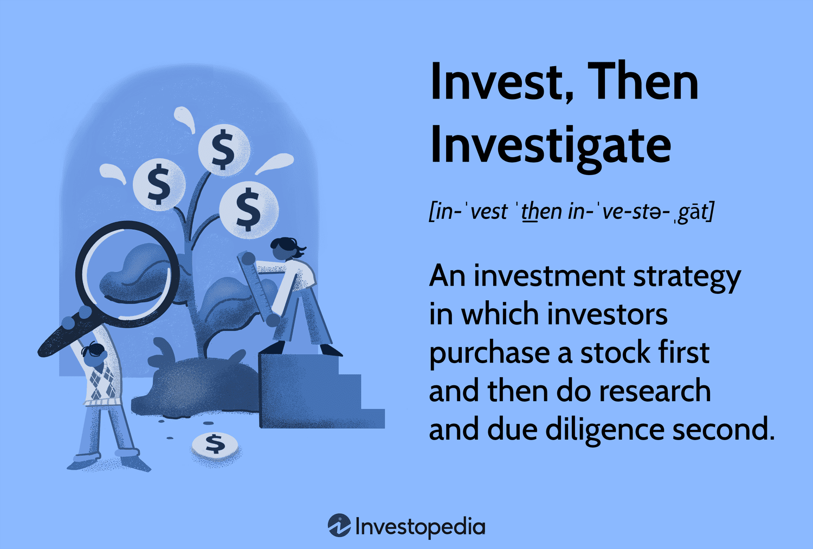

Investment decisions can be complex, involving a myriad of strategies and analyses essential for navigating the ever-evolving financial markets. As investors strive to optimize their portfolios, understanding various investment strategies—including value investing, growth investing, and income investing—becomes crucial. Each of these strategies offers unique benefits, risks, and time horizons, catering to different goals and risk appetites.

In conjunction with these strategies, financial tactics such as diversification and risk management enhance investment outcomes by mitigating potential downsides while maximizing returns. Tactical asset allocation, for example, involves adjusting investment positions to capitalize on shifting market conditions, ensuring alignment with individual investment goals.



With the advent of technology, algorithmic trading has surged to prominence within modern finance. This innovative approach employs sophisticated computer algorithms to automate trading decisions, offering speed, precision, and the capability to process vast data sets efficiently. Algorithmic trading incorporates strategies like trend-following, arbitrage, and mean reversion, each designed to exploit market inefficiencies.

As we explore the intricate landscape of investment strategies, financial tactics, and algorithmic trading, it becomes evident that successful investing is a multifaceted endeavor. Technology not only enhances traditional strategies but also introduces new paradigms, presenting both opportunities and challenges to contemporary investors. Understanding and leveraging these elements are vital for navigating the complexities of today's financial markets.

## Table of Contents

## Investment Strategies: An Overview

Investment strategies are essential frameworks that guide investors on effectively allocating their resources to optimize returns while managing risk. The choice of an investment strategy is influenced by several factors, including individual financial goals, risk appetite, time horizon, and prevailing market conditions. Understanding and selecting the right strategy is critical to achieving desired financial outcomes.

**Value Investing** is one of the most established investment strategies. It focuses on identifying undervalued stocks that are trading below their intrinsic value. The goal is to purchase these stocks with the expectation that their market price will eventually reflect their true value, resulting in a profit. This strategy requires a keen understanding of fundamental analysis to evaluate a company's inherent worth through indicators such as price-to-earnings ratios, book value, and dividend yields. The primary benefit of value investing is its potential for significant long-term gains; however, it generally involves a higher risk and requires patience as the market can take time to adjust to the intrinsic value.

**Growth Investing** prioritizes companies with significant potential for expansion and earnings increase. Unlike value investing, which seeks undervalued stocks, growth investing often involves purchasing stocks at higher valuations based on expected future growth. Investors in growth stocks focus on companies with innovative technologies, expanding market shares, or structural advantages in their respective industries. This strategy can yield substantial returns, particularly in bullish markets, but it also carries higher volatility and risk, as future growth projections may not always materialize.

**Income Investing** emphasizes generating a steady income through dividends or interest payments from investments. This strategy is especially appealing to investors seeking regular cash flows, such as retirees. Typical income investments include dividend-paying stocks, bonds, and real estate investment trusts (REITs). The main advantage of income investing is the stability and predictability of returns, although it may offer lower capital appreciation compared to growth or value investing strategies. Additionally, it is less sensitive to market fluctuations, providing a buffer against volatility.

Each investment strategy carries unique benefits and risks, and choosing the right one depends on a careful assessment of personal financial objectives and constraints. Factors such as risk tolerance—how comfortable one is with the possibility of losing money—and market conditions—such as economic cycles and interest rates—are critical in determining the most suitable approach.

Ultimately, a successful investment strategy requires a tailored plan that aligns with an investor's specific goals and circumstances. This plan might often encompass elements from multiple strategies, augmented by ongoing analysis and adjustments in response to changing market landscapes.

## Understanding Investment Analysis

Investment analysis is a fundamental process in the financial sector, designed to evaluate the potential and performance of various investment vehicles. This critical evaluation helps investors make informed decisions by assessing the viability and profitability of options available in the market. The analysis encompasses three primary methodologies: [fundamental analysis](/wiki/fundamental-analysis), technical analysis, and quantitative analysis. 

**Fundamental Analysis**

Fundamental analysis is a method that focuses on determining the intrinsic value of an asset. It involves a deep dive into the economic and financial factors affecting an investment's potential return. At its core, this type of analysis seeks to understand an asset's real worth by examining various economic indicators, financial statements, industry trends, and market conditions. 

Key components of fundamental analysis include:

- **Economic Factors**: Analyzing macroeconomic indicators like GDP growth, inflation rates, and employment figures to gauge the overall health of the economy and its impact on asset valuation.
- **Financial Statements**: Evaluating a company's income statements, balance sheets, and cash flow statements to assess financial health, profitability, and operational efficiency.
- **Industry Analysis**: Understanding the specific industry's dynamics, competition, and regulatory environment that could influence the asset's performance. 

Fundamental analysis hinges on the belief that stock prices may not reflect their true value in the short term, but will correct over the long term as market inefficiencies are eliminated.

**Technical Analysis**

Technical analysis, in contrast to fundamental analysis, evaluates securities by using historical market data, primarily price and [volume](/wiki/volume-trading-strategy). This method is predicated on the idea that historical trading activity and price changes can be valuable predictors of future price movements. 

Some of the essential tools and concepts in technical analysis include:

- **Price Charts**: Utilized to visualize the historical price data and identify patterns and trends. Common chart types include line charts, bar charts, and candlestick charts.
- **Technical Indicators**: Mathematical calculations based on historical price or volume data used to forecast potential market movements. Popular indicators include Moving Averages (MA), Relative Strength Index (RSI), and Moving Average Convergence Divergence (MACD).
- **Support and Resistance Levels**: Identified as price points on a chart that are expected to act as barriers, preventing the price from deviating further in a particular direction.

Technical analysts apply these tools and principles to make predictions about future price trends and derive trading signals, asserting that patterns and trends in historical data can repeat themselves.

Both fundamental and technical analyses offer unique insights and complement each other in the investment analysis process. While fundamental analysis provides a long-term view based on intrinsic value, technical analysis offers short-term trading signals based on historical data. Investors often use a combination of both to inform their decision-making processes, assessing investments from multiple perspectives to hedge against risk and capitalize on opportunities.

## Financial Tactics for Success

Effective financial tactics are essential in helping investors manage risk and enhance returns. These tactics include diversification, asset allocation, and risk management, all of which aim to optimize investment strategies to align with individual financial goals and prevailing market conditions.

Diversification is a fundamental financial tactic that involves spreading investments across various asset classes, sectors, and geographical regions. This approach mitigates the risk of significant losses by ensuring that a downturn in one area doesn't disproportionately affect the overall portfolio. By investing in a mix of stocks, bonds, commodities, and real estate, for instance, an investor can potentially reduce [volatility](/wiki/volatility-trading-strategies) and achieve more stable returns over time.

Asset allocation refers to the process of determining the optimal distribution of an investor's wealth across different asset classes. This tactic is based on the principle that different assets perform differently under varying economic conditions. A well-thought-out asset allocation strategy considers an individual's risk tolerance, investment time horizon, and financial objectives. As these factors change, the asset allocation may need to be adjusted to ensure it remains aligned with the investor's goals.

Risk management is a key component in safeguarding investments. It involves identifying, assessing, and prioritizing risks, followed by the application of resources to minimize and control the probability of unforeseen events. Techniques such as hedging, using options or futures, can protect portfolios from adverse movements in the market. Additionally, maintaining an emergency fund can help investors avoid the need to liquidate investments during downturns.

Tactical asset allocation takes a more dynamic approach by adjusting investment positions in response to changing market conditions. Unlike strategic asset allocation, which maintains a fixed proportion of assets, tactical asset allocation allows for flexibility and agility to capitalize on short-term market opportunities. For example, an investor may temporarily increase equity exposure if they anticipate a market rally. This approach requires constant market evaluation and timely decision-making to be effective.

Regular portfolio reviews and rebalancing are vital practices to ensure a portfolio remains in line with an investor's risk profile and financial targets. As market conditions fluctuate, the value and proportion of assets in a portfolio will naturally shift. Rebalancing involves realigning the portfolio to its desired asset allocation, taking profits from over-performing assets, and reinvesting in underperforming ones. This not only maintains desired levels of risk but can also enhance returns by enforcing a buy-low, sell-high discipline.

In summary, to achieve financial success, investors must apply effective tactics like diversification, asset allocation, risk management, and regular rebalancing. By adapting to market conditions and maintaining alignment with their financial goals, investors can manage risks and potentially enhance their returns.

## The Rise of Algorithmic Trading

Algorithmic trading employs computer-based algorithms to automate both trading decisions and transaction execution. This technological innovation has drastically transformed financial markets by enhancing the speed, precision, and capacity for processing vast amounts of data. Algorithms can analyze multiple market variables in real-time, enabling traders to identify opportunities and execute orders in fractions of a second. This efficiency was unattainable in traditional trading methods.

The appeal of [algorithmic trading](/wiki/algorithmic-trading) lies in its capacity to minimize human error, reduce transaction costs, and exploit quantitative models to forecast price movements. According to a report by Grand View Research, the global algorithmic trading market size was valued at USD 14.3 billion in 2019 and is expected to expand at a compound annual growth rate (CAGR) of 10.5% from 2020 to 2027. This growth underscores the increasing reliance on automated and systematic trading techniques across global financial institutions.

Popular algorithmic trading strategies include trend-following, [arbitrage](/wiki/arbitrage), and mean reversion. Trend-following strategies capitalize on the [momentum](/wiki/momentum) of asset prices moving in a particular direction. Algorithms detect patterns and execute trades accordingly, aiming to profit from sustained trends. Arbitrage strategies, on the other hand, exploit price discrepancies of similar or identical financial instruments across different markets or platforms, seeking risk-free profits. Mean reversion strategies assume that asset prices will revert to their historical average over time, thus buying undervalued assets or selling overvalued ones.

Despite the numerous advantages, algorithmic trading is not without risks. Technical failures, such as software glitches or unexpected market volatility, can lead to significant financial losses. Additionally, the reliance on algorithmic strategies can contribute to market instability; for instance, as seen during the Flash Crash of May 6, 2010, when the Dow Jones Industrial Average dropped by about 1,000 points within minutes due to an algorithmic trading loop.

Overall, algorithmic trading has unquestionably advanced the efficiency of financial markets, offering traders unprecedented capabilities. However, the technology requires rigorous oversight and risk management to mitigate the potential consequences of unforeseen technical anomalies.

## Implementing Strategies and Tactics with Technology

Technology has become an integral component in implementing and refining investment strategies and financial tactics. The sophistication and accessibility of trading platforms, algorithmic software, and data analytics tools have enabled investors to make more informed and efficient decisions.

Trading platforms serve as the foundation for executing trades and managing portfolios. Modern platforms offer real-time data, advanced charting tools, and access to a wide range of financial instruments. They are designed to support both manual and automated trading, catering to the needs of different types of investors. The integration of API (Application Programming Interface) capabilities allows traders to connect customized algorithms directly to their trading accounts, enabling seamless execution of complex strategies.

Algorithmic software represents a significant leap forward in trading technology, automating decision-making processes based on pre-defined criteria. Algorithms can be programmed to follow specific strategies such as arbitrage, trend-following, or [market making](/wiki/market-making). The use of [machine learning](/wiki/machine-learning) models within these algorithms can enhance their effectiveness by learning from data patterns and improving predictions over time. For example, a simple moving average crossover strategy can be implemented in Python as follows:

```python
import numpy as np
import pandas as pd

# Assuming 'data' is a pandas DataFrame with 'Close' as stock prices
data['SMA_50'] = data['Close'].rolling(window=50).mean()
data['SMA_200'] = data['Close'].rolling(window=200).mean()

data['Signal'] = 0
data['Signal'][50:] = np.where(data['SMA_50'][50:] > data['SMA_200'][50:], 1, -1)

data['Position'] = data['Signal'].shift(1)
```

This code snippet calculates the 50-day and 200-day simple moving averages (SMA) to generate buy/sell signals, which can then be used in a trading strategy. 

Data analytics tools have transformed the way investment decisions are made by providing insights from vast amounts of financial data. Advanced analytics can uncover trends and correlations that might not be immediately apparent, aiding in the formulation of strategies and risk assessments. Predictive analytics, driven by machine learning and [artificial intelligence](/wiki/ai-artificial-intelligence), enables investors to forecast market movements and optimize asset allocations accordingly.

Developing a robust technology infrastructure is crucial for supporting these advancements. Reliable and secure data storage, high-speed internet connectivity, and powerful computing resources are fundamental requirements for implementing technology-driven investment strategies effectively. Scalability and resilience are also important considerations, as they ensure continued operation even during times of extreme market volatility.

Investors must remain adaptive within this technological landscape, continually refining their strategies with the assistance of technology. Regular updates to algorithms and software, combined with a mindful approach to the ever-evolving tech advancements, will help investors remain competitive. Staying informed about new tools and methods can provide an edge in optimizing strategies and enhancing portfolio performance.

## Conclusion

Investing successfully requires a combination of well-thought-out strategies, thorough analysis, and effective tactics. This multifaceted approach necessitates a keen understanding of traditional investment principles as well as the modern tools and methodologies available. The integration of technology and algorithmic trading presents new opportunities and challenges, providing investors with advanced capabilities for optimizing their portfolios. Algorithmic trading enhances precision, reduces latency in executing trades, and allows for the handling of large datasets, thus offering substantial competitive advantages.

However, to harness these benefits, investors must remain informed and adaptable. The fast-paced development in technology demands a continuous commitment to learning and adaptation. Leveraging technology involves not only adopting new tools but also integrating them effectively with existing investment strategies. This entails regular assessment of strategies in light of technological advancements and market changes.

Understanding the evolving landscape is key to navigating the complexities of modern financial markets. As markets become increasingly interconnected and influenced by rapid technological innovations, investors who foster flexibility and embrace change are better positioned to capitalize on emerging trends. Staying informed through reliable sources, participating in ongoing education, and maintaining a network of knowledgeable peers can further bolster an investor's ability to navigate the dynamic financial environment. These efforts enable investors to refine their strategies continually, ensuring they remain well-equipped to achieve their financial objectives amidst ever-changing conditions.

## References & Further Reading

[1]: Bergstra, J., Bardenet, R., Bengio, Y., & Kégl, B. (2011). ["Algorithms for Hyper-Parameter Optimization."](https://dl.acm.org/doi/10.5555/2986459.2986743) Advances in Neural Information Processing Systems 24.

[2]: ["Advances in Financial Machine Learning"](https://www.amazon.com/Advances-Financial-Machine-Learning-Marcos/dp/1119482089) by Marcos Lopez de Prado

[3]: ["Evidence-Based Technical Analysis: Applying the Scientific Method and Statistical Inference to Trading Signals"](https://www.amazon.com/Evidence-Based-Technical-Analysis-Scientific-Statistical/dp/0470008741) by David Aronson

[4]: ["Machine Learning for Algorithmic Trading"](https://github.com/stefan-jansen/machine-learning-for-trading) by Stefan Jansen

[5]: ["Quantitative Trading: How to Build Your Own Algorithmic Trading Business"](https://www.amazon.com/Quantitative-Trading-Build-Algorithmic-Business/dp/1119800064) by Ernest P. Chan