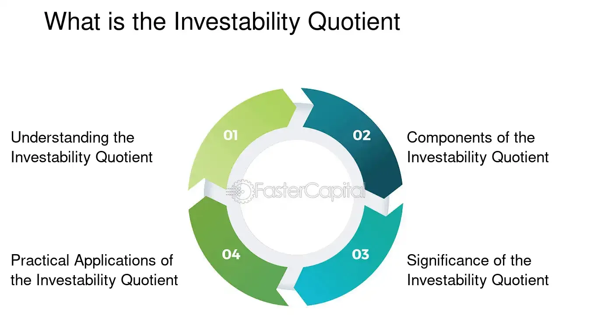

## Table of Contents

## What is the Investability Quotient (IQ)?

The Investability Quotient (IQ) is a measure that helps investors understand how easy it is to invest in a company. It looks at things like how much information is available about the company, how easy it is to buy and sell its stocks, and how well the company follows rules and regulations. This helps investors decide if they want to put their money into that company.

IQ is important because it gives investors a quick way to see if a company is a good choice for their money. If a company has a high IQ, it means it's easier to invest in it and there's less risk. This can help investors feel more confident about their choices and make smarter decisions about where to put their money.

## How is the Investability Quotient calculated?

The Investability Quotient (IQ) is calculated by looking at different things about a company. First, it checks how much information the company shares with the public. This includes things like financial reports, news about the company, and how often they talk to investors. If a company shares a lot of good information, it gets a higher score. Second, it looks at how easy it is to buy and sell the company's stocks. If it's easy to trade the stocks and there are a lot of people buying and selling, the company gets a higher score.

Another important part of the IQ is how well the company follows rules and regulations. This means checking if the company does things the right way and if it is honest with investors. If a company follows all the rules and is very transparent, it gets a higher score. All these scores are added together to get the final Investability Quotient. A higher IQ means the company is easier to invest in and might be a safer choice for investors.

## What are the key components that make up the Investability Quotient?

The Investability Quotient (IQ) is made up of three main parts. The first part is how much information a company shares with everyone. This means looking at things like the company's financial reports, news about the company, and how often they talk to investors. If a company shares a lot of good information, it gets a higher score. This helps investors understand the company better and feel more confident about investing in it.

The second part of the IQ is how easy it is to buy and sell the company's stocks. This is about checking if the stocks are easy to trade and if there are a lot of people buying and selling them. If it's easy to trade the stocks, the company gets a higher score. This makes it easier for investors to get in and out of their investments without too much trouble.

The third part is how well the company follows rules and regulations. This means making sure the company does things the right way and is honest with investors. If a company follows all the rules and is very transparent, it gets a higher score. All these parts together make up the Investability Quotient, which helps investors decide if a company is a good choice for their money.

## Why is the Investability Quotient important for investors?

The Investability Quotient (IQ) is important for investors because it helps them understand how easy it is to invest in a company. It tells them if a company shares a lot of information, if it's easy to buy and sell the company's stocks, and if the company follows all the rules. This makes it easier for investors to make good choices about where to put their money. If a company has a high IQ, it means it's easier to invest in and there's less risk. This can help investors feel more confident and make smarter decisions.

Knowing a company's IQ also helps investors compare different companies. If one company has a higher IQ than another, it might be a better choice for investing. This is because a higher IQ means the company is more open about its information, easier to trade, and more likely to follow the rules. By looking at the IQ, investors can find companies that are safer and easier to invest in, which can lead to better investment results.

## How does the Investability Quotient differ from other investment metrics?

The Investability Quotient (IQ) is different from other investment metrics because it focuses on how easy it is to invest in a company, not just how well the company is doing. Other metrics, like the Price-to-Earnings (P/E) ratio or Return on Investment (ROI), look at things like the company's profits or how much money you might make from investing. But the IQ looks at how much information the company shares, how easy it is to buy and sell its stocks, and if the company follows all the rules. This helps investors see if a company is a safe and easy choice for their money.

Another way the IQ is different is that it helps investors compare companies based on how easy they are to invest in. Other metrics might tell you if a company is making a lot of money, but they don't tell you if it's easy to buy or sell its stocks. The IQ gives a quick way to see if a company is transparent, follows the rules, and has an active market for its stocks. This can be very helpful for investors who want to make smart choices and feel confident about their investments.

## Can the Investability Quotient be applied to all types of investments?

The Investability Quotient (IQ) is mainly used for stocks, which are shares in a company. It helps investors see if a company is easy to invest in by looking at things like how much information the company shares, how easy it is to buy and sell its stocks, and if the company follows all the rules. While the IQ is very useful for stocks, it might not work as well for other types of investments like bonds, real estate, or cryptocurrencies. These investments have different ways of working and different risks, so the same measures might not apply.

For example, bonds are loans to a company or government, and they don't have stocks to buy and sell. Real estate involves buying property, which is different from buying stocks. Cryptocurrencies are digital money and have their own unique risks and ways of trading. So, while the ideas behind the IQ, like transparency and ease of trading, can be helpful to think about for any investment, the exact way the IQ is calculated might not fit well for these other types of investments. It's best used for stocks, but the principles can still guide investors when looking at other investment options.

## What are some practical applications of the Investability Quotient in portfolio management?

In portfolio management, the Investability Quotient (IQ) can help investors pick the right stocks for their portfolios. By looking at a company's IQ, investors can see how easy it is to invest in that company. If a company has a high IQ, it means it shares a lot of information, its stocks are easy to buy and sell, and it follows all the rules. This can make investors feel more confident about adding that company's stocks to their portfolio. It's especially useful when deciding between different companies in the same industry, as it can help pick the one that's easier and safer to invest in.

The IQ can also help investors manage their portfolios over time. If a company's IQ goes down, it might mean the company is not sharing as much information or it's harder to buy and sell its stocks. This could be a sign to sell those stocks and look for other companies with higher IQs. By keeping an eye on the IQ of the companies in their portfolio, investors can make sure they are always investing in companies that are easy to invest in and less risky. This can lead to better overall performance of their investment portfolio.

## How can the Investability Quotient be used to assess risk in investments?

The Investability Quotient (IQ) helps investors understand the risk of investing in a company by looking at how easy it is to invest in it. If a company has a high IQ, it means it shares a lot of information, its stocks are easy to buy and sell, and it follows all the rules. This makes the company less risky because investors can feel more confident about their investment. They know they can easily get their money out if they need to, and they have a good understanding of the company's health and practices.

On the other hand, a company with a low IQ might be riskier. It could mean the company doesn't share much information, making it hard for investors to know what's going on. It might also be hard to buy and sell the company's stocks, which can be a problem if investors need to get their money out quickly. Plus, if a company doesn't follow all the rules, it could get into trouble, which adds more risk. By looking at the IQ, investors can get a quick idea of how risky a company might be and make better decisions about their investments.

## What are the limitations of using the Investability Quotient as a sole decision-making tool?

While the Investability Quotient (IQ) can be helpful for investors, it has some limits if you use it as the only way to decide on investments. The IQ looks at how easy it is to invest in a company, but it doesn't tell you everything about the company's future or how much money you might make. For example, a company might have a high IQ because it shares a lot of information and its stocks are easy to trade, but it might not be making much money or growing. So, if you only look at the IQ, you might miss other important things like the company's profits, how fast it's growing, or what's happening in its industry.

Another problem with using the IQ by itself is that it might not work well for all types of investments. The IQ is mostly for stocks, and it might not be as useful for things like bonds, real estate, or cryptocurrencies. These other investments have different risks and ways of working, so the IQ might not give you a full picture. Also, the IQ doesn't change very quickly, so it might not show new risks that come up fast, like a sudden drop in the company's stock price or a big change in the market. Because of these limits, it's best to use the IQ along with other tools and information to make smart investment choices.

## How has the concept of Investability Quotient evolved over time?

The idea of the Investability Quotient (IQ) started as a way to help investors see how easy it is to put money into a company. At first, it mostly looked at how much information a company shared and how easy it was to buy and sell its stocks. As more people started using it, they saw that it could also show if a company followed the rules and was honest with investors. Over time, the IQ became more important because it gave investors a quick way to check if a company was a safe choice for their money.

Now, the IQ is used more often by investors to compare different companies and pick the ones that are easier and less risky to invest in. It has changed a bit to include new things like how well a company talks to its investors and how it handles new rules and laws. Even though it started as a simple tool, the IQ has grown to be a big part of how investors decide where to put their money. It helps them feel more sure about their choices and keeps them from making big mistakes.

## What advanced techniques can be used to enhance the accuracy of the Investability Quotient?

To make the Investability Quotient (IQ) more accurate, you can use new technology like big data and [machine learning](/wiki/machine-learning). Big data helps by collecting a lot of information about a company from different places, like financial reports, news articles, and social media. This can give a fuller picture of how easy it is to invest in the company. Machine learning can then look at all this information and find patterns that might not be easy to see. This can help make the IQ more exact by understanding things like how the company talks to its investors and how well it follows new rules.

Another way to improve the IQ is by using real-time data. This means looking at what's happening with the company and its stocks right now, instead of just old information. Real-time data can show if there are new risks or changes that could affect how easy it is to invest in the company. By adding real-time data to the IQ, investors can get a better idea of the current situation and make smarter choices about their investments.

## How do experts in the field critique and refine the Investability Quotient model?

Experts in the field often critique the Investability Quotient (IQ) by pointing out that it might not cover all the important parts of a company's health. They say that while the IQ looks at how easy it is to invest in a company, it might miss other big things like how much money the company is making or how it's growing. Experts also worry that the IQ might not change fast enough to show new risks or changes in the market. To make the IQ better, they suggest adding more types of information, like real-time data and news about the company. They also think that using new technology like big data and machine learning could help find patterns and make the IQ more accurate.

To refine the IQ model, experts suggest looking at more than just the usual things like how much information a company shares and how easy it is to trade its stocks. They think it's important to include how well a company talks to its investors and how it follows new rules and laws. By using more detailed and up-to-date information, the IQ can give a better picture of how easy and safe it is to invest in a company. This can help investors feel more sure about their choices and make smarter decisions about where to put their money.

## What are the key aspects of understanding financial metrics?

Financial metrics are fundamental indicators used by investors to evaluate the performance and viability of their investments. These metrics provide quantitative data that assist in assessing the profitability, risk, and overall financial health of an entity, thereby enabling investors to make informed decisions. One of the most widely used financial metrics is the return on investment (ROI). ROI is calculated as:

$$
ROI = \left( \frac{\text{Net Profit}}{\text{Cost of Investment}} \right) \times 100
$$

This metric provides insight into the efficiency of an investment by measuring the return relative to its cost, thus helping investors compare the profitability of different investment opportunities.

Liquidity, another crucial financial metric, indicates how easily an investment can be converted into cash without significantly affecting its market price. High [liquidity](/wiki/liquidity-risk-premium) is often preferred as it allows investors to quickly capitalize on investment opportunities or respond to financial needs. Assessing liquidity involves analyzing current assets and liabilities to compute ratios like the current ratio and quick ratio.

Volatility measures the degree of variation in the price of a financial instrument over time. It is quantified by calculating the standard deviation of the returns, providing a sense of the inherent risk of an asset. High [volatility](/wiki/volatility-trading-strategies) suggests larger price swings and potentially higher risk, making it a critical [factor](/wiki/factor-investing) for risk assessment in investment analysis.

Overall financial health encompasses an entity's ability to generate revenue, manage expenses, and create shareholder value. This is often evaluated through metrics such as earnings before interest, taxes, depreciation, and amortization (EBITDA), net profit margin, and debt-to-equity ratio. These indicators collectively offer insights into the operational efficiency, profitability, and financial stability of an organization.

Effectively utilizing these financial metrics enables investors to quantify financial prospects and risks, paving the way for successful investment decisions. Recognizing how these indicators interact and affect investment outcomes is essential in crafting robust investment strategies.

## What are the key trading algorithm metrics?

Algorithmic trading automates trade executions using pre-defined strategies that rely heavily on financial metrics. These metrics are crucial for evaluating the performance and robustness of trading algorithms, ensuring that they are not only profitable but also sustainable and risk-averse over time.

One of the most important metrics in this context is the Sharpe Ratio. Developed by Nobel laureate William F. Sharpe, this ratio measures the risk-adjusted return of an investment strategy. It is calculated by subtracting the risk-free rate from the expected return of the portfolio and then dividing the result by the portfolio's standard deviation. The formula is given by:

$$
\text{Sharpe Ratio} = \frac{E[R] - R_f}{\sigma}
$$

Where:
- $E[R]$ is the expected return of the portfolio
- $R_f$ is the risk-free interest rate
- $\sigma$ is the standard deviation of the portfolio's excess return

A higher Sharpe Ratio indicates a more attractive risk-adjusted return, with values above 1.0 considered good and above 3.0 deemed excellent for an investment portfolio.

Maximum Drawdown is another critical metric, which indicates the largest peak-to-trough decline in a portfolio's value before a new peak is achieved. It reflects the potential risk of capital loss and helps in understanding how much an investment could potentially lose in adverse conditions. Maximum Drawdown is expressed as a percentage of the portfolio's value and is crucial for investors focusing on capital preservation.

The Compound Annual Growth Rate (CAGR) helps users understand the mean annual growth rate of an investment over a specified time period, assuming the profits are reinvested at the end of each year. It is defined by:

$$
\text{CAGR} = \left( \frac{V_f}{V_i} \right)^{\frac{1}{t}} - 1
$$

Where:
- $V_f$ is the final value
- $V_i$ is the initial value
- $t$ is the time period in years

CAGR provides a smoothed annual rate of growth, making it an excellent measure for evaluating investment performance over extended periods.

Implementing these metrics contributes significantly to optimizing trading strategies by ensuring consistency and efficient risk management. They provide insights into both the return potential and associated risks of trading strategies, thereby empowering traders to make informed tactical decisions. Algorithmic systems can utilize these metrics to refine their trading models, offering an effective framework for maximizing returns while managing risk exposures.

## References & Further Reading

[1]: Bergstra, J., Bardenet, R., Bengio, Y., & Kégl, B. (2011). ["Algorithms for Hyper-Parameter Optimization."](https://dl.acm.org/doi/10.5555/2986459.2986743) Advances in Neural Information Processing Systems 24.

[2]: ["Advances in Financial Machine Learning"](https://www.amazon.com/Advances-Financial-Machine-Learning-Marcos/dp/1119482089) by Marcos Lopez de Prado

[3]: ["Evidence-Based Technical Analysis: Applying the Scientific Method and Statistical Inference to Trading Signals"](https://www.amazon.com/Evidence-Based-Technical-Analysis-Scientific-Statistical/dp/0470008741) by David Aronson

[4]: ["Machine Learning for Algorithmic Trading"](https://github.com/stefan-jansen/machine-learning-for-trading) by Stefan Jansen

[5]: ["Quantitative Trading: How to Build Your Own Algorithmic Trading Business"](https://github.com/LucindaYa/quant-resources/blob/master/Quantitative%20Trading%20How%20to%20Build%20Your%20Own%20Algorithmic%20Trading%20Business.pdf) by Ernest P. Chan