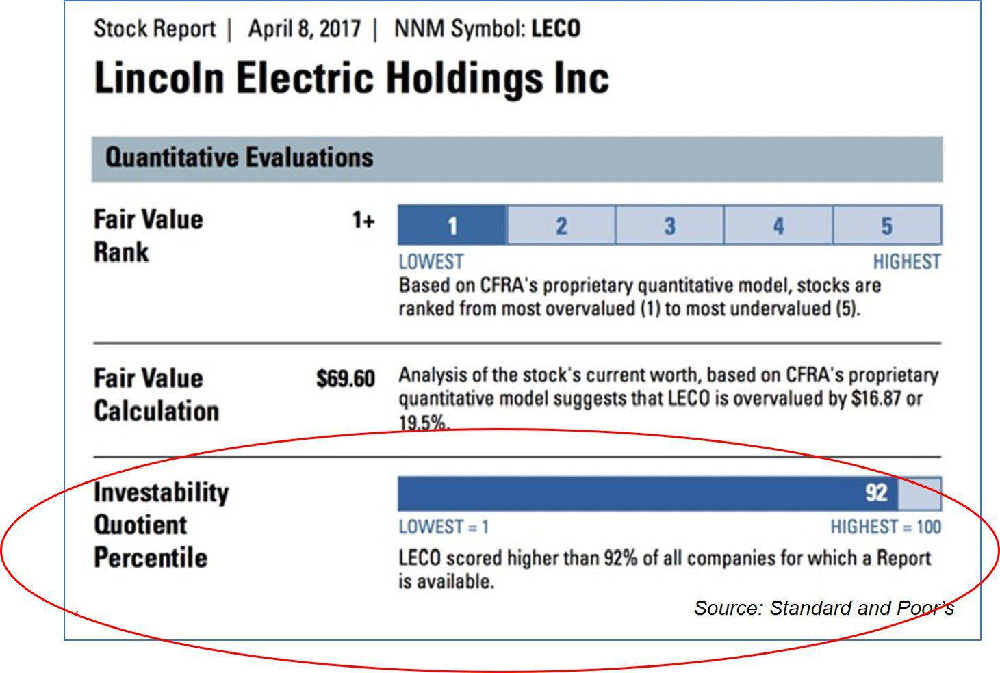

Understanding the interplay between financial metrics, the investability quotient, and algorithmic trading is essential for investors aiming to maximize returns and manage risk effectively. These interconnected elements form the backbone of modern investment analysis, offering a structured approach to evaluating opportunities and executing trades with precision. Financial metrics provide quantifiable insights into the health and performance of potential investments, allowing investors to make informed, data-driven decisions.

The investability quotient (IQ) further refines this analysis process by offering a comprehensive evaluation of stock characteristics, helping distinguish viable investment opportunities. By incorporating these metrics into algorithmic trading systems, investors can harness advanced computational capabilities to optimize trading outcomes and reduce human biases and errors.



This article presents a thorough examination of the relationship between these components, highlighting their importance in contemporary investment strategies. We will also discuss how integrating financial metrics with algorithmic systems can enhance the accuracy and efficiency of investment analysis, paving the way for improved trading outcomes. Additionally, the construct of the investability quotient and the role of algorithmic trading in today's financial landscape will be explored to provide a robust understanding of their application and benefits.

## Table of Contents

## Understanding Financial Metrics

Financial metrics are fundamental indicators used by investors to evaluate the performance and viability of their investments. These metrics provide quantitative data that assist in assessing the profitability, risk, and overall financial health of an entity, thereby enabling investors to make informed decisions. One of the most widely used financial metrics is the return on investment (ROI). ROI is calculated as:

$$
ROI = \left( \frac{\text{Net Profit}}{\text{Cost of Investment}} \right) \times 100
$$

This metric provides insight into the efficiency of an investment by measuring the return relative to its cost, thus helping investors compare the profitability of different investment opportunities.

Liquidity, another crucial financial metric, indicates how easily an investment can be converted into cash without significantly affecting its market price. High [liquidity](/wiki/liquidity-risk-premium) is often preferred as it allows investors to quickly capitalize on investment opportunities or respond to financial needs. Assessing liquidity involves analyzing current assets and liabilities to compute ratios like the current ratio and quick ratio.

Volatility measures the degree of variation in the price of a financial instrument over time. It is quantified by calculating the standard deviation of the returns, providing a sense of the inherent risk of an asset. High [volatility](/wiki/volatility-trading-strategies) suggests larger price swings and potentially higher risk, making it a critical [factor](/wiki/factor-investing) for risk assessment in investment analysis.

Overall financial health encompasses an entity's ability to generate revenue, manage expenses, and create shareholder value. This is often evaluated through metrics such as earnings before interest, taxes, depreciation, and amortization (EBITDA), net profit margin, and debt-to-equity ratio. These indicators collectively offer insights into the operational efficiency, profitability, and financial stability of an organization.

Effectively utilizing these financial metrics enables investors to quantify financial prospects and risks, paving the way for successful investment decisions. Recognizing how these indicators interact and affect investment outcomes is essential in crafting robust investment strategies.

## Investability Quotient: An Overview

The Investability Quotient (IQ), originally developed by Standard & Poor's (S&P), serves as a sophisticated tool for assessing the investment potential of stocks. This proprietary scoring system evaluates stocks by considering a comprehensive set of factors that influence their overall investability.

Central to the IQ's assessment are elements such as credit ratings, which reflect the issuer's creditworthiness and its ability to meet financial obligations. Asset liquidity is another crucial metric, focusing on how quickly and easily an asset can be converted into cash without significantly affecting its price. Company strength, often measured through financial ratios and market position, provides insights into an entity's operational and competitive robustness. Furthermore, industry volatility is examined to understand the fluctuations and stability within a given sector, helping in gauging the inherent risks associated with investing.

Following its development, the IQ system was integrated into S&P Capital IQ, a comprehensive platform that offers a wide range of analytical tools. The migration expanded the system's capabilities, allowing it to leverage the platform's extensive data sets and analytic resources. This integration helps investors compare stocks across various industries, providing a thorough analysis of investment risks and returns.

The Investability Quotient, therefore, acts as a critical analytical framework, enabling investors to make informed decisions by offering a detailed perspective on the potential opportunities and dangers tied to different stocks.

## Key Trading Algorithm Metrics

Algorithmic trading automates trade executions using pre-defined strategies that rely heavily on financial metrics. These metrics are crucial for evaluating the performance and robustness of trading algorithms, ensuring that they are not only profitable but also sustainable and risk-averse over time.

One of the most important metrics in this context is the Sharpe Ratio. Developed by Nobel laureate William F. Sharpe, this ratio measures the risk-adjusted return of an investment strategy. It is calculated by subtracting the risk-free rate from the expected return of the portfolio and then dividing the result by the portfolio's standard deviation. The formula is given by:

$$
\text{Sharpe Ratio} = \frac{E[R] - R_f}{\sigma}
$$

Where:
- $E[R]$ is the expected return of the portfolio
- $R_f$ is the risk-free interest rate
- $\sigma$ is the standard deviation of the portfolio's excess return

A higher Sharpe Ratio indicates a more attractive risk-adjusted return, with values above 1.0 considered good and above 3.0 deemed excellent for an investment portfolio.

Maximum Drawdown is another critical metric, which indicates the largest peak-to-trough decline in a portfolio's value before a new peak is achieved. It reflects the potential risk of capital loss and helps in understanding how much an investment could potentially lose in adverse conditions. Maximum Drawdown is expressed as a percentage of the portfolio's value and is crucial for investors focusing on capital preservation.

The Compound Annual Growth Rate (CAGR) helps users understand the mean annual growth rate of an investment over a specified time period, assuming the profits are reinvested at the end of each year. It is defined by:

$$
\text{CAGR} = \left( \frac{V_f}{V_i} \right)^{\frac{1}{t}} - 1
$$

Where:
- $V_f$ is the final value
- $V_i$ is the initial value
- $t$ is the time period in years

CAGR provides a smoothed annual rate of growth, making it an excellent measure for evaluating investment performance over extended periods.

Implementing these metrics contributes significantly to optimizing trading strategies by ensuring consistency and efficient risk management. They provide insights into both the return potential and associated risks of trading strategies, thereby empowering traders to make informed tactical decisions. Algorithmic systems can utilize these metrics to refine their trading models, offering an effective framework for maximizing returns while managing risk exposures.

## Role and Benefits of Algorithmic Trading

Algorithmic trading, often referred to as "algo trading," employs computer programs to execute trading orders at remarkable speed and precision. This method capitalizes on complex mathematical models and sophisticated software solutions to make trading decisions based on a set of predefined parameters, offering significant advancements over traditional trading approaches.

One of the primary advantages of [algorithmic trading](/wiki/algorithmic-trading) is its ability to process vast quantities of financial data at high speeds. Algorithms can quickly analyze and interpret numerous financial metrics, such as price action, [volume](/wiki/volume-trading-strategy), and market trends, which are essential for optimizing trading strategies and outcomes. This capacity to process large data sets rapidly enables traders to exploit minute market inefficiencies that would be virtually impossible for humans to detect in time.

Moreover, algorithmic trading minimizes human errors and emotional biases, which are common challenges in manual trading. Human emotions like fear and greed can lead to irrational trading decisions, whereas algorithms execute trades based solely on data and predetermined rules, enhancing consistency and objectivity. For instance, saying with Python, you could utilize libraries like NumPy and pandas to handle data arrays and perform statistical indices calculations efficiently:

```python
import pandas as pd
import numpy as np

# Sample price data
price_data = pd.Series([101, 102, 100, 103, 104, 102])

# Calculate simple moving average
sma = price_data.rolling(window=3).mean()

# Strategy: Buy when price is above SMA
signals = (price_data > sma.shift(1)).astype(int)
```

Here, the snippet calculates a simple moving average (SMA) and generates a basic buy signal when the current price exceeds the previous day's SMA, illustrating an algorithm's capability to make data-driven trading decisions streamlinedly.

With the advancement of technology, algorithmic trading platforms have become increasingly accessible to both individual and institutional traders, democratizing the trading landscape. These platforms provide a range of tools and features that allow users to create, backtest, and execute trading strategies without requiring in-depth programming expertise. As a result, traders can efficiently maximize returns using automated strategies tailored to their specific risk profiles and investment objectives.

In conclusion, algorithmic trading offers distinctive benefits, including enhanced precision, speed, and the ability to mitigate human errors in trading. By leveraging financial metrics and advanced computing capabilities, algorithmic trading optimizes decision-making processes, offering a competitive edge in today's fast-paced financial markets. As trading technology continues to evolve, its role in shaping modern investment strategies will undoubtedly expand.

## Integrating Investability Quotient with Algo Trading

Integrating the Investability Quotient (IQ) with algorithmic trading frameworks offers a robust approach to vetting investment opportunities. The Investability Quotient, which evaluates stock characteristics against criteria such as credit ratings, asset liquidity, and industry volatility, provides a quantitative measure that enhances the quality of investment decision-making when aligned with algorithmic strategies.

The synergy between IQ and algorithmic trading is rooted in the ability to infuse IQ’s comprehensive scoring system into algorithmic models, thus magnifying their analytical capacity. This integration is particularly beneficial in constructing algorithms that are equipped to dynamically respond to market variables. By embedding IQ data into these models, trading algorithms can be programmed to automatically adjust buy/sell decisions based on nuanced risk and return projections, thereby optimizing investment outcomes.

At the core of this synergy is data-driven decision-making. Algorithmic trading systems, by design, are adept at processing massive datasets instantaneously to identify and act on trading signals. When IQ metrics are incorporated, algorithms gain an additional layer of actionable intelligence, enhancing their responsiveness to market fluctuations and potential investment opportunities. This is achieved through advanced computational techniques, such as [machine learning](/wiki/machine-learning), where the algorithm iteratively learns from IQ inputs to refine its predictive accuracy.

For instance, a Python-based algorithm might utilize libraries like scikit-learn or TensorFlow to analyze patterns in IQ data alongside other market indicators. Here is a simplified example of how IQ data might be integrated into a trading algorithm:

```python
import numpy as np
from sklearn.linear_model import LinearRegression

# Sample dataset with market indicators and IQ scores
market_data = np.array([[5.1, 2.5, 3.6, 6.2],
                        [4.3, 2.1, 3.1, 5.8],
                        [6.7, 3.0, 4.0, 6.5]])
iq_scores = np.array([70, 65, 80])

# Initialize and train a basic linear regression model
model = LinearRegression()
model.fit(market_data, iq_scores)

# Predict IQ score for new market data
new_data = np.array([[5.5, 2.7, 3.3, 6.0]])
predicted_iq = model.predict(new_data)
print(f"Predicted IQ Score: {predicted_iq[0]}")
```

In this scenario, the algorithm learns to predict investment scores based on historical IQ data, aiding in selecting stocks that demonstrate high potential. Such predictive insights make the trading process more efficient and adaptive, thereby maximizing efficiency and profitability.

Ultimately, integrating the Investability Quotient into algorithmic trading frameworks empowers traders with enhanced analytical tools, allowing them to navigate the complexities of modern financial markets more effectively. This blend of traditional financial metrics with sophisticated algorithmic analysis holds the promise of more informed, agile investment strategies capable of yielding superior returns.

## Conclusion

Financial metrics, the Investability Quotient (IQ), and algorithmic trading form a vital trifecta in modern investment analysis and strategy. These components offer investors a comprehensive toolkit to evaluate the potential of various investment opportunities and optimize their decision-making processes. By understanding and effectively implementing financial metrics, investors can gauge the performance and prospects of investments, assessing crucial indicators such as return on investment (ROI), liquidity, and volatility.

The Investability Quotient serves as a unique scoring system developed to compare stocks across industries, factoring in aspects like credit ratings, asset liquidity, and company strength. It provides investors with a nuanced view of asset risks and returns, enhancing their capacity to make informed choices.

Algorithmic trading, on the other hand, brings precision, speed, and efficiency to executing trades. It leverages financial metrics to process large datasets rapidly, minimizing the influence of human errors and emotional biases. The integration of algorithmic trading with financial metrics and the IQ can significantly bolster trading strategies by optimizing performance and managing risks effectively. 

As trading technologies and analytics platforms continue to evolve, they enhance the capabilities of investors, granting even smaller traders access to sophisticated investment tools. This progression promises to continually redefine investment analysis and empower decisions with more dynamic, data-driven insights. Thus, the harmonious implementation of financial metrics, the IQ, and algorithmic trading strategies can provide a substantial competitive edge in the ever-advancing financial markets.

## References & Further Reading

[1]: Bergstra, J., Bardenet, R., Bengio, Y., & Kégl, B. (2011). ["Algorithms for Hyper-Parameter Optimization."](https://dl.acm.org/doi/10.5555/2986459.2986743) Advances in Neural Information Processing Systems 24.

[2]: ["Advances in Financial Machine Learning"](https://www.amazon.com/Advances-Financial-Machine-Learning-Marcos/dp/1119482089) by Marcos Lopez de Prado

[3]: ["Evidence-Based Technical Analysis: Applying the Scientific Method and Statistical Inference to Trading Signals"](https://www.amazon.com/Evidence-Based-Technical-Analysis-Scientific-Statistical/dp/0470008741) by David Aronson

[4]: ["Machine Learning for Algorithmic Trading"](https://github.com/stefan-jansen/machine-learning-for-trading) by Stefan Jansen

[5]: ["Quantitative Trading: How to Build Your Own Algorithmic Trading Business"](https://github.com/LucindaYa/quant-resources/blob/master/Quantitative%20Trading%20How%20to%20Build%20Your%20Own%20Algorithmic%20Trading%20Business.pdf) by Ernest P. Chan