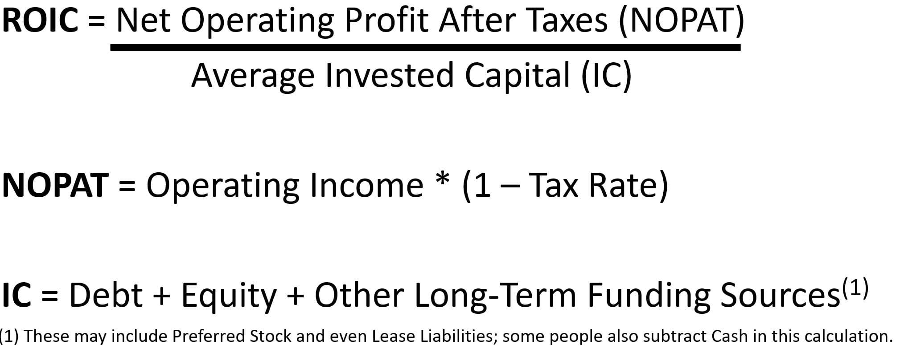

In modern financial markets, the metrics of return on investment (ROI) and return on invested capital (ROIC) are essential for evaluating the performance of investments and gauging their efficiency and profitability. These metrics provide investors and companies with insights into how well their investments are performing in relation to the capital at their disposal and the returns generated.

ROI, a commonly used measure, calculates the gain or loss made on an investment relative to its cost. It is a straightforward metric that helps assess the basic efficiency of an investment. In contrast, ROIC provides a more nuanced view by measuring the return a company generates from its invested capital. It offers a deeper understanding of how effectively a company allocates capital to profitable ventures. ROIC takes into account the cost of capital and is often seen as a better indicator of long-term value creation.

The advent of algorithmic trading, more commonly known as algo trading, has transformed how traders and investors operate within financial markets. By leveraging advanced computational power and algorithms, traders can execute strategies that optimize ROI and ROIC. Algo trading capitalizes on speed and precision, allowing for the systematic execution of trades, which enhances decision-making processes and reduces human emotional bias.

This article provides a comprehensive exploration of the intersection between ROIC and algorithmic trading. It investigates into the nuances of ROIC, how it differs from ROI, and the significant role that algorithmic trading plays in optimizing these metrics. Through automated strategies, traders and investors can potentially maximize returns and make more efficient use of their capital investments.

By the conclusion of this article, readers will gain a thorough understanding of how to incorporate ROIC effectively into their algorithmic trading strategies. This knowledge will empower traders to make informed decisions and improve their investment outcomes, pushing the boundaries of traditional financial strategies through the integration of technology and financial metrics.

## Table of Contents

## Understanding ROIC and its Importance

Return on Invested Capital (ROIC) is a crucial financial metric that assesses the return a company generates from its invested capital. This metric is specifically valuable as it focuses on the efficiency and profitability of a company's capital investments, offering a comprehensive view of how well the company is utilizing its capital to generate profits. ROIC evaluates the ability of a company to create value beyond the initial cost of capital, making it essential for assessing long-term investment performance.

While Return on Investment (ROI) is commonly used to evaluate short-term profitability, ROIC provides a clearer and more nuanced picture of a company's ability to generate long-term value. ROI simply measures the return relative to the initial investment, often not accounting for the debt or equity used to finance the investment. In contrast, ROIC measures the net income generated by the company against its total capital, including both debt and equity. This distinction is vital for investors looking to understand the true performance of a company's investments and its capacity for sustainable growth.

To calculate ROIC, the following formula is typically used:

$$
\text{ROIC} = \frac{\text{Net Operating Profit After Taxes (NOPAT)}}{\text{Invested Capital}}
$$

Where:
- NOPAT is the net operating profit after taxes, which represents the company's core operating profits after tax but before financing costs.
- Invested capital is the total capital invested in the company, including equity and debt, minus non-operating assets.

This formula helps illustrate the efficiency with which a company uses its capital to produce earnings, offering insights that are particularly useful for long-term strategic planning and investment decision-making.

For example, consider a company with a NOPAT of $200 million and invested capital totaling $1 billion. The ROIC would be calculated as:

$$
\text{ROIC} = \frac{200,000,000}{1,000,000,000} = 0.20 \text{ or } 20\%
$$

This implies that for every dollar invested in capital, the company earns 20 cents, capturing the organization's ability to generate satisfactory returns on its investments. High ROIC values often indicate a company is efficiently allocating its capital resources, which is attractive to investors looking for businesses capable of sustaining competitive advantages and generating stable profits.

In practice, ROIC is used by investors and financial analysts to compare companies within the same industry, ensuring that comparisons are made between organizations facing similar market conditions and capital requirements. By providing insights into how effectively a company is reinvesting its capital, ROIC serves as a powerful tool for evaluating the strategic allocation of resources and potential for future profitability.

## Algorithmic Trading: An Overview

Algorithmic trading, commonly referred to as algo trading, utilizes computer algorithms to execute trading strategies at speeds and frequencies beyond human capabilities. These algorithms follow a predefined set of rules and criteria, analyzing vast datasets to identify and capitalize on market opportunities. By automating the process, [algorithmic trading](/wiki/algorithmic-trading) enhances efficiency, reduces transaction times, and allows for the execution of complex strategies with precision.

At the heart of algorithmic trading is its reliance on speed and efficiency. Algorithms can process and respond to market information in milliseconds, significantly outpacing human traders. This speed advantage enables traders to exploit short-lived opportunities, such as [arbitrage](/wiki/arbitrage) situations and market inefficiencies, where quick reactions are crucial to maximizing returns.

**Types of Algorithms in Trading:**

1. **Trend-Following Strategies:** These algorithms identify and capitalize on sustained market trends. By analyzing historical price data and indicators, such as moving averages, these strategies buy assets that are trending upwards and sell those trending downwards. The basic premise is that "the trend is your friend," aligning trading actions with ongoing market momentum.

2. **Arbitrage Strategies:** These strategies take advantage of price discrepancies in different markets or instruments. For instance, if an asset is priced differently on two exchanges, an arbitrage algorithm can simultaneously buy on the lower-priced exchange and sell on the higher-priced one, pocketing the difference. The efficiency and precision of algorithms are particularly suited to capturing these fleeting opportunities.

3. **Market-Making Strategies:** Algorithmic market makers provide liquidity to the market by continuously offering buy and sell quotes. They profit from the bid-ask spread, the difference between buying and selling prices. Such algorithms adjust their quotes based on real-time market conditions and inventory levels, ensuring a balanced exposure.

Beyond the technical and strategic advantages, algorithmic trading also mitigates human biases. Emotional factors such as fear and greed, which often compromise decision-making, are eliminated in an automated environment. By adhering strictly to algorithmic rules, traders can maintain a consistent and disciplined approach, leading to potentially improved outcomes.

The evolution of algorithmic trading has significantly impacted the landscape of financial markets. Since its inception, the use of algorithms has expanded, driven by advancements in technology and increased data availability. The prevalence of high-frequency trading ([HFT](/wiki/high-frequency-trading-strategies)), a form of algorithmic trading characterized by extremely high speeds and order volumes, exemplifies this trend. According to a report by JP Morgan, over 60% of trades on major exchanges like the New York Stock Exchange are executed by algorithmic systems [1].

In summary, algorithmic trading combines computational power and strategic methodology to gain a competitive edge. Its primary benefits lie in its speed, efficiency, and ability to process vast amounts of information, making it an essential tool for modern traders and institutions. Continued advancements in technology promise further integration of algorithmic trading into the financial markets, further increasing its influence and effectiveness.

---

[1] Griffin, J., & Shams, A. (2018). "The Evolution of High-Frequency Trading in U.S. Equity Markets." The Journal of Finance.

## The Synergy Between ROIC and Algorithmic Trading

Investing firms and traders increasingly employ algorithmic trading to maximize Return on Invested Capital (ROIC) by leveraging advanced computational models and market data analytics. Algorithmic trading systems are pre-programmed to execute trades systematically based on pre-defined criteria, facilitating enhanced decision-making that optimizes capital allocation.

One effective strategy involves incorporating ROIC as a key parameter in algorithmic models. By integrating historical and real-time financial data, these systems can assess and predict a company's potential for value creation. This allows traders to prioritize investments in companies or projects with higher ROIC, ensuring capital is deployed in opportunities that promise superior returns relative to the capital invested. For example, an algorithm might be designed to screen for stocks where the ROIC consistently exceeds a specific benchmark, indicating efficient management and robust financial health.

Furthermore, traders can refine capital allocation strategies by using algorithms that continuously monitor and adjust investments based on ROIC fluctuations. Consider a scenario where a trader employs a trend-following algorithm: the model could attribute greater importance to securities that exhibit not only positive [momentum](/wiki/momentum) but also high or improving ROIC levels, thereby aligning capital allocation with efficient capital utilization.

Successful implementation of algorithmic strategies often showcases alignment with high ROIC projects. For instance, hedge funds have developed proprietary algorithms that identify and invest in high-ROIC segments within technology or healthcare sectors known for dynamic growth and innovation. By focusing on companies exhibiting superior ROIC, these funds capitalize on scalable and profitable business models.

The intrinsic value of algorithmic trading emerges from its ability to enhance financial performance metrics like ROIC. Automation and speed offer a significant advantage in identifying and exploiting high-ROIC opportunities quickly and accurately. This synergy enables firms and traders to not only increase profitability but also maintain competitive advantage in rapidly evolving markets. With continuous advancements in [machine learning](/wiki/machine-learning) and [artificial intelligence](/wiki/ai-artificial-intelligence), the scope for enhancing ROIC through algorithmic trading remains vast, promising even greater efficiency and precision in capital deployment strategies.

## Challenges and Considerations in ROIC-Focused Algo Trading

Algorithmic trading that focuses on optimizing the Return on Invested Capital (ROIC) presents unique challenges and considerations for traders and investors alike. By leveraging ROIC in algorithmic trading strategies, participants aim to achieve superior capital efficiency. However, various hurdles must be navigated to harness its full potential effectively.

One of the foremost challenges is data accuracy. The reliability of ROIC-centered trading strategies hinges on precise and timely financial data. Companies' disclosures may vary in quality, leading to discrepancies and potential misinterpretations of ROIC. Algorithms relying on inaccurate data might execute trades based on faulty assumptions, impacting performance negatively.

Risk management is another critical component in such trading strategies. The fast-paced nature of algorithmic trading necessitates robust risk management protocols to mitigate potential losses due to market [volatility](/wiki/volatility-trading-strategies) or unexpected economic shifts. Implementing stop-loss mechanisms or value-at-risk models can safeguard investments from adverse market movements.

Market conditions are perpetually dynamic, introducing complexities that must be managed. The effectiveness of an algorithmic strategy based on ROIC can vary significantly across different market environments. For example, a strategy that works well in a bullish market may falter during downturns. Continually adapting algorithms to reflect current market conditions is imperative.

The regulatory environment also warrants attention. Algorithmic and high-frequency trading is subject to stringent regulations intended to maintain market integrity and prevent manipulative practices. Traders must ensure their strategies are compliant with regulatory standards, such as those set by the U.S. Securities and Exchange Commission (SEC) or the European Securities and Markets Authority (ESMA). Non-compliance can result in significant penalties and reputational damage.

Ethical considerations play a pivotal role, particularly concerning high-frequency trading practices that might provide unfair advantages or undermine market fairness. Ethical trading mandates transparency, fairness, and the avoidance of strategies that could destabilize markets.

To navigate these challenges effectively, investors and traders can employ several best practices. Establishing partnerships with data providers that offer high-quality and reliable financial data can mitigate data accuracy issues. Implementing machine learning algorithms allows for dynamic adjustment to changing market patterns, enhancing strategy robustness. Additionally, maintaining a strong compliance framework ensures adherence to regulatory requirements and ethical standards.

Computational costs are a practical consideration, given the intensive resource needs for developing and maintaining sophisticated algorithms. Efficient coding practices and scalable cloud solutions can optimize the balance between performance and cost. Continuous monitoring and algorithmic adjustments are essential to react promptly to new data, trends, and regulatory updates.

In summary, while integrating ROIC into algorithmic trading strategies offers promising opportunities for optimizing capital allocation, it requires careful consideration of data integrity, risk protocols, market dynamics, and regulatory frameworks. By adhering to best practices and ensuring ethical compliance, traders can navigate these complexities, setting a foundation for sustainable investment success.

## Conclusion

Return on Invested Capital (ROIC) and algorithmic trading together present a powerful approach for maximizing investment efficiency and long-term value creation. ROIC, which measures the return a company generates from its invested capital, is pivotal for assessing the efficiency and profitability of these investments. When paired with algorithmic trading, which leverages advanced computational capabilities to execute trading strategies, investors are equipped to optimize performance in complex financial markets.

The fusion of ROIC and algorithmic trading accentuates the indispensability of financial metrics and technology integration in optimizing investment outcomes. Algorithmic strategies that prioritize ROIC facilitate informed capital allocation, enabling investors to target high-yield projects. As such, ROIC remains a vital strategic tool for discerning long-term value creation.

Advancements in algorithmic trading methods continue to transform the investment landscape, focusing on capital efficiency. These innovations—ranging from improved data analytics to sophisticated risk management solutions—allow investors to enhance their trading strategies continuously. The financial industry benefits from reduced biases and errors, leading to enhanced investment decision-making, which would be cumbersome with conventional methods.

Investors and traders should be encouraged to pursue strategies that incorporate both financial metrics and advanced technologies. This integrated approach enables more precise market analysis and decision-making. As technology evolves and financial markets become ever more complex, leveraging these tools will be crucial for maintaining a competitive edge and achieving sustained growth.

By prioritizing ROIC within algorithmic trading frameworks, stakeholders can harness the full potential of their capital, paving the way for future innovations and efficiencies in the financial sector. The partnership between ROIC and algorithmic trading underscores the necessity of strategic, informed investment—driven by both technological capability and rigorous financial analysis.

## References & Further Reading

[1]: Griffin, J., & Shams, A. (2018). ["The Evolution of High-Frequency Trading in U.S. Equity Markets."](https://papers.ssrn.com/sol3/papers.cfm?abstract_id=3195066) The Journal of Finance.

[2]: Bergstra, J., Bardenet, R., Bengio, Y., & Kégl, B. (2011). ["Algorithms for Hyper-Parameter Optimization."](https://dl.acm.org/doi/10.5555/2986459.2986743) Advances in Neural Information Processing Systems 24.

[3]: ["Advances in Financial Machine Learning"](https://www.amazon.com/Advances-Financial-Machine-Learning-Marcos/dp/1119482089) by Marcos Lopez de Prado

[4]: ["Evidence-Based Technical Analysis: Applying the Scientific Method and Statistical Inference to Trading Signals"](https://www.amazon.com/Evidence-Based-Technical-Analysis-Scientific-Statistical/dp/0470008741) by David Aronson

[5]: ["Quantitative Trading: How to Build Your Own Algorithmic Trading Business"](https://books.google.com/books/about/Quantitative_Trading.html?id=j70yEAAAQBAJ) by Ernest P. Chan

[6]: ["Machine Learning for Algorithmic Trading"](https://github.com/stefan-jansen/machine-learning-for-trading) by Stefan Jansen