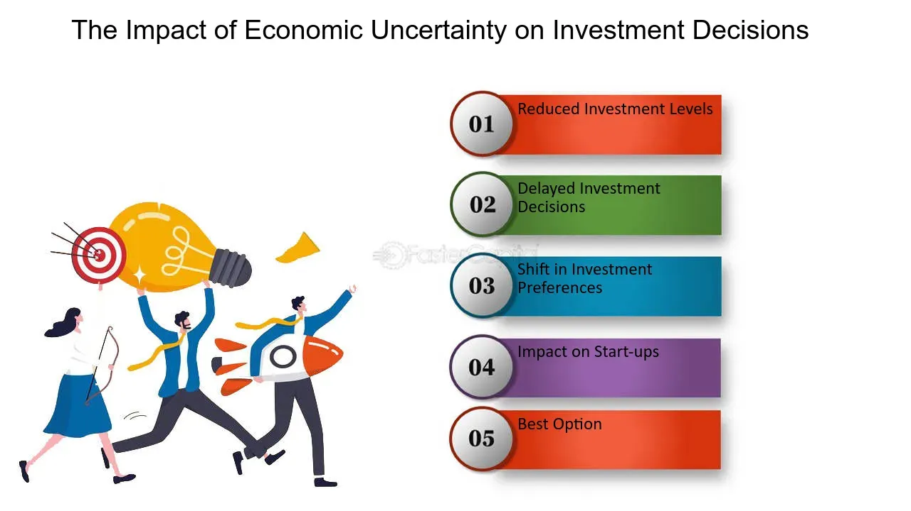

## Table of Contents

## What is economic uncertainty and how does it affect investments?

Economic uncertainty refers to a situation where people are not sure about what will happen with the economy in the future. This can be due to many reasons like changes in government policies, global events, or even natural disasters. When there is a lot of uncertainty, people feel more worried and less confident about making big decisions, like where to invest their money.

This uncertainty can affect investments a lot. When people are unsure about the future, they might decide to wait and see what happens instead of investing right away. This can lead to less money being put into the stock market or other investments, which can cause the prices of stocks to go down. On the other hand, some investors might see uncertainty as a chance to buy investments at lower prices, hoping to make a profit later when things get better. So, economic uncertainty can make the investment world more unpredictable and risky.

## What are the common types of investments during economic downturns?

During economic downturns, people often look for safe places to put their money. One common type of investment is in government bonds. These are seen as very safe because they are backed by the government, and they give a steady income through interest payments. Another type of investment that becomes popular is cash or cash equivalents, like savings accounts or money market funds. These are easy to turn into cash if needed and are less likely to lose value during tough economic times.

Some investors also turn to gold and other precious metals. These are thought to hold their value well, even when the economy is struggling. Another option is to invest in companies that provide essential services, like utilities or healthcare. These companies tend to do well even during downturns because people always need their services. Overall, during economic downturns, people tend to choose investments that are safer and more likely to keep their value, rather than taking big risks.

## How can a beginner start investing during uncertain economic times?

If you're a beginner and want to start investing during uncertain economic times, it's important to start slow and be careful. One good way to begin is by putting some money into a savings account or a money market fund. These are safe places to keep your money and you can get it back easily if you need it. You might not make a lot of money this way, but it's a good first step to get used to investing without taking big risks.

Another option is to look into government bonds. They are safe because the government backs them, and they give you a steady income. This can be a good way to start investing without worrying too much about losing your money. As you learn more, you might want to try other investments, but starting with something safe is a smart move when the economy is uncertain.

Once you feel more comfortable, you can think about investing in stocks of big companies that provide things people always need, like food or medicine. These companies tend to do okay even when the economy is not doing well. Remember, it's important to learn as much as you can and maybe talk to a financial advisor before making big decisions. Starting small and being patient will help you build confidence and make better choices as you go along.

## What are the risks associated with investing during economic uncertainty?

Investing during economic uncertainty can be risky because the economy might get worse before it gets better. When people are worried about the future, they might sell their investments, which can make the prices of stocks and other investments go down. If you invest your money during this time, you could lose some of it if the prices keep falling. Also, it can be hard to predict what will happen, so you might end up making decisions based on guesses rather than facts.

Another risk is that companies might not do as well during tough economic times. If a company you invest in has to cut jobs or close stores, its stock price could go down a lot. This means you might not get back as much money as you hoped for. Even safe investments like bonds can lose value if interest rates change a lot. So, it's important to think carefully about where you put your money and be ready for things to change quickly.

## How can diversification help manage risk during economic uncertainty?

Diversification means spreading your money across different types of investments. This can help you manage risk during economic uncertainty because if one investment does badly, the others might still do okay. For example, if you put all your money in one company's stock and that company has a tough time, you could lose a lot. But if you also have money in bonds, gold, and other companies' stocks, a problem with one won't hurt you as much.

By having a mix of investments, you can protect yourself better from the ups and downs of the economy. When the economy is uncertain, different investments might react in different ways. Some might go down, but others might stay the same or even go up. This balance can help keep your overall investment safer. So, diversification is like not putting all your eggs in one basket, which is a smart way to handle risk when things are unpredictable.

## What role do bonds play in an investment strategy during economic uncertainty?

During economic uncertainty, bonds can be a very important part of your investment strategy. They are seen as safe investments because they are backed by governments or big companies. When you buy a bond, you are basically lending money to the issuer, and in return, they pay you interest regularly. This steady income can be really helpful when the economy is shaky because it gives you some money even if other investments are not doing well. Plus, if you need to, you can usually sell your bonds and get your money back, which makes them a good choice when things are unpredictable.

Bonds can also help balance out the risk in your investment portfolio. If you have some money in stocks and those stocks go down because of economic uncertainty, the bonds might not go down as much or might even go up a little. This can help protect your overall investment from big losses. So, by including bonds in your strategy, you can make your investments more stable and less likely to be hurt by the ups and downs of the economy.

## How should one adjust their investment portfolio in response to economic indicators?

When you see economic indicators showing that the economy might be getting worse, like high unemployment or falling stock prices, it's a good idea to make your investment portfolio safer. You can do this by moving some of your money from stocks to bonds or cash. Bonds are safer because they give you steady interest payments, and cash is easy to get to if you need it. This way, if the economy keeps getting worse, you won't lose as much money. It's like putting on a seatbelt when you see a bumpy road ahead.

On the other hand, if economic indicators show that things are getting better, like lower unemployment or rising stock prices, you might want to take more risks to make more money. You can do this by putting more money into stocks, especially in companies that do well when the economy is growing. But remember, even when things look good, the economy can still surprise you. So, it's always smart to keep some of your money in safer investments like bonds, just in case. Adjusting your portfolio based on economic indicators can help you make the most of good times and protect yourself during bad times.

## What are the psychological factors to consider when investing during economic uncertainty?

When you invest during economic uncertainty, your feelings can really affect what you do. It's easy to feel scared and worried when the economy is not doing well. This fear might make you want to sell your investments quickly, even if it's not the best time. But if everyone else is selling, the prices of investments can go down a lot. On the other hand, some people might feel excited about buying investments at lower prices, thinking they can make a lot of money later. It's important to know your own feelings and try not to let them push you into making quick decisions that you might regret.

Another thing to think about is how patient you can be. Economic uncertainty can last a long time, and it can be hard to wait for things to get better. If you get tired of waiting, you might sell your investments too soon and miss out on making money when the economy improves. It's helpful to have a plan and stick to it, even when it's tough. Talking to a financial advisor can also help you stay calm and make smart choices, even when the economy is unpredictable.

## How can advanced investors use options and futures to hedge against economic uncertainty?

Advanced investors can use options and futures to protect their investments during economic uncertainty. Options give you the right, but not the obligation, to buy or sell an asset at a set price before a certain date. If you think the market might go down, you can buy a put option, which lets you sell your investment at a good price even if the market falls. This can help you limit your losses. On the other hand, if you think the market might go up, you can buy a call option, which lets you buy an investment at a lower price if it goes up. This way, you can make money if the market improves.

Futures are another tool that advanced investors can use. A futures contract is an agreement to buy or sell an asset at a set price on a future date. If you're worried about the economy getting worse, you can sell futures contracts to lock in a price for your investments now. This can protect you if the prices go down later. Futures can also be used to bet on the market going up. By buying futures, you can make money if the market improves. Both options and futures need a good understanding of the market and can be risky, but they can be powerful tools for managing risk during uncertain times.

## What historical economic events provide lessons for investing during uncertainty?

The Great Depression of the 1930s is a big lesson for investors. It started with the stock market crash in 1929, and it showed how fast things can go wrong. Many people lost their jobs and their savings. But some smart investors, like those who bought stocks at very low prices during the worst times, made a lot of money when things got better. The lesson here is to stay calm and look for good deals when everyone else is scared. It's also important not to put all your money in one place, because if that place fails, you could lose everything.

Another big event was the 2008 financial crisis. It started with problems in the housing market and spread to the whole economy. Banks failed, and many people lost their homes and jobs. During this time, investors who had a lot of money in safe investments like government bonds did better than those who had all their money in stocks. But again, some investors saw the low prices as a chance to buy good stocks at a discount. The lesson from 2008 is to have a mix of safe and risky investments, so you can protect your money and also be ready to take advantage of good opportunities when they come.

These events show that economic uncertainty can be scary, but with the right strategy, you can still do well. Diversifying your investments, staying calm, and looking for good deals when others are scared can help you navigate tough times. It's also a good idea to learn from history and use that knowledge to make smarter choices about where to put your money.

## How do global economic factors influence investment strategies during uncertain times?

Global economic factors can really change how you should invest your money during uncertain times. Things like what's happening in other countries' economies, changes in trade rules, or even big events like wars or pandemics can shake up the whole world's economy. When these things happen, they can make prices of stocks and other investments go up and down a lot. For example, if a big country like China has problems, it can affect companies all over the world that do business there. So, you might want to be careful and maybe not put all your money in one place, especially if that place is likely to be affected by what's happening around the world.

Because of these global factors, it's smart to think about having a mix of investments from different parts of the world. If one country's economy is doing badly, another country's might be doing okay. This way, if things get worse in one place, your investments in other places might help balance things out. Also, paying attention to what's happening around the world can help you see opportunities. Sometimes, when everyone is worried about one country, you might find good deals in another country that's doing better. So, keeping an eye on global economic news and adjusting your investment strategy can help you manage risk and maybe even make some money during uncertain times.

## What are the long-term strategies for investing during periods of economic uncertainty?

When you're thinking about investing for the long term during times when the economy is uncertain, it's really important to have a plan that you stick to. One good strategy is to keep investing regularly, even when things look scary. This is called dollar-cost averaging. It means you put a little bit of money into your investments at regular times, no matter what the market is doing. Over time, this can help you buy more when prices are low and less when prices are high, which can make your overall investment do better. Another part of a long-term plan is to make sure your investments are spread out. This means having some money in stocks, some in bonds, and maybe even some in other things like real estate or commodities. By doing this, you can protect yourself from big losses if one part of the economy does badly.

Another long-term strategy is to focus on companies that have strong foundations and can handle tough times. These are often big companies that provide things people always need, like food or medicine. Even when the economy is not doing well, these companies tend to do okay. It's also smart to keep some of your money in safe investments like government bonds. They might not make you a lot of money, but they can give you a steady income and help balance out the risk in your portfolio. By sticking to these long-term strategies, you can ride out the ups and downs of economic uncertainty and still come out ahead in the end.

## References & Further Reading

[1]: Bergstra, J., Bardenet, R., Bengio, Y., & Kégl, B. (2011). ["Algorithms for Hyper-Parameter Optimization."](https://dl.acm.org/doi/10.5555/2986459.2986743) Advances in Neural Information Processing Systems 24.

[2]: ["Advances in Financial Machine Learning"](https://www.amazon.com/Advances-Financial-Machine-Learning-Marcos/dp/1119482089) by Marcos Lopez de Prado

[3]: ["Evidence-Based Technical Analysis: Applying the Scientific Method and Statistical Inference to Trading Signals"](https://www.amazon.com/Evidence-Based-Technical-Analysis-Scientific-Statistical/dp/0470008741) by David Aronson

[4]: ["Machine Learning for Algorithmic Trading"](https://github.com/stefan-jansen/machine-learning-for-trading) by Stefan Jansen

[5]: ["Quantitative Trading: How to Build Your Own Algorithmic Trading Business"](https://www.amazon.com/Quantitative-Trading-Build-Algorithmic-Business/dp/1119800064) by Ernest P. Chan