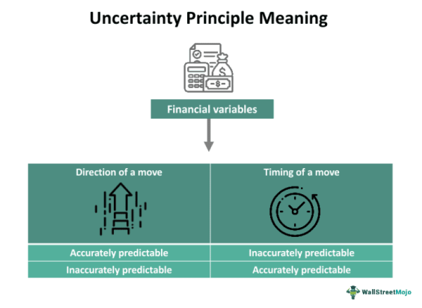

In today's fast-paced financial environment, economic uncertainty has become a prevalent challenge for investors. This uncertainty arises from various factors, including geopolitical tensions, policy changes, and global health crises, which increase the complexity of financial markets. For instance, geopolitical tensions such as trade wars and regional conflicts can disrupt global supply chains and impact investor sentiment, while rapid policy shifts can alter market dynamics unexpectedly. Furthermore, global health crises, like the COVID-19 pandemic, can lead to significant market volatility and economic disruptions, affecting both global and local economies.

To navigate these turbulent times, investors are continually seeking robust financial strategies that offer not only stability but also potential profitability. Such strategies must be adaptable to rapidly changing conditions and diverse market environments. The use of advanced technology and analytical tools, such as algorithmic trading, is becoming increasingly popular among investors for its ability to offer precise and efficient trading solutions. Algorithmic trading leverages computer programs to execute trades based on specific, programmed criteria, providing the advantages of speed and eliminating emotional biases from investment decisions.



This article investigates several key investment strategies that can be utilized to manage risks and explore market opportunities in uncertain economic climates. Emphasis is placed on how these strategies, particularly algorithmic trading, can enhance the decision-making process and potentially improve financial outcomes for investors in a world characterized by complexity and unpredictability.

## Table of Contents

## Understanding Economic Uncertainty

Economic uncertainty is an inherent aspect of the financial landscape, characterized by unpredictable fluctuations that can significantly influence investment decisions. Several key factors contribute to this uncertainty, each introducing its own set of challenges for investors.

One major factor is inflation rates, which represent the rate at which the general level of prices for goods and services is rising. Inflation can erode purchasing power and impact the real returns of investments. High inflation reduces the value of future cash flows, which can lead to decreased investment in equities and fixed income securities that do not adjust for inflation. In contrast, deflation or lower-than-expected inflation can also disrupt economic stability, leading to reduced consumer spending and investment.

Government policies are another critical source of economic uncertainty. Changes in fiscal policy, such as tax reforms or government spending alterations, directly affect disposable income and corporate profitability. Similarly, regulatory changes can impose compliance costs on businesses, impacting their operational efficiency and profitability. Monetary policy decisions by central banks, including interest rate adjustments, can also influence borrowing costs and investment returns. Investors must stay informed about policy developments as these can swiftly alter market conditions.

Global conflicts and geopolitical tensions further exacerbate economic uncertainty. Conflicts can disrupt trade routes and supply chains, leading to increased costs and delayed deliveries of goods. Political instability in key regions can trigger market [volatility](/wiki/volatility-trading-strategies), influencing commodity prices and currency exchange rates. For instance, tensions in oil-producing regions can lead to sharp increases in oil prices, affecting the global market.

Investors need a comprehensive understanding of economic risk to navigate these uncertainties effectively. Market fluctuations can impact both individual companies and the broader market ecosystem. Company-specific risks, such as management changes or product recalls, can influence stock prices independently of market-wide trends. Conversely, systemic risks, including financial crises or economic recessions, can lead to widespread market downturns.

Knowledge of economic indicators and predictive analytics can assist investors in assessing and responding to economic uncertainty. Indicators such as the Consumer Price Index (CPI), Gross Domestic Product (GDP) growth rates, and unemployment figures provide insights into economic health and potential market movements. By analyzing these metrics, investors can make informed decisions, adjusting their strategies to mitigate risks and capitalize on emerging opportunities.

## Importance of Diversification

Diversification is a key strategy employed by investors to manage risk and potentially enhance returns by mitigating the impact of market volatility. This approach involves allocating investments across various asset classes, such as stocks, bonds, and commodities, with the aim of achieving a balanced portfolio. The underlying principle of diversification is that different asset classes often react differently to economic events, reducing the overall risk.

Incorporating a variety of stocks into a portfolio allows for exposure to multiple industries and market segments, thereby lowering the risk associated with downturns in a specific sector. For instance, while technology stocks may experience volatility due to rapid innovation cycles, utility stocks tend to be more stable and offer steady returns due to their essential nature. A diversified stock portfolio can absorb shocks from sector-specific downturns more effectively than a concentrated one.

Bonds are another critical component of a diversified portfolio. They often serve as a stabilizing force, providing predictable income and reduced volatility compared to equities. Government bonds, for example, are considered low-risk and can counterbalance potential losses from riskier assets like stocks during market fluctuations.

Commodities, such as gold and oil, provide yet another layer of diversification. Commodities often have low correlations with traditional financial markets, making them an attractive option for reducing portfolio risk. For example, gold is typically viewed as a safe haven during times of economic uncertainty, preserving value when equity markets are under stress.

Geographical diversification further enhances portfolio resilience by reducing exposure to country-specific risks, such as political instability or unfavorable regulatory changes. By investing in both domestic and international markets, investors can capitalize on global growth opportunities and diminish the impact of localized economic challenges.

Mathematically, diversification can be explained using the concept of correlation, which measures the degree to which assets move in relation to one another. A perfectly diversified portfolio contains assets that have low or negative correlation, ensuring that when some investments decline, others may increase or remain unaffected.

Overall, diversification remains a fundamental strategy for investors aiming to achieve stable returns while managing risk in uncertain economic environments. By spreading investments across various asset classes, sectors, and geographies, investors can build more robust portfolios capable of weathering market disruptions effectively.

## Defensive Investment Strategies

Defensive investment strategies aim to minimize risk and protect capital, prioritizing stability over high returns. These strategies are particularly relevant during economic downturns or periods of market volatility. A key component of this approach is investing in government bonds, treasury securities, and utility stocks, which are traditionally viewed as safe havens in turbulent times.

Government bonds are debt securities issued by a government to support government spending and obligations. They are considered low-risk investments, as they are backed by the credit and taxing power of the government. They offer fixed interest payments, making them attractive for investors seeking steady income. Treasury securities, a subcategory of government bonds, are highly liquid and virtually free of credit risk, as they are backed by the full faith and credit of the issuing country's government. In the United States, for example, these include Treasury bills (T-bills), Treasury notes (T-notes), and Treasury bonds (T-bonds).

Utility stocks are shares of companies that provide essential services such as electricity, water, and natural gas. These companies often enjoy stable demand for their services regardless of the economic climate, leading to consistent and predictable earnings. As a result, utility stocks tend to exhibit lower volatility compared to other sectors. Additionally, they often pay dividends, offering investors a regular income stream as well as potential for capital appreciation.

The inherent low volatility and high security of these asset classes make them less susceptible to economic slowdowns. By including assets with different risk profiles and correlations, investors can create a diversified portfolio that balances stability with potential for growth. This diversification is a hallmark of a well-constructed defensive strategy, allowing investors to cushion their portfolios against market downturns while still maintaining a presence in the equity markets.

Thus, for investors prioritizing capital preservation and reduced risk exposure, focusing on these defensive asset classes can provide a stable foundation in uncertain economic climates.

## Role of Algorithmic Trading in Financial Markets

Algorithmic trading, commonly known as algo trading, employs computer systems to automate trading processes based on a predetermined set of instructions or algorithms. This method significantly enhances the trading process through precision and speed, executing large orders swiftly and efficiently, which would be challenging to achieve by human traders alone. One of the key advantages of [algorithmic trading](/wiki/algorithmic-trading) is its ability to eliminate the emotional biases that can often influence trading decisions. Algorithms operate strictly on logic and data, ensuring disciplined execution of trades.

In financial markets, algorithmic trading is highly prevalent, particularly in equities, [forex](/wiki/forex-system), and derivatives. The equities market benefits from algos by efficiently handling large volumes of stock transactions, thereby enhancing [liquidity](/wiki/liquidity-risk-premium) and reducing spreads. Similarly, in the forex market, algorithmic trading enables traders to exploit the fragmented nature of currency prices across different platforms, ensuring quick [arbitrage](/wiki/arbitrage) opportunities that are only executable at high speeds.

The efficiency of algos is not only limited to execution speed. They can analyze vast swathes of data in real time, identifying patterns and trends that may be imperceptible to human traders. This capability is particularly advantageous in high-frequency trading ([HFT](/wiki/high-frequency-trading-strategies)), where buy and sell decisions are made within fractions of a second, allowing traders to capture minute pricing inefficiencies in the market.

Additionally, algo trading facilitates the development of complex trading strategies that can be backtested against historical data. Python libraries like pandas and numpy are often used to manipulate and analyze financial data, while libraries like scipy and statsmodels aid in statistical analysis. Consider the following Python snippet for a simple moving average crossover strategy:

```python
import pandas as pd
import numpy as np

def moving_average_crossover(prices, short_window=40, long_window=100):
    signals = pd.DataFrame(index=prices.index)
    signals['signal'] = 0.0

    # Short simple moving average
    signals['short_mavg'] = prices['close'].rolling(window=short_window, min_periods=1).mean()

    # Long simple moving average
    signals['long_mavg'] = prices['close'].rolling(window=long_window, min_periods=1).mean()

    # Generate signals
    signals['signal'][short_window:] = np.where(signals['short_mavg'][short_window:] 
                                                > signals['long_mavg'][short_window:], 1.0, 0.0)   

    # Generate trading orders
    signals['positions'] = signals['signal'].diff()

    return signals

# Sample usage
prices = pd.read_csv('historical_data.csv', index_col='date', parse_dates=True)
signals = moving_average_crossover(prices)
```

This code outlines a basic strategy where the algorithm generates buy signals based on the crossover of short-term and long-term moving averages. While simple, such strategies can be the foundation for more complex systems incorporating additional indicators and risk management protocols.

In conclusion, algorithmic trading significantly reshapes financial market dynamics by introducing an unparalleled level of efficiency, precision, and objectivity into trading operations. Its extensive application in various financial markets underscores its integral role in modern financial trading.

## Advantages and Challenges of Algo Trading

Algorithmic trading, commonly referred to as algo trading, represents a paradigm shift in the financial markets, offering numerous advantages and presenting several challenges that traders must address.

**Advantages:**

1. **Increased Accuracy in Trading:** Algoritmic trading utilizes sophisticated algorithms to analyze vast datasets and execute trades with precision. This precision minimizes the human errors typically associated with manual trading. By relying on predetermined criteria, algorithms can effectively identify and capitalize on market inefficiencies, thereby enhancing the accuracy of trading decisions.

2. **Reduced Transaction Costs:** Automation allows for the swift execution of trades, reducing manual intervention and associated costs. Algorithmic systems can execute trades at optimal prices and within milliseconds, leading to cost savings. By accessing multiple exchanges and liquidity pools, algorithms ensure that transaction costs are minimized due to the reduction in the bid-ask spread.

3. **Backtesting Capabilities:** One of the significant benefits of algorithmic trading is the ability to backtest strategies using historical data. This process involves simulating a trading strategy on past market data to evaluate its performance. Backtesting helps identify the strategy's potential pitfalls and profitability before deploying it in live markets. Here is a simple example of a backtesting setup in Python using the pandas and numpy libraries:

    ```python
    import pandas as pd
    import numpy as np

    # Sample historical data
    data = pd.DataFrame({
        'price': [10, 10.5, 10.3, 10.8, 11, 11.2, 11.5],
        'moving_average': [10.4, 10.4, 10.5, 10.7, 10.9, 11.1, 11.3]
    })

    # Simple trading strategy
    data['signal'] = np.where(data['price'] > data['moving_average'], 1, 0)
    data['returns'] = data['price'].pct_change()
    data['strategy_returns'] = data['returns'] * data['signal'].shift(1)

    # Calculate the cumulative returns of the strategy
    cumulative_returns = (1 + data['strategy_returns'].dropna()).cumprod() - 1
    print("Strategy Cumulative Returns:")
    print(cumulative_returns)
    ```

**Challenges:**

1. **Technical Failures:** Algorithmic trading requires robust technological infrastructure. Technical failures, such as connectivity loss, hardware breakdowns, or glitches in the algorithm, can lead to significant financial losses. Implementing redundant systems and fail-safes is crucial to mitigate these risks.

2. **Overfitting of Models:** Overfitting refers to the development of a model that is excessively tailored to historical data and performs poorly on new data. This challenge occurs when algorithms are too complex and account for noise rather than the underlying market trends. Regular monitoring and validation against out-of-sample data are necessary to prevent overfitting.

3. **Infrastructure Costs:** High-frequency and algorithmic trading demand substantial initial capital to invest in technology infrastructure. This includes procuring high-performance computing systems, securing low-latency data feeds, and establishing connections to exchanges. These costs can be prohibitive for smaller trading firms and individual investors.

Traders must remain vigilant of rapid market changes to maximize the benefits of algorithmic trading. Continuous optimization of algorithms is essential, demanding constant adaptation to evolving market conditions and regulations. This agility ensures that strategies remain effective, avoiding obsolescence in the face of dynamic financial ecosystems.

## Case Studies and Real-World Applications

Real-world applications of algorithmic trading illustrate the potential for traders to effectively exploit market inefficiencies. A notable example is [statistical arbitrage](/wiki/statistical-arbitrage), which involves identifying pricing anomalies between paired securities and capitalizing on the convergence or divergence of their prices. This strategy leverages mathematical models and historical data to predict and execute trades with precision. The use of statistical arbitrage in volatile markets can be particularly advantageous as it enables traders to benefit from short-term price fluctuations while minimizing risk exposure.

Consider a scenario where a trader identifies a mean-reverting relationship between two correlated stocks, Stock A and Stock B. The trader employs a statistical model to quantify the relationship, tracking the spread between their prices. If the spread deviates beyond a predefined threshold, the algorithm triggers trades to long the undervalued stock and short the overvalued one, anticipating that the prices will revert to their historical mean. Python libraries such as NumPy and pandas can be utilized to compute moving averages, standard deviations, and other statistical metrics essential for this strategy.

Another practical application is market-making, where traders provide liquidity to markets by simultaneously posting buy and sell orders. Algorithms in market-making continuously monitor bid-ask spreads, adjusting prices to capture small profit margins from the difference between buying and selling prices. This reduces transaction costs and helps maintain market stability. In periods of high volatility, market-making algorithms can rapidly adjust their parameters to continue providing liquidity while mitigating potential losses.

These examples highlight important lessons for improving algorithmic trading strategies. One key learning is the necessity for robust [backtesting](/wiki/backtesting) frameworks to evaluate the performance of algorithms under various market conditions. Historical data should be employed to simulate trading environments, ensuring strategies are resilient to different economic scenarios. Additionally, continual refinement is crucial; traders must adapt their algorithms based on feedback from live trading performance and changes in market dynamics.

Moreover, algorithmic strategies like these require careful attention to market microstructure and order execution dynamics to optimize performance. Algorithm developers must balance the speed and frequency of trades with the associated transaction costs, ensuring profitable opportunities are pursued efficiently without excessive slippage.

In conclusion, real-world applications of algo trading showcase how systematic and data-driven approaches can yield significant advantages in capitalizing on market opportunities. By learning from and refining these strategies, traders can enhance their decision-making processes and improve the overall effectiveness of their trading operations.

## The Future of Investing in Uncertain Times

The future of investing is increasingly defined by the integration of [artificial intelligence](/wiki/ai-artificial-intelligence) (AI) and [machine learning](/wiki/machine-learning) (ML) into trading algorithms. These advanced technologies enable investors to analyze vast amounts of financial data more efficiently and recognize patterns that may not be immediately apparent through traditional analysis. AI and ML models can process real-time data from diverse sources, including market feeds, economic indicators, and news articles, providing a comprehensive understanding of market dynamics.

Investors are turning to data-driven strategies to improve their decision-making processes. Machine learning algorithms can identify correlations and trends in historical data, aiding in the development of predictive models. This approach allows investors to anticipate potential market movements and make informed investment choices. For instance, AI-driven sentiment analysis can gauge market sentiment by analyzing social media posts and news headlines, offering insights into investor behavior.

Continuous innovation and adaptation are crucial in navigating economic uncertainties and capitalizing on market opportunities. As markets evolve, so do the algorithms that guide investment strategies. Machine learning facilitates the continuous updating and refinement of models in response to new data. This adaptability ensures that trading strategies remain relevant and effective against changing market conditions.

The use of AI and ML in investing also opens up new possibilities for risk management. Advanced algorithms can assess portfolio risk by simulating different market scenarios and automatically adjusting allocations to maintain a desired risk level. This proactive approach to risk management enhances portfolio resilience during economic downturns.

Furthermore, AI-driven automation streamlines the execution of trades, reducing the likelihood of human error and the influence of emotional biases. High-frequency trading algorithms, powered by machine learning, can execute large volumes of trades at speeds beyond human capability, optimizing both the timing and pricing of transactions.

In summary, the integration of AI and machine learning into investment strategies represents a significant advancement for investors looking to enhance their capabilities in uncertain times. By leveraging these technologies, investors can achieve superior analytical depth, adapt rapidly to market changes, and systematically manage risk, all of which contribute to more robust investment outcomes.

## Conclusion

Incorporating diversified and technology-driven strategies can significantly enhance the ability of investors to achieve financial goals during periods of economic uncertainty. A diversified portfolio, which includes a mixture of stocks, bonds, commodities, and other asset classes across various sectors and geographies, helps reduce the impact of market volatility. This approach mitigates the risk associated with economic fluctuations, ensuring a more resilient investment outcome over the long term.

Technology-driven strategies, particularly algorithmic trading, provide investors with tools to optimize trading efficiency and precision. Algorithmic trading facilitates the automated execution of trades based on specific, pre-defined criteria, minimizing emotional biases that often accompany human decision-making processes. By leveraging advanced algorithms that incorporate machine learning and artificial intelligence, investors can adapt to market conditions dynamically, identifying potential opportunities and risks in real-time.

In addition to diversification and algorithmic trading, defensive strategies play a crucial role in preserving capital during economic downturns. Utilizing assets such as government bonds and utility stocks, which typically exhibit lower volatility, ensures stability and helps protect investor portfolios from significant losses.

To effectively navigate evolving market landscapes, investors should remain informed and agile. Staying updated on global economic developments and continually reassessing risk management approaches are essential for adjusting investment strategies as conditions change. Through a combination of robust defensive tactics and cutting-edge algorithms, investors can navigate uncertainty with greater confidence, balancing risks and returns to ultimately achieve their financial objectives.

## Frequently Asked Questions (FAQs)

1. **How does economic uncertainty impact investment decisions?**

Economic uncertainty can significantly influence investment decisions by introducing an element of unpredictability in market conditions. Uncertainty may arise due to fluctuations in inflation rates, [interest rate](/wiki/interest-rate-trading-strategies) changes, and global conflicts, leading investors to adopt a more cautious approach. The fear of potential losses might result in reduced exposure to riskier asset classes such as equities and an increased allocation towards safer investments like government bonds. Furthermore, uncertainty may trigger volatility, causing investors to have shorter investment horizons and increase liquidity to respond promptly to market changes.

2. **What are the key benefits of diversification?**

Diversification is a critical risk-management strategy that aims to reduce the overall risk of an investment portfolio by spreading investments across various asset classes, sectors, and geographical regions. The primary benefit is the mitigation of losses since not all investments are likely to perform poorly at the same time. For instance, if stocks underperform, bonds or commodities might provide stable returns, balancing the portfolio's overall performance. This strategy decreases portfolio volatility and enhances the potential for long-term returns by minimizing exposure to individual asset risks.

3. **How does algorithmic trading differ from traditional trading?**

Algorithmic trading involves the use of computer algorithms to automate trading processes, executing orders based on predefined criteria such as price, timing, or market conditions. Unlike traditional trading, which relies on manual decision-making and execution, algorithmic trading offers speed, precision, and the ability to analyze large datasets efficiently. It reduces human emotion, which can often lead to biases in trading decisions. Algorithms can execute trades in milliseconds, reacting to market changes much faster than human traders, thus capturing opportunities that traditional methods may miss.

4. **What risks are involved with algo trading, and how can they be mitigated?**

While algorithmic trading can enhance market efficiency, it also presents specific risks. Technical failures, such as software glitches or connectivity issues, can lead to significant trading losses. Overfitting of algorithms—where a model is too complex and tailored to past data—can make strategies ineffective in real-world scenarios. Additionally, market volatility can impact algorithm performance. To mitigate these risks, traders should implement robust testing and validation procedures, employ risk management techniques such as stop-loss orders, and continuously monitor and adapt algorithms to evolving market conditions.

5. **How can investors stay informed about economic changes affecting their portfolios?**

Staying informed about economic changes is imperative for making sound investment decisions. Investors can utilize various resources, including financial news platforms, market analysis reports, and economic data releases from authoritative sources like central banks and government agencies. Subscribing to newsletters, attending webinars, and following expert analyses on social media platforms can provide valuable insights. Additionally, employing analytical tools and software that offer real-time data and trend analysis can help investors assess and respond to market dynamics effectively.

## References & Further Reading

[1]: Bergstra, J., Bardenet, R., Bengio, Y., & Kégl, B. (2011). ["Algorithms for Hyper-Parameter Optimization."](https://dl.acm.org/doi/10.5555/2986459.2986743) Advances in Neural Information Processing Systems 24.

[2]: ["Advances in Financial Machine Learning"](https://www.amazon.com/Advances-Financial-Machine-Learning-Marcos/dp/1119482089) by Marcos Lopez de Prado

[3]: ["Evidence-Based Technical Analysis: Applying the Scientific Method and Statistical Inference to Trading Signals"](https://www.amazon.com/Evidence-Based-Technical-Analysis-Scientific-Statistical/dp/0470008741) by David Aronson

[4]: ["Machine Learning for Algorithmic Trading"](https://github.com/stefan-jansen/machine-learning-for-trading) by Stefan Jansen

[5]: ["Quantitative Trading: How to Build Your Own Algorithmic Trading Business"](https://www.amazon.com/Quantitative-Trading-Build-Algorithmic-Business/dp/1119800064) by Ernest P. Chan