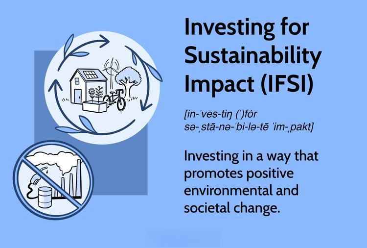

Sustainability investment has increasingly gained traction among investors seeking to achieve financial returns while also fostering a positive environmental and societal impact. This strategy, known as investing for sustainability impact (IFSI), involves approaches that aim to instigate positive behavioral changes among companies and policymakers. These strategies are designed not only to yield financial gains but also to promote more ethical and ecologically responsible business practices.

IFSI stands at the intersection of various domains, such as impact investing, algorithmic trading, and the automation of sustainable finance. Each of these areas contributes to the growing field of sustainability investments in distinct yet interconnected ways. Impact investing focuses on generating social or environmental benefits alongside financial returns. Algorithmic trading and automation, on the other hand, offer innovative solutions to optimize investment strategies by efficiently analyzing and responding to market data, including Environmental, Social, and Governance (ESG) criteria.

Understanding these concepts is crucial for investors aiming to make decisions that align their financial objectives with sustainability targets. By exploring the foundational principles of IFSI, investors can comprehend its implications for current investment strategies. This includes recognizing the potential of technology and data-driven approaches that enable more effective integration of sustainability goals in financial portfolios. Ultimately, such understanding lends itself to more informed investment choices that benefit both investors and the wider society, promoting a more resilient economic and environmental future.

## Table of Contents

## Understanding Investing for Sustainability Impact (IFSI)

Investing for Sustainability Impact (IFSI) is a strategic approach in investment that not only pursues financial gains but also seeks to achieve wider social and environmental objectives. This approach is characterized by a proactive stance where investors influence corporate or policy actions to mitigate adverse sustainability outcomes or to bolster positive transformations. The growing significance of IFSI reflects its potential to contribute to sustainable development while aligning with evolving investor preferences for responsible investing.

Institutional investors play a pivotal role in fostering IFSI. Given their substantial financial resources and influence, these investors can exert considerable pressure on companies to adopt more sustainable practices. By aligning investment criteria with environmental, social, and governance (ESG) factors, institutional investors can drive corporate accountability and promote a shift toward sustainable business models. As noted by Eccles and Klimenko (2019), large asset managers have increasingly incorporated ESG considerations into their investment processes, thereby encouraging more transparent and sustainable corporate behaviors (Eccles, Robert G., and Svetlana Klimenko. "The Investor Revolution." Harvard Business Review, 2019).

Understanding the nuances between instrumental IFSI and ultimate ends IFSI is critical for investors looking to incorporate sustainability targets within their financial strategies. Instrumental IFSI typically focuses on achieving specific, quantifiable outcomes, such as reducing carbon emissions or enhancing workplace diversity. These objectives are often grounded in the belief that improving sustainability metrics will lead to better financial performance. Conversely, ultimate ends IFSI emphasizes intrinsic values, prioritizing societal and environmental benefits over monetary returns. This approach often involves long-term investments aimed at systemic change, which may not yield immediate financial rewards.

The differentiation between these approaches highlights the multiplicity of strategies available to investors. For instance, an investor operating with an instrumental perspective might leverage data analytics to measure the carbon footprint of a portfolio and adjust investments accordingly to achieve emission reduction targets. In contrast, an ultimate ends investor might prioritize investments in renewable energy projects that support community resilience and environmental restoration, regardless of the short-term financial implications.

To effectively integrate these approaches into investment strategies, investors must navigate the complexities of impact measurement and sustainability reporting. This requires a robust framework for assessing non-financial metrics and the adoption of standardized reporting practices. Through a disciplined and informed approach to IFSI, investors can contribute to a more sustainable financial system that balances profit with purpose.

In summary, Investing for Sustainability Impact (IFSI) represents a confluence of financial acumen and ethical commitment, empowering investors to support transformative environmental and social progress. By understanding and implementing diverse IFSI frameworks, investors can play an instrumental role in shaping a sustainable future.

## The Role of Algorithmic Trading in Impact Investing

Algorithmic trading has revolutionized the field of finance by enabling the execution of complex trading strategies with speed and precision. In the context of impact investing, [algorithmic trading](/wiki/algorithmic-trading) presents an innovative means to align financial pursuits with sustainability objectives. This approach leverages computational algorithms to optimize investment portfolios not only for financial returns but also for achieving sustainability criteria. By incorporating Environmental, Social, and Governance ([ESG](/wiki/esg-investing)) factors, algorithmic trading can facilitate investment decisions that help advance environmental and societal goals.

At the core of algorithmic trading is data analysis, which requires the aggregation and interpretation of vast amounts of financial and non-financial data. High-frequency trading platforms and [machine learning](/wiki/machine-learning) models can analyze this data to identify patterns and trends that may indicate investment opportunities aligned with sustainability targets. For example, by employing natural language processing and sentiment analysis, algorithms can synthesize vast arrays of news articles, social media posts, and corporate reports to assess a company's ESG performance. 

The integration of machine learning and big data analytics not only improves the precision of sustainability assessments but also the speed at which they can be executed. Through technologies such as neural networks, machine learning models can continually refine their predictive accuracy, helping investors identify stocks with both strong financial and ESG performance. Moreover, these technologies can aggregate sustainability metrics from multiple sources to provide a comprehensive view of a company's sustainability practices.

Despite its potential, the use of algorithmic trading to achieve sustainability goals presents several challenges. One of the primary obstacles is the accurate measurement and integration of sustainability metrics into trading algorithms. While financial metrics are well-established and standardized, sustainability data can vary significantly in quality and availability. Efforts such as those by the Global Impact Investing Network (GIIN) and the Impact Management Project (IMP) aim to standardize sustainability reporting and metrics, thereby improving the quality of data available for algorithmic models.

Additionally, there is the challenge of aligning different stakeholders' sustainability criteria within a single trading strategy. Different investors may prioritize various aspects of ESG factors, making it essential for algorithmic trading models to be highly customizable and adaptable to meet diverse investor intentions.

In practical applications, several financial institutions have started leveraging algorithmic trading for sustainability. For instance, some firms have developed specific formulas and machine learning models to incorporate sustainability factors into their risk assessments, allowing them to tailor investment strategies that balance risk with impact. 

By bridging the gap between computational finance and social responsibility, algorithmic trading stands as a powerful tool in the toolkit of impact investors. As data quality continues to improve and technologies advance, the capability of algorithmically driven sustainable investment strategies will undoubtedly expand, offering more nuanced solutions tailored to sustainable impact objectives.

## Legal and Regulatory Frameworks Supporting IFSI

Investors are increasingly required or encouraged by legal frameworks to consider sustainability impacts in their investment decisions. This shift is influenced by a growing recognition of the importance of aligning financial practices with environmental and social imperatives.

### International Legal Landscape

Globally, various initiatives promulgated by the United Nations and other international bodies have catalyzed the integration of sustainability into investment practices. The United Nations' Principles for Responsible Investment (PRI) and the Sustainable Development Goals (SDGs) are pivotal frameworks promoting responsible investment practices. These initiatives encourage investors to incorporate environmental, social, and governance (ESG) criteria as core components of their decision-making processes.

A number of global financial hubs, such as the European Union, have instituted stringent regulations mandating the adherence to sustainability benchmarks. The EU's Sustainable Finance Disclosure Regulation (SFDR) requires fund managers to disclose how sustainability risks are incorporated into their investment decisions and the adverse impacts of their investments on sustainability factors.

### Challenges in Regulatory Compliance

Despite the progress, investors encounter several challenges in meeting regulatory requirements for sustainability-focused investment. Key challenges include the heterogeneity of regulations across different jurisdictions and the lack of standardized metrics for measuring sustainability impact. Inconsistent regulatory frameworks can create complexity for multinational investors who must navigate varying requirements across countries.

Furthermore, the task of aligning diverse investor goals with sustainability targets is complicated by the intricate and evolving nature of financial instruments. Investors may require innovative tools and methodologies to accurately measure and report on the sustainability impact of their investments to comply with the regulatory mandates.

### Implications for Global Investment Practices

The implications of these legal and regulatory frameworks are substantial for global investment practices. By driving the adoption of sustainability criteria, these regulations not only facilitate a shift towards more responsible investment but also promote transparency and accountability in financial markets.

Investors who successfully integrate these frameworks into their strategies often showcase best practices that harmonize financial returns with positive societal impact. For instance, several case studies highlight investment firms that have adopted comprehensive ESG evaluation frameworks, leading to enhanced performance and a stronger reputation among stakeholders.

By aligning their investment practices with established legal frameworks, investors not only mitigate legal risks but also position themselves as leaders in sustainable finance. This alignment fosters trust among stakeholders and contributes to the overall resilience of investment portfolios in addressing environmental and social challenges.

In conclusion, the growing alignment of legal frameworks with sustainability impacts significantly reshapes global investment practices. Investors equipped with the right strategies and tools can effectively navigate this complex landscape, seizing opportunities for innovation and collaboration in the pursuit of sustainable finance.

## Benefits and Challenges of Investing for Sustainability Impact

Sustainable investments, often touted for their potential to yield positive financial returns, also have the capability to address pressing environmental and social issues. By focusing on companies and projects that aim to reduce carbon emissions, conserve natural resources, and enhance social equity, investors can play a substantial role in driving global change. For instance, investments in renewable energy or green infrastructure not only promise financial gains but also contribute to the reduction of carbon footprints and foster community development. 

However, the pathway to achieving these dual goals is fraught with challenges. One of the primary challenges is aligning investor goals with sustainability targets. Investors often have diverse objectives, and deciphering how these objectives can be synchronized with sustainability benchmarks is complex. Additionally, the measurement of impact remains a significant hurdle. Traditional financial metrics are inadequate for assessing environmental and social outcomes. Metrics such as carbon reduction, social equity improvement, or biodiversity impact require innovative measurement frameworks and data collection methodologies. 

The complexity of financial instruments designed for sustainability is another challenge. These instruments often involve intricate structures that require a deep understanding of both financial and environmental science to navigate effectively. To overcome these difficulties, investors can employ various strategies. A key strategy involves the integration of Environmental, Social, and Governance (ESG) criteria into the investment decision-making process. By utilizing ESG metrics, investors can better align their portfolios with sustainability goals.

Moreover, embracing technology, such as big data analytics and machine learning, can enhance the assessment and monitoring of sustainability impacts. Technology can help in the aggregation and analysis of vast datasets, offering insights that drive investment decisions. 

Real-world examples illustrate how these challenges are managed. For instance, the Norwegian Government Pension Fund Global, one of the largest sovereign wealth funds, incorporates thorough sustainability criteria in its investment strategy. This not only positions the fund for long-term financial success but also ensures it contributes positively to global environmental goals. Testimonials from investors who have successfully aligned their portfolios with sustainability targets highlight the importance of clarity in sustainability goals, the adoption of advanced technologies, and the willingness to engage in collaborative efforts within the investment community.

Overall, while the journey of integrating sustainability in investments is complex, the potential benefits make it a worthwhile pursuit. As the frameworks and tools for measuring and achieving sustainability objectives evolve, they promise to make sustainable investing more accessible and impactful.

## Measuring the Impact of Sustainability Investments

Measuring sustainability impact is a critical component of verifying the effectiveness of Investing for Sustainability Impact (IFSI) strategies. Unlike traditional financial metrics focused solely on fiscal performance, sustainability impact measurement requires a nuanced approach integrating both qualitative assessments and advanced data-driven methodologies. 

Standardization efforts play a pivotal role in this context, with organizations such as the Global Impact Investing Network (GIIN) and the Impact Management Project (IMP) providing frameworks that help define and quantify sustainability outcomes. These frameworks aim to create consistent benchmarks for sustainability reporting, enabling investors to gauge the impact of their investments against established criteria. 

Traditional financial analysis typically employs quantitative metrics like return on investment (ROI) or net present value (NPV). However, measuring sustainability impact necessitates the use of both qualitative and quantitative data. For instance, qualitative assessments might consider stakeholder interviews or case studies that provide context to the quantitative results, thus offering a more comprehensive picture of the impact. Novel data-driven approaches leverage machine learning and big data analytics to process large datasets that include environmental, social, and governance (ESG) factors, which are crucial to sustainability assessments.

An example of a successful initiative in impact measurement is the IRIS+ system by GIIN. IRIS+ provides a catalog of standardized metrics and a framework for investors to measure and manage impact effectively. Investors can select metrics that align with their specific impact objectives and financial goals, thus customizing their measurement approach while maintaining consistency with broader industry standards.

Another significant initiative is the Social Value International framework, which emphasizes the importance of understanding material impacts. This approach advocates for evaluating the magnitude of change brought about by investments, as well as the importance of considering who experiences these changes. The framework encourages transparency and accountability in reporting impact, promoting trust and engagement among stakeholders.

Overall, measuring the impact of sustainability investments involves a multi-dimensional process that extends beyond simple profit margins. By embracing standardized benchmarks and innovative assessment techniques, investors can ensure that their financial strategies are genuinely contributing to positive societal and environmental outcomes.

## Conclusion and Future Outlook

As we move forward, incorporating sustainability into investment strategies is proving essential, marking an inevitable progression for the future of finance. This integration is not merely a passing phase; it is a crucial transformation driven by the growing need to address global environmental and social challenges while ensuring financial returns. The convergence of regulatory support and advanced technologies, such as algorithmic trading, equips investors to better align their financial objectives with impactful social and environmental outcomes.

Algorithmic trading, enhanced by machine learning and big data analytics, provides sophisticated tools that allow investors to optimize their portfolios, balancing financial gains with sustainability goals. These advances make it feasible to incorporate Environmental, Social, and Governance (ESG) factors into investment decisions more effectively. As regulatory frameworks continue to evolve globally, they offer further support and guidance for integrating sustainable practices into traditional investment strategies.

Investing for sustainability impact holds the potential to foster a more robust economic system, one that underpins the well-being of both the environment and communities. This emerging paradigm demands not only innovation and technological advancement but also persistent collaboration among investors, corporations, and policymakers. By committing to sustainability, stakeholders can catalyze meaningful changes that contribute to resilient economic growth.

The future of impact investing shines brightly, offering expansive opportunities for those willing to embrace leadership roles in sustainable finance. With the right strategies and dedication, investors stand to not only achieve remarkable financial success but also create lasting positive change in the world. This new era of investing underscores the importance of weaving sustainability into the fabric of financial markets, ultimately shaping a better future for generations to come.

## References & Further Reading

[1]: Eccles, R. G., & Klimenko, S. (2019). ["The Investor Revolution."](https://hbr.org/2019/05/the-investor-revolution) Harvard Business Review.

[2]: ["Global Impact Investing Network (GIIN)."](https://thegiin.org/) 

[3]: United Nations Principles for Responsible Investment. ["Principles for Responsible Investment (PRI)."](https://www.unpri.org/about-us/what-are-the-principles-for-responsible-investment)

[4]: European Commission. ["Sustainable Finance Disclosure Regulation (SFDR)."](https://finance.ec.europa.eu/regulation-and-supervision/financial-services-legislation/implementing-and-delegated-acts/sustainable-finance-disclosures-regulation_en)

[5]: Bocken, N. M., & Short, S. W. (2015). ["Towards a sustainable business model architype"](https://www.researchgate.net/publication/271713418_Value_mapping_for_sustainable_business_thinking). Journal of Cleaner Production.

[6]: ["IRIS+ System by the Global Impact Investing Network."](https://iris.thegiin.org/)

[7]: Lopez de Prado, M. (2018). ["Advances in Financial Machine Learning"](https://www.amazon.com/Advances-Financial-Machine-Learning-Marcos/dp/1119482089). Wiley.

[8]: Khan, S., Khan, H., & Chaudhry, A. A. (2020). ["Algorithmic Trading using Decision Trees"](https://pubmed.ncbi.nlm.nih.gov/31954044/). Procedia Computer Science.

[9]: Social Value International. ["Social Value and Social Impact."](https://www.socialvalueint.org/standards-and-guidance/)