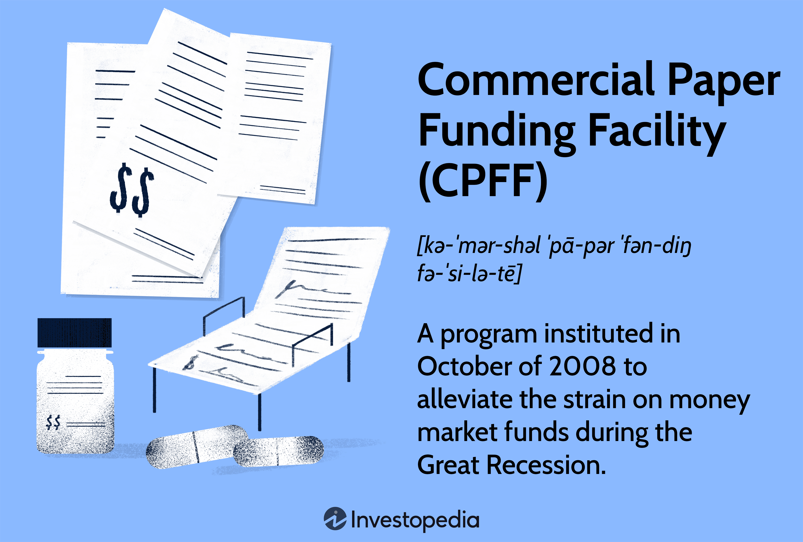

The evolving landscape of fixed income corporate bond investing is increasingly shaped by the advent of algorithmic trading, a technological advancement that is revolutionizing the financial markets. Traditionally, fixed income investments, particularly corporate bonds, function as debt securities issued by corporations aiming to raise capital. These securities offer predetermined returns and have been a key component of diversified investment portfolios. However, the introduction of algorithmic trading has begun to alter the way these bonds are traded and managed.

Algorithmic trading utilizes sophisticated algorithms and powerful computing resources to execute trades based on predetermined benchmarks, thereby significantly boosting the efficiency and competitiveness of trading strategies. The ability of algorithms to process vast amounts of data swiftly and execute trades at high speed provides a competitive edge that human traders may lack. With the adoption of algorithmic trading, the fixed income market has the potential for enhanced liquidity and more efficient trading processes, leading to improved market efficiencies and better investor outcomes. 

As we integrate technology further into trading strategies, the opportunities presented are substantial. Automation can drastically reduce transaction costs and eliminate emotional biases that often influence human trading decisions, making investment strategies more robust. Furthermore, this technological integration addresses market inefficiencies and enhances decision-making accuracy, promising a landscape where investor outcomes are optimized through informed and timely decisions.

The potential of algorithmic trading in fixed income markets holds promise for enhancing the traditional methodologies in bond trading. As these algorithms continue to evolve, the potential for their contribution to more efficient market mechanisms becomes increasingly apparent, suggesting a future where the blending of automation and traditional investment strategies leads to significant benefits for market participants.

## Table of Contents

## Understanding Fixed Income Corporate Bonds

Fixed income corporate bonds are debt securities issued by corporations intending to generate capital. They are a critical component in a diversified investment portfolio, primarily because they offer predictable income streams. The issuer promises to pay the bondholder a fixed interest, known as a coupon, at regular intervals until the bond matures. Upon maturity, the principal amount is returned to the investor.

### Characteristics of Corporate Bonds

Corporate bonds exhibit several distinctive features that make them appealing to investors. One key characteristic is the credit rating assigned by rating agencies like Moody’s, S&P Global, and Fitch. These ratings reflect the issuer’s creditworthiness and the likelihood of default, influencing the bond's [interest rate](/wiki/interest-rate-trading-strategies)—a higher risk usually commands a higher return.

Corporate bonds come in various forms, including:

- **Investment-Grade Bonds**: These bonds have higher credit ratings (typically BBB- or higher) and are considered low risk, offering lower yields but greater security.
- **High-Yield Bonds (or Junk Bonds)**: These have lower credit ratings (below BBB-) and offer higher yields to compensate for the increased risk of default.
- **Convertible Bonds**: These bonds can be converted into a pre-determined number of the issuer’s shares, blending traditional bond features with equity exposure.
- **Callable Bonds**: These allow issuers to repay and retire the debt before maturity, often when interest rates decline.

### Risk and Reward Profile

The appeal of corporate bonds lies in their risk-reward profile. While they generally provide lower returns compared to equities, they are regarded as safer investments due to the regular interest payouts and eventual return of principal. The primary risks associated with corporate bonds include credit risk (the risk of issuer default), interest rate risk (fluctuations in market interest rates), and market [liquidity](/wiki/liquidity-risk-premium) risk.

Calculating the yield of bonds can involve math formulas like:

$$
\text{Current Yield} = \frac{\text{Annual Coupon Payment}}{\text{Current Market Price}}
$$

### Investment Strategy for Income-Seeking Investors

For investors seeking income, corporate bonds offer a relatively predictable and stable income stream, useful in planning and sustaining financial goals. Investment strategies often involve balancing bond types and maturity dates to align with financial objectives and tolerance for risk.

- **Laddering Strategy**: Investors can stagger bond maturities over several intervals. This tactic helps manage interest rate exposure and provides opportunities to reinvest at higher rates if market rates rise.
- **Barbell Strategy**: This involves investing in short- and long-term bonds while avoiding intermediate terms. It aims to benefit from strong cash flow and potential capital appreciation from long-term positions.

By integrating diverse corporate bond holdings, investors not only enhance their income stream but also manage risk by selecting bonds with varying maturities, issuers, and credit qualities. This tailored approach can significantly contribute to achieving a balanced and resilient investment portfolio.

## The Role of Algorithmic Trading in Fixed Income Investments

Algorithmic trading in fixed income investments leverages sophisticated algorithms and high-speed computational power to execute trades based on predefined criteria. This approach is transformative in several ways within the fixed income market.

First, it enhances liquidity and trading efficiency significantly. By automating the trading process, algorithms can react to market changes in fractions of a second, allowing traders to capitalize on brief windows of opportunity that would be missed in manual trading. This speed not only increases the [volume](/wiki/volume-trading-strategy) of trades but also improves the immediacy with which trades are executed, thus reducing the bid-ask spread and contributing to overall market liquidity. According to a study by the Bank for International Settlements, [algorithmic trading](/wiki/algorithmic-trading) has been instrumental in enhancing liquidity, especially in less actively traded assets such as certain corporate bonds.

High-frequency trading ([HFT](/wiki/high-frequency-trading-strategies)), a subset of algorithmic trading, provides additional advantages in the corporate bond market. HFT strategies typically involve executing a large number of orders at super-fast speeds for smaller spreads. This can lead to more efficient price discovery processes and tighter bid-ask spreads as competing algorithms work to undercut each other, provided there is sufficient market liquidity. For instance, the presence of HFT has been shown to increase the transparency and efficiency of order [books](/wiki/algo-trading-books) in electronic markets.

Despite these advantages, algorithmic trading faces several challenges in the traditionally manual bond market. One of the main difficulties is incorporating unstructured data and qualitative assessments often used in bond pricing, which are less straightforward than equity markets. The fixed income market is characterized by diverse instruments with varying degrees of liquidity and complexity, making the design of robust algorithms more intricate.

Furthermore, algorithmic trading impacts market dynamics and pricing mechanisms. It can lead to increased market [volatility](/wiki/volatility-trading-strategies) due to rapid trades and potential feedback loops where algorithmic strategies respond to each other's actions. There is a risk that algorithms may react to ephemeral price changes, which might reinforce short-term trends and exacerbate fluctuations.

To mitigate these challenges, regulatory bodies have started implementing frameworks to ensure the stability and fairness of markets. Regulations may require algorithmic trading systems to have adequate risk controls, such as real-time monitoring and dynamic limit adjustment capabilities, to manage automated trading activities responsibly.

In conclusion, while algorithmic trading is revolutionizing the fixed income market by enhancing liquidity and trading efficiency, it also introduces new complexities and potential market risks that need careful management and oversight.

## Benefits of Combining Algorithmic Trading with Corporate Bonds

Algorithmic trading in the fixed income corporate bond market offers numerous advantages, making it an attractive option for investors seeking efficiency and cost-effectiveness. One of the primary benefits is the speed and reduced cost of executing trades. Algorithms can process vast amounts of information and data at a rate far exceeding human capabilities. This allows for rapid execution of trades, essential in a market where timing can significantly affect investment outcomes.

Furthermore, algorithmic trading eliminates the emotional biases that often influence human trading decisions. By relying on predefined criteria and quantitative models, algorithms ensure that decisions are based solely on data-driven insights. This objectivity enhances the accuracy and consistency of investment strategies, reducing the likelihood of mistakes caused by emotional reactions to market fluctuations.

Algorithms are adept at handling large volumes of trading data, parsing through complex datasets to identify patterns and opportunities. This capability allows investors to make informed decisions, optimizing portfolio performance. For instance, [machine learning](/wiki/machine-learning) algorithms can analyze historical data to predict future price movements, offering a competitive edge in bond trading.

The use of algorithms also has the potential to significantly reduce transaction costs. By automating the trade execution process, investors can decrease the time and resources spent on manual trades. Moreover, algorithms can seek the best available prices across various trading platforms, ensuring optimal execution prices and minimizing market impact costs.

Scalability and flexibility are other notable benefits of integrating algorithmic trading with corporate bonds. Algorithms can be tailored to manage portfolios of varying sizes, from small to extensive. This adaptability allows for efficient portfolio management, accommodating changes in strategy or market conditions. Furthermore, sophisticated algorithms can be designed to manage complex trading strategies, adjusting dynamically to new information and market developments.

In conclusion, the incorporation of algorithmic trading in corporate bond investing not only streamlines processes but also elevates the decision-making quality and cost efficiency. As technology continues to evolve, these benefits are expected to enhance the competitiveness and performance of investment strategies in the fixed income market.

## Challenges and Risks of Algorithmic Trading in Bonds

Automating the trading of corporate bonds through algorithmic systems introduces a range of complexities and risks, particularly due to the inherent nature of these financial instruments. Corporate bonds vary significantly in terms of liquidity, maturity, credit rating, and issuer-specific characteristics. While government bonds often trade in large volumes and are relatively liquid, corporate bonds do not necessarily afford the same liquidity, which poses a significant challenge for automation.

One of the primary challenges lies in constructing algorithms capable of handling the idiosyncrasies of less liquid bonds. In practice, less liquid bonds may experience wider bid-ask spreads and greater price volatility, complicating the task of executing trades efficiently. This can lead to significant price impact, where the execution of large orders drives the market price unfavorably against the trading entity. The design of algorithms that can adapt order sizes and execution timing based on prevailing market conditions is thus required. 

Moreover, an over-reliance on algorithmic decisions can expose investors to systemic risk. Algorithms depend heavily on historical data and pre-defined parameters that may not account for rare tail events or abrupt market shifts. This reliance can lead to synchronized trading responses among different algorithmic systems, exacerbating market volatility during periods of stress and potentially causing flash crashes.

Integrating traditional bond trading with modern automation technology also brings a host of challenges. Historically, bond trading has relied on over-the-counter (OTC) transactions and relationships between dealers and clients. Translating these nuanced interactions into a fully automated process requires capturing the implicit and explicit decision rules that human traders would use. Hence, the challenge is to programmatically simulate the judgment and expertise that experienced traders have developed over years.

The regulatory landscape for algorithmic trading in fixed income markets is continually evolving. Regulatory bodies such as the Securities and Exchange Commission (SEC) and the Financial Industry Regulatory Authority (FINRA) in the United States, as well as the European Securities and Markets Authority (ESMA) in the European Union, have developed rules to ensure that algorithmic trading does not lead to market abuse or systemic instability. These regulations often require algorithmic trading firms to implement risk controls, maintain audit trails, and periodically test the robustness of their trading systems. Compliance with these regulations necessitates significant investment in technology and governance structures.

Lastly, technological and operational risks abound in algorithmic trading. Technology failures, whether due to hardware malfunctions, software bugs, or cybersecurity threats, can disrupt trading operations and result in financial losses. Operational risks, including errors in algorithm coding or incorrect strategy deployment, can similarly lead to unintended trades or market distortions. Continuous monitoring and updates to algorithms are crucial to mitigate these risks. 

In summary, while algorithmic trading offers numerous efficiencies, it is accompanied by inherent complexities and risks that require careful management to avoid market disruptions and ensure compliance with regulatory expectations.

## Future Trends in Fixed Income Algorithmic Trading

As we look to the future of fixed income algorithmic trading, emerging technologies such as [artificial intelligence](/wiki/ai-artificial-intelligence) (AI) and machine learning (ML) are poised to play pivotal roles in enhancing trading strategies. With their ability to process vast amounts of data and identify patterns beyond human capabilities, AI and ML enable the development of more sophisticated and adaptive trading models. These technologies bring about an era where trading predictions become more accurate and strategies more efficient, thereby increasing the profitability of fixed income investments.

The advancement of computational infrastructure is a critical component in the evolution of algorithmic trading. High-performance computing and cloud technologies facilitate the rapid processing and analysis of large datasets necessary for developing AI-driven trading algorithms. These infrastructures support the speed and agility required to make real-time decisions in financial markets, and as hardware continues to evolve, we can anticipate even more efficient algorithm execution.

The potential for more granular and personalized trading strategies is increasing with automation. Automation enables the customization of trading strategies to meet the specific needs and risk profiles of individual investors. By leveraging AI and ML, trading platforms can develop tailored strategies that optimize returns while managing the risks associated with fixed income investments.

Big data and analytics play a substantial role in shaping future trading models. By harnessing large volumes of structured and unstructured data, traders can gain insights into market trends and investor behavior. Advanced analytics tools allow for the extraction of actionable insights that can inform algorithmic trading strategies, ultimately leading to more informed investment decisions.

Market regulations are continually evolving, and their future trajectory will significantly impact algorithmic trading. As regulators become more attuned to the complexities of algorithmic systems, there may be increased scrutiny and new compliance requirements to ensure market stability and fairness. Consequently, market participants must stay informed about regulatory changes and adjust their strategies to maintain compliance while leveraging technological advancements.

Overall, the intersection of AI, enhanced computational infrastructure, big data, and evolving regulations will shape the future of fixed income algorithmic trading. This transformation promises exciting opportunities for investors and trading institutions willing to adapt and innovate in this increasingly automated landscape.

## Conclusion

Algorithmic trading represents a substantial progression in the market for fixed income corporate bonds, offering numerous advantages to investors. By integrating automated systems, investors can achieve enhanced trading efficiency, which translates to quicker execution times and more accurate pricing. This efficiency is pivotal in markets where timing and pricing precision are crucial for achieving desired returns.

Furthermore, algorithmic trading enhances cost-effectiveness. The automation of trading processes reduces the need for manual intervention, minimizing labor costs and the potential for human error. This leads to lower transaction costs and more favorable net returns. The decision-making process also benefits significantly from the objectivity of algorithms, as they remove emotional biases that often affect human traders. Algorithms can swiftly process and analyze vast amounts of market data, making informed decisions based on pre-defined criteria and ensuring consistency in trading strategies.

While these advancements present promising opportunities for further growth and integration, challenges persist. The complexity of algorithmic systems requires substantial initial investment in technology and skilled personnel. There is also a risk associated with over-reliance on these systems, such as systemic risks and the potential for failures in dynamic market environments.

Nevertheless, the adoption of algorithmic trading strategies can give investors a competitive edge, allowing them to capitalize on market opportunities more effectively than traditional methods permit. As technological tools and strategies continue to evolve, market participants must conscientiously navigate the accompanying risks and regulatory challenges to sustainably harness these innovations.

In conclusion, the maturity of algorithmic trading technology signifies a landmark development in the fixed income corporate bond market. Investors embracing these systems are poised to benefit from a more streamlined, accurate, and financially advantageous trading experience. As the landscape evolves, balancing technological capabilities with prudent risk management will be crucial to leveraging the full potential of algorithmic trading in this burgeoning field.

## References & Further Reading

[1]: Bank for International Settlements. (2016). ["Electronic trading in fixed income markets."](https://www.bis.org/publ/mktc07.pdf)

[2]: Cartea, Á., Jaimungal, S., & Penalva, J. (2015). ["Algorithmic and High-Frequency Trading"](https://assets.cambridge.org/97811070/91146/frontmatter/9781107091146_frontmatter.pdf). Cambridge University Press.

[3]: Tuckman, B., & Serrat, A. (2011). ["Fixed Income Securities: Tools for Today's Markets"](https://www.amazon.com/Fixed-Income-Securities-Todays-Markets/dp/0470891696). Wiley.

[4]: Litterman, R., & Scheinkman, J. (1991). ["Common Factors Affecting Bond Returns."](https://www.pm-research.com/content/iijfixinc/1/1/54) The Journal of Fixed Income.

[5]: Guéant, O. (2016). ["The Financial Mathematics of Market Liquidity: From Optimal Execution to Market Making"](https://www.taylorfrancis.com/books/mono/10.1201/b21350/financial-mathematics-market-liquidity-olivier-gueant). CRC Press.