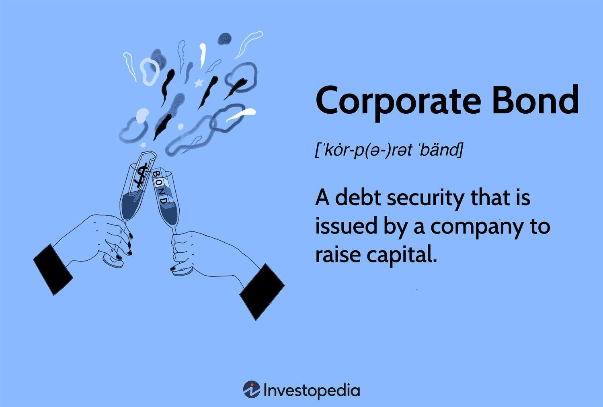

## Table of Contents

## What are corporate bonds?

Corporate bonds are a way for companies to borrow money from investors. When a company needs money for things like expanding their business or paying off debts, they can issue bonds. Investors buy these bonds, essentially lending money to the company. In return, the company promises to pay back the money with interest over a certain period of time. This interest is like a reward for the investor for lending their money.

These bonds are considered a bit riskier than government bonds because companies can go bankrupt. If a company goes bankrupt, bondholders might not get all their money back. However, corporate bonds usually offer higher interest rates than government bonds to make up for this risk. Investors can buy and sell these bonds on a bond market, just like stocks, which makes it easier to get their money back if they need it before the bond matures.

## How do corporate bonds differ from other types of bonds?

Corporate bonds are different from other types of bonds mainly because of who issues them and how risky they are. Companies issue corporate bonds to raise money, while government bonds are issued by governments. This means that with corporate bonds, you're lending money to a company, not a government. Because companies can go bankrupt more easily than governments, corporate bonds are usually seen as riskier. To make up for this risk, corporate bonds often offer higher interest rates than government bonds.

Another type of bond is municipal bonds, which are issued by local governments or agencies. Like government bonds, municipal bonds are generally considered safer than corporate bonds because the chance of a local government going bankrupt is lower than a company. However, the interest rates on municipal bonds are usually lower than corporate bonds because they are less risky. So, when choosing between these bonds, investors have to think about how much risk they are willing to take and how much return they want on their investment.

## What are the benefits of investing in corporate bonds?

Investing in corporate bonds can be a good way to earn money. When you buy a corporate bond, you are lending money to a company. In return, the company pays you interest regularly, usually every six months. This interest can be a steady source of income for you. Unlike stocks, where your money can go up and down a lot, the interest from bonds is more predictable. This makes corporate bonds a safer choice if you want a regular income without too much risk.

Another benefit is that corporate bonds can be a good way to spread out your investments. If you have all your money in one place, like stocks, and something bad happens to the stock market, you could lose a lot of money. But if you also have some money in corporate bonds, you are not putting all your eggs in one basket. Corporate bonds can help balance out your investments because they usually do not go up and down as much as stocks. This can make your overall investment safer and more stable.

## What are the risks associated with corporate bonds?

Investing in corporate bonds can be risky because there's a chance the company might not be able to pay you back. If the company goes bankrupt, you might lose some or all of the money you lent them. This is called default risk. Even though corporate bonds are generally safer than stocks, they are still riskier than government bonds because companies can go out of business more easily than governments.

Another risk is interest rate risk. This happens when the general level of interest rates in the economy goes up. If you have a bond that pays a fixed interest rate, it might not look as good compared to newer bonds that offer higher rates. This can make the value of your bond go down if you want to sell it before it matures. So, if you need to sell your bond early, you might get less money back than you expected.

Lastly, there's also the risk of inflation. If prices for things like food and gas go up a lot, the money you get from your bond might not be worth as much as when you first bought it. This means your investment might not keep up with the cost of living, and you could lose purchasing power over time. So, while corporate bonds can be a good way to earn steady income, it's important to understand these risks before you invest.

## How can one assess the creditworthiness of a corporate bond?

To figure out if a corporate bond is a good investment, you need to check the company's creditworthiness. This means looking at how likely the company is to pay you back. One way to do this is by looking at credit ratings from agencies like Moody's, Standard & Poor's, or Fitch. These agencies give grades to companies based on their financial health. A high grade, like AAA or A, means the company is very likely to pay you back. A lower grade, like BB or below, means there's more risk that the company might not be able to pay you back.

Another way to assess a company's creditworthiness is by looking at its financial statements. You can find these on the company's website or through financial news websites. Look at things like the company's profits, how much debt it has, and how well it's managing its money. If a company is making good profits and doesn't have too much debt, it's more likely to be able to pay you back. Talking to a financial advisor can also help. They can explain the numbers and give you a better idea of whether the bond is a safe investment for you.

## What is the yield to maturity and how is it calculated for corporate bonds?

Yield to maturity (YTM) is the total return you can expect to get from a corporate bond if you hold it until it matures. It's like figuring out the average interest rate you will earn each year until the bond's end date. YTM takes into account the bond's current price, its face value (the amount you get back when it matures), the interest payments you get along the way, and how long you have to wait until the bond matures.

To calculate YTM, you need to use a special formula that can be a bit tricky. You start with the bond's current price, the face value, the coupon rate (the interest rate the bond pays), and the time left until the bond matures. Then, you solve for the rate that makes the present value of all future cash flows (interest payments and the face value at maturity) equal to the bond's current price. This rate is the YTM. You can use a financial calculator or a spreadsheet program like Excel to do this calculation because it involves solving for the interest rate in a complex equation.

## What role do bond ratings play in investing in corporate bonds?

Bond ratings are like report cards for corporate bonds. They tell you how safe it is to lend money to a company. Agencies like Moody's, Standard & Poor's, and Fitch give these ratings. A high rating, like AAA or A, means the company is very likely to pay you back. It's like getting a good grade in school. A lower rating, like BB or below, means there's more risk. It's like getting a bad grade. These ratings help you decide if a bond is a good investment for you.

When you're thinking about buying a corporate bond, the bond rating can help you understand the risk. If you see a bond with a high rating, you might feel more comfortable investing because it's less likely the company will go bankrupt. But if you see a bond with a low rating, you might want to think twice because there's a bigger chance you won't get your money back. So, bond ratings are a big part of deciding which corporate bonds to buy.

## How do interest rate changes affect corporate bond prices?

When interest rates go up, the prices of corporate bonds usually go down. This happens because new bonds that are issued after the interest rate increase will offer higher interest payments. If you have an old bond that pays less interest, it's not as attractive to other investors. So, if you want to sell your old bond before it matures, you might have to sell it for less money. This is called interest rate risk.

On the other hand, when interest rates go down, the prices of corporate bonds usually go up. This is because your old bond, which pays a higher interest rate than new bonds, becomes more attractive to other investors. If you want to sell your bond, you can probably get more money for it because other people want to buy it for its higher interest payments. So, changes in interest rates can really affect how much your corporate bond is worth if you need to sell it before it matures.

## What is the difference between investment-grade and high-yield corporate bonds?

Investment-grade corporate bonds are considered safer because they have higher credit ratings. These bonds are given ratings of BBB- or higher by agencies like Standard & Poor's, or Baa3 or higher by Moody's. Because they are less risky, investment-grade bonds usually offer lower interest rates. Investors who want a steady income and are willing to accept lower returns often choose these bonds because the chance of the company going bankrupt and not paying back the money is smaller.

High-yield corporate bonds, also known as junk bonds, have lower credit ratings, usually below BBB- or Baa3. These bonds are riskier because there's a higher chance the company might not be able to pay back the money. To make up for this risk, high-yield bonds offer higher interest rates. Investors who are willing to take on more risk in hopes of getting higher returns might choose these bonds. But they need to be ready for the possibility that the company could go bankrupt, which means they might lose some or all of their investment.

## How can diversification be applied to a corporate bond portfolio?

Diversification in a corporate bond portfolio means spreading your money across different bonds to reduce risk. Instead of putting all your money into bonds from one company or one industry, you can buy bonds from many different companies and industries. This way, if one company or industry has problems and can't pay back their bonds, you won't lose all your money. It's like not putting all your eggs in one basket. By having a mix of bonds, you can protect yourself better from the risk that comes with investing in just one type of bond.

You can diversify your corporate bond portfolio in a few ways. One way is by choosing bonds from companies in different industries, like technology, healthcare, and energy. Another way is by [picking](/wiki/asset-class-picking) bonds with different credit ratings, so you have some safer investment-grade bonds and some riskier high-yield bonds. You can also diversify by investing in bonds that mature at different times. Some bonds might pay you back in a few years, while others might take longer. This mix can help you manage risk and possibly earn a better return on your investment.

## What are callable and putable features in corporate bonds and how do they impact investment?

Callable and putable features in corporate bonds give both the company and the investor some control over when the bond can be paid back. A callable bond lets the company pay back the bond early, before it's supposed to mature. This can happen if interest rates go down and the company wants to borrow money again at a lower rate. If you're an investor, this means you might get your money back sooner than expected, but you'll lose out on the interest you were supposed to get for the rest of the bond's life. So, callable bonds can be riskier for investors because they might not get all the interest they were hoping for.

On the other hand, a putable bond gives the investor the right to make the company pay back the bond early. This can be helpful if interest rates go up and you want to get your money back to invest in a new bond with a higher interest rate. Putable bonds are less risky for investors because they give you more control over your investment. If you have a putable bond, you can choose to get your money back early if you think it's a good idea. So, putable bonds can be a safer choice for investors who want more control over their investments.

## How do macroeconomic factors influence the performance of corporate bonds?

Macroeconomic factors, like the overall health of the economy, can have a big impact on how well corporate bonds do. When the economy is doing well, companies usually make more money and are less likely to go bankrupt. This makes their bonds safer and more attractive to investors. But if the economy starts to struggle, companies might not make as much money, and there's a bigger chance they could go bankrupt. This makes their bonds riskier, and investors might want higher interest rates to take that risk. So, the economy's ups and downs can change how safe and valuable corporate bonds are.

Interest rates set by central banks, like the Federal Reserve in the U.S., also play a big role. When interest rates go up, new bonds come out with higher interest payments, making older bonds with lower rates less attractive. This can cause the prices of existing corporate bonds to drop if investors want to sell them before they mature. On the flip side, when interest rates go down, older bonds with higher rates become more valuable because they pay more interest than new bonds. So, changes in interest rates can really shake up the value of corporate bonds, making them go up or down depending on what's happening with the economy.

## What is the understanding of fixed income corporate bonds?

Fixed income corporate bonds are debt securities issued by corporations intending to generate capital. They are a critical component in a diversified investment portfolio, primarily because they offer predictable income streams. The issuer promises to pay the bondholder a fixed interest, known as a coupon, at regular intervals until the bond matures. Upon maturity, the principal amount is returned to the investor.

### Characteristics of Corporate Bonds

Corporate bonds exhibit several distinctive features that make them appealing to investors. One key characteristic is the credit rating assigned by rating agencies like Moody’s, S&P Global, and Fitch. These ratings reflect the issuer’s creditworthiness and the likelihood of default, influencing the bond's [interest rate](/wiki/interest-rate-trading-strategies)—a higher risk usually commands a higher return.

Corporate bonds come in various forms, including:

- **Investment-Grade Bonds**: These bonds have higher credit ratings (typically BBB- or higher) and are considered low risk, offering lower yields but greater security.
- **High-Yield Bonds (or Junk Bonds)**: These have lower credit ratings (below BBB-) and offer higher yields to compensate for the increased risk of default.
- **Convertible Bonds**: These bonds can be converted into a pre-determined number of the issuer’s shares, blending traditional bond features with equity exposure.
- **Callable Bonds**: These allow issuers to repay and retire the debt before maturity, often when interest rates decline.

### Risk and Reward Profile

The appeal of corporate bonds lies in their risk-reward profile. While they generally provide lower returns compared to equities, they are regarded as safer investments due to the regular interest payouts and eventual return of principal. The primary risks associated with corporate bonds include credit risk (the risk of issuer default), interest rate risk (fluctuations in market interest rates), and market [liquidity](/wiki/liquidity-risk-premium) risk.

Calculating the yield of bonds can involve math formulas like:

$$
\text{Current Yield} = \frac{\text{Annual Coupon Payment}}{\text{Current Market Price}}
$$

### Investment Strategy for Income-Seeking Investors

For investors seeking income, corporate bonds offer a relatively predictable and stable income stream, useful in planning and sustaining financial goals. Investment strategies often involve balancing bond types and maturity dates to align with financial objectives and tolerance for risk.

- **Laddering Strategy**: Investors can stagger bond maturities over several intervals. This tactic helps manage interest rate exposure and provides opportunities to reinvest at higher rates if market rates rise.
- **Barbell Strategy**: This involves investing in short- and long-term bonds while avoiding intermediate terms. It aims to benefit from strong cash flow and potential capital appreciation from long-term positions.

By integrating diverse corporate bond holdings, investors not only enhance their income stream but also manage risk by selecting bonds with varying maturities, issuers, and credit qualities. This tailored approach can significantly contribute to achieving a balanced and resilient investment portfolio.

## References & Further Reading

[1]: Bank for International Settlements. (2016). ["Electronic trading in fixed income markets."](https://www.bis.org/publ/mktc07.pdf)

[2]: Cartea, Á., Jaimungal, S., & Penalva, J. (2015). ["Algorithmic and High-Frequency Trading"](https://assets.cambridge.org/97811070/91146/frontmatter/9781107091146_frontmatter.pdf). Cambridge University Press.

[3]: Tuckman, B., & Serrat, A. (2011). ["Fixed Income Securities: Tools for Today's Markets"](https://www.amazon.com/Fixed-Income-Securities-Todays-Markets/dp/0470891696). Wiley.

[4]: Litterman, R., & Scheinkman, J. (1991). ["Common Factors Affecting Bond Returns."](https://www.pm-research.com/content/iijfixinc/1/1/54) The Journal of Fixed Income.

[5]: Guéant, O. (2016). ["The Financial Mathematics of Market Liquidity: From Optimal Execution to Market Making"](https://www.taylorfrancis.com/books/mono/10.1201/b21350/financial-mathematics-market-liquidity-olivier-gueant). CRC Press.