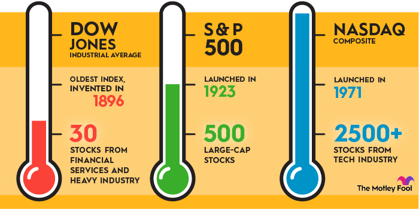

## Table of Contents

## What is the Dow Jones Industrial Average (DJIA)?

The Dow Jones Industrial Average, often called the Dow or DJIA, is a famous stock market index. It measures the performance of 30 large companies in the United States. These companies come from different industries like technology, health care, and finance. The DJIA is used as a way to see how the overall stock market and the U.S. economy are doing. It was created by Charles Dow in 1896.

The DJIA is calculated by adding up the stock prices of the 30 companies and then dividing by a special number called the divisor. This divisor changes over time to account for things like stock splits and dividends. When the DJIA goes up, it usually means that the stock market is doing well. When it goes down, it can mean that investors are worried about the economy. Many people watch the DJIA to help them make decisions about buying and selling stocks.

## How does the DJIA differ from other stock market indices?

The DJIA is different from other stock market indices mainly because of how it's made and what it includes. The DJIA only has 30 big companies from the U.S., while other indices like the S&P 500 have 500 companies. This smaller number of companies makes the DJIA easier to understand but also means it might not show the whole market as well as bigger indices. Also, the DJIA uses a price-weighted method, which means companies with higher stock prices have more impact on the index. Other indices, like the S&P 500, use a market-cap weighted method, where companies with bigger total values have more impact.

Another way the DJIA is different is its focus on traditional industries. While it does include some tech companies, it's not as focused on technology as newer indices like the Nasdaq Composite. The DJIA has companies from industries like finance, health care, and manufacturing, which gives a broad view of the U.S. economy but might miss out on the fast growth in tech sectors. This mix of industries can make the DJIA a good way to see how the overall economy is doing, but it might not be the best choice if you're interested in specific sectors like technology or small companies.

## What are the components of the Dow Jones Industrial Average?

The Dow Jones Industrial Average, or DJIA, includes 30 big companies from different parts of the U.S. economy. Some of these companies are in technology, like Apple and Microsoft. Others are in health care, like Johnson & Johnson, or in finance, like Goldman Sachs and JPMorgan Chase. There are also companies in industries like manufacturing, with companies like Caterpillar and 3M, and in consumer goods, with companies like Procter & Gamble and Coca-Cola.

These 30 companies are chosen because they are important and well-known. They are supposed to show how the whole U.S. economy is doing. The list of companies can change over time. For example, if a company is not doing well or if a new company becomes very important, it might be added to the DJIA. This means the DJIA tries to stay up-to-date with what's happening in the economy.

## How can someone start investing in the DJIA?

To start investing in the DJIA, you first need to open a brokerage account. A brokerage account is like a special bank account where you can buy and sell stocks. You can find many online brokerages that let you do this easily. Once your account is set up, you'll need to add money to it. This money is what you'll use to buy stocks. After you have money in your account, you can start investing in the DJIA.

One way to invest in the DJIA is by buying shares of a DJIA index fund or an exchange-traded fund ([ETF](/wiki/etf-trading-strategies)) that tracks the DJIA. These funds hold all 30 companies in the DJIA, so when you buy shares of the fund, you're investing in all those companies at once. This can be a simple way to invest because you don't have to pick individual stocks. Another way is to buy shares of the individual companies in the DJIA. This can be more work because you need to decide which companies to buy and when, but it also lets you pick the ones you think will do the best. Either way, remember to do some research first and maybe talk to a financial advisor to make sure investing in the DJIA is right for you.

## What are the benefits of investing in the DJIA for beginners?

Investing in the DJIA can be a good choice for beginners because it's easy to understand and follow. The DJIA is made up of 30 big companies from different parts of the U.S. economy. This means when you invest in the DJIA, you're spreading your money across many different industries, which can be safer than putting all your money in just one company. It's like not putting all your eggs in one basket. Also, the DJIA is well-known and often talked about in the news, so it's easy to keep up with how it's doing.

Another benefit for beginners is that you can invest in the DJIA through index funds or ETFs, which are simple ways to invest. These funds hold all the companies in the DJIA, so you don't have to pick which stocks to buy yourself. This can make investing less scary for someone just starting out. Plus, these funds often have low fees, which means you get to keep more of your money. By investing in the DJIA, beginners can start learning about the stock market and how it works, while also having a chance to grow their money over time.

## What are the risks associated with investing in the DJIA?

Investing in the DJIA can be risky because the stock market can go up and down a lot. The DJIA is made up of 30 big companies, but if a lot of those companies do badly, the whole index can go down. This means you could lose money if you invest when the market is high and it goes down later. Also, the DJIA is focused on big, traditional companies. If new industries or smaller companies start doing better, the DJIA might not do as well as other parts of the market.

Another risk is that the DJIA uses a price-weighted method, which means companies with higher stock prices have more impact on the index. If one of these high-priced companies does badly, it can pull the whole index down. This can be different from other indices that use different ways to measure performance. Also, while the DJIA can be a good way to spread your money across different industries, it's still just one part of the economy. If the whole economy has problems, the DJIA can go down too. So, it's important to think about these risks and maybe talk to a financial advisor before you start investing.

## How does the performance of the DJIA reflect the broader economy?

The Dow Jones Industrial Average, or DJIA, is often used as a way to see how the broader U.S. economy is doing. It includes 30 big companies from different parts of the economy, like technology, health care, and finance. When these companies are doing well, it usually means the economy is strong. People feel confident and spend more money, which helps businesses grow. On the other hand, if the DJIA goes down, it can be a sign that people are worried about the economy. They might spend less, and businesses might struggle, which can lead to slower economic growth.

However, the DJIA doesn't show everything about the economy. It's just one part of it. The DJIA focuses on big, well-known companies and might not show what's happening with smaller businesses or new industries. Also, the DJIA can be affected by things like global events or changes in certain industries that might not affect the whole economy in the same way. So while the DJIA can give a good idea of how the economy is doing, it's important to look at other indicators too to get the full picture.

## What strategies can be used to maximize returns from DJIA investments?

One way to try to get more money from investing in the DJIA is to use a strategy called dollar-cost averaging. This means you put money into the DJIA regularly, like every month, instead of all at once. By doing this, you buy more shares when the price is low and fewer shares when the price is high. Over time, this can help you pay less on average for your shares and might lead to better returns. Another part of this strategy is to keep your money in the DJIA for a long time. The stock market can go up and down a lot in the short term, but over many years, it usually goes up. So, if you're patient and keep your money invested, you have a better chance of making more money.

Another strategy is to look at how the DJIA is doing compared to other parts of the market. Sometimes, the DJIA might not be doing as well as other indices like the S&P 500 or the Nasdaq. If you think other parts of the market will do better, you might want to move some of your money there. But this needs to be done carefully because trying to guess which part of the market will do best can be risky. A simpler approach is to use something called rebalancing. This means you check your investments every so often and make sure you still have the right mix of different types of investments. If the DJIA has gone up a lot, you might sell some of it and buy other things to keep your mix balanced. This can help you manage risk and might lead to better returns over time.

## How does the calculation of the DJIA work, and why is it important for investors?

The Dow Jones Industrial Average, or DJIA, is calculated by adding up the stock prices of its 30 companies and then dividing by a special number called the divisor. This divisor changes over time to make sure the DJIA stays accurate even when things like stock splits or dividends happen. The DJIA uses a price-weighted method, which means companies with higher stock prices have a bigger effect on the index. So, if a company's stock price goes up a lot, it can pull the whole DJIA up with it.

Understanding how the DJIA is calculated is important for investors because it helps them know what the index really shows. The DJIA gives a quick look at how some big companies in the U.S. are doing, which can tell investors a lot about the overall economy. But because it only has 30 companies and uses a price-weighted method, it might not show the whole market. So, investors need to know this to make smart choices about where to put their money. They can use the DJIA to see trends and decide if it's a good time to buy or sell, but they should also look at other indices and do their own research.

## What historical trends should an investor be aware of when investing in the DJIA?

When you're thinking about investing in the DJIA, it's good to know about some big trends from the past. The DJIA has been around since 1896, and over all that time, it's gone up a lot. But it's also had some big drops, like during the Great Depression in the 1930s and the financial crisis in 2008. These big drops show that the stock market can be risky, and the DJIA can go down a lot sometimes. But after these drops, the DJIA usually goes back up over time. This shows that if you're patient and keep your money in the DJIA for a long time, you might do well.

Another thing to know is that the DJIA changes over time. The companies in the DJIA are picked to show what's important in the U.S. economy, so they can change. For example, in the past, the DJIA had more companies from industries like steel and railroads. Now, it has more from technology and health care. This means the DJIA tries to stay up-to-date with what's happening in the economy. So, when you're investing, it's good to think about what industries are doing well now and might do well in the future. This can help you decide if the DJIA is a good place to put your money.

## How can investors use options and futures related to the DJIA to hedge their investments?

Investors can use options and futures related to the DJIA to protect their investments from big drops in the market. Options give you the right, but not the obligation, to buy or sell the DJIA at a certain price before a certain time. If you think the DJIA might go down, you can buy a put option. This means you can sell the DJIA at the price you chose, even if the real price goes lower. This can help you lose less money if the market goes down. Futures, on the other hand, are agreements to buy or sell the DJIA at a set price on a certain date in the future. If you're worried about the DJIA dropping, you can sell a futures contract. This way, if the DJIA goes down, you'll make money on the futures to help cover any losses in your other investments.

Using options and futures can be a bit tricky, so it's important to understand how they work before you start. Options can be cheaper than buying the actual stocks in the DJIA, but they also have risks. If the DJIA doesn't go down like you thought, you could lose the money you spent on the options. Futures can be more complicated because they require you to actually buy or sell at the end of the contract, which means you need to have enough money to do that. But if used right, both options and futures can be good tools to help you manage the risks of investing in the DJIA. They let you plan for different things that might happen in the market and protect your money.

## What advanced analytical tools and metrics should an expert use to predict DJIA movements?

Experts can use several advanced tools and metrics to try to predict how the DJIA will move. One important tool is technical analysis, which looks at past price movements and trading volumes to find patterns. This can include using things like moving averages, which smooth out price data to see trends over time, and the Relative Strength Index (RSI), which shows if a stock is overbought or oversold. Another useful metric is the Bollinger Bands, which show how much the DJIA's price has been moving around its average. By looking at these patterns and indicators, experts can make guesses about where the DJIA might go next.

Another set of tools experts use is [fundamental analysis](/wiki/fundamental-analysis), which looks at the actual health and performance of the companies in the DJIA. This can include studying financial statements to see how much money the companies are making and what they're worth. Experts also look at economic indicators like GDP growth, unemployment rates, and inflation to understand the bigger picture. They might use models like the Capital Asset Pricing Model (CAPM) to see how the DJIA should perform based on its risk compared to the overall market. By combining these different tools and metrics, experts can make more informed predictions about the DJIA's future movements.

## What is the Dow Jones Industrial Average (DJIA) and how does it work?

The Dow Jones Industrial Average (DJIA) is a prominent stock market index that consists of 30 large-cap companies, often referred to as blue-chip stocks. These companies are leaders in their respective sectors, which include technology, healthcare, finance, consumer goods, and industrials, among others. The index serves as a representative gauge of the U.S. economic health, providing insights into how major businesses are performing.

The DJIA is a price-weighted index, meaning that each company's influence on the index is proportional to its stock price, rather than its market capitalization. This method of calculation is relatively straightforward: the sum of the prices of the 30 stocks is divided by a divisor, which accounts for stock splits and other adjustments. As a formula, it can be represented as:

$$
\text{DJIA} = \frac{\sum_{i=1}^{30} P_i}{D}
$$

Where $P_i$ represents the price of the $i$-th stock, and $D$ is the divisor.

Investors cannot directly purchase shares of the DJIA itself due to its nature as an index. Instead, they have the option to buy shares in the individual companies that make up the DJIA. However, purchasing shares in all 30 companies requires significant capital and meticulous management to ensure proportional investment in line with the index's weighting. 

For investors seeking to mimic the DJIA's performance without individually buying each component stock, several investment funds replicate the index's performance. These include Exchange Traded Funds (ETFs) and mutual funds that are specifically designed to track the DJIA. By investing in such funds, investors can achieve diversified exposure to the composite companies of the DJIA with ease and reduced transaction costs.

## What are the investment strategies in the DJIA?

Investment strategies associated with the Dow Jones Industrial Average (DJIA) cater to a range of investor profiles, from those seeking traditional methods to those leveraging advanced algorithmic techniques. 

One prominent traditional strategy is the "Dogs of the Dow." This approach involves selecting the ten DJIA stocks with the highest dividend yield at the beginning of the year. The premise is that these stocks are undervalued and provide higher-than-average income potential. Investors reallocate their portfolio annually, choosing a new batch of ten stocks based on updated yield data. Historical studies suggest that this strategy often yields competitive returns by capitalizing on underpriced stocks with robust dividend payments.

Investors keen on risk management may also use protective put strategies or covered calls. A protective put involves buying a put option for a stock that the investor already owns, providing the right to sell those shares at a predetermined price. This strategy offers downside protection while maintaining upside potential. The formula for the protective put value, $V_{\text{protective put}}$, combines the underlying stock price $S$ and the put option price $P$:

$$
V_{\text{protective put}} = S + P
$$

Covered calls involve holding a stock and selling call options on the same asset, generating income through premiums. This strategy is effective when an investor expects minimal stock price movement. The combined payoff for a covered call strategy can be calculated as:

$$
V_{\text{covered call}} = S - \max(0, S - K) + C
$$

where $K$ is the strike price of the call, and $C$ is the premium received from the call option sale.

Algorithmic trading enhances these traditional strategies by incorporating data-driven decision-making processes. Algorithms can assess market conditions and adjust strategies in real-time, implementing techniques such as protective puts or call spreads. Call spreads, for example, involve buying and selling call options with different strike prices, allowing investors to speculate or hedge future price movements with controlled risk levels.

Implementing an [algorithmic trading](/wiki/algorithmic-trading) system in Python to evaluate protective puts or call spreads could involve leveraging libraries such as NumPy or Pandas to process data efficiently. Below is a simple pseudocode to illustrate the basic setup for an algorithmic strategy:

```python
import numpy as np
import pandas as pd

# Load historical stock price data
prices = pd.read_csv('djia_stocks.csv')

# Define algorithm parameters
strike_price = 100
put_premium = 5

# Evaluate protective put strategy
def calculate_protective_put(stock_price, strike_price, put_premium):
    return stock_price + put_premium

# Iterate over stock prices to simulate strategy performance
for price in prices['Close']:
    value = calculate_protective_put(price, strike_price, put_premium)
    print(f"Protective Put Value: {value}")

# Further development can include dynamic decision-making
```

This combination of traditional and algorithmic strategies offers diversified approaches to investing in the DJIA, enabling investors to tailor their strategies according to their risk appetite and market outlook.

## References & Further Reading

[1]: ["The Dow Jones Industrial Average: A History"](https://www.macrotrends.net/1319/dow-jones-100-year-historical-chart) by CNBC

[2]: ["Dow Theory: Charles Dow's Investment Tool"](https://www.investopedia.com/terms/d/dowtheory.asp) by Investopedia

[3]: "Algorithmic Trading and DMA: An Introduction to Direct Access Trading Strategies" by Barry Johnson

[4]: ["A Visual Guide to ETFs"](https://www.wiley.com/en-us/Visual%20Guide%20to%20ETFs-p-x000591756) by Bloomberg

[5]: ["Quantitative Analysis, Derivatives Modeling, and Trading Strategies"](https://archive.org/details/quantitativeanal0000tang) by Yi Tang

[6]: ["The Complete Guide to ETF Portfolio Management"](https://www.swetf.com/) by Morningstar

[7]: ["Algorithmic Trading for Dummies"](https://www.investopedia.com/articles/active-trading/101014/basics-algorithmic-trading-concepts-and-examples.asp) by David James Stewart in Dummies.com