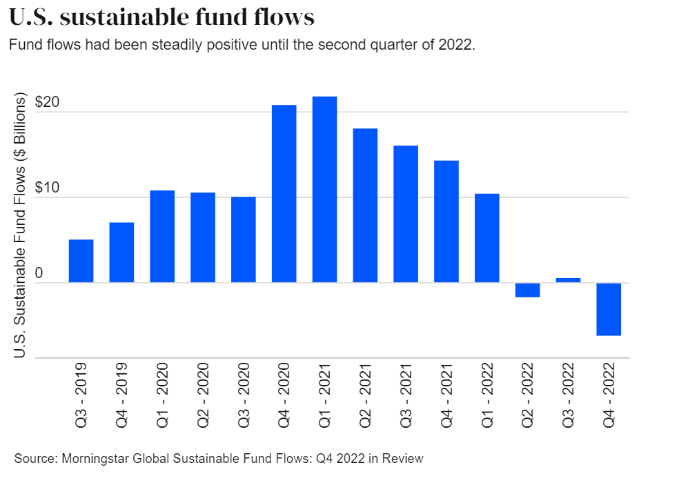

The intersection of sustainable investment, Environmental, Social, and Governance (ESG) investing, and algorithmic trading is reshaping the landscape of modern finance. In 2024, these converging trends are gaining prominence as investors increasingly seek to harmonize their financial objectives with sustainable values. This blend presents a new paradigm where profitability aligns with environmental responsibility and social accountability.

Sustainable investment, which emphasizes long-term viable practices, has experienced notable growth. This approach prioritizes financial returns while considering the broader impact on the environment and society. ESG investing, a subset of sustainable investment, involves evaluating companies on their management of environmental, social, and governance factors. This assessment provides a framework for identifying businesses that are not only financially sound but also committed to ethical operations. According to Refinitiv, ESG bonds issuance touched $1 trillion by 2021, marking an accelerating trend towards sustainability-focused assets [1].



Algorithmic trading introduces a technological dimension to this investment strategy. Algorithms, designed to process vast amounts of data at high speeds, enhance decision-making capabilities for investors. These tools can refine ESG scores by integrating diverse datasets, ranging from carbon emissions data to board diversity statistics. This synthesis allows for a more comprehensive evaluation of investment vehicles, supporting informed choices that align with both financial and non-financial objectives.

As we navigate 2024, the significance of these trends is underscored by increased regulatory pressure and heightened consumer awareness. Investors are leveraging technologies like artificial intelligence and machine learning to maximize returns while adhering to ESG criteria. This dual focus on financial and ethical metrics reflects a broader shift towards responsible capitalism.

The purpose and scope of this article are to explore the evolving dynamics of sustainable and ESG investing, particularly in conjunction with algorithmic trading. It aims to provide insights into how these strategies are reshaping portfolios, enhancing value, and driving the future of investment. Through this exploration, investors are encouraged to consider ESG factors as integral components of their decision-making processes, fostering a financial environment that supports sustainable growth.

---
[1] Refinitiv, "Green Bonds Issuance Breaks $1 Trillion Barrier in 2021".

## Table of Contents

## The Rise of Sustainable Investment

Sustainable investing has rapidly evolved over the past few decades, gaining significant traction as investors increasingly recognize the importance of integrating environmental, social, and governance ([ESG](/wiki/esg-investing)) considerations into financial decision-making. This method of investing aims to generate long-term competitive financial returns while positively impacting society and the environment.

The [momentum](/wiki/momentum) behind sustainable investing can be largely attributed to the global environmental and social movements that have emerged over recent years. Climate change awareness has heightened scrutiny on carbon emissions and resource consumption, prompting investors to seek opportunities that mitigate such impacts. Movements advocating for social equality and justice have also increased focus on fair labor practices, diversity, equity, and inclusion (DEI) initiatives. As such, investment strategies are increasingly being designed to align with these societal demands.

Several major sectors are at the forefront of sustainable investment. The renewable energy sector, including companies involved in solar, wind, and hydroelectric power, is pivotal. These industries offer viable alternatives to fossil fuels and are critical in reducing carbon footprints globally. Additionally, technology companies focusing on sustainable innovation, such as software facilitating energy efficiency or platforms promoting the sharing economy, lead the charge. Consumer goods companies that implement sustainable sourcing practices and utilize eco-friendly materials are also significant players.

Regulatory changes have played an instrumental role in accelerating the adoption of sustainable investments. Governments and international organizations have begun implementing policies that encourage transparency and accountability in corporate ESG practices. Such regulations include mandatory ESG disclosures and incentives for green initiatives. The European Union's Sustainable Finance Disclosure Regulation (SFDR) and the increasing prevalence of carbon pricing mechanisms are prominent examples of how policy frameworks are promoting sustainable investing practices. By establishing clear guidelines, these regulatory measures enhance the reliability and comparability of ESG data, thereby empowering investors to make informed decisions aligned with their values.

In summary, the rise of sustainable investment reflects a profound shift in investment paradigms, driven by a combination of societal pressures, sectoral innovation, and supportive regulatory environments. As the global focus on sustainability intensifies, this investment approach is expected to continue evolving and expanding, offering a pathway to both meet financial objectives and contribute to a more sustainable future.

## Understanding ESG Investing

### Understanding ESG Investing

Environmental, Social, and Governance (ESG) criteria are a set of standards for a company's operations that socially conscious investors use to screen potential investments. Environmental criteria consider how a company performs as a steward of nature. Social criteria examine how it manages relationships with employees, suppliers, customers, and the communities where it operates. Governance deals with a company’s leadership, executive pay, audits, internal controls, and shareholder rights ([MSCI ESG Research](https://www.msci.com/our-solutions/esg-investing), [S&P Global](https://www.spglobal.com/esg/)).

**ESG Score Calculation and Impact**

ESG scores are metrics intended to measure a company's exposure to long-term environmental, social, and governance risks. These risks can have material financial consequences, and companies with higher ESG scores are often seen as having better risk management practices ([Refinitiv, 2023](https://www.refinitiv.com/en/sustainable-finance/esg-scores)).

The calculation of ESG scores involves analyzing a variety of publicly reported data, and multiple methodologies are used to weight these data points. Generally, the formula for an indicative ESG score $S$ can be expressed as:

$$

S = w_E \cdot E + w_S \cdot S + w_G \cdot G 
$$

where $E, S,$ and $G$ represent the environmental, social, and governance scores, respectively, and $w_E, w_S, w_G$ are the respective weights assigned to each dimension. These weights differ between scoring agencies depending on the relative importance assigned to each category.

Investors use ESG scores to make informed investment choices, aiming to align their portfolios with values that reflect sustainability. High ESG scores can attract investors, enhancing a firm’s capital and impacting stock prices favorably, whereas poor scores may deter investment.

**Benefits and Challenges of ESG Investing**

ESG investing offers numerous benefits, including risk mitigation, long-term performance, and alignment with ethical values. Studies suggest that ESG-compliant companies often achieve better operational performance, reducing costs and avoiding controversies ([Harvard Business School](https://www.hbs.edu/faculty/Publication%20Files/Impact%20Investing_18c43cb1-2a94-4559-905c-fe1d4fe8c133.pdf)). Moreover, companies addressing environmental and social risks may encounter fewer disruptions and scandals.

However, ESG investing is not without challenges. The lack of standardized criteria and inconsistent score comparability across different scoresheets can mislead investors. Data reliability and the potential for "greenwashing" — where companies overstate their ESG efforts — present additional hurdles ([Financial Times](https://www.ft.com/content/59031d5e-47ab-11ec-b8f5-65ac3a795bd4)).

**Popular ESG Investment Vehicles**

Investors employ various vehicles to incorporate ESG factors into their portfolios. Among these are:

- **Stocks**: Individual company shares selected based on ESG performance. Technology and renewable energy sectors often represent significant ESG-focused investments due to their innovations in sustainability.

- **Bonds**: Green bonds are fixed-income investment vehicles specifically earmarked to raise money for climate and environmental projects. They offer a way for investors to contribute directly to sustainable projects while receiving steady returns.

- **Mutual Funds**: These funds aggregate money from many investors to buy a diversified mix of stocks and bonds with an ESG focus. They offer investors ESG exposure with professional management.

- **ETFs (Exchange-Traded Funds)**: Similar to mutual funds but traded on stock exchanges, allowing investors to buy into ESG portfolios with flexibility and lower costs. ESG ETFs have gained popularity due to their accessibility and cost-effectiveness ([Bloomberg](https://www.bloomberg.com/etfs)).

ESG investing continues to evolve as a critical consideration for investors seeking not only financial returns but also positive societal impact. As the movement grows, understanding these dynamics equips investors with the ability to make choices that reflect both their values and financial objectives.

## Algorithmic Trading in ESG Investments

Algorithmic trading, a method of executing trades using pre-programmed and automated criteria, has significantly transformed the investment landscape, including the sphere of sustainable investments. This approach leverages computational algorithms to make investment decisions, offering the benefits of speed, accuracy, and the capacity to handle and analyze vast volumes of data. Within the context of ESG (Environmental, Social, and Governance) investing, [algorithmic trading](/wiki/algorithmic-trading) can enhance investment strategies by systematically integrating ESG criteria with traditional financial metrics.

Algorithms in ESG investment strategies can optimize portfolio selection and management by incorporating ESG scores alongside financial performance indicators such as revenue growth and earnings per share. These algorithms often apply [machine learning](/wiki/machine-learning) techniques to predict future returns of ESG-compliant assets. For example, a basic algorithm could be trained to prioritize stocks with high ESG ratings and robust financial growth metrics:

```python
import pandas as pd
from sklearn.model_selection import train_test_split
from sklearn.ensemble import RandomForestRegressor

# Load data
data = pd.read_csv('esg_data.csv')

# Features and target
X = data[['ESG_Score', 'Revenue_Growth', 'Earnings_Per_Share']]
y = data['Future_Returns']

# Splitting data
X_train, X_test, y_train, y_test = train_test_split(X, y, test_size=0.2, random_state=42)

# Model training
model = RandomForestRegressor(n_estimators=100, random_state=42)
model.fit(X_train, y_train)

# Predict returns
predictions = model.predict(X_test)
```

In enhancing investment choices and returns, technology plays a crucial role. Big data analytics, [artificial intelligence](/wiki/ai-artificial-intelligence) (AI), and machine learning facilitate the processing and interpretation of ESG data to develop predictive models for sustainable investments. These technologies enable investors to identify emerging trends and risks quickly, adapting their strategies to maximize financial and ESG outcomes.

A notable case study is BlackRock, a leading asset management firm, which has incorporated algorithmic trading strategies within its ESG-focused portfolios to maintain efficient risk-adjusted returns. By integrating AI-driven insights and ESG analytics, BlackRock's algorithms can dynamically adjust asset allocations in response to both market dynamics and ESG-related developments.

Another example is the use of satellite imagery and natural language processing (NLP) to assess ESG parameters such as carbon emissions and corporate governance practices. For instance, machine vision algorithms analyze real-time satellite data to estimate a company's carbon footprint, offering investors a quantitative basis for evaluating environmental impact.

Algorithmic trading in ESG investments offers a sophisticated, data-driven approach to aligning financial objectives with sustainable values. By harnessing the power of technology and advanced analytics, investors can refine their decision-making processes, pursue enhanced returns, and contribute to a more sustainable future.

## 2024 ESG and Sustainable Investment Trends

Emerging ESG trends in 2024 are poised to significantly influence investment strategies, with decarbonization, supply chain resilience, and social impact at the forefront. These trends are driven by growing environmental concerns and the integration of advanced technologies, influencing how investors prioritize ESG considerations.

Decarbonization remains a key focus, with investors increasingly seeking to align portfolios with net-zero carbon emissions goals. This shift is in response to both regulatory pressures and consumer demand for sustainable practices. Companies leading in renewable energy, carbon capture technologies, and emission reduction are likely to attract more investment. Investors are also considering the carbon footprint of their investments, utilizing metrics such as the Carbon Intensity Ratio (CIR) to evaluate the environmental impact. The CIR is calculated as:

$$
\text{CIR} = \frac{\text{Total Emissions (CO}_2\text{e)}}{\text{Revenue (in USD)}}
$$

Supply chain resilience is emerging as a critical ESG [factor](/wiki/factor-investing), particularly in the wake of disruptions caused by global challenges such as the COVID-19 pandemic and geopolitical tensions. Investors are assessing companies' abilities to withstand and adapt to changes, taking into account factors like diversified sourcing and ethical labor practices. Companies with robust risk management strategies and transparent supply chains are better positioned to handle unforeseen disruptions, making them attractive investment opportunities.

Social impact, highlighted by ESG's 'S' component, is gaining prominence as investors focus on organizations championing diversity, equity, and inclusion (DEI) initiatives. The social license to operate is becoming increasingly pivotal for long-term success, prompting firms to enhance community engagement and fair labor practices. As a result, there is a shift towards investing in firms that contribute positively to societal well-being, elevating their market appeal.

Technological advancements, especially in climate tech and artificial intelligence (AI), are transforming the ESG investment landscape. AI-driven analytics provide investors with deeper insights into ESG performance, enabling more informed decision-making. These technologies facilitate the analysis of large datasets to identify sustainability trends and predict future performance, enhancing investment strategies.

The regulatory environment continues to evolve with a strong focus on transparency and disclosure. Governments and regulatory bodies are setting stricter guidelines for ESG reporting, aiming to standardize metrics and improve the quality of disclosed information. This push towards increased disclosure is designed to build investor confidence and ensure accountability. As illustrated in the European Union's Sustainable Finance Disclosure Regulation (SFDR), companies are required to provide clear, comparable information on their sustainability practices, shaping investment decisions.

Overall, these trends indicate a growing integration of ESG considerations into mainstream investment strategies. Investors in 2024 are expected to navigate these trends proactively, leveraging technology to optimize their ESG-oriented portfolios while adhering to evolving regulatory standards.

## Green Finance: Capturing Capital for Sustainability

Green finance plays a crucial role in the transition towards a more sustainable economy by facilitating the flow of capital into environmentally friendly and responsible projects. It emphasizes investments that not only offer financial returns but also contribute positively to the environment and society. As sustainability becomes a priority for investors and companies alike, green finance is increasingly at the forefront of financial strategies and operations worldwide.

### Trends in Green Bonds, Sustainable Loans, and Impact Investing

Green bonds have become a central instrument in green finance, allowing organizations to raise funds specifically for projects that have a positive environmental impact, such as renewable energy, waste reduction, and water conservation. According to the Climate Bonds Initiative, the issuance of green bonds reached notable heights, with projections suggesting continued growth as more investors seek to align their portfolios with sustainable outcomes[^1^]. Sustainable loans, including sustainability-linked loans and green loans, offer companies incentives, such as reduced interest rates, to meet sustainability targets. These financial products encourage borrowers to enhance their environmental performance and contribute to the sustainable agenda.

Impact investing, another significant trend, focuses on generating measurable social and environmental impact alongside financial returns. This investment strategy aligns with the broader objectives of green finance by targeting sectors such as clean technology, sustainable agriculture, and microfinance. Firms like BlackRock and Morgan Stanley have expanded their offerings in this area to cater to growing investor demand[^2^].

### Influence of Green Finance on Company Operations and Strategies

Green finance affects companies at multiple levels. It drives them to integrate sustainability into their core strategies and operations, as access to capital often depends on fulfilling specific environmental criteria. Companies are increasingly publishing sustainability reports and setting quantifiable environmental targets to attract green financing and boost investor confidence. For instance, firms have adopted strategies like reducing carbon emissions or enhancing energy efficiency to qualify for favorable financing options. This shift not only benefits the environment but also offers reputational advantages in a market where consumers and investors alike value corporate responsibility.

Moreover, green finance encourages innovation as companies invest in research and development of eco-friendly technologies and solutions. By aligning financial goals with sustainable practices, businesses may find opportunities to gain a competitive edge in their industries.

### Opportunities and Challenges for Investors in Green Finance

Investors venturing into green finance can benefit from opportunities such as portfolio diversification, risk mitigation, and alignment with global sustainability objectives. These investments can offer stability, particularly in sectors poised for growth due to regulatory support and consumer demand for sustainable products. Furthermore, as data transparency improves, investors can make informed decisions by evaluating the environmental performance and impact of their potential investments.

However, challenges persist. Investors must navigate the complexities of evaluating the true sustainability of investments, as metrics and standards for assessing environmental impact are still evolving and may lack consistency. Additionally, there is the risk of "greenwashing," where companies or investment products are misleadingly marketed as more sustainable than they are in practice. As the green finance field matures, developing robust frameworks and standards will be imperative to ensure transparency and maintain investor trust.

In conclusion, green finance is a pivotal component in driving the global economy towards sustainability, presenting investors and companies with both opportunities and challenges. As this field continues to evolve, it plays an increasingly vital role in shaping the future of sustainable investing and corporate strategies.

[^1^]: Climate Bonds Initiative, "Green Bonds Market Summary," 2022.
[^2^]: Morgan Stanley, "Sustainable Signals: The Individual Investor Perspective," 2022.

## The Social Dimension of ESG: Elevating the Importance of 'S'

The 'S' in ESG (Environmental, Social, Governance) investing is gaining prominence as the significance of social impact continues to rise within investment frameworks. Companies are increasingly recognizing that addressing social factors such as diversity, equity, and inclusion (DEI) is not merely a matter of corporate responsibility but a strategic advantage. Investments in DEI initiatives can enhance recruitment efforts, improve employee satisfaction, and increase productivity. This recognition has led to heightened focus and resource allocation towards fostering inclusive work environments.

Companies investing in DEI often experience an improvement in brand loyalty. Engagement with communities and adherence to fair labor practices not only bolster a company’s reputation but also foster trust and loyalty among consumers. Fair treatment of employees and ethical labor practices are becoming significant factors for consumers when choosing where to buy products or services. As a result, companies that emphasize social responsibility through genuine engagement and improved workplace practices often gain competitive advantage.

Looking forward, there is a strategic imperative for companies to enhance their societal impact. Organizations are expected to invest strategically in social initiatives that yield positive societal change. These include enhancing community relations, promoting equal opportunities, and ethically valuing supply chains. Building robust socially responsible practices will likely be correlated with a company's long-term success, increasingly factored into investor decisions.

Investors and companies navigating this landscape must remain informed and proactive, continually adapting to the evolving ESG criteria and leveraging opportunities to enhance societal impact through investments. The integration of social considerations in investment practices is not just ethically favorable but is proving to be an economic necessity as well within the modern market.

## Navigating the Complexities of ESG and Algorithmic Investments

Sustainable investments and algorithmic trading are rapidly evolving fields. However, they come with a unique set of challenges that can complicate the investment landscape. Understanding these complexities is crucial for both investors and financial professionals who wish to integrate Environmental, Social, and Governance (ESG) factors into their algorithmic trading strategies.

### Challenges in ESG and Algorithmic Investments

One of the primary challenges in sustainable investments is the inconsistency and lack of standardization in ESG data. ESG scores can vary significantly across data providers due to differences in methodologies, which can lead to uncertainty for investors. This lack of uniformity can affect the reliability of algorithms designed to optimize portfolios based on ESG criteria.

Algorithmic trading in the context of sustainable investment must also address the issues of algorithm reliability and adaptability. Algorithms depend on quality input data, and inconsistencies in ESG data can lead to flawed investment decisions. Additionally, algorithms need to be dynamic enough to adapt to regulatory changes, technological advancements, and shifting market landscapes.

### Mitigating Risks

To mitigate these risks, investors can employ several strategies. Building robust ESG datasets is essential; this might involve integrating data from multiple sources to create a more comprehensive view. Advanced machine learning techniques can be used to normalize and analyze disparate data sets, improving the reliability of the insights gleaned.

For algorithm reliability, continuous [backtesting](/wiki/backtesting) and optimization are essential. Algorithms should be tested under various market conditions and updated as new ESG metrics become relevant. Additionally, incorporating elements such as natural language processing (NLP) can help algorithms interpret qualitative ESG data from unstructured data sources like news articles and earnings calls.

### Importance of Investor Education

Investor education and awareness play a pivotal role in successfully navigating these complexities. Investors should be well-versed in understanding ESG metrics and the potential biases inherent in algorithmic models. Educational workshops, online courses, and certification programs focusing on ESG investing can provide valuable knowledge to investors.

Moreover, awareness of technological implications, such as the role of AI and machine learning in refining ESG investment strategies, is crucial. Investors should keep abreast of the latest developments in fintech that can influence sustainable investment outcomes.

### Tools and Resources

Numerous tools and resources are available to assist investors in aligning their portfolios with ESG principles. Platforms like Bloomberg, MSCI, and Sustainalytics offer comprehensive ESG rating systems and reports. These platforms provide detailed insights into a company's ESG performance, allowing investors to make informed decisions.

For those looking to integrate algorithmic trading with ESG criteria, platforms such as QuantConnect or Alpaca offer algorithm development environments where investors can test and deploy ESG-focused strategies. Python libraries such as Pandas and Scikit-learn are invaluable for data manipulation and applying machine learning techniques to ESG data.

In conclusion, while the integration of ESG factors into algorithmic trading presents certain challenges, with the right strategies, education, and tools, these challenges can be effectively managed. By staying informed and utilizing the appropriate resources, investors can successfully navigate the complexities of sustainable investment and algorithmic trading.

## Conclusion

In 2024, ESG investing and algorithmic trading represent a dynamic convergence that is shaping the face of modern investment strategies. As the integration of Environmental, Social, and Governance (ESG) criteria with algorithmic trading methodologies becomes more prevalent, investors are witnessing unprecedented opportunities to align their financial goals with sustainable and ethical values.

The critical takeaway for investors is the increasing importance of ESG factors in driving investment decisions. These factors not only reflect broader societal changes but also highlight a shift towards long-term value creation and risk mitigation. By leveraging ESG insights, investors are positioned to identify and capitalize on sustainable business models that promise lasting returns.

Looking ahead, the future of sustainable investment is promising, with a substantial potential impact on global financial markets. As technology continues to advance, the accessibility and accuracy of ESG data will improve, enabling more sophisticated investment decision-making. Furthermore, the ongoing development of green finance instruments presents avenues for investors to support and benefit from environmentally and socially responsible initiatives.

Investors are encouraged to remain vigilant and adaptable as ESG investment trends evolve. Staying informed about regulatory changes, emerging ESG sectors, and technological advancements is vital for navigating this complex landscape. By doing so, investors can ensure their portfolios are resilient, forward-looking, and aligned with sustainable principles. Engaging with reliable resources and educational opportunities will equip investors to make informed decisions, contributing to a more sustainable future for both their investments and the planet.

## References & Further Reading

[1]: Refinitiv. (2021). ["Green Bonds Issuance Breaks $1 Trillion Barrier in 2021."](https://www.sciencedirect.com/science/article/pii/S0890838921000974)

[2]: S&P Global. ["ESG Investing."](https://www.spglobal.com/esg/insights/)

[3]: MSCI ESG Research. ["Our Solutions: ESG Investing."](https://www.msci.com/our-solutions/esg-investing/esg-ratings-climate-search-tool)

[4]: Refinitiv. (2023). ["ESG Scores Methodology."](https://www.lseg.com/content/dam/marketing/en_us/documents/methodology/refinitiv-esg-scores-methodology.pdf)

[5]: Harvard Business School. ["Impact Investing: Making Money While Making a Difference."](https://www.amazon.com/Impact-Investing-Transforming-Making-Difference-ebook/dp/B005HFBQU6)

[6]: Financial Times. ["ESG Funds and the Risks of Greenwashing."](https://www.ft.com/content/79772342-d260-4dd5-b943-5e75bc27878c)

[7]: Bloomberg. ["ETFs Market Analysis and ESG Trends."](https://www.bloomberg.com/professional/insights/sustainable-finance/comparing-esg-etfs-may-be-a-challenge-but-a-scorecard-can-help/)

[8]: BlackRock. ["Sustainable Investing: Building Resilience Through Strong ESG Management."](https://nordsip.com/wp-content/uploads/2020/07/BlackRock_sustainable-investing-resilience_May2020.pdf)

[9]: Climate Bonds Initiative. (2022). ["Green Bonds Market Summary."](https://www.climatebonds.net/resources/reports/q3-2022-market-summary)