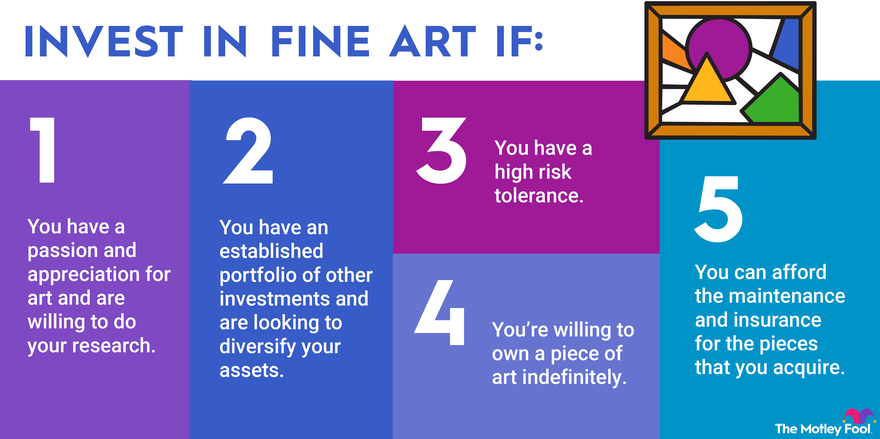

## Table of Contents

## What is fine art and how does it differ from other types of art?

Fine art is a type of art that people make just for the sake of beauty or to express ideas. It includes things like paintings, sculptures, and drawings. People usually see fine art in places like museums or galleries. The main goal of fine art is not to be useful or to sell something, but to make people think or feel something special.

Other types of art, like applied art or commercial art, are different because they have a practical use or a business purpose. Applied art includes things like pottery or furniture, which are both beautiful and useful. Commercial art is used in ads or packaging to help sell products. Unlike fine art, these types of art focus more on being useful or making money, rather than just being about beauty or expression.

## Why should someone consider investing in fine art?

Someone should consider investing in fine art because it can be a good way to make money over time. Fine art, like famous paintings or sculptures, often goes up in value. If you buy a piece of art and it becomes more popular or rare, you might be able to sell it for a lot more money later. This is different from other investments like stocks or real estate, which can go up and down a lot. Art can be a safer way to grow your money if you choose the right pieces.

Also, investing in fine art can be really fun and interesting. When you buy art, you get to learn about different artists and styles. You might even get to meet artists or go to special events. Plus, having beautiful art in your home or office can make you happy every day. It's not just about the money; it's also about enjoying the art itself and being part of a community that loves art.

## What are the initial steps a beginner should take to start investing in fine art?

If you're new to investing in fine art, the first thing you should do is learn about it. Start by visiting museums and galleries to see different types of art and learn about artists. You can also read [books](/wiki/algo-trading-books) or watch videos about art history and the art market. This will help you understand what makes a piece of art valuable and why some artists are more popular than others. It's important to take your time and not rush into buying something just because you think it's pretty.

Once you feel like you know more about art, the next step is to start small. You don't need to spend a lot of money right away. Look for art fairs or smaller galleries where you can find pieces that are less expensive. You can also buy prints or works by up-and-coming artists, which can be a good way to start without spending too much. As you learn more and gain confidence, you can start to invest in more expensive pieces. Remember, investing in art is a long-term thing, so be patient and enjoy the journey.

## How can one evaluate the value of a piece of fine art?

Evaluating the value of a piece of fine art can be tricky, but there are some things you can look at to help you decide. First, think about the artist. Is the artist well-known or up-and-coming? Art by famous artists usually costs more because people want to own their work. Also, look at how rare the piece is. If there are only a few pieces like it, it might be worth more. The condition of the art is important too. If it's in good shape, it will be worth more than if it's damaged.

Another thing to consider is the history of the piece. Has it been shown in important museums or galleries? Has it been owned by someone famous? These things can make the art more valuable. You should also think about what's happening in the art market. Sometimes, certain types of art become more popular and their value goes up. Talking to experts, like art dealers or appraisers, can help you understand all these things better and make a good decision about the value of a piece of fine art.

## What are the common risks associated with investing in fine art?

Investing in fine art can be risky because the value of art can go up and down a lot. Unlike stocks or real estate, art doesn't always follow a clear pattern. Sometimes, the value of a piece of art might drop if people stop liking that artist or style. Also, if you need to sell your art quickly, you might not get as much money as you hoped because finding a buyer can take time.

Another risk is that art can be damaged or lost. If you don't take good care of it, or if something bad happens like a fire or flood, your investment could be ruined. Plus, there are fakes out there. If you buy a piece of art that turns out to be a fake, you could lose a lot of money. It's important to do a lot of research and maybe even get help from experts to make sure you're making a smart investment.

## How does the art market function and what influences art prices?

The art market works a lot like other markets, but it's a bit special. People buy and sell art at places like auctions, galleries, and art fairs. When someone wants to buy art, they might go to an auction where different people bid on the same piece until the highest bidder wins. Galleries are another place where art is sold, and they often work directly with artists to show and sell their work. Art fairs bring together lots of galleries in one place, so people can see and buy art from all over the world. The price of art can change based on how much people want it and how rare it is.

Many things can influence the price of art. One big thing is how famous the artist is. If an artist is well-known and respected, their art will usually cost more. Another thing is how rare the piece is. If there are only a few pieces like it, it might be worth more. The condition of the art matters too; if it's in good shape, it will be worth more. Also, what's happening in the world can affect art prices. If a certain style or type of art becomes popular, its value might go up. Sometimes, the history of the piece, like if it was owned by someone famous or shown in a big museum, can make it more valuable.

## What are the different ways to invest in fine art, such as direct purchases, art funds, or fractional ownership?

One way to invest in fine art is by making direct purchases. This means you buy a piece of art yourself, like a painting or a sculpture. You can find art to buy at galleries, auctions, or art fairs. When you buy art this way, you own it completely and can enjoy it in your home or office. But, you need to know a lot about art to make good choices, and it can be expensive. If you want to sell the art later, you might need to wait for the right buyer, which can take time.

Another way to invest in fine art is through art funds. These are like investment funds, but instead of stocks or bonds, they invest in art. You put your money into the fund, and the people who run it buy and sell art. This can be a good way to invest in art without having to know everything about it yourself. But, you don't get to pick the art, and you might have to pay fees to the fund managers. Also, it can be hard to get your money out of the fund quickly if you need it.

A third way to invest in fine art is through fractional ownership. This means you buy a part of a piece of art, not the whole thing. Companies that offer fractional ownership let you own a share of expensive art that you might not be able to afford on your own. You can buy and sell these shares, kind of like stocks. This can be a good way to get into the art market without spending a lot of money. But, you don't get to keep the art at home, and the value of your share can go up and down based on what's happening in the art market.

## How important is provenance and authenticity in fine art investment?

Provenance and authenticity are very important when you invest in fine art. Provenance is like the history of the art piece. It tells you where the art came from, who owned it before, and if it was shown in any big museums or galleries. Knowing the provenance helps you understand if the art is real and valuable. If a piece of art has a good provenance, it can be worth a lot more money because people trust that it's real and important.

Authenticity means the art is really made by the artist it says it's made by. If you buy a piece of art that turns out to be a fake, you could lose a lot of money. That's why it's so important to check if the art is authentic before you buy it. You might need to hire an expert to look at the art and make sure it's real. If the art is authentic and has a good provenance, it's more likely to be a good investment.

## What role do art fairs, auctions, and galleries play in the fine art investment ecosystem?

Art fairs, auctions, and galleries are important places where people can buy and sell art. Art fairs bring together lots of galleries from all over the world in one place. This makes it easy for people to see and buy different kinds of art. Auctions are where people bid on art, and the person who bids the highest gets to buy it. Galleries work directly with artists to show and sell their work. All these places help people find art to invest in and also help set the prices of art based on what people are willing to pay.

These places also help make the art market work smoothly. At art fairs, you can see what kinds of art are popular and what people are willing to pay for them. Auctions can make art more exciting because people can see the prices go up as they bid. Galleries help artists by showing their work and helping them sell it. Together, art fairs, auctions, and galleries create a big network where people can buy, sell, and learn about art. This network helps people decide which art to invest in and how much to pay for it.

## How can an investor diversify their fine art portfolio?

To diversify a fine art portfolio, an investor should think about buying different kinds of art. This means choosing art from different artists, different styles, and even different time periods. For example, you might buy a modern painting, a sculpture from the 19th century, and a piece of photography. By doing this, you spread out your risk. If one type of art goes down in value, the other types might still be worth a lot. It's like not putting all your eggs in one basket.

Another way to diversify is by looking at art from different parts of the world. Instead of just buying art from one country or region, you can explore art from Europe, Asia, Africa, and other places. This can help you find unique pieces that might not be as common in the market. Plus, it can make your collection more interesting and valuable because it shows a wide range of cultures and styles. Diversifying your fine art portfolio this way can help protect your investment and make it more fun to collect art.

## What are advanced strategies for maximizing returns on fine art investments?

One advanced strategy for maximizing returns on fine art investments is to focus on emerging artists. These are artists who are just starting to become well-known. If you can spot an artist who is about to become popular, you might be able to buy their art for a lower price before everyone else knows about them. As the artist becomes more famous, the value of their art can go up a lot. To do this, you need to keep up with what's happening in the art world, go to art fairs and galleries, and talk to people who know a lot about art. It's like finding a hidden gem that could be worth a lot more in the future.

Another strategy is to use art as part of a bigger investment plan. This means you don't just buy art to keep at home, but you also think about how it fits with other things you invest in, like stocks or real estate. You can use art to balance out the risk in your overall investments. For example, if the stock market goes down, your art might still be worth a lot. You can also look into art funds or fractional ownership, which let you invest in art without having to buy whole pieces. These options can help you spread out your money and maybe make more money over time.

## How do tax considerations and estate planning affect fine art investments?

When you invest in fine art, you need to think about taxes. If you sell a piece of art for more money than you paid for it, you might have to pay capital gains tax. This tax can be different depending on how long you owned the art. If you owned it for less than a year, it's a short-term gain and you pay more tax. If you owned it for more than a year, it's a long-term gain and you pay less tax. Some countries also let you donate art to museums or charities and get a tax break. It's a good idea to talk to a tax expert to understand how taxes will affect your art investments.

Estate planning is also important for fine art investors. When you pass away, your art collection becomes part of your estate. You can decide what happens to your art by writing it in your will. You might want to leave it to your family, or you might want to donate it to a museum. If your art is very valuable, it could mean your heirs have to pay a lot of estate tax. To avoid this, you can give some of your art away while you're still alive. This can help lower the value of your estate and make things easier for your family. Talking to an estate planner can help you make the best choices for your art and your loved ones.

## References & Further Reading

[1]: Artnet News. (n.d.). ["How the Integration of Tech Like Blockchain and AI Is Changing the Art World."](https://news.artnet.com/) Artnet News. 

[2]: Bocart, F., & Oosterlinck, K. (2011). ["Discoveries of Fakes: Their Impact on the Art Market."](https://www.sciencedirect.com/science/article/pii/S0165176511002618) Economics of Art and Culture. 

[3]: Burnham, B. (2018). ["The Art of Art Investing: A Guide to the World's Most Lucrative Market."](https://archive.org/details/structureofart00burn) Forbes. 

[4]: Johnston, R. (2020). ["Art as an Investment."](https://www.jstor.org/stable/25592524) Journal of Economic Perspectives.

[5]: McAndrew, C. (2021). ["The Art Market 2021."](https://www.artbasel.com/stories/art-market-report-2021) Art Basel & UBS Global Art Market Report. 

[6]: Shnayerson, M. (2019). ["Boom: Mad Money, Mega Dealers, and the Rise of Contemporary Art."](https://www.amazon.com/Boom-Money-Mega-Dealers-Contemporary/dp/1610398408) PublicAffairs. 

[7]: Velthuis, O. (2013). ["Talking Prices: Symbolic Meanings of Prices on the Market for Contemporary Art."](https://www.jstor.org/stable/j.ctt4cgd14) Princeton University Press.