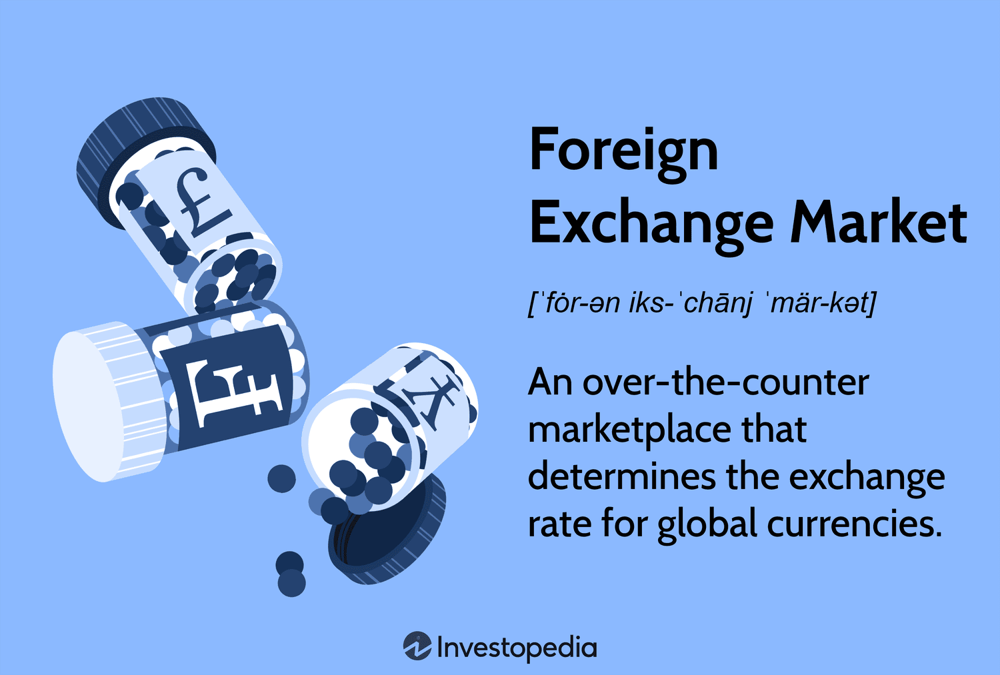

## Table of Contents

## What is the foreign exchange market and why is it important?

The foreign exchange market, often called the forex market, is where people and businesses trade different currencies. It's like a big global marketplace where you can exchange one country's money for another's. For example, if you want to buy something from Japan but you have US dollars, you would go to the forex market to get Japanese yen. This market works all the time, every day, because somewhere in the world, it's always business hours.

The forex market is very important for several reasons. First, it helps countries do business with each other. If a company in France wants to buy goods from the United States, they need dollars, so they use the forex market to get them. This makes international trade easier. Second, it helps travelers. When you go on a trip to another country, you need that country's money, and the forex market helps you get it. Lastly, it affects the economy of countries. If a country's currency is strong, it can make their exports more expensive and imports cheaper, which can change how well their businesses do.

## How does the foreign exchange market work?

The foreign exchange market works like a big trading place where people and businesses swap one country's money for another's. It's open all the time because somewhere in the world, it's always daytime. When you want to trade, you usually do it through a bank or a special company called a broker. They help you buy or sell currencies. The price of one currency compared to another, called the exchange rate, changes all the time based on things like how much people want that currency, what's happening in the world, and the economy of different countries.

The [forex](/wiki/forex-system) market is really important for making sure that money can move around the world easily. When someone wants to trade, they look at the current exchange rate and decide if they want to buy or sell. If you think a currency will become more valuable, you might buy it now and sell it later for a profit. On the other hand, if you need to pay for something in another country, you'll use the forex market to get the right currency. All these trades happening every day help set the value of currencies and keep the global economy running smoothly.

## What are the major currency pairs in forex trading?

In forex trading, the major currency pairs are the ones that are traded the most. They always have the US dollar on one side. The most popular ones are the EUR/USD, which is the Euro against the US dollar, the USD/JPY, which is the US dollar against the Japanese yen, and the GBP/USD, which is the British pound against the US dollar. These pairs are called major because they have the biggest markets and the most people trading them.

There are also other important pairs like the USD/CHF, which is the US dollar against the Swiss franc, and the AUD/USD, which is the Australian dollar against the US dollar. These pairs are also very popular but not as much as the first three. Traders like these pairs because they are easy to trade, have a lot of information available, and usually have smaller price changes, which can make them safer to trade.

These major currency pairs make up most of the trading in the forex market. They are important because they help set the value of the US dollar and other big currencies around the world. When you see news about the forex market, it's usually about these pairs because they affect so many people and businesses.

## What are the basic terms and concepts a beginner should know in forex trading?

When you start learning about forex trading, there are some basic terms and ideas you should know. First, there's the exchange rate, which is how much one currency is worth compared to another. For example, if the exchange rate for EUR/USD is 1.20, it means 1 Euro is worth 1.20 US dollars. Another important term is a pip, which is the smallest change in the exchange rate. If the EUR/USD moves from 1.2000 to 1.2001, that's a one pip change. You'll also hear about leverage, which lets you trade with more money than you actually have. It can make your profits bigger, but it can also make your losses bigger, so it's risky.

Another key concept is a currency pair, which is two currencies you're trading. The first currency is called the base currency, and the second is the quote currency. For example, in EUR/USD, the Euro is the base and the US dollar is the quote. You'll also need to understand what a bid and ask price are. The bid is the price you can sell at, and the ask is the price you can buy at. The difference between them is called the spread, and it's how brokers make money. Lastly, there's the idea of going long or short. Going long means you think the base currency will go up in value, so you buy it. Going short means you think it will go down, so you sell it.

## How can someone start trading in the forex market?

To start trading in the forex market, you first need to choose a broker. A broker is a company that helps you buy and sell currencies. Look for a broker that is trusted and has good reviews. Once you pick a broker, you'll need to open an account with them. This usually involves filling out some forms and giving them some personal information. After your account is set up, you'll need to put some money into it. This is called making a deposit. The amount you need to start can be different depending on the broker, but it's usually not too much.

Once you have your account set up and funded, you can start trading. Most brokers have a platform, which is like a special computer program, where you can see the prices of different currencies and make trades. You'll need to learn how to use this platform. It's a good idea to start with a demo account, which lets you practice trading without using real money. This way, you can get used to how everything works without risking any money. When you feel ready, you can start trading with real money. Remember, trading can be risky, so it's important to learn as much as you can and be careful with your money.

## What are the different types of forex trading strategies?

There are several types of forex trading strategies that traders use to make money. One common strategy is called [day trading](/wiki/day-trading-spy). Day traders buy and sell currencies within the same day, trying to make small profits from small changes in the exchange rate. They don't keep their trades open overnight because they want to avoid the risk of big changes happening when the market is closed. Another strategy is called swing trading. Swing traders hold their trades for a few days or weeks, trying to catch bigger moves in the market. They look for trends and try to ride them for a while before selling.

Another popular strategy is called [scalping](/wiki/gamma-scalping). Scalpers make a lot of trades in a short time, trying to make tiny profits from very small changes in the exchange rate. They might make 50 or 100 trades in a day, but each trade only makes a little bit of money. Position trading is different because position traders hold their trades for months or even years. They try to catch big trends in the market and are not worried about small changes day to day. Each of these strategies has its own risks and rewards, so it's important for traders to pick the one that fits their goals and how much risk they are willing to take.

## What are the risks involved in forex trading and how can they be managed?

Forex trading can be risky because the market can change a lot and very quickly. One big risk is losing money. If the exchange rate moves against you, you could lose more than you put in, especially if you use leverage. Leverage lets you trade with more money than you have, but it can make your losses bigger too. Another risk is that the market can be affected by things you can't control, like news about the economy or big events in the world. These things can make the exchange rate move in ways you didn't expect.

To manage these risks, you can use a few different strategies. One way is to use stop-loss orders, which automatically close your trade if the exchange rate moves against you by a certain amount. This can help limit how much you lose. Another way is to not use too much leverage. If you trade with less leverage, your losses won't be as big if the market moves against you. It's also a good idea to spread your money around and not put it all into one trade. This is called diversification, and it can help you not lose everything if one trade goes bad. Finally, always keep learning and stay updated on what's happening in the world, because that can affect the forex market.

## How do economic indicators and global events affect forex markets?

Economic indicators and global events can really change the forex markets. Economic indicators are numbers that tell us about a country's economy, like how many people have jobs, how much things cost, and how fast the economy is growing. When these numbers come out, they can make the value of a country's money go up or down. For example, if a country's economy is doing well, its money might become more valuable because more people want to buy it. On the other hand, if the economy is doing badly, the value of its money might go down. Traders watch these indicators closely and trade based on what they think will happen next.

Global events also have a big impact on forex markets. Things like wars, elections, and natural disasters can make the value of currencies change a lot. For example, if there's a war in a country, people might not want to hold that country's money because it's risky, so its value might go down. Or if a country has an election and people think the new leader will be good for the economy, the value of its money might go up. Traders need to keep an eye on the news and understand how these events might affect the forex market. By doing this, they can make better decisions about when to buy and sell currencies.

## What are the advantages of using leverage in forex trading and what are the potential pitfalls?

Using leverage in forex trading can help you make more money with less. It's like borrowing money from your broker to trade bigger amounts than what you have in your account. If the exchange rate moves in your favor, even a small move can turn into a big profit because you're trading with more money. For example, if you have $1,000 and use leverage to trade like you have $10,000, a small change in the exchange rate can make you a lot more money than if you just used your $1,000. This can make trading more exciting and let you take advantage of good opportunities even if you don't have a lot of money.

But leverage can also be really risky. If the exchange rate moves against you, your losses can be much bigger than what you put in. Using the same example, if you're trading like you have $10,000 but the market goes the wrong way, you could lose more than your $1,000 very quickly. This is why many traders lose money when they use too much leverage. It's important to be careful and understand that while leverage can make your profits bigger, it can also make your losses bigger. Always think about how much you can afford to lose before you start trading with leverage.

## How can technical analysis be used to predict forex market movements?

Technical analysis is a way to predict forex market movements by looking at past prices and trading patterns. Traders use charts and special tools to see how the market has moved before and try to guess where it might go next. They look for things like support and resistance levels, which are prices where the market often stops going down or up. They also use indicators like moving averages, which smooth out price changes over time, and the Relative Strength Index (RSI), which tells them if a currency is overbought or oversold. By studying these patterns and indicators, traders hope to make better decisions about when to buy or sell currencies.

Using technical analysis can help traders spot trends and make predictions based on what the market has done before. For example, if a currency pair keeps bouncing off a certain price level, traders might think that level is important and use it to decide when to trade. They might also look at chart patterns like triangles or head and shoulders to guess where the price might go next. While technical analysis doesn't always get it right, many traders find it helpful because it gives them a way to understand the market better and make more informed choices about their trades.

## What are the regulatory considerations for forex trading in different countries?

Forex trading is watched over by different rules in different countries. In the United States, the Commodity Futures Trading Commission (CFTC) and the National Futures Association (NFA) make sure that brokers follow the rules. They check that brokers are honest and protect people from getting tricked. In the United Kingdom, the Financial Conduct Authority (FCA) does the same thing. They make sure that forex trading is fair and safe for everyone. Each country has its own group that keeps an eye on forex trading to make sure it's done the right way.

In Europe, the European Securities and Markets Authority (ESMA) helps set rules for forex trading across many countries. They work to make sure that trading is the same everywhere in Europe and that people are protected. In Australia, the Australian Securities and Investments Commission (ASIC) is in charge. They make rules to keep trading safe and honest. No matter where you live, it's important to know the rules for forex trading in your country. This helps you stay safe and make smart choices when you trade.

## How do professional forex traders develop and refine their trading systems?

Professional forex traders develop and refine their trading systems by first figuring out what kind of trading they want to do. They might choose to be day traders, swing traders, or position traders, depending on how long they want to hold their trades. Once they pick a style, they start by looking at past data to see what works and what doesn't. They use this information to create rules for when to buy and sell currencies. These rules are based on things like technical analysis, which looks at charts and patterns, and sometimes [fundamental analysis](/wiki/fundamental-analysis), which looks at economic news and events. They test these rules on old data to see if they would have made money in the past. This is called [backtesting](/wiki/backtesting).

After they have a system that works well in backtesting, professional traders start using it in the real market, but with small amounts of money at first. They keep track of how well their system does and make changes if it's not working as well as they hoped. They might change the rules a little bit or try new indicators to see if they can do better. This process of trying, watching, and changing is called refining. Over time, as they learn more about the market and what works for them, they keep making their system better. This way, they can make more money and lose less.

## References & Further Reading

[1]: ["Algorithmic Trading"](https://www.investopedia.com/articles/active-trading/101014/basics-algorithmic-trading-concepts-and-examples.asp) by Ernie Chan

[2]: ["Quantitative Trading: How to Build Your Own Algorithmic Trading Business"](https://books.google.com/books/about/Quantitative_Trading.html?id=j70yEAAAQBAJ) by Ernest P. Chan

[3]: ["Advances in Financial Machine Learning"](https://www.amazon.com/Advances-Financial-Machine-Learning-Marcos/dp/1119482089) by Marcos Lopez de Prado

[4]: ["Machine Learning for Algorithmic Trading"](https://github.com/PacktPublishing/Machine-Learning-for-Algorithmic-Trading-Second-Edition) by Stefan Jansen

[5]: ["Evidence-Based Technical Analysis: Applying the Scientific Method and Statistical Inference to Trading Signals"](https://www.amazon.com/Evidence-Based-Technical-Analysis-Scientific-Statistical/dp/0470008741) by David Aronson

[6]: Bergstra, J., Bardenet, R., Bengio, Y., & Kégl, B. (2011). ["Algorithms for Hyper-Parameter Optimization."](https://dl.acm.org/doi/10.5555/2986459.2986743) Advances in Neural Information Processing Systems 24.