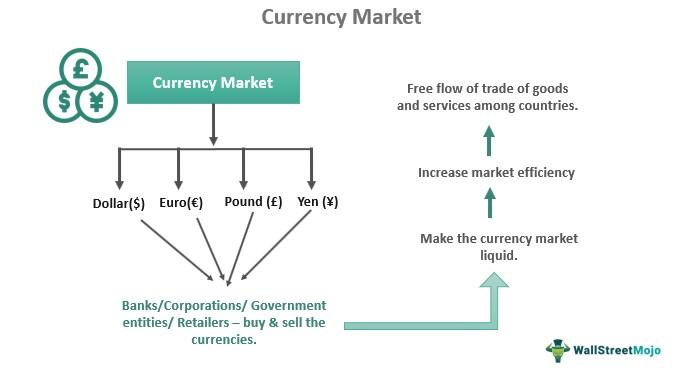

The Forex market, or foreign exchange market, is a pivotal component of global finance, serving as the largest and most liquid financial market globally. It facilitates the exchange of currencies, which is essential for international trade and investment. Unlike stock markets, Forex operates on a decentralized network, only existing in the digital space across global financial centers, which allows for continuous operation, 24 hours a day, five days a week. This market's structure is unique compared to other financial markets, as it lacks a central exchange; trades occur "over-the-counter" (OTC), directly between parties via telecommunication networks.

Foreign exchange refers to the conversion and trading of currencies, driven by the need to conduct transactions across national borders. Unlike equity or commodity markets, where goods or shares are traded, Forex involves purchasing one currency while simultaneously selling another, hence the term "currency pair" (e.g., EUR/USD). This dual nature, along with factors such as geopolitical events, economic indicators, and market sentiment, introduces a complexity that distinguishes Forex from other financial markets.



Currency investing attracts investors due to its potential for diversification and hedging, offering avenues to protect against currency risk or capitalize on currency movements. Forex trading strategies can cater to different risk profiles and investment goals, making it a versatile tool for wealth management.

Algorithmic trading has gained prominence in the Forex market, leveraging computer algorithms to execute trades with minimal human intervention. This form of trading has risen due to its ability to process large volumes of data at high speeds, offering enhanced efficiency and reduced risk of human error. Algorithms identify and act on market opportunities, often before human traders can respond.

This article aims to explore the dynamic intersection of Forex, currency investing, and algorithmic trading. By examining these components, readers will gain insights into how technological advancements transform the Forex market and how investors can position themselves to benefit from these developments.

## Table of Contents

## Understanding the Forex Market

The Forex market, or foreign exchange market, is a decentralized global marketplace for trading national currencies against one another. It operates 24 hours a day, five days a week, and plays a critical role in global finance by facilitating international trade and investment. Unlike other financial markets such as stocks or bonds, Forex does not have a centralized exchange. Instead, trading occurs electronically over-the-counter (OTC), involving a network of banks, brokers, financial institutions, corporations, and individual traders.

### Key Participants in the Forex Market

1. **Banks**: Central banks, commercial banks, and investment banks are pivotal participants. Central banks, such as the Federal Reserve or the European Central Bank, can influence Forex markets by adjusting interest rates and controlling money supply. Commercial and investment banks participate in Forex for their own accounts and on behalf of clients.

2. **Financial Institutions**: These include asset managers, hedge funds, and pension funds. They engage in Forex trading to hedge risks, diversify portfolios, and generate profits.

3. **Corporations**: Multinational companies utilize the Forex market to hedge against currency fluctuations in international trade and investment.

4. **Individual Traders**: Retail traders and individual investors participate in Forex through brokers and trading platforms, often attracted by the market’s liquidity and the availability of leverage.

### The Significance of Currency Pairs

Currencies are traded in pairs, which signify the relative value of one currency to another. The most traded currency pairs are known as "major pairs" and include EUR/USD, USD/JPY, GBP/USD, and USD/CHF. Currency pairs are quoted with a base currency and a quote currency, whereby the price reflects how much of the quote currency is needed to purchase one unit of the base currency. 

### Factors Affecting Forex Market Movements

Forex market movements are influenced by a variety of factors, including:

- **Economic Indicators**: Data such as GDP growth, employment rates, inflation, and consumer sentiment can impact currency values. For example, strong economic performance typically strengthens a currency.

- **Geopolitical Events**: Political stability, international conflicts, and policy changes can create volatility in currency markets.

- **Interest Rates**: Differences in national interest rates can affect currency values, as investors seek higher returns through currency investments.

### The Role of Leverage in Forex Trading

Leverage is a tool used by Forex traders to control larger positions than their actual investment capital would allow. It is expressed as a ratio, such as 50:1 or 100:1. While leverage can amplify potential profits, it also increases the risk of significant losses. For example, with a 50:1 leverage, an investment of $1,000 can control a $50,000 position. However, a small market movement against the trader’s position could quickly deplete the account balance.

Overall, the Forex market's accessibility and dynamic nature make it a focal point for various economic activities and investment strategies. Understanding its structure and the factors influencing it is vital for all market participants.

## Currency Investing Strategies

Currency investing serves as a crucial aspect of portfolio diversification, offering investors an avenue to potentially stabilize their portfolios by mitigating risks associated with traditional assets like stocks and bonds. By holding different currencies, investors can navigate fluctuations in one market while finding gains or stability in another, capitalizing on diverse global economic trends.

In the Forex market, investors employ a variety of strategies to invest in currencies, with spot trading being among the most immediate. Spot trading involves the exchange of currency pairs at the current market rate, executed on the spot. This method is characterized by its simplicity and lack of complex future contracts, making it accessible to many traders.

Futures trading, another prevalent strategy, entails entering into agreements to buy or sell currencies at a predetermined price at a specified future date. This provides a mechanism to hedge against potential market movements, though it requires a profound understanding of market trends and the ability to anticipate future conditions.

Options are yet another strategy, where traders purchase the right, but not the obligation, to exchange currencies at a set rate before a specific expiration date. This flexibility allows investors to limit potential losses to the option premium while preserving the ability to capitalize on favorable movements.

Currency investing approaches can be broadly categorized into long-term and short-term paradigms. Long-term investments focus on macroeconomic factors, such as [interest rate](/wiki/interest-rate-trading-strategies) trends and geopolitical stability, requiring patience and an insightful analysis of economic indicators. Conversely, short-term strategies depend on daily market fluctuations, utilizing technical analysis and market sentiment to execute swift trades for quick gains.

Risk management is a pivotal component of currency investing. It involves employing stop-loss orders to cap potential losses, diversification of currency holdings, and leveraging analytical tools to forecast market trends accurately. Hedging against currency risk by balancing positions and using protective options also forms a backbone to safeguard investments.

Examining successful currency investing case studies can provide valuable insights. For instance, George Soros' famed short position against the British pound in 1992, which yielded substantial profits, underscores the potential of well-researched currency speculation. Meanwhile, Warren Buffett's strategic investments in foreign currencies to hedge against dollar devaluation illustrate more conservative, long-term approaches.

In summary, currency investing encompasses a spectrum of strategies, each with its own risk and reward profile. It acts as a multifaceted tool within a diversified portfolio, offering opportunities for both speculative gains and risk management.

## The Rise of Algorithmic Trading in Forex

Algorithmic trading, commonly referred to as algo trading, has become a significant force in the Forex market, transforming the landscape of currency trading. This practice involves the use of computer algorithms to automate trading strategies, optimizing speed and efficiency while reducing the potential for human error.

### Algorithmic Trading Strategies

There are several types of [algorithmic trading](/wiki/algorithmic-trading) strategies employed in the Forex market:

1. **Trend Following**: This strategy seeks to capitalize on market trends, entering trades in the direction of prevailing price movements. Algorithms identify patterns and initiate trades based on historical data and trend indicators, such as moving averages.

2. **Arbitrage**: Arbitrage takes advantage of price discrepancies in different markets or instruments. Forex arbitrage involves simultaneously buying and selling a currency pair in different markets to profit from minor price differences.

3. **Mean Reversion**: Mean reversion strategies are based on the assumption that prices and returns eventually move back towards the mean or average. Algorithms track currency prices and execute trades when the price diverges from its historical average.

### Benefits of Algorithmic Trading

Algorithmic trading in Forex offers several advantages:

- **Speed**: Algorithms can process market data and execute trades much faster than human traders, capitalizing on fleeting opportunities.

- **Efficiency**: Automated trading reduces the need for manual intervention, streamlining the trading process and reducing operational costs.

- **Elimination of Human Error**: By removing emotional decision-making and minimizing human errors, algo trading enhances the precision and profitability of trades.

### Challenges and Risks

Despite its benefits, algo trading comes with challenges and risks:

- **Technical Failures**: Reliance on technology makes algo trading susceptible to system failures and technical glitches, which can lead to significant losses.

- **Market Dynamics**: Algorithms are based on historical data, which might not always predict future market movements, particularly during unprecedented events or shifts in market conditions.

- **Complexity**: Developing effective algorithms requires sophisticated knowledge of programming, mathematics, and market dynamics, posing a barrier to entry for some traders.

### Future Trends in Algorithmic Trading

The future of algorithmic trading in Forex is being shaped by advancements in technology and data analytics:

- **Machine Learning**: The integration of machine learning into trading algorithms is enhancing their ability to adapt and improve over time, allowing for more precise predictions and better risk management.

- **Big Data**: The use of big data analytics provides traders with insights from vast amounts of market data, enabling more informed and strategic trading decisions.

- **Quantum Computing**: As quantum computing matures, it promises to revolutionize trading algorithms, offering unprecedented processing power and speed to tackle complex market analyses.

In conclusion, algorithmic trading continues to reshape the Forex market, providing significant opportunities and challenges. As technology advances, the role of algorithms in currency trading is expected to grow, offering enhanced tools and strategies for those venturing into Forex trading.

## How to Get Started with Forex Algo Trading

To embark on Forex algorithmic trading, one must take several foundational steps. First, it is crucial to grasp the basics of algorithmic trading itself, which involves the use of automated, pre-programmed trading instructions that account for variables such as time, price, and [volume](/wiki/volume-trading-strategy). Selecting a reliable trading platform is equally important; popular choices include MetaTrader, TradeStation, and [Interactive Brokers](/wiki/interactive-brokers-api), each offering different features tailored to various trading requirements.

Programming is an essential skill in the development of trading algorithms, with Python and R being prominent languages due to their robust libraries and data handling capabilities. Python, with libraries such as NumPy, pandas, and TA-Lib, provides powerful tools for data manipulation and technical analysis. For example, a simple moving average crossover strategy can be implemented in Python as follows:

```python
import pandas as pd

def moving_average_crossover(df, short_window, long_window):
    df['short_mavg'] = df['Close'].rolling(window=short_window, min_periods=1).mean()
    df['long_mavg'] = df['Close'].rolling(window=long_window, min_periods=1).mean()
    df['signal'] = 0
    df.loc[df['short_mavg'] > df['long_mavg'], 'signal'] = 1
    df.loc[df['short_mavg'] <= df['long_mavg'], 'signal'] = -1
    return df
```

Backtesting is crucial for evaluating the effectiveness of trading algorithms. It involves simulating the execution of a trading strategy using historical data to gauge potential success. Traders should ensure data quality and employ realistic scenarios to avoid overfitting, where a model performs well on historical data but fails in live markets.

Selecting and customizing trading strategies involves aligning them with personal trading goals and risk tolerance. Strategies may range from [trend following](/wiki/trend-following) and [arbitrage](/wiki/arbitrage) to more complex [machine learning](/wiki/machine-learning) models that adapt to market conditions.

Finally, Continuous learning is vital, with numerous resources available to enhance understanding and skill levels in Forex algo trading. Books such as "Algorithmic Trading" by Ernie Chan provide in-depth insights, while online courses like those offered by Coursera and Udemy deliver practical knowledge. Online forums such as Stack Overflow and specialized trading communities further provide platforms for knowledge exchange and problem-solving.

These steps serve as a guide for navigating the dynamic field of Forex algorithmic trading, enabling traders to harness the power of technology for potentially significant market gains.

## Conclusion

The Forex market holds a crucial position in global finance, serving as a foundation for currency investing. Its vast [liquidity](/wiki/liquidity-risk-premium) and continuous trading opportunities present a dynamic environment where investors can capitalize on currency fluctuations for potential profits. Currency investments not only offer diversification benefits but also serve as a hedge against geopolitical and economic shifts that impact global markets.

Integrating algorithmic trading into Forex investing amplifies these advantages by combining speed, precision, and data-driven decision-making. Algorithmic trading allows investors to execute trades with minimal latency, optimize strategies using historical data, and reduce errors inherent in manual trading. These capabilities mean investors can potentially exploit arbitrage and trend-following opportunities more effectively than manual trading would allow.

With these significant benefits, investors are encouraged to explore the synergy between Forex and algorithmic trading as a promising avenue for growth. Embracing technology and data-driven strategies can unlock new dimensions of profitability and risk management that traditional trading approaches may not achieve.

In an ever-evolving financial landscape, staying informed about market trends and technological advances is essential. The rapid development of fintech tools and increased availability of computational resources demand continuous education and adaptation. Mastering these elements can position investors ahead in a competitive market.

Therefore, as you consider your investment journey, the combination of Forex and algo trading offers a dynamic and innovative path. Engage with educational resources, participate in forums, and leverage [backtesting](/wiki/backtesting) to refine your strategies. This approach not only enhances your trading skills but also builds a robust foundation for navigating the complexities of modern Forex trading.

## References & Further Reading

[1]: ["Algorithmic Trading"](https://www.investopedia.com/articles/active-trading/101014/basics-algorithmic-trading-concepts-and-examples.asp) by Ernie Chan

[2]: ["Quantitative Trading: How to Build Your Own Algorithmic Trading Business"](https://books.google.com/books/about/Quantitative_Trading.html?id=j70yEAAAQBAJ) by Ernest P. Chan

[3]: ["Advances in Financial Machine Learning"](https://www.amazon.com/Advances-Financial-Machine-Learning-Marcos/dp/1119482089) by Marcos Lopez de Prado

[4]: ["Machine Learning for Algorithmic Trading"](https://github.com/PacktPublishing/Machine-Learning-for-Algorithmic-Trading-Second-Edition) by Stefan Jansen

[5]: ["Evidence-Based Technical Analysis: Applying the Scientific Method and Statistical Inference to Trading Signals"](https://www.amazon.com/Evidence-Based-Technical-Analysis-Scientific-Statistical/dp/0470008741) by David Aronson

[6]: Bergstra, J., Bardenet, R., Bengio, Y., & Kégl, B. (2011). ["Algorithms for Hyper-Parameter Optimization."](https://dl.acm.org/doi/10.5555/2986459.2986743) Advances in Neural Information Processing Systems 24.