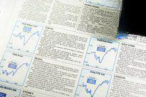

The financial landscape has undergone significant transformations in recent decades, driven by globalization and technological advancements. Central to this evolution are government bonds, foreign bonds, and the emergence of algorithmic trading, each playing a critical role in shaping modern investment strategies. As global financial markets develop, a comprehensive understanding of these elements becomes imperative for making informed investment decisions.

Government bonds are debt securities issued by national governments, serving as a traditional and fundamental component of investment portfolios. These bonds are generally perceived as low-risk investments due to the creditworthiness of the issuing government. However, the spectrum of potential returns and risks broadens when considering foreign bonds, which provide investors opportunities for higher yields and greater diversification. The investment in foreign bonds, however, introduces variables such as currency risk and sovereign risk, making the landscape complex yet rewarding for those capable of navigating it.



Concurrently, the advent of algorithmic trading has revolutionized the way bonds are traded. By employing sophisticated algorithms, this method allows for the automation of trading processes, enhancing market efficiency and execution speed. The integration of algorithms within bond markets, though slower compared to equity markets, represents a progressive shift that aligns with technological advances, thereby optimizing trading strategies.

This article aims to provide insights into both the advantages and challenges posed by government and foreign bonds and to examine the transformative role of algorithmic trading. By understanding these financial instruments and the technological forces at play, investors can better navigate the intricacies of today’s financial markets, fostering a more robust and adaptable investment approach.

## Table of Contents

## Understanding Government Bonds

Government bonds are debt securities that national governments issue to raise capital for public projects and expenditures, including infrastructure development, social programs, and governmental operations. These bonds are generally considered low-risk investments because they are backed by the issuing government's creditworthiness, resulting in a high level of investor confidence. The risk profile of these bonds is intrinsically linked to the government's ability to manage its finances and meet debt obligations, which is influenced by fiscal policies, economic stability, and geopolitical factors.

Government bonds can be divided into several types, each characterized by different maturities and interest payment structures. The primary types include:

1. **Treasury Bills (T-Bills)**: These are short-term securities that mature in one year or less. They are sold at a discount to face value, and no periodic interest payments are made; instead, the buyer receives the face value upon maturity. 

2. **Treasury Notes (T-Notes)**: T-Notes have maturities ranging from two to ten years. They pay interest to holders semi-annually, creating a regular income stream for investors. 

3. **Treasury Bonds (T-Bonds)**: These are long-term investments with maturities exceeding ten years, often up to thirty years. Like T-Notes, they also pay interest semi-annually, making them suitable for investors seeking long-term income stability.

The strategic role of government bonds within fiscal policy and economic stabilization makes them critical components of investment portfolios. They serve multiple functions, such as financing government initiatives without immediate tax increases and managing national debt. In times of economic downturn, governments often issue more bonds to stimulate growth through increased spending. Conversely, in times of growth, issuing fewer bonds can help moderate inflationary pressures.

Furthermore, government bonds are pivotal in establishing a risk-free rate of return benchmark within financial markets. This benchmark influences the pricing of riskier investment assets and assists in the valuation of diverse financial instruments. As a result, government bonds not only support governmental financial needs but also underpin the broader economic structure, offering a stable and reliable investment vehicle for institutional and retail investors alike.

## Foreign Bonds: Opportunities and Risks

Foreign bonds provide investors with significant opportunities to access higher yields and diversify their investment portfolios, compared to the often more stable and lower-yielding domestic government bonds. These instruments allow investors to tap into different economic growth cycles and [interest rate](/wiki/interest-rate-trading-strategies) environments, potentially enhancing returns and reducing risks associated with a single market. 

However, investing in foreign bonds is not without risks. One of the primary concerns is currency risk, which arises from fluctuations in the exchange rates between the investor's home currency and the currency of the foreign bond. This can either enhance returns if the foreign currency appreciates or severely diminish them if it depreciates against the investor's home currency. Sovereign risk is another critical [factor](/wiki/factor-investing), as it reflects the possibility that a foreign government might default on its obligations due to economic instability or political turmoil. Historical examples include the Russian debt crisis in 1998 and the Argentine default in 2001.

Economic instability in the issuing country can further impact the returns from foreign bonds. This instability might be due to a variety of factors, including inflation, unemployment, geopolitical tensions, and changes in fiscal or monetary policies. An unstable economic environment can lead to increased [volatility](/wiki/volatility-trading-strategies) and uncertainty, affecting bond prices and yields.

Additionally, investors must consider the regulatory frameworks and tax implications associated with foreign bond investments. Different countries have varying regulations concerning foreign investments, and understanding these is crucial to ensure compliance and minimize legal risks. Taxation on foreign investment income can also affect net returns, with some countries imposing withholding taxes on interest payments to foreign investors.

Moreover, investing in foreign bonds often involves higher transaction costs. These can include fees related to currency exchange, international wire transfers, and custodial services, which can erode the potential returns. 

To effectively balance the rewards and risks associated with foreign bonds, investors need to conduct thorough due diligence. This involves not only an analysis of the financial health and creditworthiness of the issuing country but also an understanding of macroeconomic indicators and geopolitical developments. Such analysis can help in making informed decisions that align with the investor’s risk tolerance and investment objectives.

## Algorithmic Trading in the Bond Market

Algorithmic trading has become a pivotal component in the modern bond market, leveraging sophisticated computer algorithms to automate trading decisions and execution. This technological innovation has brought about significant improvements in market efficiency and execution speed, primarily by reducing the latency traditionally associated with human trading processes. Traders now employ algorithms that can analyze vast datasets, execute trades at optimal prices, and capitalize on fleeting market opportunities faster than the human mind can process.

One of the core advantages of [algorithmic trading](/wiki/algorithmic-trading) in the bond market lies in its ability to significantly reduce transaction costs. By automating the trading process, firms can minimize the impact of human error, lower brokerage fees through strategic participation in electronic communication networks (ECNs), and optimize execution strategies that avoid significant market impact. Enhanced trading precision is another noteworthy benefit. Algorithms can be programmed to execute trades according to predefined criteria, ensuring that the execution aligns closely with the trader’s strategic objectives, such as minimizing slippage or achieving a target price.

Algorithmic trading also allows for handling large trading volumes efficiently. In traditional markets, executing high-[volume](/wiki/volume-trading-strategy) trades without impacting the market price is challenging. However, algorithms can distribute these trades over time or across different venues, thereby masking the size and intent of the trades from the market, which is a significant advantage in maintaining price stability.

Despite its advantages, the adoption of algorithmic trading in bond markets has been slower compared to equity markets. Bonds are traditionally traded over-the-counter (OTC), lacking the centralized exchanges that equities benefit from. However, advances in technology, such as the development of electronic trading platforms and improved algorithmic models capable of navigating the complexities of the bond markets, are driving increased integration. These technological advancements facilitate better price discovery, [liquidity](/wiki/liquidity-risk-premium), and transparency in the bond markets, encouraging more participants to adopt algorithmic trading strategies.

Understanding the intricacies of algorithmic trading in the bond market is essential for investors aiming to optimize their trading strategies. The complexities involved include the need to adapt algorithms to different market environments, manage the risks associated with algorithmic errors, and ensure compliance with regulatory standards. Given these factors, investors need to continuously monitor and refine their algorithms to align with the dynamic nature of global financial markets. 

As the bond market continues to embrace digitalization, such technological integration promises further efficiencies, presenting both significant opportunities and challenges for traders and investors alike.

## Challenges and Risks of Algo Trading

Algorithmic trading, while enhancing efficiency in financial markets, introduces several inherent risks that necessitate careful consideration by investors and regulators. One prominent challenge is the dependency on technology. As algorithmic trading relies heavily on complex software and high-speed internet connections, any technological failure can lead to substantial financial losses. For instance, system glitches or network outages can cause missed trading opportunities or erroneous trades, directly impacting the profitability of trading strategies.

Market volatility is another significant risk associated with algorithmic trading. The rapid execution of large volumes of trades by algorithms can exacerbate price movements, leading to increased volatility. This heightened volatility can manifest in "flash crashes," where prices drop drastically in a short period due to automated selling triggers. Such events, although temporary, can result in substantial monetary losses and market destabilization.

Market manipulation also poses a threat to the integrity of financial markets in an algorithmic trading environment. Strategies such as spoofing, where traders place large orders with no intention of executing them to influence asset prices, can exploit algorithmic systems, causing artificial market movements. These manipulative practices underscore the need for robust regulatory frameworks to detect and prevent unethical trading behaviors.

To mitigate these risks, continuous monitoring and refinement of trading algorithms are essential. Algorithms must be designed to adapt to dynamic market conditions and evolving regulatory standards. This involves integrating real-time data feeds, implementing fail-safes to handle unexpected market scenarios, and regular stress testing of systems to ensure they operate as intended under various conditions.

Furthermore, investors and financial institutions must maintain a vigilant approach to risk management. This includes deploying strategies such as diversification to mitigate the impact of potential losses, using circuit breakers to pause trading during extreme volatility, and maintaining backup systems to prevent data loss during technological failures.

In summary, while algorithmic trading offers numerous advantages, it is not without its challenges. Investors must remain cognizant of the technology and market risks involved, and actively incorporate risk management practices to successfully leverage algorithmic trading technologies. Such proactive measures are critical in safeguarding against the complexities and uncertainties inherent in modern financial markets.

## The Future of Bonds and Algo Trading

The integration of [artificial intelligence](/wiki/ai-artificial-intelligence) (AI) and [machine learning](/wiki/machine-learning) into algorithmic trading is set to revolutionize strategies in the bond market. These technologies provide enhanced capabilities in data analysis, enabling traders to make more informed decisions. By processing vast amounts of historical and real-time data, AI-driven models can identify complex patterns and correlations, which traditional methods might overlook. For instance, machine learning algorithms can forecast interest rate movements with greater accuracy by evaluating diverse economic indicators.

This technological shift necessitates collaboration between regulatory bodies and financial institutions to effectively manage the changes. Regulatory frameworks must evolve to address the new dynamics AI introduces, such as ensuring transparency and mitigating risks of algorithmic malpractice. Financial institutions, on their part, must work closely with these bodies to foster a compliant environment that supports innovation while safeguarding market integrity.

Investors stand to gain significantly, provided they stay informed about these advancements. Those who understand the capabilities and limitations of AI-driven trading can optimize their strategies to harness new opportunities and manage associated risks effectively. For instance, a key focus should be on developing robust risk management systems that can adapt to the rapid pace of technological advancements. 

Python, a preferred language for developing machine learning applications, offers numerous libraries, such as TensorFlow and scikit-learn, which can be employed to build predictive models. Here is a simple example of implementing a linear regression model to predict bond yields using Python:

```python
from sklearn.model_selection import train_test_split
from sklearn.linear_model import LinearRegression
import pandas as pd

# Load your dataset
data = pd.read_csv('bond_data.csv')  # Replace with your data source

# Features and target
X = data[['interest_rate', 'inflation_rate', 'economic_growth']]  # Example feature columns
y = data['bond_yield']

# Split data into training and testing sets
X_train, X_test, y_train, y_test = train_test_split(X, y, test_size=0.2, random_state=42)

# Initialize and train the model
model = LinearRegression()
model.fit(X_train, y_train)

# Make predictions
predictions = model.predict(X_test)

# Output the predictions
print(predictions)
```

As AI and machine learning technologies continue to develop, they promise not only to enhance current trading operations but also to redefine market strategies. For investors and institutions alike, embracing these technologies will be critical to maintaining a competitive edge in a continuously evolving financial landscape.

## Conclusion

Government and foreign bonds remain essential components of diversified investment portfolios by offering a blend of stability and the potential for higher yields. Government bonds are typically seen as low-risk investments due to the backing by the issuer's creditworthiness, providing investors with a haven during periods of market volatility. Meanwhile, foreign bonds can offer investors access to different and possibly higher yield environments, although they introduce additional risks, such as currency and sovereign risk.

The rise of algorithmic trading in the bond market has opened new avenues for enhancing investment strategies. These automated processes enable faster and potentially more precise execution of trades, which can reduce transaction costs. However, they also bring complexity and heightened technology dependency, posing challenges related to market volatility and the risks of technological malfunctions or exploitations, such as flash crashes.

A comprehensive understanding of both bonds and algorithmic trading is crucial for investors to navigate the intricacies of modern financial markets. The amalgamation of these financial elements suggests that a holistic strategy, cognizant of the interplay between traditional and technological aspects of trading, may yield the most robust results.

As such, adaptability and a commitment to continuous learning emerge as key success factors for investors. Staying informed about regulatory developments, technological advancements, and market dynamics will allow investors to construct and maintain resilient investment portfolios capable of weathering the evolving financial landscape.

## References & Further Reading

1. **Government Bonds**  
   - *Title:* "The U.S. Treasury Securities: A Primer"  
     *Source:* U.S. Department of the Treasury  
     [Link](https://home.treasury.gov/policy-issues/financing-the-government/treasury-securities)  
     This resource provides a comprehensive guide to U.S. Treasury securities, including Treasury Bills, Notes, and Bonds, outlining their features, benefits, and role in fiscal policy.

2. **Foreign Bonds**  
   - *Title:* "Currency Risk and Sovereign Risk in International Investments"  
     *Authors:* Bekaert, G., & Hodrick, R. J.  
     *Published in:* Journal of International Finance  
     This scholarly article discusses the risks associated with foreign bonds, primarily focusing on currency and sovereign risks, and provides insights into the considerations for international investments.

3. **Algorithmic Trading**  
   - *Title:* "Algorithmic Trading and Its Implications on Trading Efficiency"  
     *Authors:* Algozzine, J., & Najarian, M.  
     *Published by:* Financial Analysts Journal  
     This paper analyzes how algorithmic trading has enhanced market efficiency and execution speed, particularly its impact on transaction costs and trading precision.

4. **Challenges in Algorithmic Trading**  
   - *Title:* "Flash Crashes and High-Frequency Trading: Regulatory Challenges"  
     *Authors:* Easley, D., López de Prado, M. M., & O'Hara, M.  
     *Published in:* Journal of Financial Economics  
     This publication explores the risks posed by algorithmic trading, such as flash crashes and market manipulation, emphasizing the need for regulatory oversight and risk management.

5. **Future of Algorithmic Trading in Bonds**  
   - *Title:* "Artificial Intelligence in Algorithmic Trading: Transforming Bond Markets"  
     *Authors:* Chen, Y., & Lux, T.  
     *Published by:* Journal of Financial Regulation and Compliance  
     This article projects the integration of AI and machine learning technologies in bond trading, analyzing how these advancements are expected to reshape market strategies and regulatory requirements.

6. **Books on Bonds and Trading**  
   - *Title:* "The Bond Book: Everything Investors Need to Know About Treasuries, Municipals, GNMAs, Corporates, Zeros, Bond Funds, Money Market Funds, and More"  
     *Author:* Annette Thau  
     This book serves as an essential resource for understanding various types of bonds, their investment benefits, and associated trading strategies, suitable for both novice and experienced investors.

7. **Online Course: Algorithmic Trading**  
   - *Title:* "Algorithmic Trading Strategy Development and Implementation"  
     *Platform:* Coursera (offered by the University of Michigan)  
     [Link](https://www.coursera.org/learn/algorithmic-trading)  
     This [course](/wiki/best-algorithmic-trading-courses) covers the fundamentals of building and implementing algorithmic trading strategies, with modules specifically tailored to securities and bond markets.

