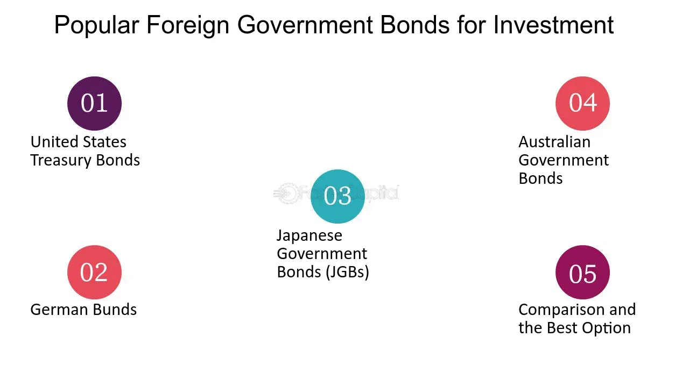

## Table of Contents

## What are foreign government bonds?

Foreign government bonds are loans that people or organizations give to other countries' governments. When you buy a foreign government bond, you are lending money to that country's government. In return, the government promises to pay you back the money you lent them, plus some extra money as interest, over a certain period of time. These bonds can be bought and sold in financial markets, just like stocks or other types of bonds.

These bonds are often seen as a way to diversify an investment portfolio because they come from different countries and can have different levels of risk and return. However, investing in foreign government bonds can also be riskier than investing in bonds from your own country. This is because the value of the bond can be affected by changes in the foreign country's economy, political stability, and currency exchange rates. It's important for investors to understand these risks before deciding to buy foreign government bonds.

## Why might someone consider investing in foreign government bonds?

People might consider investing in foreign government bonds because they want to spread out their investments. By putting money into bonds from different countries, they can reduce the risk that comes from having all their money in one place. If something bad happens to the economy of one country, the bonds from other countries might still do well. This can help protect their money and make their overall investment safer.

Another reason is that foreign government bonds can sometimes offer higher interest rates than bonds from their own country. This means they could earn more money over time. But, it's important to remember that with the chance of [earning](/wiki/earning-announcement) more, there's also more risk. Things like changes in the foreign country's economy, politics, or currency value can affect how much the bond is worth. So, people need to think carefully about these risks before deciding to invest in foreign government bonds.

## What are the risks associated with investing in foreign government bonds?

Investing in foreign government bonds can be riskier than investing in bonds from your own country. One big risk is that the value of the foreign currency might change compared to your own currency. If the foreign currency gets weaker, the money you get back from the bond might be worth less when you convert it back to your own currency. This means you could lose money even if the bond pays back all the interest it promised.

Another risk is that the foreign government might have trouble paying back the money it borrowed. If the country's economy is not doing well, or if there are big political problems, the government might not be able to pay back the bond on time or at all. This is called default risk, and it can make your investment worth less or even worthless.

Lastly, there are also risks from changes in interest rates. If interest rates go up in the country where you bought the bond, the value of your bond might go down. This is because new bonds would be issued with higher interest rates, making your older bond less attractive to other investors. So, if you need to sell your bond before it matures, you might get less money than you expected.

## How do foreign government bonds differ from domestic government bonds?

Foreign government bonds and domestic government bonds are both ways for governments to borrow money, but they come from different countries. When you buy a foreign government bond, you are lending money to a government in another country. This means you have to deal with a different currency, which can change in value compared to your own country's money. If the foreign currency gets weaker, the money you get back from the bond might be worth less when you convert it back to your own currency. On the other hand, domestic government bonds are in your own country's currency, so you don't have to worry about currency changes.

Another big difference is the risk of the government not being able to pay back the money it borrowed. With foreign government bonds, you have to think about the economy and politics of another country. If that country has big problems, the government might not be able to pay back the bond on time or at all. This is called default risk. Domestic government bonds usually have less default risk because you know more about your own country's situation. Also, foreign government bonds can sometimes offer higher interest rates, but with more risk, while domestic bonds might be safer but with lower returns.

## What are the key factors to consider when selecting foreign government bonds?

When [picking](/wiki/asset-class-picking) foreign government bonds, it's important to think about the country's economy. You want to know if the country is doing well or if it might have problems paying back the money it borrowed. Look at things like how fast the economy is growing, how much debt the country has, and if it has a history of paying back its debts on time. If the country's economy is strong and stable, the bond might be safer. But if the economy is weak or unstable, the bond could be riskier.

Another thing to consider is the [interest rate](/wiki/interest-rate-trading-strategies) the bond offers. Sometimes, foreign government bonds can give you higher interest rates than bonds from your own country. This means you could earn more money, but it also means there might be more risk. You should also think about the currency the bond is in. If the foreign currency gets weaker compared to your own currency, the money you get back might be worth less. So, it's a good idea to look at how stable the foreign currency is and how it might change in the future.

Lastly, think about how long you want to keep the bond. Some bonds pay back the money you lent over a short time, while others take many years. If you might need your money back soon, you should pick a bond that matures quickly. But if you can wait a long time, you might choose a bond with a longer term that could offer a higher interest rate. Always remember to balance the potential rewards with the risks involved.

## How does currency risk affect investments in foreign government bonds?

Currency risk is a big deal when you invest in foreign government bonds. It means that the value of the foreign money might change compared to your own money. If the foreign money gets weaker, the money you get back from the bond might be worth less when you change it back to your own money. This can make your investment worth less than you thought it would be, even if the bond pays back all the interest it promised.

For example, if you buy a bond in euros and you live in the United States, you have to change the euros back to dollars when you get your money back. If the euro gets weaker compared to the dollar, you'll get fewer dollars for your euros. This means you could lose money, even if the bond itself does well. So, it's important to think about how the foreign currency might change before you decide to invest in foreign government bonds.

## What role do credit ratings play in investing in foreign government bonds?

Credit ratings are really important when you're thinking about investing in foreign government bonds. They are like report cards that tell you how likely a country is to pay back the money it borrows. Agencies like Moody's, Standard & Poor's, and Fitch give these ratings. If a country has a high credit rating, it means the country is seen as safe and likely to pay back its debts. This makes the bonds from that country less risky, and people might be willing to accept lower interest rates for them. On the other hand, if a country has a low credit rating, it means there's more risk that the country might not be able to pay back its debts. This can make the bonds riskier, and investors might want higher interest rates to take that risk.

When you're looking at foreign government bonds, you should always check the credit rating of the country. It helps you understand the risks better. A country with a high credit rating might be a safer choice, but it might also offer lower returns. A country with a low credit rating could offer higher returns, but it's also riskier. So, you have to balance the safety of your investment with the potential for higher earnings. Remember, credit ratings can change over time, so it's a good idea to keep an eye on them and be ready to adjust your investments if needed.

## How can geopolitical events impact the returns on foreign government bonds?

Geopolitical events, like wars, elections, or big changes in a country's government, can really affect the returns on foreign government bonds. If something bad happens in a country, like a war or a big political change, people might start to worry that the country won't be able to pay back its debts. This can make the value of the country's bonds go down because investors want to sell them and get their money out. If you own those bonds, you could lose money because they're worth less than when you bought them.

On the other hand, if a country has good news, like a peaceful election or a new government that people trust, the value of its bonds might go up. People would feel more confident that the country will pay back its debts, so they might be willing to buy the bonds at a higher price. This can be good for you if you own those bonds because they could be worth more than when you bought them. But, it's important to remember that geopolitical events can be hard to predict, so investing in foreign government bonds always comes with some risk.

## What are the tax implications of investing in foreign government bonds?

When you invest in foreign government bonds, you need to think about taxes. The interest you earn from these bonds might be taxed differently than the interest from bonds in your own country. In some places, the interest from foreign bonds is taxed at a higher rate. Also, some countries take a small amount of tax out of the interest payments before they even get to you. This is called withholding tax. You might be able to get some of this money back when you file your taxes, but it depends on the tax rules of your country and the country where the bond is from.

Another thing to think about is how you report these investments on your taxes. You might have to fill out extra forms to tell your tax office about the foreign bonds you own and the interest you earn from them. If you sell the bond for more than you paid for it, you might have to pay capital gains tax on the profit. The rules for this can be different from country to country, so it's a good idea to talk to a tax advisor who knows about investing in foreign bonds. They can help you understand all the tax rules and make sure you're doing everything right.

## How can investors diversify their portfolio using foreign government bonds?

Investors can diversify their portfolio by adding foreign government bonds. This means they spread their money across different countries' bonds instead of putting all their money in one place. By doing this, they can lower the risk that comes from having all their investments in one country. If something bad happens to the economy of one country, the bonds from other countries might still do well. This can help protect their money and make their overall investment safer.

When choosing foreign government bonds, investors should look at different countries with different economies and risks. Some countries might have strong economies and low risk, while others might offer higher interest rates but come with more risk. By picking a mix of bonds from different countries, investors can balance the safety of their investment with the chance to earn more money. This way, they can have a more stable and potentially more profitable portfolio.

## What strategies can be used to mitigate risks when investing in foreign government bonds?

When you invest in foreign government bonds, one way to lower the risks is by spreading your money across different countries. This is called diversification. If you put your money in bonds from many different countries, you won't lose everything if one country has problems. It's like not putting all your eggs in one basket. You can also look at the credit ratings of the countries you're thinking about investing in. Countries with high credit ratings are usually safer bets because they are more likely to pay back their debts.

Another strategy is to keep an eye on currency changes. Since foreign government bonds are in different currencies, you need to think about how those currencies might change compared to your own. You can use something called currency hedging to protect against big changes in currency value. This means you can buy financial products that help balance out any losses if the foreign currency gets weaker. Also, staying informed about geopolitical events is important. Big changes in a country's politics or economy can affect the value of its bonds. By keeping up with the news and understanding what's happening in the countries you invest in, you can make better decisions and be ready to adjust your investments if needed.

## How do emerging market government bonds compare to those from developed markets?

Emerging market government bonds come from countries that are still growing their economies and might not be as rich or stable as developed countries. These bonds can offer higher interest rates because they are riskier. If you invest in them, you might earn more money, but there's also a bigger chance that the country could have trouble paying back the money it borrowed. Things like changes in the country's economy, politics, or currency value can make these bonds more unpredictable. So, if you're thinking about buying emerging market bonds, you need to be ready for more ups and downs.

On the other hand, developed market government bonds come from countries with strong and stable economies. These bonds usually have lower interest rates because they are seen as safer. Countries like the United States, Germany, and Japan issue these bonds, and they are less likely to have big problems paying back their debts. But, because they are safer, the returns might not be as high as those from emerging markets. If you want a more stable investment with less risk, developed market bonds might be a better choice for you.

## References & Further Reading

1. **Government Bonds**  
   - *Title:* "The U.S. Treasury Securities: A Primer"  
     *Source:* U.S. Department of the Treasury  
     [Link](https://home.treasury.gov/policy-issues/financing-the-government/treasury-securities)  
     This resource provides a comprehensive guide to U.S. Treasury securities, including Treasury Bills, Notes, and Bonds, outlining their features, benefits, and role in fiscal policy.

2. **Foreign Bonds**  
   - *Title:* "Currency Risk and Sovereign Risk in International Investments"  
     *Authors:* Bekaert, G., & Hodrick, R. J.  
     *Published in:* Journal of International Finance  
     This scholarly article discusses the risks associated with foreign bonds, primarily focusing on currency and sovereign risks, and provides insights into the considerations for international investments.

3. **Algorithmic Trading**  
   - *Title:* "Algorithmic Trading and Its Implications on Trading Efficiency"  
     *Authors:* Algozzine, J., & Najarian, M.  
     *Published by:* Financial Analysts Journal  
     This paper analyzes how [algorithmic trading](/wiki/algorithmic-trading) has enhanced market efficiency and execution speed, particularly its impact on transaction costs and trading precision.

4. **Challenges in Algorithmic Trading**  
   - *Title:* "Flash Crashes and High-Frequency Trading: Regulatory Challenges"  
     *Authors:* Easley, D., López de Prado, M. M., & O'Hara, M.  
     *Published in:* Journal of Financial Economics  
     This publication explores the risks posed by algorithmic trading, such as flash crashes and market manipulation, emphasizing the need for regulatory oversight and risk management.

5. **Future of Algorithmic Trading in Bonds**  
   - *Title:* "Artificial Intelligence in Algorithmic Trading: Transforming Bond Markets"  
     *Authors:* Chen, Y., & Lux, T.  
     *Published by:* Journal of Financial Regulation and Compliance  
     This article projects the integration of AI and [machine learning](/wiki/machine-learning) technologies in bond trading, analyzing how these advancements are expected to reshape market strategies and regulatory requirements.

6. **Books on Bonds and Trading**  
   - *Title:* "The Bond Book: Everything Investors Need to Know About Treasuries, Municipals, GNMAs, Corporates, Zeros, Bond Funds, Money Market Funds, and More"  
     *Author:* Annette Thau  
     This book serves as an essential resource for understanding various types of bonds, their investment benefits, and associated trading strategies, suitable for both novice and experienced investors.

7. **Online Course: Algorithmic Trading**  
   - *Title:* "Algorithmic Trading Strategy Development and Implementation"  
     *Platform:* Coursera (offered by the University of Michigan)  
     [Link](https://www.coursera.org/learn/algorithmic-trading)  
     This [course](/wiki/best-algorithmic-trading-courses) covers the fundamentals of building and implementing algorithmic trading strategies, with modules specifically tailored to securities and bond markets.

