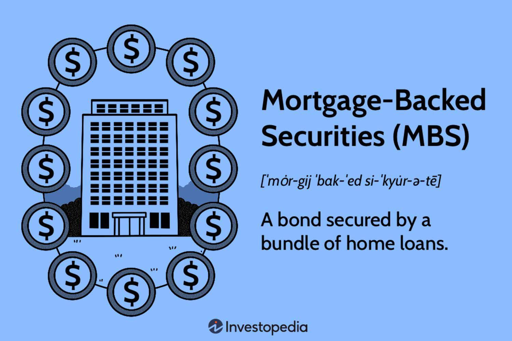

## Table of Contents

## What are Mortgage-Backed Securities (MBS)?

Mortgage-Backed Securities (MBS) are a type of investment where a bunch of home loans are bundled together and sold as a single security. Imagine you own a piece of paper that represents a share in thousands of home loans. When homeowners make their monthly mortgage payments, the money goes to the investors who own the MBS. This way, instead of lending money directly to homebuyers, investors can buy these securities and still earn money from home loans.

These securities are created by banks or other financial institutions that gather many individual home loans. They then sell these loans to a company that turns them into MBS. These MBS can be bought and sold in financial markets, just like stocks or bonds. This process helps banks free up money to lend to more homebuyers. However, MBS can be risky because if many homeowners can't pay their mortgages, the value of the MBS can drop, and investors might lose money.

## How do Mortgage-Backed Securities work?

Mortgage-Backed Securities (MBS) work by taking a bunch of home loans and bundling them together into one big package. This package is then sold to investors as a security. When people pay their monthly mortgage, that money goes to the investors who own the MBS. It's like owning a piece of many home loans at once. Banks or other financial companies gather these loans, and then a special company turns them into MBS that can be bought and sold in the market.

This process helps banks because they can sell the loans they made and get money back quickly. This money can then be used to make more loans to other people who want to buy homes. For investors, MBS can be a way to earn money from home loans without having to lend money directly to homebuyers. But, there's a risk involved. If a lot of homeowners can't pay their mortgages, the value of the MBS can go down, and investors might lose money.

## What are the different types of Mortgage-Backed Securities?

There are two main types of Mortgage-Backed Securities: Pass-Through MBS and Collateralized Mortgage Obligations (CMOs). Pass-Through MBS are the simpler type. They work by taking all the mortgage payments from a pool of home loans and passing them directly to the investors. So, if homeowners pay their mortgages, that money goes straight to the investors. This type is easier to understand because the payments are straightforward and predictable.

Collateralized Mortgage Obligations, or CMOs, are a bit more complicated. They take the same pool of home loans but split them into different parts, called tranches. Each tranche has its own level of risk and return. Some tranches get paid back first and are safer, while others get paid later and are riskier but might offer higher returns. This allows investors to choose the level of risk they're comfortable with. CMOs can be trickier to understand because of how they're divided up, but they give investors more options.

## What are the benefits of investing in Mortgage-Backed Securities?

Investing in Mortgage-Backed Securities can be a good way to make money from home loans without having to lend money directly to homebuyers. When you buy an MBS, you're buying a piece of a lot of home loans all at once. If homeowners keep paying their mortgages, you get a steady stream of payments. This can be a good way to earn regular income, kind of like getting interest from a savings account but often with a higher return.

Another benefit is that MBS can help spread out risk. Instead of lending money to one person and hoping they pay you back, you're investing in many loans at once. If one homeowner can't pay, it's not a big deal because there are lots of other loans in the pool. Plus, MBS can be bought and sold in the financial markets, so if you need your money back, you might be able to sell your MBS to someone else. This makes them a flexible investment option.

## What are the risks associated with Mortgage-Backed Securities?

One big risk with Mortgage-Backed Securities is that homeowners might stop paying their mortgages. If a lot of people can't pay, the value of the MBS goes down, and investors might lose money. This happened during the 2008 financial crisis when many homeowners couldn't pay their loans, and it caused big problems for investors holding MBS.

Another risk is that MBS can be hard to understand, especially the more complicated types like Collateralized Mortgage Obligations. These can be split into different parts with different levels of risk, and it can be tough to know exactly what you're buying. If you don't fully understand what you're investing in, you might end up with something riskier than you thought.

Also, the value of MBS can change a lot because of interest rates. If interest rates go up, the value of MBS can go down, and vice versa. This can make MBS a bit unpredictable, and if you need to sell your MBS quickly, you might not get as much money as you hoped.

## How can one start investing in Mortgage-Backed Securities?

To start investing in Mortgage-Backed Securities, you first need to open an account with a brokerage firm that deals in these types of investments. Once you have an account, you can look at the different MBS options available. You might want to talk to a financial advisor to help you understand which MBS might be right for you. They can explain the risks and benefits and help you decide how much to invest.

After choosing the right MBS, you can buy them through your brokerage account, just like you would buy stocks or bonds. Keep in mind that MBS can be a bit more complicated than other investments, so it's important to do your homework. Make sure you understand how they work and the risks involved. Regularly check on your investment to see how it's doing and be ready to make changes if needed.

## What role do government agencies play in the MBS market?

Government agencies like Fannie Mae, Freddie Mac, and Ginnie Mae play a big role in the MBS market. They help make home loans easier to get by buying mortgages from banks and turning them into MBS. This way, banks can lend more money to people who want to buy homes. Fannie Mae and Freddie Mac are called government-sponsored enterprises (GSEs). They don't directly lend money to homebuyers, but they buy loans from banks and package them into MBS that investors can buy.

Ginnie Mae is a bit different. It's fully backed by the U.S. government, which means it's considered very safe. Ginnie Mae doesn't buy loans directly, but it guarantees MBS that are backed by government-insured loans, like FHA or VA loans. This guarantee makes these MBS very attractive to investors because they're seen as less risky. Overall, these government agencies help keep the MBS market running smoothly and make it easier for people to buy homes by ensuring there's always money available for loans.

## How do interest rates affect Mortgage-Backed Securities?

Interest rates have a big impact on Mortgage-Backed Securities. When interest rates go up, the value of existing MBS usually goes down. This happens because new mortgages will have higher interest rates, making them more attractive to investors. People might also pay off their old mortgages faster to take advantage of the new, higher rates, which means less money coming in for the investors who own the old MBS. So, if you're thinking about buying MBS, you need to keep an eye on what interest rates are doing.

On the other hand, when interest rates go down, the value of MBS can go up. This is because the older MBS with higher interest rates become more valuable compared to new mortgages with lower rates. Homeowners might also be less likely to pay off their mortgages early because they can't get a better deal, which means more steady payments for MBS investors. So, interest rates can make MBS either more or less attractive to investors, depending on which way they're moving.

## What is the impact of prepayment risk on MBS investments?

Prepayment risk is a big deal for people who invest in Mortgage-Backed Securities. It happens when homeowners pay off their mortgages earlier than expected. This can be because they decide to sell their house, refinance their loan to get a better [interest rate](/wiki/interest-rate-trading-strategies), or just pay off their loan faster. When this happens, the money that was supposed to come in over a long time comes in all at once. This can be a problem for MBS investors because they were counting on a steady stream of payments over time, not a big lump sum.

This risk can mess up the returns that investors were expecting from their MBS. If a lot of homeowners pay off their loans early, the MBS might not last as long as planned, and investors might have to find a new place to put their money sooner than they thought. Also, if interest rates go down, more people might refinance their loans, which increases the prepayment risk even more. So, when thinking about investing in MBS, it's important to consider how prepayment risk might affect the money you're hoping to make.

## How are Mortgage-Backed Securities priced and valued?

Mortgage-Backed Securities are priced and valued based on a few key things. One big thing is the interest rate that the mortgages in the MBS are paying. If those rates are higher than what you can get from other investments, the MBS will be worth more. Another thing is how likely it is that homeowners will keep paying their mortgages. If a lot of people might stop paying, the MBS will be worth less because it's riskier. Also, how quickly homeowners might pay off their loans early, called prepayment risk, affects the value. If a lot of people are likely to pay off their loans early, the MBS might not last as long, which can make it less valuable.

Another important [factor](/wiki/factor-investing) is what's happening with interest rates in the economy. If interest rates go up, new mortgages will have higher rates, making existing MBS less attractive and lowering their value. But if interest rates go down, the existing MBS with higher rates become more valuable. Finally, how easy it is to buy and sell the MBS in the market also affects its price. If a lot of people want to buy MBS, the price goes up. If not many people want them, the price goes down. So, the value of an MBS is always changing based on these different things.

## What advanced strategies can be used to enhance returns from MBS?

One advanced strategy to enhance returns from Mortgage-Backed Securities is to use a technique called "tranching." This is where you take a big pool of mortgages and split it into different parts, called tranches. Each tranche has its own level of risk and return. By choosing the right tranche, you can match your investment to the level of risk you're comfortable with. For example, if you want safer returns, you might choose a tranche that gets paid back first. If you're okay with more risk for the chance of higher returns, you might pick a tranche that gets paid back later. This way, you can fine-tune your investment to get the best possible return for your risk level.

Another strategy is to use interest rate swaps. This is a bit more complicated, but it can help manage the risk of changing interest rates. With an interest rate swap, you agree with another party to exchange cash flows based on different interest rates. For example, you might swap the fixed interest payments you get from your MBS for variable interest payments from the other party. This can help protect your returns if interest rates go up, because the variable payments might go up too. By using these swaps, you can make your MBS investment more stable and potentially increase your returns by managing interest rate risk better.

## How have regulatory changes affected the Mortgage-Backed Securities market?

Regulatory changes have had a big impact on the Mortgage-Backed Securities market. After the 2008 financial crisis, the government made new rules to make the market safer. One big change was the Dodd-Frank Act, which made banks keep some of the risk of the loans they sold as MBS. This was to stop banks from selling off risky loans without caring about what happened to them. The rules also made it harder for people to get certain types of risky loans, which changed what kinds of mortgages were being bundled into MBS.

These changes have made the MBS market more stable but also more complicated. Investors now have to do more work to understand the new rules and how they affect the MBS they're thinking about buying. The rules have also made it harder for some people to get loans, which means fewer mortgages are being made into MBS. This can affect how much money investors can make from MBS. Overall, the new regulations have made the MBS market safer but also changed how it works and who can invest in it.

## References & Further Reading

[1]: Fabozzi, F. J. (2016). ["The Handbook of Mortgage-Backed Securities"](https://academic.oup.com/book/7943). Oxford University Press.

[2]: Gorton, G. B., & Metrick, A. (2012). ["Getting Up to Speed on the Financial Crisis: A One-Weekend-Reader's Guide"](https://www.nber.org/system/files/working_papers/w17778/w17778.pdf). The Review of Financial Studies, 25(1), 151-196.

[3]: ["Mortgage-Backed Securities: Products, Structuring, and Analytical Techniques"](https://www.amazon.com/Mortgage-Backed-Securities-Structuring-Analytical-Techniques/dp/1118004698) by Frank J. Fabozzi and Anand K. Bhattacharya

[4]: ["Algorithmic Trading: Winning Strategies and Their Rationale"](https://www.wiley.com/en-us/Algorithmic+Trading%3A+Winning+Strategies+and+Their+Rationale-p-9781118746912) by Ernest P. Chan

[5]: Vickery, J., & Wright, J. (2013). ["TBA Trading and Liquidity in the Agency MBS Market"](https://www.newyorkfed.org/medialibrary/media/research/epr/2013/1212vick.pdf). Federal Reserve Bank of New York Staff Reports.

[6]: Ashcraft, A. B., & Schuermann, T. (2008). ["Understanding the Securitization of Subprime Mortgage Credit"](https://papers.ssrn.com/sol3/papers.cfm?abstract_id=1071189). Federal Reserve Bank of New York Staff Reports.