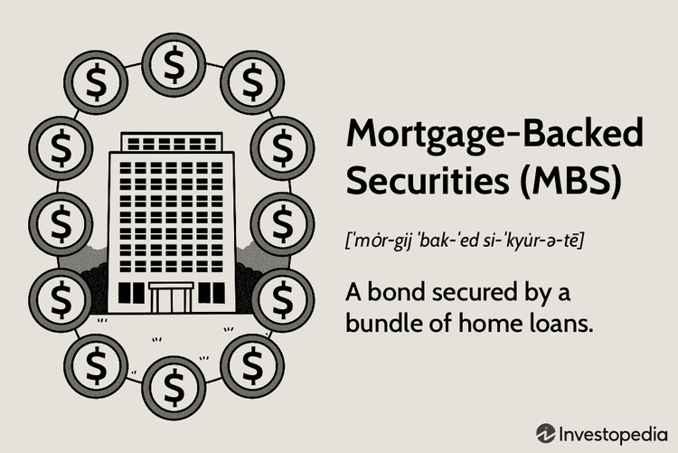

Mortgage-backed securities (MBS) have served as a pivotal element in modern finance by bridging the gap between mortgage lenders and investors. This financial innovation enables lenders to convert mortgage loans into marketable securities, thus providing new funding sources for additional mortgage lending. These securities encapsulate a complex interplay of investment and mortgage debt, creating avenues for diversification and income generation.

The evolving landscape of MBS encompasses varied investment strategies, prominently including algorithmic trading, which has significantly influenced market dynamics. By employing algorithms to execute trades at high speeds and volumes, investors can better navigate the nuances of the MBS market, reacting swiftly to changing conditions and optimizing their portfolios with precision. Algorithmic trading is particularly valuable in the MBS space, where pricing can be intricate and influenced by numerous variables.



This article undertakes a comprehensive examination of MBS, touching on their formation—the process of pooling and securitizing mortgage loans—and discussing the different types available, such as pass-through securities and collateralized mortgage obligations (CMOs). Each type presents unique characteristics and risk profiles, catering to the diverse objectives and risk appetites of investors.

Historically, MBS have played a dual role in advancing home ownership and contributing to systemic risks, as evidenced during the 2007-2008 financial crisis. These periods of turmoil underline the importance of regulatory oversight and improved risk assessment practices. Post-crisis reforms have sought to safeguard the MBS market, aiming for enhanced transparency and stability.

In equipping investors with an understanding of MBS, this article aims to demystify these intricate instruments and their place in investment portfolios. Insight into their historical impact, structuring intricacies, and the transformative role of algorithmic trading will empower investors to make informed decisions amidst a complex financial landscape.

## Table of Contents

## Understanding Mortgage-Backed Securities (MBS)

Mortgage-backed securities (MBS) are financial instruments that package mortgage loans together to be sold as securities to investors. These instruments have become integral to financial markets, allowing mortgage lenders to acquire additional funds for new loans and providing investors with investment opportunities that yield regular income. The income stems from the interest and principal payments made by homeowners on the underlying mortgages.

The structure of an MBS is relatively straightforward: a financial institution, such as a bank or government-sponsored entity, purchases a pool of mortgages from lenders. Once these mortgages are bundled, they are restructured into a security, which is then sold to investors. Throughout this process, homeowners continue to make payments on their mortgages, which are collected and distributed to the holders of the MBS. This setup provides investors with periodic payouts which are derived from the mortgage payments.

Entities like Fannie Mae (Federal National Mortgage Association) and Freddie Mac (Federal Home Loan Mortgage Corporation) are pivotal in the MBS market. These government-sponsored entities provide a vital service by guaranteeing the timely payment of principal and interest on their issued MBS. This guarantee essentially reduces the credit risk for investors and makes agency MBS a more attractive and secure investment.

A key distinction exists between agency MBS and non-agency MBS. Agency MBS are those that are issued or guaranteed by government-backed entities such as Fannie Mae, Freddie Mac, or Ginnie Mae. These securities are generally considered safer due to the backing, which typically results in lower yields compared to their non-agency counterparts. Non-agency MBS, on the other hand, do not have government backing. These securities might offer higher yields but come with higher risk, as they are more susceptible to credit risk – the risk of borrowers defaulting on their loans.

Understanding these basic facets of mortgage-backed securities is crucial for investors. Agency MBS are often favored by risk-averse investors seeking stable, lower-risk returns, while non-agency MBS might appeal to those willing to assume more risk in pursuit of higher yields. As such, the selection between agency and non-agency options should align with an investor’s risk tolerance and investment strategy.

## Types of Mortgage-Backed Securities

Mortgage-backed securities (MBS) are a category of asset-backed securities with the underlying asset being the cash flows from mortgage loans. The two primary types of MBS are pass-through securities and collateralized mortgage obligations (CMOs). Each type has distinct characteristics, appealing to different investor profiles and risk tolerances. 

**Pass-Through Securities**

Pass-through securities operate by pooling together mortgage loans and then passing the monthly mortgage payments from homeowners directly to investors, minus servicing and other fees. These securities are typically structured such that all investors receive the same rate of return. The payments consist of both interest and principal repayments, distributed proportionally to all holders. Pass-through securities are relatively straightforward and offer a direct link between the mortgage payments and investor returns. However, they come with prepayment risk, as homeowners can refinance or pay off their loans early. This can lead to variable cash flows and uncertainty in the timing of returns. 

For an investor considering pass-through securities, it is essential to weigh the potential for stable, regular income against the risk of fluctuating returns due to prepayments. These securities typically align with investors seeking moderate risk and regular income.

**Collateralized Mortgage Obligations (CMOs)**

CMOs represent a more advanced form of mortgage-backed securities. They segment or tranche the mortgage pool's payments into different layers, each with distinct characteristics, maturities, and risk levels. These tranches can cater to varied investor risk-return profiles. In a typical CMO structure, tranches are organized into sequential-pay structures, where each tranche is paid off in sequence before the next one begins to receive payments. This allows for more precise control over the timing of principal payments, appealing to investors with specific risk appetites and investment horizons. 

The complex structuring of CMOs allows for innovative risk distribution, enabling investors to select tranches that align with their risk tolerance and return expectations. For instance, an investor with low risk tolerance might opt for a senior tranche with lower yields but higher payment priority and less exposure to prepayment risk. Conversely, a more risk-tolerant investor might choose a subordinate tranche with higher yields, bearing more prepayment and credit risk.

Investors must consider their financial goals and risk preferences to determine the appropriate choice between pass-through securities and CMOs. Understanding these types equips investors with the necessary knowledge to navigate MBS investments effectively, optimizing their portfolios in line with personal investment strategies.

## History and Evolution of MBS

Mortgage-backed securities (MBS) have undergone significant transformation since their inception in the late 1960s, fundamentally changing the financial landscape and helping to expand homeownership by connecting mortgage lenders with capital markets. Originally developed to address the challenges faced by banks in maintaining [liquidity](/wiki/liquidity-risk-premium) while offering long-term fixed-rate mortgages, MBS were designed to redistribute mortgage debt by selling bundled loans as securities to investors. This innovation allowed banks to offload risk and use the proceeds to issue new home loans, thereby fostering increased access to home financing.

The 2007-2008 financial crisis marked a pivotal moment in the history of MBS. During this period, the proliferation of complex MBS products, such as collateralized debt obligations (CDOs) that often included subprime mortgages, exposed major weaknesses in risk assessment and regulatory oversight. The excessive reliance on flawed credit ratings compounded the risk, amplifying the crisis when homeowners defaulted on their loans, leading to massive losses for investors holding these securities. The crisis underscored the critical need for rigorous regulatory frameworks and robust risk management practices in the MBS market. This pivotal event highlighted the systemic risks associated with insufficiently transparent financial products, prompting widespread calls for reform.

In response to the crisis, substantial reforms were implemented to stabilize the MBS market and enhance its transparency. One of the most significant changes was the introduction of stricter regulatory requirements for financial institutions, including higher capital standards and more comprehensive disclosure obligations. These regulations aimed to ensure that investors had a clearer understanding of the risks associated with MBS investments. Additionally, the Dodd-Frank Wall Street Reform and Consumer Protection Act, enacted in 2010, sought to improve the oversight of the financial industry and specifically addressed the practices surrounding mortgage lending and securitization.

Furthermore, the establishment of the Consumer Financial Protection Bureau (CFPB) aimed to bolster consumer protection by enforcing regulations that reduce predatory lending practices and ensuring that borrowers are better equipped to meet their mortgage obligations. These reforms have collectively worked to restore confidence in the MBS market by enhancing the integrity of mortgage lending and securitization processes.

The evolution of MBS continues as the industry adapts to an ever-changing regulatory environment and incorporates new technologies to enhance transparency and efficiency. With an emphasis on sustainable growth and rigorous oversight, the MBS market plays a crucial role in maintaining liquidity within the real estate finance sector and supporting broader economic stability.

## Advantages and Disadvantages of Investing in MBS

Mortgage-backed securities (MBS) are compelling to income-focused investors due to the attractiveness of their returns, diversification benefits, and federal backing potential. These securities are designed to provide regular income streams from the interest and principal payments made by mortgage borrowers. Their inclusion in investment portfolios can translate into a diversified income source that often yields higher returns compared to traditional fixed-income assets like government bonds.

A significant advantage of MBS is their potential federal backing, particularly for agency MBS, which are guaranteed by government-sponsored enterprises like Fannie Mae and Freddie Mac. This backing offers a layer of security, essentially minimizing credit risk and providing investors with more stable returns in contrast to non-agency MBS, where the credit risk can be substantial. Non-agency MBS are not guaranteed by these entities and thus expose investors to greater credit risk, making them more susceptible to fluctuations in mortgage borrowers' ability to repay, although they might offer higher yields as compensation.

Despite their advantages, MBS investments come with inherent risks. Prepayment risk is a primary concern where borrowers may repay their mortgage early, particularly in a declining [interest rate](/wiki/interest-rate-trading-strategies) environment. This leads to reinvestment risk, as investors might be forced to reinvest the returned principal at lower prevailing interest rates, potentially reducing future income. Additionally, credit risk in non-agency MBS remains a significant [factor](/wiki/factor-investing), requiring investors to assess the creditworthiness of the underlying mortgage borrowers.

Investors must weigh these risks against their investment objectives and risk tolerance. A careful analysis of the MBS market conditions and the specific characteristics of the securities in question, including the underlying loan quality and prevailing economic status, will aid in assessing the suitability of MBS in an investment strategy.

In conclusion, MBS present an advantageous opportunity for diversification and income generation, particularly with federal backing reducing associated risks. However, potential downsides such as prepayment and credit risks necessitate a thorough evaluation of personal financial goals, to ensure they align appropriately with the risk-return profile inherent in MBS investing. Understanding these dynamics is essential for investors to make informed choices in integrating MBS into their portfolios effectively.

## Algorithmic Trading and MBS

Algorithmic trading has significantly transformed the landscape of mortgage-backed securities (MBS), driving efficiencies in execution and enhancing pricing mechanisms. This sophisticated form of trading employs complex algorithms and computing power to analyze market conditions and execute trades at speeds and frequencies that would be impossible for human traders.

### Enhanced Execution and Pricing
The primary advantage of [algorithmic trading](/wiki/algorithmic-trading) in the MBS market is the ability to execute trades instantly, thereby narrowing bid-ask spreads and providing more accurate pricing. Algorithms can rapidly process vast amounts of market data, identifying [arbitrage](/wiki/arbitrage) opportunities and executing multiple transactions simultaneously. This leads to more liquid markets, as the presence of algorithmic traders increases the frequency of trades, enabling a continuous flow of transactions that benefits all participants. 

### Real-Time Market Movements
Investors can benefit from real-time market dynamics by employing algorithms that instantaneously process news events, economic data releases, and changes in interest rates. These algorithms are designed to respond to specific triggers, executing trades based on pre-defined criteria without the need for manual intervention. This capability allows investors to preemptively manage risks and capitalize on short-term market fluctuations with precision.

### Risk Management
Algorithmic trading facilitates advanced risk management strategies. Risk metrics such as Value at Risk (VaR) and stress testing scenarios can be integrated into trading algorithms to monitor and control the risk exposure of MBS portfolios continuously. For instance, an algorithm might dynamically adjust a portfolio's composition in response to changes in [volatility](/wiki/volatility-trading-strategies) or credit default risks. 

In Python, an example of a simple algorithmic strategy to manage risk might involve adjusting a portfolio’s allocation based on volatility, with a function such as:

```python
def adjust_portfolio(mbs_portfolio, market_volatility, target_volatility):
    """
    Adjusts the MBS portfolio allocation based on market volatility.

    Args:
        mbs_portfolio (dict): Current portfolio allocations of MBS.
        market_volatility (float): Current observed market volatility.
        target_volatility (float): Desired target volatility.

    Returns:
        dict: New portfolio allocations.
    """
    adjustment_factor = target_volatility / market_volatility
    for security in mbs_portfolio:
        mbs_portfolio[security] *= adjustment_factor
    return mbs_portfolio

# Example usage
current_portfolio = {'MBS_A': 50000, 'MBS_B': 30000}
volatility = 0.2
target_volatility = 0.15
new_portfolio = adjust_portfolio(current_portfolio, volatility, target_volatility)
```

### Shaping Future Dynamics
The integration of algorithmic trading will likely continue transforming the MBS market structure. Innovations such as [machine learning](/wiki/machine-learning) and [artificial intelligence](/wiki/ai-artificial-intelligence) enable more sophisticated algorithms, capable of predicting market trends and making probabilistic decisions. As these technologies advance, they could introduce new models for pricing and risk assessment, further streamlining trading processes and increasing market efficiency.

### Conclusion
The involvement of algorithmic trading in the MBS market introduces a level of sophistication and precision that empowers investors to optimize returns and manage risks more effectively. Staying abreast of these technological advancements is crucial for market participants seeking to leverage algorithmic trading for competitive advantage.

## MBS in the Modern Financial Landscape

Mortgage-backed securities (MBS) continue to play a crucial role in the modern financial landscape by facilitating liquidity and promoting credit expansion. As instruments that pool together multiple mortgage loans, they serve as a link between mortgage lenders and investors, allowing for the redistribution of risk and return potential. This function is particularly significant for the housing market, as it supports the availability of capital and promotes home ownership.

### Regulatory Scrutiny and Innovations in MBS Structuring

In recent years, there has been an increase in regulatory scrutiny surrounding MBS, mainly driven by the lessons learned from the 2007-2008 financial crisis. This heightened oversight aims to mitigate systemic risks inherent in the securitization of mortgage loans. Governments and regulatory bodies have sought to implement stricter underwriting standards, enhanced disclosure requirements, and improved risk assessment practices to ensure that the MBS market operates more transparently and sustainably.

The Dodd-Frank Wall Street Reform and Consumer Protection Act, for instance, introduced several regulations aimed at increasing the resilience of the financial system, including stronger capital requirements for banks holding MBS. Simultaneously, the Basel III framework has imposed tougher capital and liquidity standards to ensure financial institutions adequately manage the risks associated with securitization exposure.

Concurrent with these regulatory changes, the MBS market has witnessed innovations in structuring. One such innovation is the use of credit risk transfer (CRT) transactions, which allow for the transfer of risk from government-sponsored enterprises (GSEs) like Fannie Mae and Freddie Mac to private investors. This mechanism not only reduces the risk burden on the GSEs but also broadens the investor base involved in the MBS market.

Another notable development is the integration of environmental, social, and governance ([ESG](/wiki/esg-investing)) criteria into MBS structuring. As investors increasingly demand sustainable investment options, MBS issuers are incorporating ESG factors into their offerings to align with these preferences. An example is the issuance of "green MBS," which are backed by loans on energy-efficient homes.

### Navigating the Contemporary MBS Market Landscape

Understanding these trends is essential for investors who aim to navigate the contemporary MBS market landscape effectively. The evolving regulatory environment necessitates a keen awareness of compliance requirements and their implications for MBS valuations and returns. Additionally, innovations in MBS structuring present new opportunities and challenges, making it critical for investors to remain informed about the latest market developments.

Investors should prioritize due diligence and risk management strategies by closely analyzing the credit quality of underlying mortgage loans, the structure of the MBS, and any embedded innovations such as CRTs or ESG considerations. Furthermore, leveraging technology and advanced analytics can aid in assessing MBS performance metrics and understanding the impact of macroeconomic variables, such as interest rate fluctuations and housing market trends, on MBS investments.

In conclusion, MBS continue to be an indispensable component of the financial ecosystem. The combination of increased regulatory oversight and structural innovations offers both opportunities and complexities that investors must comprehend to make informed decisions in this dynamic market.

## Conclusion

Mortgage-backed securities (MBS) present both opportunities and challenges for investors. These financial instruments are complex but offer significant potential for income generation and portfolio diversification. However, understanding their unique mechanics is essential for investors seeking to navigate their complexities effectively. At the core of MBS is the bundling of mortgage loans, which involves distinct risks such as prepayment and credit risk. These can significantly affect the return on investment and must be closely monitored.

Algorithmic trading has revolutionized how MBS are traded by enhancing market efficiency through rapid execution and precise pricing mechanisms. This technology enables investors to react swiftly to real-time market data, optimizing their strategies accordingly. As a result, algorithmic trading has become a pivotal tool in managing the inherent risks associated with MBS investments.

For investors, staying informed about market trends and technological advancements in MBS trading is increasingly important. Market volatility and regulatory changes can significantly impact the value and stability of these securities. A comprehensive understanding of MBS, coupled with the ability to leverage algorithmic tools, can empower investors to make well-informed decisions, balancing potential rewards with associated risks. As the financial landscape continues to evolve, informed engagement in the MBS market will be critical for achieving investment goals.

## References & Further Reading

[1]: Fabozzi, F. J. (2016). ["The Handbook of Mortgage-Backed Securities"](https://academic.oup.com/book/7943). Oxford University Press.

[2]: Gorton, G. B., & Metrick, A. (2012). ["Getting Up to Speed on the Financial Crisis: A One-Weekend-Reader's Guide"](https://www.nber.org/system/files/working_papers/w17778/w17778.pdf). The Review of Financial Studies, 25(1), 151-196.

[3]: ["Mortgage-Backed Securities: Products, Structuring, and Analytical Techniques"](https://www.amazon.com/Mortgage-Backed-Securities-Structuring-Analytical-Techniques/dp/1118004698) by Frank J. Fabozzi and Anand K. Bhattacharya

[4]: ["Algorithmic Trading: Winning Strategies and Their Rationale"](https://www.wiley.com/en-us/Algorithmic+Trading%3A+Winning+Strategies+and+Their+Rationale-p-9781118746912) by Ernest P. Chan

[5]: Vickery, J., & Wright, J. (2013). ["TBA Trading and Liquidity in the Agency MBS Market"](https://www.newyorkfed.org/medialibrary/media/research/epr/2013/1212vick.pdf). Federal Reserve Bank of New York Staff Reports.

[6]: Ashcraft, A. B., & Schuermann, T. (2008). ["Understanding the Securitization of Subprime Mortgage Credit"](https://papers.ssrn.com/sol3/papers.cfm?abstract_id=1071189). Federal Reserve Bank of New York Staff Reports.