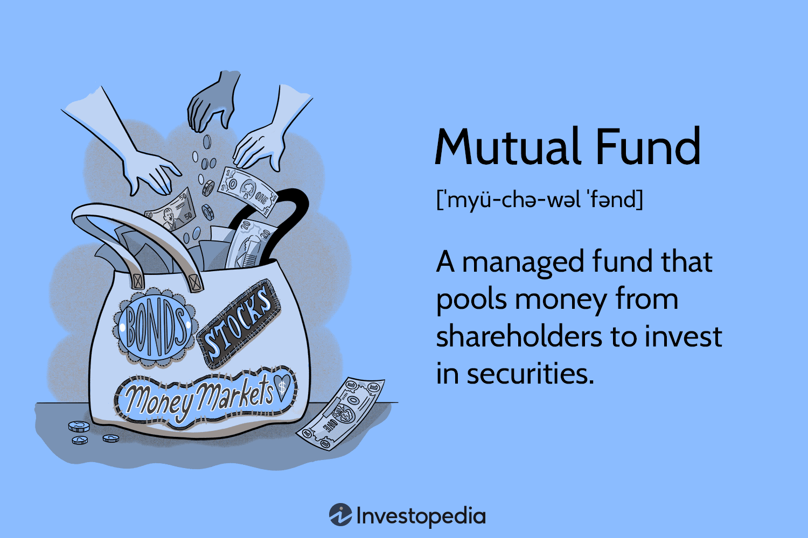

The financial landscape is undergoing significant transformations driven by advancements in technology and innovative investment methodologies. At the heart of modern portfolio management are mutual funds, diverse investment strategies, and algorithmic trading, all of which collectively redefine the traditional approach to investing.

Mutual funds play a critical role in this evolution by offering diversification and professional management. This allows investors to mitigate risk while pursuing potential returns. By pooling resources from numerous investors, mutual funds enable access to a broadly diversified portfolio, encompassing a wide array of asset classes such as stocks, bonds, and other instruments. The diversification inherent in mutual funds helps minimize the detrimental impact of poor-performing investments on the overall portfolio.

Algorithmic trading, a technology-driven mechanism, has also made substantial contributions to modern finance by enhancing trading efficiency, precision, and liquidity in financial markets. This form of trading involves using pre-programmed algorithms to execute trading orders at optimal prices, thereby reducing the transaction costs and the risk of human error. The speed and accuracy of algorithmic trading can significantly improve market liquidity, providing investors with better opportunities to enter and exit positions at favorable terms.

The integration of mutual funds, diverse investment strategies, and algorithmic trading fosters a dynamic and adaptive approach to investment, optimizing returns while effectively managing associated risks. This synergy allows for the development of resilient portfolio management strategies that can navigate the rapid and often unpredictable changes in global financial markets. As technological innovations continue to shape the financial sector, these integrated tools will play an increasingly pivotal role in helping investors achieve their financial objectives in an efficient and controlled manner.

## Table of Contents

## Understanding Mutual Funds

Mutual funds are financial vehicles that aggregate capital from multiple investors, allowing for a diversified portfolio of investments across various asset classes such as stocks, bonds, and other securities. This structure provides investors with several advantages, notably diversification and professional management.

### Diversification and Professional Management

Diversification is a fundamental advantage of mutual funds. By pooling funds, a mutual fund can invest in a wide range of assets, which helps to mitigate risk. This spread of investments means that the poor performance of a single asset has a reduced impact on the overall portfolio. This characteristic is crucial for investors seeking balance between risk and reward.

Professional fund managers are at the helm of mutual funds, focusing on fulfilling specified financial objectives. These managers leverage their expertise to select the fund’s investments, a service that individual investors might find challenging due to the required experience and time commitment. This professional management is particularly beneficial for investors who may lack the knowledge or resources to effectively oversee their investment portfolios.

### Fee Structures and Their Impact

An important consideration when investing in mutual funds is the fee structure. Fees, including the expense ratio—which covers management fees and operating expenses—can significantly affect the overall return on investment. The expense ratio is often expressed as a percentage of the fund’s total assets and varies between funds. Lower expense ratios generally lead to higher net returns to investors, assuming other factors remain constant.

### Types of Mutual Funds

Mutual funds are diverse in nature, offering various types that cater to different investment needs and risk appetites. The primary categories include equity funds, bond funds, money market funds, and balanced funds.

- **Equity Funds**: These funds primarily invest in stocks and aim to achieve capital growth. They are suitable for investors with higher risk tolerance and a focus on long-term growth.
- **Bond Funds**: Focusing on fixed-income securities, bond funds are generally considered lower risk compared to equity funds. They primarily aim to provide income through interest payments.
- **Money Market Funds**: These funds invest in short-term, high-quality debt securities and are considered low-risk, offering liquidity and modest income.
- **Balanced Funds**: Also known as hybrid funds, these invest in a mix of equities and fixed-income securities, aiming to provide a balanced approach of income and growth, with moderate risk exposure.

In summary, mutual funds offer a convenient and effective way for investors to achieve diversification, benefit from professional management, and select investments aligned with their risk preferences and financial objectives. Understanding the types of mutual funds and their associated fee structures is essential for optimizing investment decisions.

## Investment Strategies for Mutual Funds

Investment strategies for mutual funds can be broadly categorized into active and passive management, each having distinct implications for the fund's cost and performance.

Active management strives to outperform a specific market index by selectively purchasing securities. Fund managers employ research, forecasts, and their own judgment to make investment decisions. The objective is to achieve returns exceeding the benchmark index. However, active management generally incurs higher fees due to the extensive research and trading activities involved. These costs can erode net returns, especially in the absence of consistent outperformance.

Passive management, on the other hand, aims to mirror the performance of an index. This approach involves creating a portfolio that mimics the components of a market index such as the S&P 500. The costs associated with passive management are typically lower since there is less buying and selling of securities, and it does not require the same level of research as active management. Investors may choose passive management to achieve market-average returns while incurring minimal expenses.

A fundamental concept in investments is the risk-return trade-off, which investors must understand to align their financial goals and risk tolerance. The risk-return trade-off refers to the principle that potential returns rise with an increase in risk. Investing in stocks typically involves higher [volatility](/wiki/volatility-trading-strategies) compared to bonds but offers the possibility of higher returns. Conversely, bonds are viewed as more stable but provide lower returns. An optimal investment strategy balances risks against expected returns.

Diversification plays a crucial role in mitigating risks within a mutual fund by spreading investments across different asset classes, sectors, or geographic regions. This strategy reduces the impact of a poor-performing asset on the overall portfolio. For instance, losses in one asset may be offset by gains in another, thereby stabilizing returns. Diversification is often encapsulated in the portfolio variance formula, a measure of risk:
$$
\sigma^2_P = \sum_{i=1}^{n} \sum_{j=1}^{n} w_i w_j \sigma_i \sigma_j \rho_{ij}
$$
where $w$ represents the weight of an asset in the portfolio, $\sigma$ denotes asset volatility, and $\rho_{ij}$ is the correlation between assets $i$ and $j$.

Lastly, the investment time horizon significantly influences strategy, dictating how investors balance potential returns against exposure to market volatility. A longer investment horizon typically allows for more aggressive strategies with higher risk and return profiles, given that investors have more time to recover from short-term volatility. Conversely, a shorter horizon might necessitate a more conservative approach to protect against market downturns, emphasizing capital preservation over high returns.

These strategies inform mutual fund investment decisions, enabling investors to select funds aligning with their objectives and risk appetites, ultimately influencing their financial outcomes.

## Integrating Mutual Funds with Algo Trading

Algorithmic trading significantly enhances the management of mutual funds by facilitating rapid and efficient trade execution. This integration allows mutual funds to leverage technology to optimize trading processes and improve overall performance.

Automated systems in [algorithmic trading](/wiki/algorithmic-trading) process large orders with efficiency, minimizing market impact and transaction costs. By employing advanced algorithms, these systems can execute trades at optimal times based on real-time market data, thereby reducing slippage and enhancing the execution prices. This aspect is crucial for mutual funds that manage substantial capital and require the ability to enter and [exit](/wiki/exit-strategy) large positions without adversely affecting the market price.

Data-driven strategies form the backbone of algorithmic trading in mutual fund management. These strategies utilize vast datasets, often sourced from financial markets, economic indicators, and news analytics, to make informed trading decisions. By analyzing such data, algorithmic systems can identify patterns and forecast market movements, ultimately optimizing returns. For instance, [machine learning](/wiki/machine-learning) models can be trained to recognize trading signals that suggest favorable entry or exit points, aligning trades with the fund's investment objectives.

Algorithms also contribute to diversification within mutual funds by dynamically adjusting asset allocations in response to changing market conditions. This dynamic approach allows fund managers to maintain a balanced risk profile and capitalize on emerging investment opportunities. For example, algorithms may automatically rebalance the portfolio between equities and fixed income securities when volatility increases, ensuring the fund remains aligned with its risk tolerance and investment goals.

The integration of traditional mutual fund management practices with algorithmic trading techniques results in resilient investment strategies. This hybrid approach capitalizes on the strengths of professional fund management—such as expertise in security selection and strategic asset allocation—while incorporating the precision and speed of automated trading systems. As a result, mutual funds gain the ability to navigate complex market environments more effectively, ensuring superior performance and risk management for investors.

## Challenges and Considerations

Technological dependence in algorithmic trading requires robust infrastructure and real-time data management to ensure efficient and accurate operations. As trades are executed at high speeds, even minor lags or data inaccuracies can result in significant financial implications. Real-time data feeds must be consistently reliable to prevent discrepancies that could lead to suboptimal trading decisions or financial losses. Thus, financial institutions invest heavily in up-to-date technology and infrastructure to mitigate these risks and maintain competitive edges.

Rapid market changes further necessitate flexible strategies and quick recalibrations in algorithmic trading. Algorithms must be designed with the capability to adapt swiftly to various market conditions. This flexibility is crucial to capitalize on markets' dynamic nature, given that static strategies may falter during periods of volatility or unexpected events. 

Moreover, algorithmic systems can malfunction, introducing potential financial risks. A system error, triggered by a programming bug or unforeseen market event, can execute unintended trades, leading to significant losses. To minimize such risks, rigorous system testing, regular updates, and fail-safes are essential components of maintaining algorithmic trading platforms.

Fees and expenses from mutual funds can also impact returns and influence strategy choices. Mutual funds often incur costs such as management fees and expense ratios, which are deducted from the fund's returns. These costs can accumulate over time and potentially erode investment gains. Investors need to weigh these expenses against the fund's performance potential, seeking those funds that deliver optimal net returns relative to the associated costs.

Investors, meanwhile, must remain informed and adaptable to navigate the complexities of modern investment landscapes. Keeping pace with technological advancements and market trends is necessary to make sound investment decisions. Continuous education and staying abreast of financial news, regulatory changes, and technological innovations enable investors to optimize their strategies in an ever-evolving financial environment. Ensuring a blend of human oversight with automated systems can bridge the gap between traditional investing wisdom and modern technological efficiencies, offering a balanced and informed approach to portfolio management.

## Conclusion

Mutual funds and algorithmic trading serve as pivotal components in the landscape of contemporary investing, each offering distinct advantages that, when integrated, can significantly enhance portfolio performance and risk management. Mutual funds, with their inherent capacity for diversification and professional oversight, allow investors to spread risk across various asset classes, thereby reducing the impact of negative performance from individual investments. This diversification is a core principle in optimizing portfolios to balance risk and return.

Algorithmic trading, on the other hand, introduces efficiency and precision by leveraging technology to execute trades rapidly and minimize trading costs. By integrating these algorithmic methods with mutual fund investments, investors gain the ability to quickly adapt to volatile market conditions, ensuring that portfolios remain aligned with market movements and investor objectives. This integration facilitates a dynamic and flexible approach, combining human expertise in fund management with the speed and data-processing power of algorithms.

As technological advancements continue to evolve, the importance of staying informed and adaptable is paramount. The continuous development of new strategies and tools enhances the potential for maximizing returns while controlling exposure to risks. The fusion of traditional mutual fund strategies with innovative algorithmic techniques results in a more comprehensive solution for portfolio management, as it marries time-tested investment principles with cutting-edge technology.

In a rapidly changing financial environment, the strategic application of mutual funds alongside algorithmic trading methodologies provides a robust framework for achieving optimized investment outcomes. By effectively harmonizing these diverse strategies, investors can navigate the complexities of financial markets with increased confidence and efficiency while ensuring that their portfolios are well-positioned to meet future challenges and opportunities.

## References & Further Reading

1. Statman, Meir. "Investment Strategies and Performance: The Case of Index Funds and Index-Based Investment." Financial Analysts Journal, explores the effectiveness of different index fund strategies and their performance in diverse market conditions. It offers insights into how passive index-based investments can be optimized for varying financial goals.

2. Sharpe, William F. "Capital Asset Prices: A Theory of Market Equilibrium Under Conditions of Risk." The Journal of Finance, presents the Capital Asset Pricing Model (CAPM), a foundational theory in finance that models the relationship between systematic risk and expected return for assets, particularly stocks. This work provides a theoretical framework for assessing the risk-return trade-off in investment portfolios.

3. Elton, Edwin J., and Gruber, Martin J. "Modern Portfolio Theory and Investment Analysis." John Wiley & Sons, offers a comprehensive guide to portfolio construction and management. It covers key concepts in portfolio theory, including diversification, risk management, and asset allocation, which are vital for mutual fund investment strategies.

4. Investopedia resources on mutual funds, investing, and algorithmic trading offer a wealth of information for investors seeking to enhance their understanding of complex investment tools and strategies. Investopedia provides accessible explanations of financial concepts, making it a valuable resource for both novice and experienced investors.