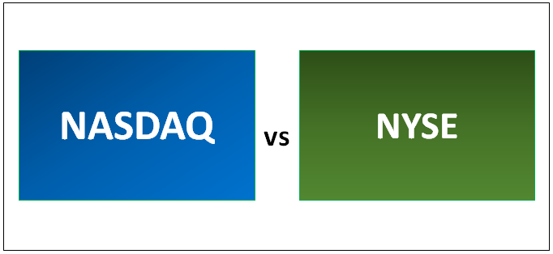

In today's fast-paced financial markets, algorithmic trading, commonly referred to as algo trading, represents a pivotal strategy for modern investors. Predominantly employed on major stock exchanges such as the New York Stock Exchange (NYSE) and Nasdaq, this approach leverages sophisticated computer algorithms to execute trades with unparalleled efficiency and speed. By automating the process based on pre-set criteria, algorithmic trading minimizes human intervention, which can lead to faster decision-making and reduced potential for emotional bias.

The adoption of algo trading is driven by the exponential growth of data and the increasing complexity of financial instruments. It allows traders to smoothly handle high volumes of trades and take advantage of rapid price fluctuations that are often beyond the capacity of manual trading. Through this method, trading strategies can be optimized not just for speed but also for precision in executing large orders over dispersed times to avoid significant market impact.



This article aims to provide a comprehensive overview of how investors can harness the power of algorithmic trading on major stock exchanges such as NYSE and Nasdaq. By exploring the mechanics of algorithmic trading, its inherent advantages, and practical application in these exchanges, investors can better understand how to align their trading strategies with technological advancements for competitive market participation. Additionally, the article discusses popular strategies, technical requirements, and exemplary case studies related to this trading method, allowing investors to gauge the full spectrum of potential benefits as well as inherent challenges.

## Table of Contents

## Understanding the NYSE and Nasdaq

The New York Stock Exchange (NYSE) and Nasdaq represent the cornerstone of the US financial markets, as well as major platforms for global trading. Collectively, they host thousands of listed companies from various sectors, contributing significantly to global stock trading volumes. These exchanges attract a wide array of investors and technological advancements, influencing both domestic and international economies.

**NYSE Overview:**
The NYSE was established in 1792 and has evolved into one of the world’s largest securities exchanges by market capitalization. It is based in New York City’s historic Wall Street and is often referred to as the Big Board. The NYSE is known for its traditional floor trading environment, where specialists facilitate buying and selling orders. Its listings encompass a diverse range of industries, including industrials, financials, consumer goods, healthcare, and energy. This broad spectrum allows investors to engage with well-established firms across various economic sectors, providing stability and reduced [volatility](/wiki/volatility-trading-strategies) compared to technology-dominated exchanges.

**Nasdaq Overview:**
Nasdaq, founded in 1971, revolutionized stock trading by being the first electronic stock market. It is heavily populated with technology and internet-based companies, often viewed as a barometer for technological innovation and growth. Nasdaq operates completely electronically, facilitating faster trade execution without traditional trading floors. This exchange is known for hosting a substantial number of tech giants, including companies like Apple, Microsoft, and Amazon, which are central to its reputation for growth potential. Nasdaq's electronic trading system promotes higher [liquidity](/wiki/liquidity-risk-premium) and transparency in pricing, making it an attractive choice for both new tech companies and investors seeking growth opportunities.

**Investment Options:**
Investors interested in NYSE and Nasdaq have multiple avenues for participation. They can directly purchase stocks of companies listed on these exchanges, benefiting from the specific dynamics of each listed company. Alternatively, investors may choose to invest in exchange-traded funds (ETFs) that track indices associated with these exchanges. For instance, the S&P 500 Index includes a multitude of NYSE-listed companies, while the Nasdaq-100 Index offers exposure to top companies traded on Nasdaq, particularly in the technology sector. These ETFs present a diversified investment option, reducing risk through broad market participation without the need to select individual stocks.

Both the NYSE and Nasdaq continue to serve as pivotal elements in the global financial infrastructure, accommodating a wide spectrum of traders, from individual retail investors to large institutional players, and leveraging cutting-edge technology to maintain their competitive edge in the rapidly evolving financial markets.

## What is Algorithmic Trading?

Algorithmic trading refers to the use of advanced mathematical and computational models to automate the execution of trades. This approach leverages pre-defined criteria to make trading decisions, encompassing factors such as timing, price, and quantity. Algorithms analyze these factors to determine optimal trading actions, thereby minimizing human intervention and emotional bias.

One of the hallmark features of [algorithmic trading](/wiki/algorithmic-trading) is its capacity to facilitate high-frequency trading ([HFT](/wiki/high-frequency-trading-strategies)). This form of trading exploits the ability of algorithms to process vast numbers of trades at a speed and efficiency unattainable by human traders. HFT typically involves executing trades on fleeting market opportunities that exist for mere milliseconds, demanding minimal latency and high processing power. 

For instance, an algorithm can be designed to execute a buy order if a certain stock's price drops by 2% within a given time frame or concurrently sell stocks in small increments once a predetermined profit threshold is reached. Such automation ensures the rapid execution of trades based on real-time data analysis.

In Python, a simple pseudo-code algorithm for a basic moving average crossover strategy might look like this:

```python
import pandas as pd

# Load stock data
data = pd.read_csv('stock_data.csv')

# Calculate moving averages
data['Short_MA'] = data['Close'].rolling(window=20).mean()
data['Long_MA'] = data['Close'].rolling(window=50).mean()

# Define trading signal
def generate_signals(df):
    buy_signals = []
    sell_signals = []
    for i in range(len(df)):
        if df['Short_MA'][i] > df['Long_MA'][i]:
            buy_signals.append(df['Close'][i])
            sell_signals.append(None)
        elif df['Short_MA'][i] < df['Long_MA'][i]:
            sell_signals.append(df['Close'][i])
            buy_signals.append(None)
        else:
            buy_signals.append(None)
            sell_signals.append(None)
    return buy_signals, sell_signals

# Generate buy and sell signals
data['Buy_Signal'], data['Sell_Signal'] = generate_signals(data)
```

In this example, the algorithm calculates two moving averages—a short-term and a long-term one—to identify potential buying or selling points based on crossover patterns. When the short-term moving average crosses above the long-term average, a buy signal is generated, and vice versa for a sell signal. Such strategies underscore the efficiency with which algorithmic trading can perform complex analysis and execute a series of trades without human intervention.

## Advantages and Disadvantages of Algo Trading

Algorithmic trading offers several significant advantages, making it a popular choice among investors who participate in the NYSE and Nasdaq. One of the primary benefits is the elimination of human errors. Human traders can be influenced by emotions, fatigue, and other cognitive biases that might lead to suboptimal decision-making. Algorithmic trading, by contrast, relies on pre-defined rules and calculations, reducing the risk of errors linked to human judgment.

Another compelling advantage is the instant execution of orders. In fast-paced financial markets, the ability to act quickly is crucial. Algorithms can analyze multiple market conditions and execute trades in milliseconds, something human traders cannot match. This speed ensures that trading opportunities are seized as soon as they arise, often at optimal prices.

The ability to backtest trading strategies is another notable advantage. Backtesting involves running a trading strategy on historical market data to evaluate its effectiveness. This enables traders to refine and improve their strategies before deploying them in live markets. Python, for instance, is widely used for [backtesting](/wiki/backtesting) financial models due to its extensive data analysis libraries:

```python
import pandas as pd

# Load historical market data
data = pd.read_csv('market_data.csv')

# Define a simple moving average strategy
short_window = 20
long_window = 50

# Calculate moving averages
data['Short_MA'] = data['Close'].rolling(window=short_window, min_periods=1).mean()
data['Long_MA'] = data['Close'].rolling(window=long_window, min_periods=1).mean()

# Signal: Buy when Short_MA crosses Long_MA upward
data['Signal'] = 0
data['Signal'][short_window:] = np.where(data['Short_MA'][short_window:] > data['Long_MA'][short_window:], 1, 0)

# Backtest strategy by calculating returns
data['Strategy_Return'] = data['Signal'].shift(1) * data['Daily_Return']
cumulative_returns = (1 + data['Strategy_Return']).cumprod() - 1
```

However, algorithmic trading is not without its challenges. One significant hurdle is the requirement for substantial technology infrastructure. High-performance computers, reliable data feeds, and advanced network capabilities are essential to handle the data-intensive nature of algo trading. These systems must be maintained and regularly updated, which can be costly.

Market impact risks also pose challenges. Large trades executed via algorithms might move markets, affecting prices adversely. This is particularly true for high-frequency trading (HFT), where the sheer [volume](/wiki/volume-trading-strategy) of trades can influence market trends.

Furthermore, algorithmic trading is subject to regulatory scrutiny. Regulatory bodies aim to ensure market stability and protect against manipulative practices. This regulatory environment means that traders must carefully design algorithms to comply with legal standards, leading to additional complexity in algo trading development.

In summary, while algorithmic trading on exchanges like the NYSE and Nasdaq offers numerous benefits, including precision and efficiency, it also comes with significant challenges that must be addressed to ensure successful strategy implementation.

## Popular Algo Trading Strategies for NYSE and Nasdaq

Algorithmic trading strategies have gained popularity due to their ability to efficiently handle large volumes of trades with precise execution. Within the context of major exchanges like the NYSE and Nasdaq, several strategies stand out: Trend-following, Arbitrage Opportunities, and Index Fund Rebalancing.

**Trend-Following Strategies**: These strategies rely on market trends and employ statistical tools to predict price movements. The key idea is to identify and follow existing market trends instead of predicting market reversals. Indicators commonly used in trend-following include moving averages, momentum indicators, and the Average Directional Index (ADX). For instance, a simple trend-following approach might involve using a moving average crossover strategy, where buy signals are generated when a short-term moving average crosses above a long-term moving average.

Python example for a moving average crossover strategy:

```python
import pandas as pd

def moving_average_crossover(data, short_window=40, long_window=100):
    data['Short_MA'] = data['Close'].rolling(window=short_window, min_periods=1).mean()
    data['Long_MA'] = data['Close'].rolling(window=long_window, min_periods=1).mean()

    data['Signal'] = 0
    data['Signal'][short_window:] = np.where(data['Short_MA'][short_window:] 
                                             > data['Long_MA'][short_window:], 1, 0)
    data['Position'] = data['Signal'].diff()

    return data

# Assuming df is a DataFrame with historical stock prices
strategy_results = moving_average_crossover(df)
```

**Arbitrage Opportunities**: Arbitrage takes advantage of price inefficiencies between different markets or financial instruments. A common form is statistical arbitrage, where a trader uses statistical models to identify mean-reverting price behaviors among correlated securities. For example, if Stock A and Stock B are historically correlated but suddenly diverge, a trader might short the outperforming stock while going long on the underperforming one, anticipating a return to the mean.

**Index Fund Rebalancing**: This strategy leverages the anticipated buying or selling activities that accompany the rebalancing of index funds. Rebalancing occurs when funds adjust their holdings to match the composition of a benchmark index. Traders can profit by predicting which stocks will be added or removed from an index. The knowledge of the rebalance schedule can allow traders to position themselves ahead of this activity, potentially capturing alpha from predictable price movements.

Each of these strategies requires a deep understanding of market mechanics, robust data analytics, and precise execution capabilities. Effectively implementing such strategies on the NYSE and Nasdaq demands combining quantitative analysis with cutting-edge technological resources.

## Technical Requirements for Effective Algo Trading

To implement algorithmic trading strategies effectively, investors must meet several key technical requirements. A thorough understanding of programming skills is fundamental, as it allows traders to create, test, and execute trading algorithms efficiently. Python, known for its simplicity and extensive libraries, is often the preferred language for developing trading algorithms. These libraries include `pandas` for data manipulation, `NumPy` for numerical computing, and `scikit-learn` for implementing [machine learning](/wiki/machine-learning) models, which can enhance algorithmic strategies by recognizing complex patterns in market data.

Access to real-time data feeds is crucial for algorithmic trading, as it ensures the algorithms have the latest market information to base trading decisions on. Exchanges like NYSE and Nasdaq provide this data, but subscribing to high-quality data vendors who offer comprehensive feeds can enhance accuracy. An example of establishing a real-time data feed in Python is using the `WebSocket` API, which enables continuous streaming of market data:

```python
import websocket
import json

def on_message(ws, message):
    data = json.loads(message)
    print(f"Received market data: {data}")

ws = websocket.WebSocketApp("wss://real-time-data-feed-url",
                            on_message=on_message)
ws.run_forever()
```

Robust backtesting capabilities are necessary to evaluate strategy performance on historical data before live trading. Backtesting tools need to replicate real-world scenarios accurately, accounting for factors like transaction costs and slippage. Libraries such as `Backtrader` in Python can be used for developing and testing trading strategies against historical data sets:

```python
import backtrader as bt

class TestStrategy(bt.Strategy):
    def next(self):
        if self.data.close > self.data.close[-1]:
            self.buy(size=1)

cerebro = bt.Cerebro()
cerebro.addstrategy(TestStrategy)
cerebro.run()
```

In addition to programming and data requirements, deploying trading software that ensures minimal latency is essential for algorithmic trading. Latency, the delay between data receipt and action execution, can significantly impact profitability, especially in high-frequency trading strategies. To minimize latency, traders can colocate their servers near exchange datacenters.

Maintaining a reliable network for placing trade orders is equally critical. A robust network should be resilient and secure to handle high data volumes and protect against cyber threats. Good practices include regular system updates, implementing firewall protections, and using encrypted connections for data transmission.

Collectively, these technical requirements ensure that algorithmic trading strategies are not only executed efficiently but also have the capability to adapt to ever-changing market conditions, thereby optimizing trade execution and performance.

## Case Study: Invesco QQQ and SPDR Dow Jones ETFs

Invesco QQQ and the SPDR Dow Jones Industrial Average [ETF](/wiki/etf-trading-strategies) (DIA) are two prominent exchange-traded funds (ETFs) that cater to different segments of the stock market, each offering unique opportunities for algorithmic trading.

**Invesco QQQ**: This ETF is designed to track the Nasdaq-100 Index, which comprises 100 of the largest non-financial companies listed on the Nasdaq Stock Market. As a result, Invesco QQQ gives investors exposure to some of the most influential and high-growth technology firms globally, such as Apple, Microsoft, and Amazon. These companies are known for their rapid innovation and significant market capitalization, which draws considerable interest from investors looking to capitalize on tech-driven growth. Given the high volatility and liquidity typical of tech stocks, Invesco QQQ is an attractive option for high-frequency trading (HFT) algorithms that can profit from rapid price movements.

**SPDR Dow Jones Industrial Average ETF (DIA)**: This ETF aims to mirror the performance of the Dow Jones Industrial Average (DJIA), an index that includes 30 large, publicly-owned companies based in the United States. Unlike the Nasdaq-100, the DJIA covers a broader range of economic sectors, including industrials, healthcare, financials, and consumer goods. This diversification provides a more comprehensive exposure to the US economy's overall health. Algorithmic strategies for DIA might focus on exploiting the relatively stable price movements typical of blue-chip stocks, utilizing trend-following methods and mean-reversion strategies to capture gains.

When applying algorithmic trading strategies to these ETFs, it's crucial to consider their underlying index compositions and market behaviors. For instance, a Python-based algorithm aiming to trade QQQ and DIA could leverage historical price data and technical indicators to optimize entry and [exit](/wiki/exit-strategy) points. Such a strategy might involve tools like moving averages for trend identification or the relative strength index (RSI) for spotting overbought or oversold conditions.

```python
import pandas as pd
import talib

# Historical price data for QQQ and DIA
qqq_prices = pd.read_csv('qqq_data.csv')  # Assuming CSV file with historical prices
dia_prices = pd.read_csv('dia_data.csv')

# Calculate moving averages and RSI
qqq_prices['MA50'] = talib.SMA(qqq_prices['Close'], timeperiod=50)
qqq_prices['RSI'] = talib.RSI(qqq_prices['Close'], timeperiod=14)

dia_prices['MA50'] = talib.SMA(dia_prices['Close'], timeperiod=50)
dia_prices['RSI'] = talib.RSI(dia_prices['Close'], timeperiod=14)

# Define a simple strategy: Buy when RSI is below 30 (oversold), sell when RSI is above 70 (overbought)
qqq_signals = (qqq_prices['RSI'] < 30).astype(int) - (qqq_prices['RSI'] > 70).astype(int)
dia_signals = (dia_prices['RSI'] < 30).astype(int) - (dia_prices['RSI'] > 70).astype(int)

```

In summary, both Invesco QQQ and SPDR Dow Jones ETFs provide algorithmic traders with different strategic angles depending on their focus, whether it is tech-driven [momentum](/wiki/momentum) or diversified sector stability. Understanding these dynamics allows traders to tailor their algorithmic models to maximize efficiency and profitability.

## Conclusion

Algorithmic trading on the NYSE and Nasdaq has revolutionized investment strategies by offering unprecedented efficiency and precision. By leveraging advanced computer algorithms, investors can execute trades at speeds unattainable by human intervention, reducing latency and minimizing errors. This method capitalizes on high-frequency trading (HFT) to swiftly process multiple orders, which can significantly enhance profitability.

Nevertheless, the landscape of algorithmic trading is complex. While the benefits are substantial, the associated risks should not be underestimated. An essential aspect of successful algo trading is the deployment of robust risk management systems and the establishment of comprehensive controls. Investors must remain vigilant to regulatory changes and ensure their technological infrastructure can support the demands of real-time data processing and low-latency execution.

Investment in algo trading also requires significant technical prowess. Competency in programming, along with access to cutting-edge trading software and real-time market data feeds, is fundamental. Without these capabilities, traders face increased exposure to risks, such as market impact and technical failures.

In conclusion, while algorithmic trading on major exchanges like the NYSE and Nasdaq provides new avenues for optimizing trading outcomes, it is imperative for investors to recognize the intrinsic risks involved. Meticulous preparation, consistent monitoring, and the integration of sophisticated technology are vital components in harnessing the full potential of algo trading effectively and securely.

## References & Further Reading

[1]: ["Algorithms for Hyper-Parameter Optimization"](https://dl.acm.org/doi/10.5555/2986459.2986743) by Bergstra, J., Bardenet, R., Bengio, Y., & Kégl, B., Advances in Neural Information Processing Systems 24 (2011).

[2]: ["Advances in Financial Machine Learning"](https://www.amazon.com/Advances-Financial-Machine-Learning-Marcos/dp/1119482089) by Marcos Lopez de Prado.

[3]: ["Evidence-Based Technical Analysis: Applying the Scientific Method and Statistical Inference to Trading Signals"](https://www.amazon.com/Evidence-Based-Technical-Analysis-Scientific-Statistical/dp/0470008741) by David Aronson.

[4]: ["Machine Learning for Algorithmic Trading"](https://github.com/stefan-jansen/machine-learning-for-trading) by Stefan Jansen.

[5]: ["Quantitative Trading: How to Build Your Own Algorithmic Trading Business"](https://www.amazon.com/Quantitative-Trading-Build-Algorithmic-Business/dp/1119800064) by Ernest P. Chan.