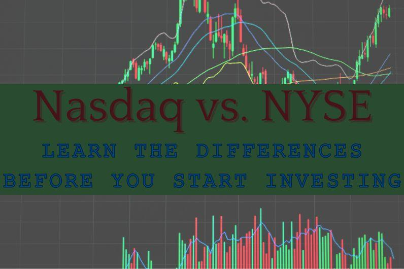

## Table of Contents

## What are the Nasdaq and NYSE, and how do they differ?

The Nasdaq and NYSE are both stock exchanges where people can buy and sell shares of companies. The Nasdaq, which stands for National Association of Securities Dealers Automated Quotations, is known for being the first electronic stock market. It started in 1971 and is home to many technology and internet companies like Apple and Amazon. The NYSE, or New York Stock Exchange, is much older, having been founded in 1792. It is famous for its physical trading floor in New York City where traders used to shout and use hand signals to trade stocks.

The main difference between the Nasdaq and NYSE is how they operate. The Nasdaq is fully electronic, meaning all trading happens through computers without a physical trading floor. This makes it faster and more efficient for trading. On the other hand, the NYSE uses a mix of electronic trading and a physical trading floor, though it has become more electronic over time. Another difference is the types of companies listed on each exchange. The Nasdaq tends to have more tech and growth companies, while the NYSE has a broader range of industries, including many big, established companies.

## How can a beginner start investing in stocks listed on Nasdaq and NYSE?

To start investing in stocks listed on the Nasdaq and NYSE, a beginner should first open a brokerage account. This can be done online with many different companies that offer brokerage services. Some popular choices include Robinhood, E*TRADE, and Charles Schwab. Once you have an account set up, you'll need to deposit money into it. This money will be used to buy stocks. It's important to choose a brokerage that fits your needs, like one with low fees or a user-friendly app if you're new to investing.

After setting up your account and adding money, you can start buying stocks. You can search for companies listed on the Nasdaq or NYSE within your brokerage's platform. For example, if you want to buy shares of Apple (which is on the Nasdaq), you would search for "Apple" or its stock symbol "AAPL," decide how many shares you want to buy, and then place your order. It's a good idea to start with companies you know and understand. Also, consider starting small and learning as you go. There are many resources online, like articles and videos, that can help you learn more about investing and make better decisions.

## What are the key factors to consider when choosing stocks on these exchanges?

When choosing stocks on the Nasdaq or NYSE, it's important to look at the company's financial health. This means checking things like their earnings, how much debt they have, and if they are making more money over time. You should also think about the company's business model and if it makes sense to you. For example, if a company sells a product you like and use, you might understand their business better. Another thing to consider is the price of the stock compared to how much money the company makes. This is called the price-to-earnings ratio, and it can help you see if the stock is a good deal or if it's too expensive.

It's also a good idea to think about the industry the company is in. Some industries, like technology, can grow a lot but can also be risky. Other industries, like utilities, might not grow as fast but can be more stable. You should also pay attention to what's happening in the world and how it might affect the company. For example, if there's a new law that helps or hurts the company's business, that could change how well the stock does. Finally, think about how long you plan to keep the stock. If you're looking to hold onto it for a long time, you might be okay with more ups and downs. But if you need the money soon, you might want to pick stocks that are less likely to go up and down a lot.

## How do trading fees and commissions impact investing in Nasdaq and NYSE?

Trading fees and commissions are costs you pay when you buy or sell stocks on the Nasdaq and NYSE. These fees can come from your brokerage and can make a big difference in how much money you make or lose from investing. If you trade a lot, these fees can add up quickly. For example, if you pay $5 every time you buy or sell a stock, and you do this 10 times in a month, that's $50 in fees just for that month. Over time, these costs can eat into your profits, especially if you are investing small amounts of money.

It's important to think about these fees when you choose a brokerage and decide how often you want to trade. Some brokerages offer low or no fees for trading, which can be good for people who are just starting out or who want to trade often. Others might have higher fees but offer other services like research tools or advice that could help you make better investment choices. By understanding and comparing these fees, you can pick the best option for your investing style and keep more of your money working for you in the stock market.

## What are the risks associated with investing in stocks on these exchanges?

Investing in stocks on the Nasdaq and NYSE can be risky because the value of stocks can go up and down a lot. This is called market risk. Sometimes, the whole market goes down because of things like a bad economy or big world events. This means even if you picked good companies, their stock prices could still drop. Also, there's company risk. This is when the stock of a specific company goes down because of problems with the company itself, like bad earnings or a scandal. If you put all your money into one stock and that company does poorly, you could lose a lot.

Another risk is [liquidity](/wiki/liquidity-risk-premium) risk. This happens when you want to sell your stocks but can't find anyone to buy them at the price you want. This can be a problem with smaller companies on the Nasdaq, where there might not be as many people trading. On the other hand, the NYSE usually has more trading happening, which can make it easier to sell your stocks. Lastly, there's the risk of fees and commissions eating into your profits. If you trade a lot, these costs can add up and make it harder to make money from your investments. It's important to understand these risks and think about how much risk you're comfortable with before you start investing.

## How can one use market analysis tools to make informed decisions on Nasdaq and NYSE?

Market analysis tools can help you make better choices when investing in stocks on the Nasdaq and NYSE. These tools give you important information like stock prices, how much a stock's price has changed over time, and what people think about the company's future. For example, you can use charts to see if a stock's price is going up or down. This can help you decide if it's a good time to buy or sell. You can also look at financial reports to see how well a company is doing. If a company is making more money and growing, its stock might be a good investment.

Another way market analysis tools help is by letting you compare different stocks. You can see how one company is doing compared to others in the same industry. This can show you which companies are doing better and might be good to invest in. Tools like stock screeners let you find stocks that meet certain criteria, like a low price or high growth. By using these tools, you can make more informed decisions and pick stocks that are more likely to do well.

## What are the tax implications of investing in stocks on Nasdaq and NYSE?

When you invest in stocks on the Nasdaq and NYSE, you need to think about taxes. If you make money from your stocks, you have to pay taxes on those gains. There are two types of gains: short-term and long-term. Short-term gains are when you sell a stock you've owned for less than a year. These are taxed at your regular income tax rate, which can be high. Long-term gains are when you sell a stock you've owned for more than a year. These are taxed at a lower rate, which can be 0%, 15%, or 20%, depending on your income.

Another thing to consider is dividends. Some companies pay dividends, which are like little payments to shareholders. These dividends are also taxed. If you hold the stock for more than 60 days during the 121-day period that begins 60 days before the ex-dividend date, the dividends are taxed at the long-term capital gains rate. Otherwise, they are taxed as ordinary income. It's important to keep track of your investments and know the tax rules so you can plan better and maybe pay less in taxes.

## How do economic indicators affect stock performance on these exchanges?

Economic indicators are like signs that tell us how the economy is doing. They can affect how stocks do on the Nasdaq and NYSE. For example, if the unemployment rate goes down, it means more people have jobs and are making money. This can make people feel good about the economy and want to buy more stocks, which can push stock prices up. On the other hand, if inflation goes up a lot, it means things are getting more expensive. This can make people worried about the future and they might sell their stocks, which can make stock prices go down.

Another important economic indicator is the Gross Domestic Product (GDP). GDP tells us how much all the goods and services in a country are worth. If GDP is growing, it usually means the economy is doing well, and this can make stock prices go up because companies are making more money. But if GDP is shrinking, it can mean the economy is in trouble, and this can make stock prices go down because people are worried about companies making less money. So, keeping an eye on these economic indicators can help you understand why stock prices are moving the way they are on the Nasdaq and NYSE.

## What advanced strategies can be used for investing in Nasdaq and NYSE?

One advanced strategy for investing in stocks on the Nasdaq and NYSE is called dollar-cost averaging. This means you put the same amount of money into stocks at regular times, no matter if the stock price is high or low. By doing this, you can buy more shares when prices are low and fewer when prices are high. Over time, this can help you pay less on average for your stocks. Another strategy is called diversification. This means you spread your money across different types of stocks and industries. If one stock or industry does badly, the others might do well and balance it out. This can help you lower the risk of losing a lot of money.

Another strategy is using technical analysis. This involves looking at charts and patterns to try to guess where stock prices might go next. People who use this strategy might buy stocks when they think the price is about to go up and sell when they think it's about to go down. It can be tricky and takes a lot of practice, but some people find it helpful. Lastly, there's options trading. This is when you buy contracts that give you the right to buy or sell stocks at a certain price by a certain date. It can be a way to make money if you think a stock's price will move a lot, but it's also very risky and not for beginners.

## How can investors leverage ETFs and mutual funds focused on Nasdaq and NYSE stocks?

Investors can use ETFs and mutual funds to invest in a lot of stocks at once, instead of buying each stock one by one. ETFs, or exchange-traded funds, are like baskets of stocks that you can buy and sell on the Nasdaq and NYSE just like you would buy a single stock. There are ETFs that focus on stocks from the Nasdaq, like the tech-heavy Nasdaq-100, or from the NYSE, like the S&P 500. By investing in these ETFs, you can get a piece of many companies without having to pick each one yourself. This can help spread out your risk because if one company does badly, the others might do well and balance it out.

Mutual funds work in a similar way, but they are managed by professionals who pick the stocks for you. There are mutual funds that focus on stocks from the Nasdaq and NYSE, too. These funds can be a good choice if you want someone else to make the investment decisions for you. Like ETFs, mutual funds let you invest in a lot of different companies at once, which can help lower your risk. But, you might have to pay a fee for the fund manager's work, and you can't buy or sell mutual funds as easily as ETFs during the trading day. Both ETFs and mutual funds can be great tools for investors looking to get into the Nasdaq and NYSE without having to pick individual stocks.

## What role do market makers and liquidity providers play in Nasdaq and NYSE?

Market makers and liquidity providers are important for the Nasdaq and NYSE because they help make sure there are always people ready to buy and sell stocks. On the Nasdaq, market makers are companies that keep a list of stocks they are willing to buy and sell. They make money from the difference between the price they buy a stock for and the price they sell it for. This helps keep the market running smoothly because there's always someone ready to trade, even if not many people are buying or selling that stock at the moment.

On the NYSE, designated market makers (DMMs) play a similar role but they also have a physical spot on the trading floor. They help keep the market stable by making sure there's always a price for stocks, even during busy times. Liquidity providers on both exchanges help by adding more people who are willing to trade, which makes it easier for everyone to buy and sell stocks quickly. This is important because it helps keep the market fair and efficient for all investors.

## How can one assess the long-term growth potential of companies listed on Nasdaq and NYSE?

To assess the long-term growth potential of companies listed on the Nasdaq and NYSE, it's important to look at their financial health and future plans. You can start by checking the company's earnings reports to see if they are making more money over time. A company that consistently grows its earnings is likely to have strong long-term potential. You should also look at the company's debt levels. If a company has too much debt, it might struggle to grow because it has to spend a lot of money paying it back. Another key [factor](/wiki/factor-investing) is the company's business model. If the company is in an industry that's growing, like technology or healthcare, it might have better chances for long-term growth. Also, consider the company's plans for the future. If they are investing in new products or expanding into new markets, that could mean they are set up for growth.

Another way to assess a company's long-term growth potential is by looking at industry trends and economic conditions. If the industry the company is in is expected to grow in the future, that's a good sign. For example, if renewable energy is becoming more popular, companies in that field might have strong growth potential. Economic indicators, like GDP growth and unemployment rates, can also affect a company's future. A strong economy usually means more people buying things, which can help companies grow. Finally, it's helpful to read what experts think about the company. Analysts often make predictions about a company's future earnings and growth, which can give you a good idea of its long-term potential. By combining all these factors, you can get a clearer picture of whether a company listed on the Nasdaq or NYSE is likely to grow over the long term.

## References & Further Reading

[1]: ["Algorithms for Hyper-Parameter Optimization"](https://dl.acm.org/doi/10.5555/2986459.2986743) by Bergstra, J., Bardenet, R., Bengio, Y., & Kégl, B., Advances in Neural Information Processing Systems 24 (2011).

[2]: ["Advances in Financial Machine Learning"](https://www.amazon.com/Advances-Financial-Machine-Learning-Marcos/dp/1119482089) by Marcos Lopez de Prado.

[3]: ["Evidence-Based Technical Analysis: Applying the Scientific Method and Statistical Inference to Trading Signals"](https://www.amazon.com/Evidence-Based-Technical-Analysis-Scientific-Statistical/dp/0470008741) by David Aronson.

[4]: ["Machine Learning for Algorithmic Trading"](https://github.com/stefan-jansen/machine-learning-for-trading) by Stefan Jansen.

[5]: ["Quantitative Trading: How to Build Your Own Algorithmic Trading Business"](https://www.amazon.com/Quantitative-Trading-Build-Algorithmic-Business/dp/1119800064) by Ernest P. Chan.