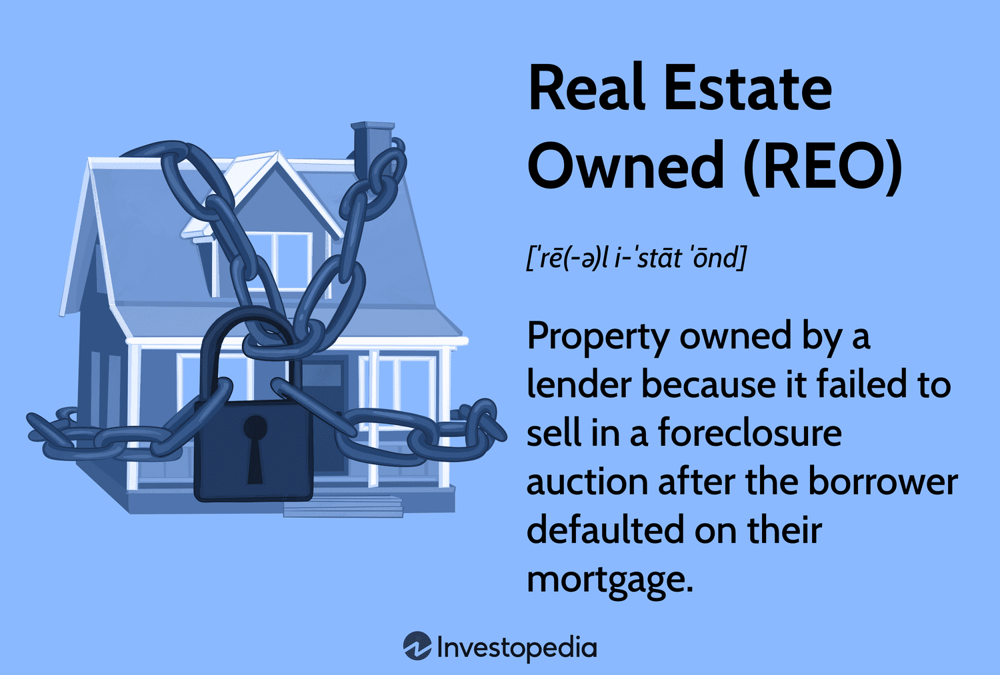

## Table of Contents

## What are REO properties?

REO properties, or Real Estate Owned properties, are homes that banks or lenders take back after the homeowner fails to pay their mortgage. When someone can't make their mortgage payments, the bank might start a process called foreclosure. If the home doesn't sell at a foreclosure auction, the bank ends up owning the property. At this point, the home becomes an REO property.

Banks usually want to sell REO properties quickly to get rid of them. They often sell these homes at lower prices than other homes in the area. This can be a good chance for people looking to buy a home at a lower cost. However, buying an REO property can also have some challenges. These homes might need repairs or have other issues that buyers need to be aware of before buying.

## How do properties become REO?

When someone can't pay their mortgage, the bank might start a process called foreclosure. This means the bank wants to take back the house because the owner isn't paying. The bank will usually try to sell the house at a foreclosure auction. At this auction, people can bid on the house, and if someone buys it, the house doesn't become an REO property.

If no one buys the house at the auction, the bank ends up owning it. This is when the house becomes an REO, or Real Estate Owned, property. The bank now has to take care of the house and try to sell it on their own. They usually want to sell it quickly, so they might offer it at a lower price than other houses in the area.

## What are the benefits of investing in REO properties?

Investing in REO properties can be a good idea because they often cost less than other homes. Banks want to sell these houses quickly, so they might sell them for less money. This means you could buy a house for a lower price than usual. If you fix up the house and sell it later, you might make a good profit because you bought it at a low price.

Another benefit is that you might have less competition when buying an REO property. Not as many people know about these houses or want to deal with the extra work they might need. This can make it easier for you to buy one. Also, because banks want to get rid of these houses, they might be more willing to negotiate on the price or help with some of the costs, like fixing the house up.

## What are the risks associated with REO properties?

One risk of buying an REO property is that it might need a lot of repairs. Banks usually take back these houses after the owners couldn't pay their mortgage, so the houses might be in bad shape. You might have to spend a lot of money to fix them up before you can live in them or sell them. This can make your investment more expensive than you planned.

Another risk is that it can take a long time to buy an REO property. Banks have a lot of rules and paperwork, and it can be slow to get everything done. This means you might have to wait longer to move into your new home or start fixing it up. If you need a place to live right away, this could be a problem.

Also, there might be other costs you didn't expect. Sometimes, there are unpaid taxes or other fees on the property that you have to pay. These extra costs can add up and make your investment less profitable. It's important to do a lot of research and maybe talk to a real estate expert before you decide to buy an REO property.

## How can I find REO properties for sale?

One way to find REO properties is to look on real estate websites. Many of these websites have a section just for REO properties. You can search for houses in the area you want to buy in, and these sites will show you which ones are owned by banks. Some popular websites that list REO properties include Zillow, RealtyTrac, and HomePath, which is run by Fannie Mae.

Another way to find REO properties is to work with a real estate agent who specializes in these types of homes. These [agents](/wiki/agents) know a lot about REO properties and can help you find the right one. They can also help you with the buying process, which can be more complicated than buying a regular house. You can find a real estate agent by asking friends or family for recommendations, or by searching online for agents in your area who focus on REO properties.

Lastly, you can also find REO properties by contacting banks directly. Many banks have a list of their REO properties on their websites. You can call the bank's REO department or visit their website to see what they have available. This can be a good way to find properties that might not be listed on other websites.

## What is the typical process for buying an REO property?

When you want to buy an REO property, the first step is to find one you like. You can look on real estate websites or work with a real estate agent who knows about REO properties. Once you find a house you want to buy, you'll need to make an offer. This is different from buying a regular house because you're making an offer to the bank, not a person. The bank might take a while to respond, so be patient.

After the bank accepts your offer, you'll need to do a home inspection. This is important because REO properties often need repairs. The inspection can help you know what needs to be fixed and how much it might cost. If everything looks good, you'll move on to the closing process. This can take longer than usual because banks have a lot of paperwork. Once everything is done, you'll get the keys to your new home.

Sometimes, there can be extra steps or problems. For example, there might be unpaid taxes or other fees on the property that you have to pay. It's a good idea to work with a real estate agent who knows about REO properties. They can help you through the whole process and make sure you don't miss anything important.

## How does financing an REO property differ from traditional real estate purchases?

Financing an REO property can be a bit different from buying a regular house. When you buy an REO property, you're buying it from a bank, not a person. Banks might have special rules or programs for financing these homes. For example, some banks offer special loans for REO properties that might have lower interest rates or different terms than regular home loans. It's a good idea to ask the bank about any special financing options they might have.

Another difference is that REO properties often need repairs. This can affect how much money you can borrow. Lenders might not give you as much money for an REO property if it needs a lot of work. They might want to see a home inspection report to know what repairs are needed. Sometimes, you might need to use a special type of loan, like an FHA 203(k) loan, which lets you borrow money to buy the house and fix it up at the same time. Talking to a lender who knows about REO properties can help you understand your financing options better.

## What should I look for when inspecting an REO property?

When you inspect an REO property, you should first check the outside of the house. Look at the roof to see if it needs repairs. Check the walls and the foundation for any cracks or damage. Make sure the yard is in good shape and that there are no big problems with the driveway or sidewalks. It's also important to check the plumbing and electrical systems outside, like the water meter and the electrical box, to make sure they are working right.

Next, go inside the house and look at every room. Check the walls, floors, and ceilings for any damage or signs of water leaks. Make sure all the windows and doors work properly. Turn on all the lights and test the outlets to see if the electricity is working. Check the plumbing by turning on the faucets and flushing the toilets. Look at the kitchen and bathrooms to see if they need any repairs or updates. It's also a good idea to check the heating and cooling systems to make sure they are working well. By looking at all these things, you can get a good idea of what repairs the house might need and how much they might cost.

## How can I estimate the potential return on investment for an REO property?

To estimate the potential return on investment for an REO property, you first need to figure out how much money you will spend. This includes the price of the house, any repairs it needs, and other costs like taxes and fees. Once you know your total costs, you can compare that to how much you think you can sell the house for after you fix it up. The difference between what you sell it for and what you spent is your profit. You can also look at similar houses in the area to get an idea of what price you might be able to sell it for.

Another way to estimate your return on investment is to think about renting out the property instead of selling it. You can figure out how much rent you could charge by looking at what other houses in the area are renting for. Then, you subtract your costs like the mortgage, taxes, insurance, and any repairs from the rent you collect. The money left over is your profit from renting. Both selling and renting can give you a good idea of your potential return, but remember that the real estate market can change, so your estimates might not be exact.

## What are some advanced strategies for investing in REO properties?

One advanced strategy for investing in REO properties is to buy them in bulk. Some investors work directly with banks to buy multiple REO properties at once. This can be a good way to get a discount because banks want to sell these houses quickly. When you buy in bulk, you can fix up the houses and sell them or rent them out. This can help you make more money because you're working on several properties at the same time. It's important to have a good team of people to help you, like contractors and real estate agents, to make sure everything goes smoothly.

Another strategy is to focus on REO properties in up-and-coming neighborhoods. These are areas where the value of houses is expected to go up in the future. By buying REO properties in these neighborhoods, you can fix them up and sell them for a higher price later. You can also rent them out and benefit from the increasing rent prices. To find these neighborhoods, you can look at things like new businesses moving in, new schools being built, or new public transportation projects. Investing in these areas can be riskier, but it can also lead to bigger rewards if the neighborhood grows like you expect.

## How do REO properties fit into a broader real estate investment portfolio?

REO properties can be a good addition to a real estate investment portfolio because they often cost less than other houses. Banks want to sell these houses quickly, so they might offer them at lower prices. This means you can buy them for less money and then fix them up. If you sell the house later, you might make a good profit because you bought it at a low price. Adding REO properties to your portfolio can help you spread out your investments and lower your risk. If one type of investment doesn't do well, the REO properties might still make money.

Another way REO properties can fit into your portfolio is by renting them out. If you buy an REO property and fix it up, you can rent it to people who need a place to live. The rent money can help you pay for the house and make some extra money. This can be a good way to have a steady income from your investments. By having both REO properties you plan to sell and ones you plan to rent, you can have different ways to make money from your real estate investments. This can help you build a strong and balanced portfolio.

## What are the current market trends affecting REO property investments?

Right now, the real estate market is changing, and this affects REO property investments. One big trend is that interest rates are going up. When interest rates are higher, it can be harder for people to get loans to buy houses. This means fewer people might be able to buy REO properties, which could make it take longer to sell them. But it also means that if you can buy an REO property, you might be able to get a good deal because there's less competition.

Another trend is that the demand for houses is still strong in many places. Even with higher interest rates, people still want to buy homes. This can be good for REO property investors because it means there are still buyers out there. If you fix up an REO property and it's in a good area, you might be able to sell it for a good price. But you have to be careful because the market can change, and what's true in one place might not be true in another.

## References & Further Reading

[1]: Colquhoun, D. (2017). ["REO and Foreclosure Investing For Dummies"](https://www.researchgate.net/publication/323607970_Correction_to_'The_reproducibility_of_research_and_the_misinterpretation_of_p_-values'). 

[2]: Hebner, J. (2020). ["Real Estate Investing: Market Analysis, Valuation Techniques, and Risk Management Strategies"](https://link.springer.com/book/10.1007/978-3-319-06397-3).

[3]: Fabozzi, F. J., Shiller, R. J., & Tunaru, R. S. (2010). ["Real Estate: Markets and Investments"](http://aida.econ.yale.edu/~shiller/pubs/property-derivatives2010.pdf). Wiley.

[4]: Ge, W., Ruggiero, J., & Zhao, Z. (2016). ["Data Driven Real Estate Investing: Predictive Modeling through Machine Learning Algorithms"](https://www.tandfonline.com/doi/full/10.1080/15592324.2024.2447460). Journal of Real Estate Research.

[5]: Lopez de Prado, M. (2018). ["Advances in Financial Machine Learning"](https://www.amazon.com/Advances-Financial-Machine-Learning-Marcos/dp/1119482089). Wiley.