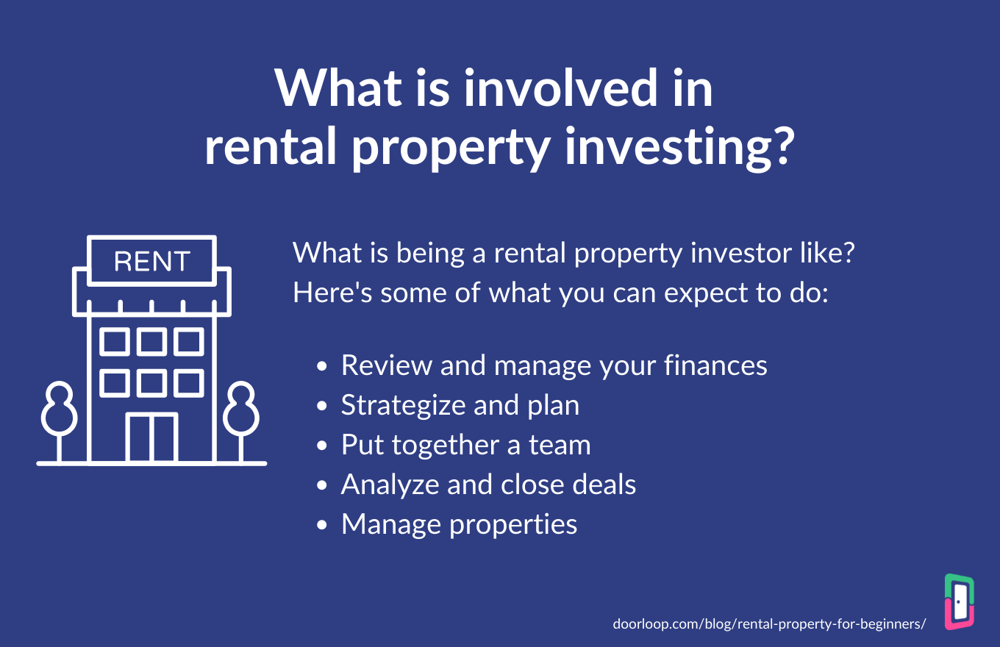

## Table of Contents

## What are the basic steps to start investing in rental properties?

Starting to invest in rental properties involves a few key steps that you need to follow carefully. First, you need to do your research. This means learning about the real estate market in the area where you want to buy a property. You should look at things like how much properties cost, how much rent you can charge, and what kind of people live in the area. It's also a good idea to talk to other investors or real estate agents to get their advice. Once you feel like you understand the market, you can start looking for a property to buy.

After finding a property you like, the next step is to make sure you can afford it. You'll need to get a loan from a bank or another lender, so you should check your credit score and see how much money you can borrow. It's important to have a good down payment saved up, usually around 20% of the property's price. Once you have the loan, you can buy the property and start renting it out. Make sure you set the right rent price so you can cover your mortgage and other costs, and still make a profit.

Lastly, being a landlord comes with responsibilities. You'll need to take care of the property, make repairs when needed, and deal with tenants. It's a good idea to have some money saved up for unexpected costs. You might also want to hire a property management company to help you if you don't have the time to do everything yourself. With the right preparation and ongoing management, investing in rental properties can be a good way to make money over time.

## How do I evaluate the potential of a rental property?

To evaluate the potential of a rental property, you need to look at a few important things. First, check how much rent you can charge for the property. Look at similar properties in the area to see what they are renting for. This will help you figure out if the rent will be enough to cover your mortgage and other costs, and still leave you with some profit. You should also think about how easy it will be to find good tenants. A good location with nearby jobs, schools, and shops can make it easier to keep your property rented out.

Next, consider the costs of owning the property. This includes the mortgage, property taxes, insurance, and any repairs or maintenance you might need to do. It's a good idea to set aside some money for unexpected costs, too. You can use something called the "cash flow" to see if the property will make you money. Cash flow is the money left over after all your costs are paid. If the cash flow is positive, that means you're making money. If it's negative, you might need to rethink your investment.

Lastly, think about the future value of the property. Real estate markets can change, so you want to buy in an area that is likely to grow in value over time. Look at things like new developments, job growth, and how the neighborhood is changing. If the property is in an area that is getting better, it could be worth more in the future, which is good for your investment. By carefully looking at these factors, you can make a smart decision about whether a rental property has good potential.

## What are the key financial metrics to consider when investing in rental properties?

When you're thinking about investing in rental properties, it's important to look at a few key financial metrics. The first one is the Gross Rent Multiplier (GRM). This is a simple way to see how much you're paying for the property compared to how much rent you can get. You find the GRM by dividing the property's price by its yearly rent. A lower GRM usually means the property could be a good deal. Another important metric is the Capitalization Rate, or Cap Rate. This shows you how much return you can expect on your investment, before you pay off any loans. You calculate it by dividing the property's net operating income (which is the rent minus expenses like taxes and maintenance) by the property's price. A higher Cap Rate means a better return, but it also might mean more risk.

Another crucial metric is the Cash-on-Cash Return. This tells you how much money you're making compared to how much you put down on the property. You figure it out by dividing your yearly cash flow (the money left over after all costs) by the total amount of money you invested. This is especially helpful if you're using a loan to buy the property. Lastly, don't forget about the Net Operating Income (NOI). This is the total income from the property after you subtract all the operating expenses, but before you pay the mortgage. A higher NOI means more money in your pocket. By keeping an eye on these metrics, you can make smarter choices about which rental properties to invest in.

## How can I finance the purchase of a rental property?

There are several ways to finance the purchase of a rental property. The most common way is to get a mortgage from a bank or a lender. You'll need to have a good credit score and enough money saved up for a down payment, which is usually around 20% of the property's price. The bank will loan you the rest of the money, and you'll pay it back over time with interest. Another option is to use a home equity line of credit (HELOC) if you already own a home. This lets you borrow money against the value of your current home to buy the rental property.

You can also look into government-backed loans like those from the Federal Housing Administration (FHA) or the Department of Veterans Affairs (VA) if you qualify. These loans can have lower down payments and better interest rates. If you have a lot of money saved up, you might choose to pay for the property in cash. This means you won't have to worry about mortgage payments, but it also means you'll need a big chunk of money upfront. Finally, you could consider partnering with other investors to pool your money together. This way, you can share the cost of buying and managing the property, which can make it easier to get started.

## What are the tax implications of owning rental properties?

Owning a rental property can affect your taxes in a few ways. First, you can deduct many of the costs of owning and managing the property from your income. This includes things like mortgage interest, property taxes, insurance, and repairs. These deductions can lower the amount of income tax you have to pay. You can also claim depreciation on the property, which means you can spread out the cost of the building over a number of years and deduct a part of it each year. This can help reduce your taxable income even more.

However, there are also some tax responsibilities to keep in mind. The rent you collect from tenants is considered taxable income, so you'll need to report it on your tax return. If you sell the property for more than you paid for it, you might have to pay capital gains tax on the profit. But, if you've lived in the property for at least two of the last five years before selling, you might be able to avoid some of this tax. It's a good idea to keep good records of all your income and expenses, and maybe even talk to a tax professional to make sure you're doing everything right and taking advantage of all the tax benefits you can.

## How do I manage and maintain my rental properties effectively?

Managing and maintaining rental properties can be a big job, but it gets easier if you have a good plan. First, you need to find good tenants. This means checking their background and making sure they can pay the rent on time. Once you have tenants, you need to keep the property in good shape. This means fixing things when they break and doing regular check-ups to make sure everything is working well. It's also important to set clear rules for your tenants, like when they can call you for repairs and how they should take care of the place. Good communication with your tenants can help avoid problems and keep everyone happy.

Another important part of managing rental properties is keeping track of your money. You need to make sure you're collecting rent on time and that you have enough money saved up for unexpected repairs. It can be helpful to set up a separate bank account just for your rental property money. This makes it easier to keep track of your income and expenses. If you don't have a lot of time to manage everything yourself, you might want to hire a property management company. They can take care of finding tenants, collecting rent, and making repairs for you. This can make things a lot easier, but it will cost you some money. By staying organized and planning ahead, you can manage and maintain your rental properties well.

## What are common pitfalls to avoid when investing in rental properties?

One common pitfall when investing in rental properties is not doing enough research. It's easy to get excited about a property, but you need to take time to learn about the area and the market. If you don't, you might end up buying in a place where it's hard to find good tenants or where property values are going down. Another big mistake is not having enough money saved up. You need to be ready for unexpected costs like repairs or times when you don't have a tenant. If you don't have a financial cushion, you could end up losing money instead of making it.

Another pitfall to watch out for is underestimating the time and effort it takes to be a landlord. Managing a rental property can be a lot of work, from finding tenants to dealing with repairs and maintenance. If you don't have the time or the skills to do this well, it can lead to problems and stress. Some people make the mistake of not setting the right rent price, either charging too much and scaring off tenants or charging too little and not making enough money to cover their costs. By avoiding these common mistakes and planning carefully, you can have a better chance of success with your rental property investments.

## How can I scale my rental property investment portfolio?

To scale your rental property investment portfolio, you need to start by reinvesting the profits you make from your current properties. This means using the money you earn from rent to buy more properties. It's important to keep an eye on the market and look for good deals. You might also want to consider different types of properties, like multi-family units or commercial spaces, to spread out your investments and make more money. Another way to grow is by working with other investors. You can pool your money together to buy bigger properties that you might not be able to afford on your own.

Another key part of scaling your portfolio is managing your properties well. As you buy more properties, you'll need to make sure you have a good system for keeping track of everything. This might mean hiring a property management company to help you, especially if you don't have the time to do it all yourself. It's also important to keep learning about the real estate market and finding new ways to make your investments work better. By staying organized and always looking for new opportunities, you can grow your rental property portfolio and make more money over time.

## What legal considerations should I be aware of when managing rental properties?

When managing rental properties, you need to know about the laws that affect landlords and tenants. Every place has its own rules about things like how much rent you can charge, how you can evict someone, and what you need to do to keep the property safe and livable. For example, you might need to follow rules about giving tenants enough notice before you enter their home or before you raise the rent. You also need to make sure you're not breaking any fair housing laws, which means you can't treat people differently because of things like their race, religion, or family status.

Another important thing to remember is that you need to have good lease agreements. These are the contracts that say what you and your tenants have agreed to. A good lease should be clear about how much rent is due, when it's due, and what happens if someone doesn't pay. It should also say who is responsible for things like repairs and who pays for utilities. If you ever have to go to court, having a solid lease agreement can help you a lot. It's a good idea to talk to a lawyer who knows about real estate to make sure you're doing everything right and following all the laws.

## How do market conditions affect rental property investments?

Market conditions can have a big impact on your rental property investments. When the real estate market is doing well, property values go up, and it can be easier to find good tenants who are willing to pay higher rent. This means you can make more money from your properties. But if the market is not doing well, property values might go down, and it can be harder to find tenants. This can make it tough to cover your costs and make a profit. You also need to think about things like the local economy and job market, because these can affect how much people can afford to pay for rent.

Another thing to consider is interest rates. When interest rates are low, it's cheaper to borrow money to buy a property, which can make it easier to grow your investment portfolio. But when interest rates go up, borrowing money becomes more expensive, which can slow down your plans to buy more properties. It's also important to keep an eye on new developments and changes in the neighborhood, because these can affect the value of your property and how easy it is to find tenants. By understanding how market conditions work, you can make smarter choices about when and where to invest in rental properties.

## What advanced strategies can I use to maximize returns on rental properties?

One advanced strategy to maximize returns on rental properties is to use a technique called house hacking. This means you buy a multi-unit property, live in one part, and rent out the others. By living in the property, you can save on housing costs and use the rent money from the other units to help pay your mortgage. This can make your investment more profitable and let you build equity faster. Another strategy is to focus on value-add properties. These are properties that need some work but can be improved to increase their value and rent potential. By fixing them up, you can charge more rent and sell the property for a higher price later on.

Another way to boost your returns is to use leverage wisely. This means borrowing money to buy more properties than you could with just your own savings. If you can get a good [interest rate](/wiki/interest-rate-trading-strategies) on your loans, the rent you collect can cover the mortgage payments and leave you with extra money. It's important to be careful with leverage, though, because it can be risky if the market goes down or if you can't find tenants. Lastly, consider diversifying your portfolio by investing in different types of properties or in different areas. This can help spread out your risk and make your investments more stable. By using these advanced strategies, you can work towards getting the most out of your rental property investments.

## How can I use technology to enhance my rental property management and investment decisions?

Technology can make managing your rental properties a lot easier. You can use property management software to keep track of everything, like when rent is due, what repairs need to be done, and how much money you're making. These tools can send reminders to your tenants about their rent and let them pay online, which can save you time and make things run smoother. You can also use apps to do background checks on potential tenants and keep all your documents organized in one place. This can help you find good tenants and stay on top of your paperwork without getting overwhelmed.

Technology can also help you make smarter investment decisions. You can use real estate analytics tools to look at market trends and see how property values and rents are changing in different areas. This can help you find the best places to invest and know when it's a good time to buy or sell. There are also apps that can help you keep track of your finances, like how much money you're making from each property and how much you're spending on repairs and other costs. By using these tools, you can make better choices about where to put your money and how to grow your rental property business.

## What are the Basics of Real Estate Rental Property Investment?

Rental properties present an attractive investment avenue by offering both a consistent income stream and the potential for long-term appreciation. They serve as a classic approach to building wealth, capitalizing on the dual advantage of rental income and property value increment over time. Understanding the foundation of rental property investment requires careful consideration of several critical factors.

Firstly, location is paramount. The value and rental potential of a property are largely determined by its geographic positioning. Proximity to amenities such as schools, hospitals, public transport, and commercial centers enhances appeal to potential tenants and drives higher rental yields. Additionally, market trends must be closely monitored to assess growth potentials and avoid areas that may suffer from property devaluation.

A comprehensive understanding of financial viability is equally crucial. Investors must evaluate the costs associated with property acquisition, management, taxes, and maintenance to ensure that expenses do not exceed rental income. The financial strategy should be aimed at achieving a profitable yield. This can be represented through the capitalization rate (cap rate), calculated as:

$$
\text{Cap Rate} = \frac{\text{Net Operating Income}}{\text{Current Market Value of the Property}} \times 100
$$

This formula helps in analyzing the return on investment for rental properties.

Landlords play a critical role in maximizing returns by staying informed about tenant laws and effectively managing their properties. Familiarity with legislation concerning tenant rights and responsibilities is essential to avoid legal disputes and maintain a healthy, long-lasting landlord-tenant relationship. Efficient property management involves maintaining the property, collecting rent, handling tenant concerns, and ensuring compliance with local regulations.

Rental properties are diverse, each offering different investment potential. Single-family homes are popular for beginners due to their lower maintenance costs and ease of management. Multi-family properties, such as duplexes or apartment complexes, can offer higher income streams but require more involvement in management. Vacation rentals, increasingly popularized by platforms like Airbnb, can provide significant returns if located in high-demand tourist areas.

Financing is the backbone of rental property acquisition. Investors should explore a range of options including conventional loans, hard money loans, and private financing to find the most suitable solution for their financial situation. Each option has distinct terms, interest rates, and qualification criteria that impact the investment's ultimate profitability. Mastery of these financial mechanisms enhances the probability of securing favorable conditions for property acquisition.

In conclusion, success in rental property investment demands a strategic assessment of location, market dynamics, and financial aspects. Mastery in property management, understanding varying property types, and astute financial acumen are vital for leveraging the potential of rental properties in generating substantial income and appreciating value over time.

## References & Further Reading

[1]: Bergstra, J., Bardenet, R., Bengio, Y., & Kégl, B. (2011). ["Algorithms for Hyper-Parameter Optimization."](https://papers.nips.cc/paper/4443-algorithms-for-hyper-parameter-optimization) Advances in Neural Information Processing Systems 24.

[2]: ["Advances in Financial Machine Learning"](https://www.amazon.com/Advances-Financial-Machine-Learning-Marcos/dp/1119482089) by Marcos Lopez de Prado

[3]: ["Evidence-Based Technical Analysis: Applying the Scientific Method and Statistical Inference to Trading Signals"](https://www.amazon.com/Evidence-Based-Technical-Analysis-Scientific-Statistical/dp/0470008741) by David Aronson

[4]: ["Machine Learning for Algorithmic Trading"](https://github.com/stefan-jansen/machine-learning-for-trading) by Stefan Jansen

[5]: ["Quantitative Trading: How to Build Your Own Algorithmic Trading Business"](https://www.amazon.com/Quantitative-Trading-Build-Algorithmic-Business/dp/1119800064) by Ernest P. Chan

[6]: Geltner, D., Miller, N.G., Clayton, J., & Eichholtz, P. (2014). ["Commercial Real Estate Analysis and Investments"](https://www.researchgate.net/publication/245702364_Commercial_Real_Estate_Analysis_and_Investments) Cengage Learning

[7]: Frank J. Fabozzi (2015). ["Handbook of Mortgage-Backed Securities"](https://www.amazon.com/Handbook-Mortgage-Backed-Securities-7th/dp/0198785771) Oxford University Press

[8]: Clapp, J. M., & Giaccotto, C. (1999). ["Reconsidering the evidence on capitalisation and location within the urban structure of cities."](https://journals.sagepub.com/doi/10.1177/0739456X08321795?icid=int.sj-abstract.citing-articles.441) Journal of Regional Science.

[9]: Renigier-Biłozor, M., Wisniewski, R., & Kaklauskas, A. (2014). ["Market-oriented factors to the property value: A multi-dimensional analysis of Poland regional markets."](https://www.sciencedirect.com/science/article/pii/S0264275113002296) Cities.

[10]: Hendershott, P. H., Ong, S. E., & Thibodeau, T. G. (2000). ["Relative Financial Risk of Low-Income Housing Tax Credit."](https://deepblue.lib.umich.edu/handle/2027.42/73407?show=full) Urban Studies.