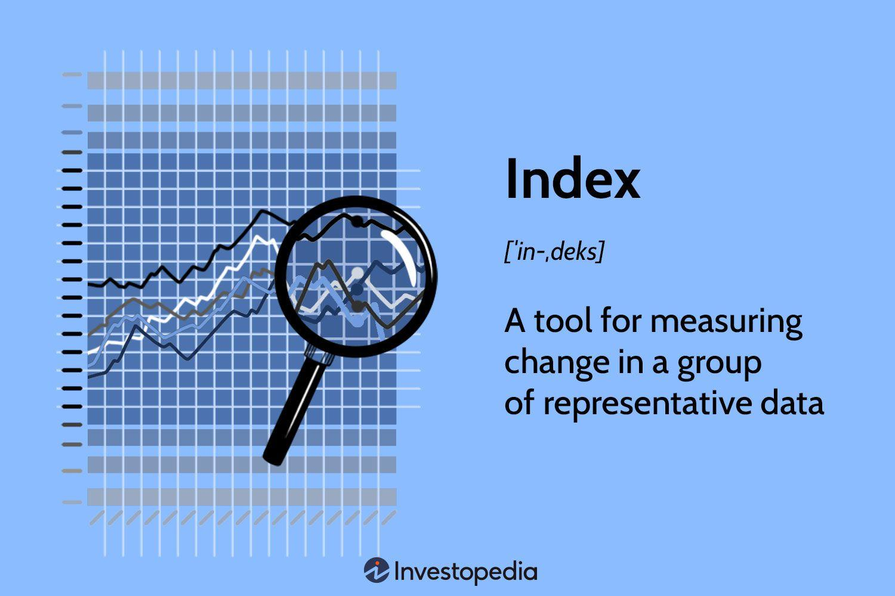

## Table of Contents

## What is a stock index?

A stock index is a way to measure the performance of a group of stocks that represent a particular market or a portion of it. It's like a scorecard that shows how well the stocks in that group are doing overall. For example, the Dow Jones Industrial Average is an index that tracks 30 large companies in the United States, giving investors an idea of how the overall market is performing.

Indexes are important because they help investors understand the health of the market without having to look at every single stock. They can also be used to create investment products like index funds, which allow people to invest in a broad range of stocks all at once. By following an index, investors can see trends and make decisions about buying or selling stocks based on how the market as a whole is doing.

## Why should someone consider investing in a stock index?

Investing in a stock index can be a smart choice for many people. One big reason is that it helps spread out risk. When you buy a single stock, all your money is tied to how that one company does. But when you invest in an index, you're putting your money into a bunch of different companies all at once. This means if one company does poorly, it won't hurt your whole investment as much because other companies might be doing well.

Another reason to consider a stock index is that it's a simple way to grow your money over time. Indexes like the S&P 500 have a long history of going up in value over many years. This means that even if the market goes up and down in the short term, over the long term, you're likely to see your money grow. Plus, you don't need to be an expert in [picking](/wiki/asset-class-picking) individual stocks; the index does the work for you by including a wide range of companies.

Lastly, investing in a stock index can save you time and effort. Instead of researching lots of different stocks and trying to figure out which ones to buy, you can just invest in an index fund. This way, you get a diversified portfolio without having to do all the work yourself. It's a hands-off approach that can be really helpful if you're new to investing or if you just want to keep things simple.

## How does investing in a stock index differ from investing in individual stocks?

Investing in a stock index is different from buying individual stocks mainly because it spreads your money across many companies instead of just one. When you buy a stock index, you're getting a piece of lots of different businesses all at once. This is called diversification, and it helps lower your risk. If one company in the index does badly, it won't hurt your whole investment as much because other companies might be doing well. On the other hand, when you invest in a single stock, all your money is tied to how that one company does. If that company does poorly, your investment could lose a lot of value.

Another big difference is how much work and knowledge it takes. Picking individual stocks means you need to do a lot of research to figure out which companies are good investments. You have to keep up with news about the company, understand its financial reports, and know what's going on in its industry. It can be a lot of work and requires a good understanding of the market. But with a stock index, you don't need to do all that. The index already includes a mix of companies, so you don't have to pick and choose. It's a simpler way to invest that's easier for people who don't want to spend a lot of time and effort on their investments.

## What are some common stock indices that investors can consider?

Some common stock indices that investors can consider are the S&P 500, the Dow Jones Industrial Average, and the Nasdaq Composite. The S&P 500 is one of the most popular indices and it includes 500 of the largest companies in the United States. It's a good way to see how the overall U.S. stock market is doing because it covers many different industries. The Dow Jones Industrial Average, often just called the Dow, is another well-known index. It tracks 30 large companies in the U.S., and it's been around for a long time, so people often use it to get a quick look at the market.

The Nasdaq Composite is different because it focuses on technology and internet companies. It includes all the stocks that trade on the Nasdaq stock exchange, which is a lot of tech firms. This index can be a good choice if you're interested in investing in the tech sector. Each of these indices gives investors a different way to understand and invest in the market, depending on what they're looking for.

## How can someone start investing in a stock index?

To start investing in a stock index, the first step is to open a brokerage account. A brokerage account is like a bank account, but it's used for buying and selling investments like stocks and index funds. You can open one online with a company like Vanguard, Fidelity, or Charles Schwab. Once your account is set up, you'll need to add money to it. This is called funding your account. You can usually do this by transferring money from your bank account.

After your account is funded, you can start investing in a stock index. One easy way to do this is by buying an index fund or an exchange-traded fund ([ETF](/wiki/etf-trading-strategies)) that tracks the index you're interested in. For example, if you want to invest in the S&P 500, you can buy an S&P 500 index fund or ETF. These funds are made up of all the stocks in the index, so when you buy them, you're investing in all those companies at once. Once you've chosen your fund, you can place an order to buy it through your brokerage account. It's a good idea to set up a regular investment plan, where you add money to your investment every month or every paycheck. This helps you build your investment over time without having to think about it too much.

## What are the costs associated with investing in a stock index?

When you invest in a stock index, there are a few costs you need to think about. One cost is the expense ratio, which is a fee that the fund charges to manage your money. This fee is usually a small percentage of your investment, like 0.05% or 0.10%. Even though it's small, it can add up over time, so it's good to look for funds with low expense ratios. Another cost is the trading fee, which some brokerages charge when you buy or sell an index fund or ETF. Not all brokerages have these fees, so it's worth checking if your brokerage offers free trades.

Another thing to consider is the cost of taxes. If you make money from your investment, you might have to pay taxes on it. This can happen if you sell your investment for more than you paid for it or if you get dividends from the companies in the index. The tax rules can be different depending on where you live, so it's a good idea to talk to a tax advisor to understand how it works for you. Overall, while there are costs to investing in a stock index, they can be pretty low compared to other types of investments, and the benefits of diversification and long-term growth can make it worth it.

## What are the risks involved in investing in a stock index?

Investing in a stock index isn't without risks. One big risk is that the whole market can go down. Even though a stock index spreads your money across many companies, if the economy is doing badly, most stocks might lose value. This means your investment could lose money too. Another risk is that some indexes might be more focused on certain industries. For example, the Nasdaq Composite has a lot of tech companies. If the tech industry has a bad year, the whole index could go down, even if other industries are doing okay.

Another thing to think about is inflation. Over time, the cost of things can go up, and if your investment doesn't grow faster than inflation, your money might not be worth as much in the future. Also, while index funds have low fees, those fees can still add up over many years and eat into your returns. It's important to understand these risks and think about how long you plan to keep your money invested. The longer you can leave your money in the market, the more likely it is to grow, even with these risks.

## How does diversification work in the context of a stock index?

Diversification in a stock index means spreading your money across many different companies instead of putting it all in one place. When you invest in a stock index, you're buying a little bit of a lot of different businesses. This is good because if one company does badly, it won't hurt your whole investment too much. Other companies in the index might be doing well, which can help balance things out. It's like not putting all your eggs in one basket.

For example, if you invest in the S&P 500, you're getting a piece of 500 big companies in the U.S. These companies are from different industries like technology, healthcare, and finance. If the tech industry has a bad year, the healthcare and finance companies might still do well. This mix helps lower your risk because your investment isn't tied to just one type of business. Diversification through a stock index can make your investment safer and more likely to grow over time.

## What is the historical performance of major stock indices?

The S&P 500 is one of the most watched stock indices and has a long history of growing over time. Since it started in 1926, the S&P 500 has had an average yearly return of about 10%. This means if you had invested in the S&P 500 a long time ago, your money would have grown a lot. But it's not always a smooth ride. The S&P 500 has had some big drops, like during the Great Depression in the 1930s and the financial crisis in 2008. Even with these ups and downs, the S&P 500 has shown that it can recover and keep growing over the long term.

The Dow Jones Industrial Average, or the Dow, is another important index that has been around since 1896. It tracks 30 big companies in the U.S. and has also grown over time, but not as much as the S&P 500. The Dow has had an average yearly return of about 6-7%. Like the S&P 500, the Dow has had its share of big drops, like during the 1987 stock market crash and the 2008 financial crisis. But it has also bounced back and continued to grow. Both the S&P 500 and the Dow show that while the stock market can be risky in the short term, it can be a good way to grow your money over many years.

## How do economic cycles affect stock index performance?

Economic cycles can have a big impact on how stock indices perform. When the economy is doing well, like during a boom, companies usually make more money. This means their stock prices go up, and so does the stock index that includes them. People feel good about the economy and are more likely to invest, which can push stock prices even higher. But when the economy slows down or goes into a recession, companies might not make as much money. This can make their stock prices fall, and the stock index goes down too. During tough economic times, people might be scared to invest, which can make the market drop even more.

Different stages of the economic cycle can affect different industries in different ways. For example, during the early stages of a recovery, industries like technology and consumer goods might do well because people start spending more money. This can help lift the stock index if it has a lot of companies from these industries. But during a downturn, industries like finance and manufacturing might struggle more, which can pull the stock index down if it's heavily weighted towards those sectors. Understanding where we are in the economic cycle can help investors make better choices about when to buy or sell stocks in an index.

## What advanced strategies can be used to optimize returns from stock index investments?

One advanced strategy to optimize returns from stock index investments is called dollar-cost averaging. This means you put money into the index regularly, like every month, instead of all at once. This way, you buy more shares when the price is low and fewer when it's high. Over time, this can help you get a better average price for your investment. It's a simple but effective way to smooth out the ups and downs of the market and can lead to better long-term returns.

Another strategy is rebalancing your portfolio. This means checking your investments every so often and making sure they're still spread out the way you want. If one part of your investment has grown a lot, it might be too big compared to the rest. You can sell some of it and buy more of the other parts to keep things balanced. This can help you stick to your plan and manage risk. By keeping your investments diversified and in line with your goals, you can optimize your returns and make your money work better for you.

## How can one use stock index futures and options for hedging and speculation?

Stock index futures and options are tools that investors can use to either protect their investments or try to make money from changes in the market. When you use them for hedging, you're trying to protect your investments from going down in value. For example, if you own a lot of stocks in the S&P 500 and you're worried the market might go down, you can buy a futures contract or an option that goes up in value if the S&P 500 goes down. This way, if the market does drop, the money you lose on your stocks can be made up by the money you make on your futures or options. It's like buying insurance for your investments.

On the other hand, you can use stock index futures and options for speculation, which means trying to make money by guessing which way the market will go. If you think the market is going to go up, you can buy a futures contract or a call option on an index like the S&P 500. If the market does go up, the value of your futures or options will go up too, and you can sell them for a profit. But if you're wrong and the market goes down, you could lose money. Speculating with futures and options can be risky, but it can also be a way to make big gains if you're right about the market's direction.

## References & Further Reading

[1]: Bergstra, J., Bardenet, R., Bengio, Y., & Kégl, B. (2011). ["Algorithms for Hyper-Parameter Optimization."](https://dl.acm.org/doi/10.5555/2986459.2986743) Advances in Neural Information Processing Systems 24.

[2]: ["Advances in Financial Machine Learning"](https://www.amazon.com/Advances-Financial-Machine-Learning-Marcos/dp/1119482089) by Marcos Lopez de Prado

[3]: ["Evidence-Based Technical Analysis: Applying the Scientific Method and Statistical Inference to Trading Signals"](https://www.amazon.com/Evidence-Based-Technical-Analysis-Scientific-Statistical/dp/0470008741) by David Aronson

[4]: ["Machine Learning for Algorithmic Trading"](https://github.com/stefan-jansen/machine-learning-for-trading) by Stefan Jansen

[5]: ["Quantitative Trading: How to Build Your Own Algorithmic Trading Business"](https://www.amazon.com/Quantitative-Trading-Build-Algorithmic-Business/dp/1119800064) by Ernest P. Chan