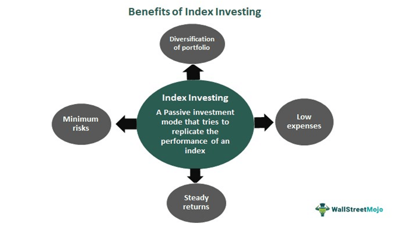

In the constantly changing landscape of financial markets, integrating traditional investment methods with advanced technology creates a fertile ground for novel investment opportunities. This article explores the combination of index funds, stock index investing, and algorithmic trading, emphasizing their potential to improve investment strategies. 

Index funds serve as mutual funds or exchange-traded funds (ETFs) designed to mirror the performance of a specific market index, such as the S&P 500. This type of investment offers low-cost market exposure and employs a passive investment strategy, favoring long-term growth through diversification and reduced management expenses. 



On the other hand, stock index investing involves tracking significant indices like the Dow Jones Industrial Average or NASDAQ. Investors use these indices as benchmarks to gauge market performance and assess their portfolios. Investing can occur directly through individual investments that align with the index or indirectly via index funds and ETFs. 

Algorithmic trading, a more modern innovation, deploys computer programs to execute trades based on predefined criteria, enabling rapid decision-making and minimizing human error. Algorithmic trading is efficient, potentially identifying arbitrage opportunities faster and executing trades with greater precision than human traders. However, it also carries risks, such as technological failures and market unpredictability.

By understanding the principles underlying these methodologies, investors can enhance their portfolios. Combining index fund investment with algorithmic trading creates opportunities for improved trade execution and market exposure. This synergy seeks to maximize returns while effectively managing risk. 

Throughout this article, we aim to highlight the practical applications, benefits, and challenges of merging these strategies. Investors equipped with this knowledge can optimize their portfolios, capitalize on profit opportunities, and navigate the inherent risks of modern market investment practices effectively.

## Table of Contents

## Understanding Index Funds

Index funds are a type of mutual fund or exchange-traded fund ([ETF](/wiki/etf-trading-strategies)) constructed to mirror the performance of a specific market index, such as the S&P 500. These funds follow a passive investment strategy, offering a straightforward and cost-efficient method for investors to achieve substantial market exposure. At the core, index funds maintain a portfolio that reflects the constituent securities and the weighted composition of the index they intend to replicate.

### Benefits of Index Funds

One of the main advantages of index funds is their ability to provide diversification. By investing in a broad array of assets represented in a particular index, investors can reduce the idiosyncratic risk associated with holding a limited number of stocks. Essentially, diversification helps mitigate the impact of poor performance by a single stock or sector. This widespread exposure aligns with the broader movements of the market.

Index funds typically incur lower management fees compared to actively managed funds. This cost efficiency arises because passive investing requires less frequent buying and selling of securities and minimal active trading strategies. These funds operate with a buy-and-hold philosophy, which minimizes transaction fees and capital gains taxes, ultimately benefiting investors through higher net returns over time.

Furthermore, index funds attract investors seeking long-term growth without the need for constant portfolio management. The hands-off approach frees investors from the [volatility](/wiki/volatility-trading-strategies) and decision-making demands of active stock trading.

### Structure and Operation

The construction and operation of an index fund are straightforward. Fund managers allocate fund assets in direct proportion to the index it tracks. For instance, if the index allocates 10% of its weight to a particular stock, the fund will similarly allocate 10% of its funds to that stock. This mirroring of the index's holdings helps ensure performance closely aligns with the index itself.

Additionally, index funds adhere strictly to the index rebalancing schedules. When stocks are added or removed from an index, the corresponding index fund will adjust its holdings accordingly, maintaining the alignment with its benchmark index.

### Role in Modern Portfolios

In contemporary investment portfolios, index funds play an integral role by offering a reliable foundation for long-term financial planning. They provide consistent returns that approximate the overall market's performance, which has historically trended upwards over extended periods. This trend makes index funds a compelling option for individuals aiming to achieve steady growth, particularly those prioritizing retirement savings.

The adoption of index funds marks a significant shift in investment strategies, driven by the increased awareness of cost impacts on investment returns and the diminishing appeal of high-cost, actively managed funds. As a result, index funds have become a staple in modern investment portfolios, offering a balanced approach between risk management and market participation.

## The Basics of Stock Index Investing

Stock index investing is an investment strategy that focuses on replicating the performance of major stock market indices. These indices, such as the Dow Jones Industrial Average (DJIA) and the NASDAQ Composite, serve as indicators of the stock market's overall performance. They provide investors with a bird's-eye view of the market, enabling individuals to compare their own portfolio returns against these benchmarks.

Investors interested in stock index investing have two primary approaches: direct investment in individual stocks that comprise the index or through index funds and Exchange-Traded Funds (ETFs) that replicate the index's portfolio. Direct investment requires purchasing the exact proportions of stocks within the index, a process that can be costly and labor-intensive due to varying stock prices and required capital. In contrast, index funds and ETFs offer a more accessible route by pooling investor funds to buy a comprehensive basket of stocks that represent the index. This method is popular due to its simplicity and cost-effectiveness.

Understanding the various stock indices is crucial for investors aiming to employ index investing. For example, the DJIA includes 30 large publicly-traded companies in the United States, providing insight into the industrial sector’s performance. Conversely, the NASDAQ Composite is full of more than 3,000 stocks and has a heavier concentration of technology-oriented companies, highlighting the tech industry's market trends. Each index provides unique insights into different industry sectors and economic segments, allowing investors to gain a holistic market view.

Stock index investing also acts as a barometer for economic health and market trends. Indices reflect investor sentiment and economic conditions; a rising index generally signals economic optimism, while a declining index may indicate economic concerns or contractions. This macroeconomic connection makes stock index investing a valuable tool for investors seeking to understand broader market dynamics and anticipate potential portfolio impacts.

Overall, stock index investing offers a strategic pathway for investors to achieve diversification and benchmark their investment performance against key market indicators. Embracing either direct stock investments or index-based funds, this strategy continues to provide compelling advantages in portfolio management.

## Algorithmic Trading: A Modern Innovation

Algorithmic trading uses computer algorithms to execute trades at speeds and frequencies that far surpass human capabilities, capitalizing on defined market criteria. Central to [algorithmic trading](/wiki/algorithmic-trading) is its capacity to minimize human error and methodically optimize market opportunities through automated systems. Algorithms, by design, act upon a set of instructions based on time, price, quantity, or any other mathematical model, enabling rapid decision-making and precise trade execution.

A primary advantage of algorithmic trading is its ability to identify [arbitrage](/wiki/arbitrage) opportunities effortlessly. Arbitrage refers to the simultaneous buying and selling of identical or equivalent financial instruments to profit from price discrepancies across different markets or exchanges. Algorithms can swiftly detect and act on these inefficiencies, capturing arbitrage profits that would be challenging for human traders to spot in time manually.

Moreover, algorithmic trading enhances trading precision by pre-defining trade parameters, minimizing the impact of human emotions on trading decisions. For example, a moving average crossover strategy within an algorithm might automate the buying of a stock when its short-term moving average surpasses the long-term moving average and sell when the opposite occurs. Such strategies help maintain consistency in trading performance.

Despite these significant advantages, algorithmic trading poses certain risks. Technological failures, such as system crashes or connectivity losses, can disrupt trading operations. Market conditions may change rapidly, and without real-time monitoring and adaptive algorithms, significant financial losses can ensue. Furthermore, the complexity of algorithms can lead to unintended market impacts, exemplified by instances like the 2010 Flash Crash.

Here is a basic illustration of an algorithmic trading strategy using Python, focusing on the moving average crossover method:

```python
import pandas as pd
import numpy as np

# Sample data: A DataFrame with 'Close' prices
data = pd.read_csv('market_data.csv')  # Example data source

# Calculate short-term and long-term moving averages
data['Short_MA'] = data['Close'].rolling(window=50, min_periods=1).mean()
data['Long_MA'] = data['Close'].rolling(window=200, min_periods=1).mean()

# Generate signals: Buy when Short_MA crosses above Long_MA, and sell when opposite
data['Signal'] = 0
data['Signal'][50:] = np.where(data['Short_MA'][50:] > data['Long_MA'][50:], 1, -1)

# Determine positions based on the signal
data['Position'] = data['Signal'].shift()

print(data.tail())  # View the trading signals and positions
```

This script calculates the short-term and long-term moving averages of a stock's closing prices and generates buy and sell signals based on their crossover. While simplified, it demonstrates the foundational logic behind algorithmic trading systems.

In summary, algorithmic trading brings substantial strategic advantages by automating the trading process, improving efficiency, and reducing latency. However, the inherent risks associated with technology and market dynamics require diligent oversight and robust risk management strategies to ensure the reliability and effectiveness of such trading systems.

## Integrating Index Fund Investing with Algorithmic Trading

Integrating index fund investing with algorithmic trading can significantly enhance trading performance by combining the stable, diversified market exposure offered by index funds with the precision and speed of algorithmic frameworks. This hybrid approach allows investors to optimize their portfolios more efficiently by utilizing technology-driven strategies alongside traditional passive investing.

Index funds inherently minimize costs due to their passive nature, which means they require minimal active management. This reduction in management fees is one of the primary advantages of index funds, along with their ability to provide broad market diversification. By tracking the performance of various market indices, they reduce unsystematic risk and enable investors to gain exposure to large segments of the market with a single investment.

Algorithmic trading, on the other hand, complements this by offering precision in trade execution and the capacity to swiftly respond to market fluctuations. Algorithms can be designed to analyze vast datasets, identify patterns, and automate the decision-making process based on predefined criteria. The benefit lies in their ability to execute orders at an optimal pace, reducing missed opportunities and trading errors often associated with human execution.

The integration of these two strategies involves leveraging algorithms to manage index fund portfolios more effectively. This can be achieved by setting algorithms to monitor market conditions and execute trades when certain criteria are met – such as rebalancing a portfolio when asset allocations deviate from their targets or capitalizing on temporary mispricings in the market. By doing so, investors can maintain the cost efficiency and diversification benefits of index funds while taking advantage of the agility and analytical power of algorithmic trading.

For practical implementation, one might employ [machine learning](/wiki/machine-learning) models to predict price movements or volatility, integrating these predictions with a rebalancing strategy for the index fund portfolio. For example, using Python's scikit-learn library, a predictive model could be built to forecast short-term market trends. The following code snippet demonstrates a simple linear regression model, trained to predict future price movements based on historical data:

```python
import pandas as pd
from sklearn.model_selection import train_test_split
from sklearn.linear_model import LinearRegression

# Assume df is a DataFrame containing historical stock data with columns 'Feature1', 'Feature2', ..., 'Price'
features = df[['Feature1', 'Feature2']]
target = df['Price']

# Split the data into training and testing sets
X_train, X_test, y_train, y_test = train_test_split(features, target, test_size=0.2, random_state=42)

# Initialize and train the model
model = LinearRegression()
model.fit(X_train, y_train)

# Predictions on the test set
predictions = model.predict(X_test)
```

This model can be incorporated into a larger algorithmic framework that triggers buy or sell signals based on predicted market conditions, thereby optimizing the trade executions for the index fund.

Overall, the synergy between the passive structure of index funds and the active, data-driven decision-making of algorithmic trading offers a balanced strategy. It strategically amplifies returns while managing exposure to risks, providing a robust approach for contemporary investors seeking to navigate and capitalize on the dynamics of modern financial markets.

## Potential Risks and Considerations

Both index fund investing and algorithmic trading, while advantageous, are not devoid of risks that require careful management. Understanding these risks is vital for investors to optimize their strategies and protect their portfolios from potential vulnerabilities.

Index funds, by design, reflect market indices and hence are subject to market fluctuations. During economic downturns or periods of increased market volatility, the value of an index fund can decline significantly, exposing investors to potential losses. This inherent risk stems from the fund's composition, as it mirrors the performance of its underlying index. For example, if an index heavily weighted in technology stocks suffers a major downturn, an index fund tracking that index will also bear the brunt of that decline. Therefore, investors must be cognizant of the economic and geopolitical factors that can impact market indices and, subsequently, their investments.

Algorithmic trading, although offering enhanced precision and speed, introduces a different set of challenges. The reliance on technology means that any technical failures—such as software bugs, hardware malfunctions, or network outages—can lead to significant disruptions in trading activities. Furthermore, the algorithms themselves may contain errors or may not adequately react to market anomalies, which can result in substantial financial losses. For example, if an algorithm misinterprets a market signal and executes trades contrary to an investor’s strategy, it could lead to undesirable outcomes.

Effective risk management in both index fund investing and algorithmic trading requires a comprehensive understanding of an investor’s risk tolerance. For index funds, investors should consider diversification across different asset classes and sectors to mitigate the impact of adverse market movements. Regular portfolio reviews and adjustments can also help align investment strategies with changing market conditions.

In algorithmic trading, it is crucial to implement robust oversight mechanisms. This includes rigorous [backtesting](/wiki/backtesting) of algorithms under various market scenarios, regular updates to the algorithmic models, and the establishment of fail-safes to address unexpected system failures. Comprehensive monitoring systems that provide real-time insights into trading activities can further help in quickly identifying and rectifying any issues.

Additionally, investors should employ a systematic approach to assess and manage these risks. For example, a Python-based risk assessment model could be used to simulate various scenarios and predict potential outcomes, allowing investors to tailor their strategies accordingly. An example of such a model could be:

```python
import numpy as np

# Simulate market returns
np.random.seed(42)
market_returns = np.random.normal(loc=0.07, scale=0.15, size=1000)  # mean return of 7%, volatility of 15%

# Calculate potential outcomes for an index fund
initial_investment = 10000  # starting with $10,000
portfolio_values = initial_investment * np.cumprod(1 + market_returns)

# Calculate potential drawdowns
drawdowns = np.maximum.accumulate(portfolio_values) - portfolio_values
max_drawdown = np.max(drawdowns)

print(f"Max Drawdown: ${max_drawdown:.2f}")
```

This code snippet simulates market returns and evaluates potential drawdowns in an index fund investment, illustrating how quantitative methods can be applied to assess risk exposure.

By developing a thorough understanding of these risks and implementing appropriate control mechanisms, investors can better position themselves to mitigate adverse impacts and enhance the resilience of their investment strategies.

## Conclusion

Incorporating index funds and algorithmic trading into an investment strategy can enhance portfolio performance through the synergy of diversification and tactical trading precision. This strategy aligns the stability and cost-efficiency of index funds with the advanced, rapid decision-making capabilities provided by algorithmic trading. 

Index funds, by design, offer a broad market exposure and reduce risks associated with individual stock investments, while algorithmic trading can precisely time market entry and [exit](/wiki/exit-strategy) points, capturing fleeting opportunities that are often missed with manual trading. This hybrid approach leverages the historical long-term growth potential of index funds with the agility and precision of algorithms to potentially achieve risk-adjusted returns. 

As investors gain more knowledge about these tools, they become adept at harnessing their advantages while also mitigating inherent risks. It is crucial for investors to have a strong grasp of their financial objectives, risk tolerance, and resources to effectively apply these strategies. Risk management practices, including diversification, are essential to protect against market volatility and technical malfunctions that may arise from algorithmic systems.

Education and adaptability are vital in navigating the ever-changing market landscape. Regular updates and continuous learning about market trends, technological innovations, and economic forecasts empower investors to make informed decisions that align with their financial goals. This dynamic combination of traditional and modern investment strategies provides a robust framework for achieving sustainable investment success.

## References & Further Reading

[1]: Bergstra, J., Bardenet, R., Bengio, Y., & Kégl, B. (2011). ["Algorithms for Hyper-Parameter Optimization."](https://dl.acm.org/doi/10.5555/2986459.2986743) Advances in Neural Information Processing Systems 24.

[2]: ["Advances in Financial Machine Learning"](https://www.amazon.com/Advances-Financial-Machine-Learning-Marcos/dp/1119482089) by Marcos Lopez de Prado

[3]: ["Evidence-Based Technical Analysis: Applying the Scientific Method and Statistical Inference to Trading Signals"](https://www.amazon.com/Evidence-Based-Technical-Analysis-Scientific-Statistical/dp/0470008741) by David Aronson

[4]: ["Machine Learning for Algorithmic Trading"](https://github.com/stefan-jansen/machine-learning-for-trading) by Stefan Jansen

[5]: ["Quantitative Trading: How to Build Your Own Algorithmic Trading Business"](https://www.amazon.com/Quantitative-Trading-Build-Algorithmic-Business/dp/1119800064) by Ernest P. Chan