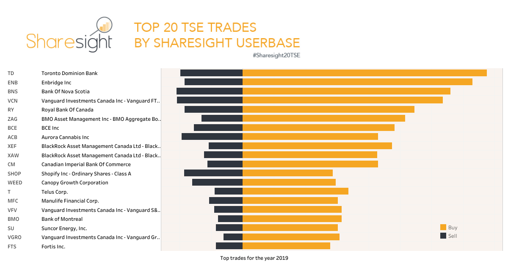

## Table of Contents

## What is the Toronto Stock Exchange (TSX) and why is it important?

The Toronto Stock Exchange (TSX) is a big place in Canada where people buy and sell pieces of companies, called stocks. It's like a marketplace, but instead of buying fruits or clothes, people trade parts of businesses. The TSX is the biggest stock exchange in Canada and one of the top exchanges in the world. It's located in Toronto, which is why it's called the Toronto Stock Exchange.

The TSX is important because it helps companies get money to grow their businesses. When a company wants to expand, it can sell pieces of itself on the TSX, and people can buy those pieces. This gives the company money to build new things or hire more people. It also helps everyday people save and invest their money. By buying stocks on the TSX, people can own a little bit of big companies and maybe make more money if those companies do well. So, the TSX is a key part of Canada's economy, helping both companies and people.

## How can a beginner start investing in TSX equities?

To start investing in TSX equities, a beginner should first open a brokerage account. This is like a special bank account where you can buy and sell stocks. You can choose from many online brokers, like Wealthsimple or Questwealth, which are easy to use and often have low fees. Once you have your account set up, you'll need to add some money to it. This is called funding your account. You can usually do this by transferring money from your regular bank account.

After your account is funded, you can start looking at different companies listed on the TSX. You might want to start with companies you know or industries you're interested in. When you find a company you like, you can place an order to buy its stock. It's a good idea to start small and only invest money you can afford to lose. As you get more comfortable, you can learn more about different investment strategies and maybe even start looking at other types of investments like ETFs, which are baskets of stocks that you can buy all at once.

## What are the different types of equities available on the TSX?

The Toronto Stock Exchange (TSX) has different types of equities that people can buy. The most common type is common stock. When you buy common stock, you own a little piece of the company. This means you might get to vote on big decisions the company makes, and you can get some of the company's profits if they do well. These profits are called dividends. Another type of equity is preferred stock. Preferred stock is different because it usually doesn't let you vote, but it often gives you a fixed dividend, which is like getting a regular payment from the company.

There are also other types of equities like exchange-traded funds (ETFs) and real estate investment trusts (REITs). ETFs are like baskets of stocks that you can buy all at once. They can be based on things like the whole market, a certain industry, or even a theme like clean energy. REITs are companies that own and manage properties like shopping malls or apartment buildings. When you buy shares in a REIT, you're investing in real estate without having to buy a whole building yourself. Each type of equity has its own benefits and risks, so it's important to learn about them before you start investing.

## What are the key factors to consider before investing in TSX stocks?

Before you start investing in TSX stocks, it's important to think about a few things. First, you need to understand the company you're thinking about buying. Look at what they do, how they make money, and if they have a good future ahead. You should also check if the stock's price is a good deal. Sometimes stocks can be too expensive, and you might not want to buy them at that time. Also, think about how much risk you're okay with. Some stocks can go up and down a lot, and that might make you nervous if you don't like risk.

Another thing to consider is how long you plan to keep the stock. If you're planning to keep it for a long time, like many years, you might be okay with some ups and downs along the way. But if you need the money soon, you might want to pick stocks that are more stable. It's also a good idea to spread your money around. This means not putting all your money into just one or two stocks. By buying different kinds of stocks, you can lower your risk. And don't forget to think about any fees you might have to pay, like when you buy or sell stocks, because these can eat into your profits.

## How does the performance of the TSX compare to other global stock exchanges?

The Toronto Stock Exchange (TSX) is one of the biggest stock exchanges in the world, but its performance can be different from other global exchanges. The TSX often does well when the Canadian economy is strong, especially in industries like energy, mining, and finance. These are big parts of Canada's economy, so when they do well, the TSX usually goes up too. But, the TSX can also be affected by what's happening in other countries. For example, if the U.S. stock market goes down, it can pull the TSX down with it because Canada and the U.S. do a lot of business together.

Compared to other global exchanges like the New York Stock Exchange (NYSE) or the London Stock Exchange (LSE), the TSX can sometimes be more focused on certain industries. The NYSE, for example, has a lot of big tech companies, which can make it go up a lot when tech is doing well. The LSE, on the other hand, has a lot of big banks and insurance companies, so it can be affected by what's happening in the financial world. The TSX, with its focus on energy and mining, can be more sensitive to changes in those areas. So, while the TSX can be a good place to invest, its performance can be different from other exchanges around the world.

## What are the tax implications of investing in TSX equities?

When you invest in TSX equities, you need to think about taxes. If you make money from your investments, you might have to pay capital gains tax. This happens when you sell a stock for more than you paid for it. In Canada, you only pay tax on half of your capital gain. So, if you made $1,000 from selling a stock, you would only pay tax on $500 of that. But, if you lose money on a stock, you can use that loss to lower your taxes. This is called a capital loss, and you can use it to reduce the amount of tax you pay on other gains.

Another thing to think about is dividends. If a company you own stock in pays you dividends, you have to pay tax on that money too. But, there's something called the Dividend Tax Credit that can help lower the tax you pay on dividends from Canadian companies. This makes investing in Canadian stocks a bit more attractive because you get a tax break. It's a good idea to talk to a tax advisor to understand how all of this works for your specific situation. They can help you figure out the best way to manage your investments and taxes.

## How can one analyze the financial health of companies listed on the TSX?

To analyze the financial health of companies listed on the TSX, you can start by looking at their financial statements. These are reports that companies have to make, showing how much money they made, how much they spent, and what they own or owe. One important part of these statements is the income statement, which tells you if the company is making a profit or a loss. Another part is the balance sheet, which shows the company's assets, like money and property, and its liabilities, like debts. You can also look at the cash flow statement, which shows how money moves in and out of the company. By looking at these, you can see if the company is doing well financially.

Another way to analyze a company's financial health is by using financial ratios. These are numbers that help you understand the company's performance better. For example, the debt-to-equity ratio tells you how much the company is borrowing compared to what the owners have put in. A high ratio might mean the company is risky because it has a lot of debt. The price-to-earnings (P/E) ratio can tell you if the stock is a good deal by comparing the stock price to the company's earnings. A lower P/E might mean the stock is cheaper, but you need to look at other things too. By using these ratios and looking at the financial statements, you can get a good idea of how healthy a company is on the TSX.

## What are some common strategies for investing in TSX equities?

One common strategy for investing in TSX equities is called value investing. This means looking for companies that you think are a good deal. You find stocks that are selling for less than what you think they're really worth. You do this by looking at things like the company's earnings, its assets, and how much it owes. If you think the stock is cheap compared to these things, you buy it and hold onto it until the price goes up. This strategy takes patience because it might take a while for the market to realize the stock is a good deal.

Another strategy is growth investing. This is when you look for companies that are growing fast and might keep growing in the future. You want to find companies that are making more money each year and are in industries that are doing well. You might pay more for these stocks because they're growing, but if the company keeps doing well, the stock price can go up a lot. This strategy can be riskier because if the company stops growing, the stock price can fall.

A third strategy is dividend investing. This is when you buy stocks that pay you regular dividends, which are like little payments from the company. You look for companies that have a history of paying good dividends and might even raise them over time. This can give you a steady income from your investments. It's a good strategy if you want to get money from your investments without selling your stocks.

## How do economic indicators affect the TSX and its equities?

Economic indicators can have a big impact on the TSX and the stocks listed on it. Things like the unemployment rate, inflation, and interest rates can tell us how the economy is doing. If the unemployment rate goes down, it usually means more people have jobs and are spending money, which can be good for companies and their stocks. On the other hand, if inflation goes up a lot, it can make things more expensive and might make people spend less. This can hurt companies and make their stock prices go down. Interest rates are also important because they affect how much it costs for companies to borrow money. If interest rates go up, it can be harder for companies to grow, which might make their stocks less attractive.

Another important economic indicator is the Gross Domestic Product (GDP), which tells us how much the whole economy is growing. If the GDP is growing, it usually means the economy is doing well, and this can be good for the TSX. Companies might make more money, and their stock prices can go up. But if the GDP is shrinking, it can mean the economy is in trouble, and this can make stock prices go down. Other indicators like consumer confidence and housing starts can also affect the TSX. If people feel good about the economy and are buying houses, it can be a sign that the economy is strong, which can help the TSX and its stocks.

## What role do sector-specific trends play in TSX equity performance?

Sector-specific trends can really affect how stocks on the TSX do. The TSX has a lot of companies in certain industries like energy, mining, and finance. If something big happens in one of these industries, it can move the whole TSX. For example, if oil prices go up, energy companies on the TSX might do better because they make more money. This can make their stock prices go up too. On the other hand, if there's a new rule that makes it harder for mining companies to work, their stocks might go down because it's harder for them to make money.

These trends can also affect how investors feel about certain sectors. If people think that technology is going to be the next big thing, they might start buying more tech stocks on the TSX. This can make tech stocks go up, even if the rest of the market isn't doing as well. But if there's bad news about a sector, like a big company in that sector getting into trouble, it can make people nervous and they might start selling their stocks in that sector. This can make the stocks in that sector go down, even if the rest of the TSX is doing okay.

## How can advanced investors use derivatives and options on the TSX?

Advanced investors can use derivatives and options on the TSX to make their investment strategies more flexible and potentially more profitable. Derivatives are financial contracts that get their value from something else, like a stock or an index. Options are a type of derivative that give you the right, but not the obligation, to buy or sell a stock at a certain price before a certain date. On the TSX, investors can use options to bet on whether they think a stock will go up or down. For example, if you think a stock will go up, you can buy a call option, which lets you buy the stock at a lower price later. If you think it will go down, you can buy a put option, which lets you sell the stock at a higher price later.

Using derivatives and options can be a way for advanced investors to manage risk and make money in different market conditions. For instance, if you own a stock and you're worried it might go down, you can buy a put option to protect yourself. This is called hedging. It's like buying insurance for your stock. On the other hand, if you want to make more money from a stock you think will go up, you can sell call options against it. This is called writing options, and it can give you extra income, but it also comes with more risk. Because options and derivatives can be complicated and risky, it's important for investors to really understand them before using them on the TSX.

## What are the risks associated with investing in TSX equities and how can they be mitigated?

Investing in TSX equities comes with several risks. One big risk is that the stock price can go down, and you might lose money. This can happen if the company doesn't do well or if something bad happens in the economy. Another risk is that the stock might not pay dividends, or the dividends might be cut. This can be a problem if you were counting on that money. There's also the risk that the whole market might go down, which can affect all the stocks on the TSX. And sometimes, things can happen that you didn't expect, like a company getting into legal trouble or a new competitor coming along.

To help lower these risks, you can do a few things. One good idea is to spread your money around, which is called diversification. Instead of putting all your money into one stock, you can buy different kinds of stocks or even other investments like bonds. This way, if one stock goes down, you won't lose all your money. Another way to manage risk is to do your homework before you buy a stock. Look at the company's financials and see if it's a good deal. You can also set up a plan for when to sell a stock, so you don't hold onto it too long if it starts to go down. And if you're not sure, talking to a financial advisor can help you make better choices and understand the risks better.

## References & Further Reading

[1]: ["Advances in Financial Machine Learning"](https://www.amazon.com/Advances-Financial-Machine-Learning-Marcos/dp/1119482089) by Marcos Lopez de Prado

[2]: ["Algorithms for Hyper-Parameter Optimization"](https://dl.acm.org/doi/10.5555/2986459.2986743) by Bergstra, J., Bardenet, R., Bengio, Y., & Kégl, B. in Advances in Neural Information Processing Systems 24

[3]: ["Evidence-Based Technical Analysis: Applying the Scientific Method and Statistical Inference to Trading Signals"](https://www.amazon.com/Evidence-Based-Technical-Analysis-Scientific-Statistical/dp/0470008741) by David Aronson

[4]: ["Machine Learning for Algorithmic Trading"](https://github.com/stefan-jansen/machine-learning-for-trading) by Stefan Jansen

[5]: ["Quantitative Trading: How to Build Your Own Algorithmic Trading Business"](https://www.amazon.com/Quantitative-Trading-Build-Algorithmic-Business/dp/1119800064) by Ernest P. Chan