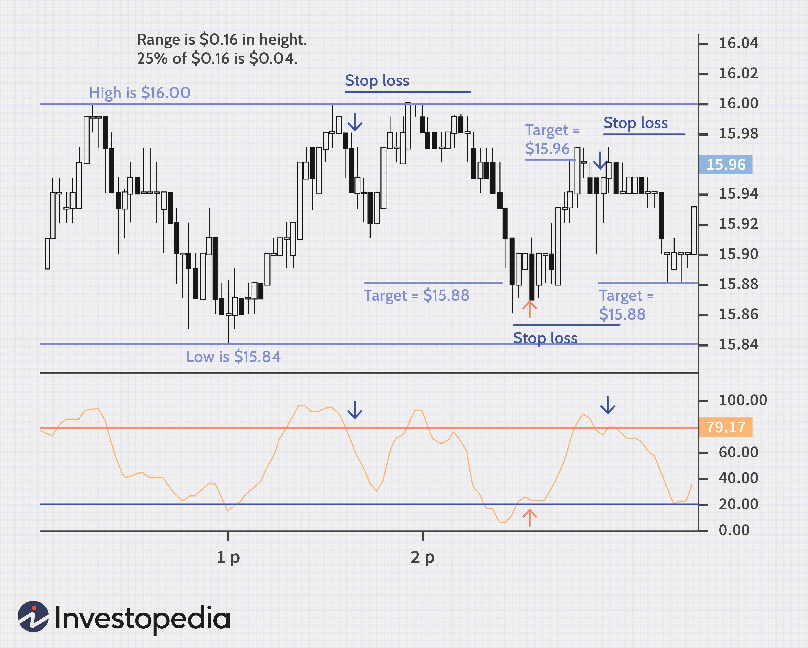

Investing in a volatile stock market presents challenges and opportunities that are significant for modern investors. Volatility implies rapid and significant price fluctuations, which can lead to large gains or losses. To effectively navigate such environments, it's imperative to understand the underlying dynamics that drive these fluctuations. Algorithmic trading, a method of executing trades using automated systems based on pre-defined criteria, has fundamentally altered the landscape of financial markets. This approach operates by leveraging speed and precision, enabling trades at a scale and frequency human traders cannot achieve.

The effectiveness of algorithmic trading in volatile markets stems from its ability to process vast amounts of data quickly and execute trades based on sophisticated analytics and quantitative models. For investors, this means the possibility of capitalizing on price discrepancies that arise from rapid market movements. However, employing algorithmic strategies in such unpredictable markets also presents numerous challenges. It necessitates a firm grasp of market behavior and the technology that drives these algorithms.



In exploring the use of algorithmic trading during volatile market conditions, this article analyzes its benefits and challenges. The aim is to furnish investors with valuable insights into how they can make well-informed decisions by implementing advanced trading technologies. By integrating these technologies with a solid understanding of market volatility, investors can potentially enhance their ability to manage risk and seize opportunities, ensuring their portfolio remains adaptive and resilient amidst market upheavals.

## Table of Contents

## Understanding Market Volatility

Volatility is a fundamental concept in financial markets, characterized by the rate and magnitude of price fluctuations over a given period. It is commonly measured using statistical metrics such as the standard deviation or variance of returns. High volatility indicates large price swings, while low volatility suggests more stable prices. Although volatility is often perceived as a source of risk, it also presents opportunities for astute investors who can effectively navigate these market conditions.

Numerous factors contribute to market volatility. Economic indicators, such as interest rates, inflation data, and employment figures, can have significant impacts. For example, unexpected changes in interest rates by central banks can lead to rapid adjustments in equity and bond markets.

Geopolitical events also play a crucial role. Political instability, conflicts, or unexpected regulatory announcements can trigger sharp market reactions. For instance, trade disputes between major economies can create uncertainty, affecting currencies, commodities, and stock indices globally.

Market sentiment, the overall attitude of investors toward a particular market or asset, heavily influences [volatility](/wiki/volatility-trading-strategies). Bullish sentiment can drive prices up, leading to heightened volatility if the sentiment shifts suddenly. Similarly, bearish sentiment can cause sharp price declines.

Understanding these drivers is crucial for investors. Developing strategies that can withstand sudden market changes requires a deep comprehension of volatility. Investors might employ techniques such as diversification to mitigate risk or utilize derivatives to hedge potential losses. By recognizing the factors that influence volatility, investors can better position themselves to capitalize on the opportunities it presents while managing the associated risks effectively.

## Why Volatile Markets Attract Investors

Volatile markets present unique opportunities for investors who have the aptitude to navigate their inherent risks. One of the primary attractions of volatile markets is the potential for substantial profits. Price swings, though unpredictable, can be leveraged to execute trades that capitalize on significant market movements. This potential profit margin is often what lures investors despite the accompanying risks.

High [liquidity](/wiki/liquidity-risk-premium) is another characteristic of volatile markets that attracts active traders. Liquidity refers to how quickly an asset can be bought or sold in the market without affecting its price. In volatile markets, this liquidity allows traders to enter and [exit](/wiki/exit-strategy) positions rapidly, which is essential for capitalizing on short-term price fluctuations. High liquidity also reduces transaction costs because it minimizes the bid-ask spread, making it cheaper to execute trades.

For long-term investors, market volatility can be a period to acquire undervalued assets. During times of market turbulence, prices may fall below their intrinsic value, presenting buying opportunities. This concept aligns with the investment strategy of value investing, where the goal is to purchase securities that appear underpriced by some form of [fundamental analysis](/wiki/fundamental-analysis). When markets eventually stabilize or rebound, these assets can appreciate significantly, yielding notable returns for the investor.

In summary, while volatile markets pose certain risks, they also offer distinct advantages including profit potential, liquidity, and opportunities for acquiring assets at a discount. Understanding these dynamics can empower investors to make informed decisions and potentially reap significant rewards.

 to Algorithmic Trading

Algorithmic trading, commonly referred to as algo-trading, is a method of executing orders using automated and pre-programmed trading instructions. These instructions account for variables such as timing, price, and market conditions. The primary aim of [algorithmic trading](/wiki/algorithmic-trading) is to minimize the impact of human emotions on trading decisions and execute strategies based on quantitative models.

At its core, algorithmic trading relies on mathematical models to identify trading opportunities. These models analyze vast datasets to forecast price movements and optimize the timing of trade executions. For instance, a basic example of a quantitative model employed in algorithmic trading could be a mean-reversion strategy. This strategy is based on the hypothesis that the price of a security will revert to its mean. The algorithm triggers a buy order whenever the price falls below a certain threshold and sells when it rises accordingly.

The execution of trades in algorithmic trading is typically implemented through a series of code written in a programming language such as Python. Here's a simple example of how an algorithm to execute trades might be structured:

```python
import numpy as np

def mean_reversion_strategy(prices, window_size=20, threshold=0.01):
    moving_avg = np.convolve(prices, np.ones(window_size)/window_size, mode='valid')
    signals = np.where(prices[window_size:] < (1 - threshold) * moving_avg, 'buy', 'hold')
    signals = np.where(prices[window_size:] > (1 + threshold) * moving_avg, 'sell', signals)
    return signals

# Example usage
stock_prices = np.array([100, 102, 101, 104, 107, 105, 102, 100, 98, 95, 93])
signals = mean_reversion_strategy(stock_prices)
print(signals)
```

This snippet outlines a basic structure wherein a moving average is calculated over a specified window size. If the price of the security deviates from this moving average by a defined threshold, a buy or sell signal is generated. 

Other key components of algorithmic trading encompass precise timing, and access to high-quality, real-time market data. The environment in which these algorithms operate must be robust and capable of handling numerous transactions in fractions of a second. This precision allows traders to exploit small price discrepancies that occur in high-frequency trading scenarios.

In conclusion, algorithmic trading has become an indispensable tool for traders aiming to leverage automated processes for consistent and rapid trade execution. Through the use of sophisticated mathematical models and advanced computational techniques, algo-trading seeks to maximize efficiency and minimize the emotional bias inherent in manual trading.

## Advantages and Disadvantages of Algo-Trading

Algorithmic trading, known for leveraging computational algorithms to automate trading decisions, presents several advantages that contribute to its widespread adoption among traders and institutions. A primary advantage is the speed of execution. Algorithms can process and execute trades within milliseconds, far surpassing human capabilities. This speed is particularly beneficial in markets where price movements can occur rapidly, allowing traders to capture fleeting opportunities that manual trading would likely miss.

Another significant advantage is the reduction of human error. By eliminating the emotional biases that often impact trading decisions—such as fear or greed—algorithmic strategies can adhere strictly to pre-established criteria. This objectivity ensures consistency in executing trades, which is crucial in maintaining discipline across trading activities.

Moreover, algorithmic trading offers potential cost savings. Automated systems can efficiently handle large volumes of trades, optimizing the execution process to secure better prices and reduced transaction costs. As such, institutions can benefit from economies of scale, further enhancing profitability.

However, algorithmic trading is not without its challenges. One of the most notable disadvantages is the potential for technical failures. Automated systems rely heavily on technology, and any malfunction, whether due to software bugs or hardware breakdowns, could result in significant financial losses.

Another issue is the reliance on historical data to inform algorithmic models. While past data can provide valuable insights, it does not guarantee future performance, especially in unpredictable or atypical market conditions. This dependency highlights the need for continuous monitoring and updating of trading algorithms to ensure their relevance and effectiveness.

Regulatory scrutiny also poses a challenge. The use of complex algorithms in financial markets has attracted increasing attention from regulators concerned with market fairness and stability. Traders and firms must navigate evolving regulations which may require substantial compliance efforts and adjustments to trading strategies.

In conclusion, while algorithmic trading offers considerable benefits including speed, accuracy, and cost efficiency, it also incorporates risks such as technical failures and regulatory challenges. Traders must carefully evaluate these factors to determine the suitability of algorithmic trading strategies within their specific investment frameworks.

## Strategies in Algorithmic Trading

Algorithmic trading involves using specific strategies to manage investments more efficiently than traditional trading methods. One common strategy is trend-following, which is based on identifying and capitalizing on the [momentum](/wiki/momentum) of asset price movements. Traders using trend-following techniques often deploy algorithms that detect patterns and trends in historical data, enabling them to predict future price movements. This method assumes that prices often move in prolonged trends due to psychological, economic, or geopolitical factors. The algorithms are designed to initiate buy or sell orders automatically when the trend reaches preset conditions, aiming to profit from continued price movement in the direction of the identified trend.

Arbitrage opportunities arise when there are price discrepancies of the same asset across different markets or exchanges. Algorithms can be programmed to detect and capitalize on these discrepancies, executing simultaneous buy and sell orders to lock in profits. This strategy, often executed at high speeds, relies heavily on the precision and speed that algo-trading provides. By buying low in one market and selling high in another, traders can efficiently exploit brief windows of opportunity.

Index fund rebalancing strategies involve adjusting portfolios to maintain alignment with a specific index. As index funds periodically adjust their holdings to mirror the composition of an underlying index, these adjustments can create temporary price imbalances. Algorithmic traders can anticipate these movements by developing models that predict when and how these rebalancing actions will occur, thus allowing them to execute trades that capture these ancillary price movements.

High-frequency trading ([HFT](/wiki/high-frequency-trading-strategies)) is another sophisticated algorithmic strategy that seeks to exploit minute price changes through rapid trade execution. HFT involves making trades on extremely short time frames, from milliseconds to seconds, requiring advanced technological infrastructure and high-speed data processing capabilities. This method takes advantage of small price discrepancies in the market, often resulting in significant cumulative gains over time, although each individual trade might yield minimal profit.

Choosing the right algorithmic trading strategy depends largely on a trader's objectives and the available technology. Traders must consider factors such as market conditions, risk tolerance, and technological resources. The infrastructure supporting a strategy is crucial, as high-frequency and [arbitrage](/wiki/arbitrage) strategies demand robust and low-latency networks, while trend-following strategies may require sophisticated data analysis capabilities. In conclusion, continual advancement in technology and computational power significantly enhances the effectiveness and accessibility of these algorithmic trading strategies.

## Technical Requirements for Algo-Trading

Successful algorithmic trading, commonly known as algo-trading, necessitates a robust technical foundation to execute trades efficiently and effectively. At the core of this foundation is a comprehensive understanding of computer programming and seamless access to the market.

### Programming Knowledge and Market Access

To implement an algorithmic trading system, traders need substantial proficiency in programming languages such as Python or C++. Python is particularly popular in the finance sector due to its simplicity and the availability of numerous libraries that facilitate data analysis, statistical computations, and [machine learning](/wiki/machine-learning). Essential libraries include NumPy for numerical computations, pandas for data manipulation, and scikit-learn for machine learning algorithms.

Here's a simple example in Python:

```python
import pandas as pd
import numpy as np

# Sample moving average algorithm
def moving_average_strategy(data, short_window=40, long_window=100):
    signals = pd.DataFrame(index=data.index)
    signals['signal'] = 0.0

    # Create short and long simple moving averages
    signals['short_mavg'] = data['close'].rolling(window=short_window, min_periods=1, center=False).mean()
    signals['long_mavg'] = data['close'].rolling(window=long_window, min_periods=1, center=False).mean()

    # Create signals
    signals['signal'][short_window:] = np.where(signals['short_mavg'][short_window:] > signals['long_mavg'][short_window:], 1.0, 0.0)   

    # Generate trading orders
    signals['positions'] = signals['signal'].diff()

    return signals
```

### Real-Time Market Data

Access to real-time market data is vital for executing algorithmic strategies effectively. Investors require data feeds that provide accurate and timely updates of market information, such as stock prices, trading volumes, and other relevant financial metrics. This data is essential for making informed decisions and executing trades based on current market conditions. 

### Backtesting Capabilities

Backtesting is another critical component, which involves testing an algorithmic strategy on historical data to evaluate its performance. This process allows traders to test their strategies without risking capital and make necessary adjustments before live implementation. Libraries like `[backtrader](/wiki/backtrader)` in Python can be used to facilitate [backtesting](/wiki/backtesting).

```python
from backtrader import cerebro

# An example of setting up a backtesting environment
cerebro = Cerebro()
# Add data feed and strategy here
# cerebro.adddata(data)
# cerebro.addstrategy(MyStrategy)
cerebro.run()
```

### Network Infrastructure

A robust network connection is paramount for minimizing latency, which refers to the delay before a transfer of data begins following an instruction for its transfer. High-frequency trading, for instance, relies heavily on swift execution, where milliseconds can make a difference in profitability. Establishing a reliable and fast network infrastructure ensures that trades can be executed promptly without disruptions.

### Trading Infrastructure

Implementing a reliable trading infrastructure involves setting up servers that can handle high volumes of transactions and protect against technical failures. This includes having redundancy measures in place to recover quickly from any unexpected disruptions and ensure that algorithmic strategies can operate efficiently. Furthermore, the trading platform must be secure, providing safeguards against cyber threats.

Overall, the complexities of algorithmic trading require investors to establish a sophisticated technical setup that encompasses not only programming acumen and market access but also real-time data acquisition, rigorous backtesting, and a solid network and trading infrastructure. This comprehensive approach ensures that algorithmic trading strategies can be leveraged effectively to navigate the fast-paced and often volatile financial markets.

## Navigating Volatile Markets with Algo-Trading

Algorithmic trading, or algo-trading, is a powerful tool for managing risk and identifying opportunities in volatile market conditions. By employing advanced algorithms, traders can respond swiftly to fluctuations, making the most of both upward and downward trends in stock prices. Such responsiveness is crucial in markets where conditions can change rapidly and unpredictably.

Traders using algorithmic strategies can adjust their algorithms to be more sensitive to different levels of market volatility. This adjustment process often involves modifying the algorithm's parameters to better adapt to the current market environment. For instance, when market volatility increases, a trader might enhance the algorithm’s sensitivity to price movements to capture gains more effectively. Conversely, in calmer markets, reducing sensitivity might minimize unnecessary trades and associated costs.

The success of these strategies relies heavily on understanding the market conditions at any given moment. This involves analyzing market data, news, and historical trends to gain insights into price movements. Once these conditions are identified, algorithms can be tweaked to not only follow the current trends but also anticipate potential market shifts.

To illustrate, consider a simple moving average crossover strategy. In a volatile market, a trader might choose shorter moving average periods to react more quickly to price changes. Here is a basic example of how such an algorithm could be implemented in Python:

```python
import pandas as pd

# Load stock data
data = pd.read_csv('stock_data.csv')
short_window = 5
long_window = 20

# Calculate moving averages
data['short_mavg'] = data['Close'].rolling(window=short_window, min_periods=1).mean()
data['long_mavg'] = data['Close'].rolling(window=long_window, min_periods=1).mean()

# Generate trading signals
data['signal'] = 0.0
data['signal'][short_window:] = np.where(
    data['short_mavg'][short_window:] > data['long_mavg'][short_window:], 1.0, 0.0
)

# Calculate positions based on signals
data['positions'] = data['signal'].diff()

# Output
print(data[['Date', 'short_mavg', 'long_mavg', 'signal', 'positions']])
```

In this example, the algorithm uses two moving averages—a short-term and a long-term one—to generate buy or sell signals. When the short-term average crosses above the long-term average, a buy signal is generated, and vice versa for selling.

Overall, successfully navigating volatile markets with algo-trading necessitates a dynamic and adaptive approach. Traders must remain vigilant, continuously evaluate their strategies, and adjust their algorithms to maintain efficacy in the ever-changing landscape of stock markets. Integrating real-time data analysis with automated adjustments can significantly enhance one's trading performance, turning market volatility from a challenge into an opportunity.

## Conclusion

Investing in a volatile stock market requires adopting a strategic approach that effectively balances risk and reward. The inherent unpredictability of such markets can either erode capital or present significant profit potential. In this context, algorithmic trading has emerged as a powerful tool. By leveraging pre-programmed rules, it systematically exploits market volatility, enabling precise execution and timely decision-making that human traders may struggle to achieve.

Algorithmic trading facilitates a structured means of capitalizing on volatility by executing trades based on data-driven models rather than emotional impulses. These models analyze a multitude of factors, including price movements, market sentiment, and economic indicators, to make informed trading decisions. The quantitative nature of these models helps reduce human error, offering a level of precision crucial in rapidly changing market environments. Moreover, algorithmic trading can swiftly adapt to new market conditions, adjusting strategies in real time to mitigate risks and seize emerging opportunities.

Integrating technology with sound financial acumen enhances trading efficacy. Investors equipped with advanced algorithmic strategies can identify and act on market inefficiencies that may arise during periods of volatility. The automation of processes such as order placement and risk management also leads to increased efficiency, lower transaction costs, and improved execution speeds. These advantages, however, come with the responsibility of managing technological risks and ensuring algorithms are continuously refined to align with evolving market dynamics.

In conclusion, harnessing algorithmic trading in volatile markets offers a systematic way to navigate uncertainty. By combining technological tools with analytical expertise, investors can better align their strategies with market conditions, ultimately enhancing their ability to achieve desired financial outcomes.

## References & Further Reading

[1]: Bergstra, J., Bardenet, R., Bengio, Y., & Kégl, B. (2011). ["Algorithms for Hyper-Parameter Optimization."](https://dl.acm.org/doi/10.5555/2986459.2986743) Advances in Neural Information Processing Systems 24.

[2]: ["Advances in Financial Machine Learning"](https://www.amazon.com/Advances-Financial-Machine-Learning-Marcos/dp/1119482089) by Marcos Lopez de Prado

[3]: ["Evidence-Based Technical Analysis: Applying the Scientific Method and Statistical Inference to Trading Signals"](https://books.google.com/books/about/Evidence_Based_Technical_Analysis.html?id=MeoJAQAAMAAJ) by David Aronson

[4]: ["Machine Learning for Algorithmic Trading"](https://github.com/stefan-jansen/machine-learning-for-trading) by Stefan Jansen

[5]: ["Quantitative Trading: How to Build Your Own Algorithmic Trading Business"](https://www.amazon.com/Quantitative-Trading-Build-Algorithmic-Business/dp/1119800064) by Ernest P. Chan