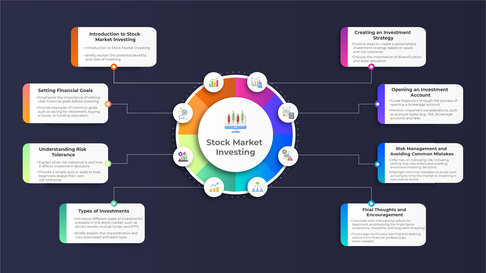

Investing in the stock market has historically served as a robust mechanism for wealth accumulation, offering individuals and institutions the ability to multiply their investments over time. The stock market's potential for high returns has traditionally attracted a broad spectrum of investors. However, the complexity, volatility, and emotional demands of trading can pose challenges. These challenges are now being addressed through the emergence of algorithmic trading (algo trading), which is transforming the landscape of stock investments in 2024.

Algorithmic trading leverages advanced computational power to execute trades automatically, guided by pre-defined rules and algorithms. This method capitalizes on the rapid processing speeds of modern computers to make trade decisions in microseconds, a capability far beyond human traders. By eliminating the role of human emotions—such as fear and greed—algo trading addresses common pitfalls that lead investors to make irrational decisions, thereby increasing the potential for consistent returns.



The transformative potential of algorithmic trading in 2024 lies in its ability to enhance efficiency and precision in the stock market. It serves as a tool for investors seeking to optimize their strategies and maximize returns by employing data-driven techniques. Through this article, we shall examine the advancements and implications of algorithmic trading on stock investments, providing insights on how investors can tap into these technological innovations for improved performance.

Additionally, we will review some of the leading algorithmic trading software and platforms available in 2024. These platforms offer diverse features tailored to different trading strategies and needs, thus empowering investors with the tools necessary to implement cutting-edge trading approaches.

By the conclusion of this article, investors will gain a comprehensive understanding of how to integrate algorithmic strategies into their investment framework, equipping them with the knowledge to effectively navigate the evolving landscape of stock trading.

## Table of Contents

## What is Algorithmic Trading?

Algorithmic trading, commonly referred to as algo trading, is a sophisticated method of executing trades in financial markets using pre-programmed instructions coded into computer systems. These instructions are based on various factors including timing, price, and volume, allowing traders to place multiple orders simultaneously and at a speed that significantly outpaces human capabilities.

These programs can range from simple to highly complex. A basic algorithm might rely on simple moving average crossovers, a strategy where buy and sell signals are generated by comparing two moving averages of different lengths. For instance, a buy signal might be triggered when a short-term moving average crosses above a long-term moving average. More complex algorithms can involve a series of nested if-then statements that evaluate numerous market conditions before executing a trade. 

For example, consider a pseudo-Python function implementing the moving average crossover strategy:

```python
def moving_average_crossover(data, short_window=40, long_window=100):
    short_mavg = data['Price'].rolling(window=short_window, min_periods=1).mean()
    long_mavg = data['Price'].rolling(window=long_window, min_periods=1).mean()

    data['Signal'] = 0
    data['Signal'][short_window:] = np.where(short_mavg[short_window:] > long_mavg[short_window:], 1, 0)
    data['Position'] = data['Signal'].diff()

    return data
```

In this function, 'data' is a pandas DataFrame containing historical price data. The short and long moving averages are calculated over specified windows, and signals are generated when the short-term average exceeds the long-term average.

The automation of these trading strategies using algorithms provides key advantages. One of the most significant is the ability to execute a high [volume](/wiki/volume-trading-strategy) of orders in microseconds, a feat unachievable by human traders. This rapid execution is crucial, especially in markets where price movements can be extremely volatile and occur within fractions of a second.

Another advantage is the capability of [backtesting](/wiki/backtesting), which involves running a trading strategy on historical market data to determine its effectiveness before applying it in a live market environment. Through backtesting, traders can analyze how the algorithm would have performed historically, adjusting parameters to optimize for profitability and minimize risk. This data-driven approach helps in refining strategy logic and reducing potential losses. 

Overall, [algorithmic trading](/wiki/algorithmic-trading) epitomizes the integration of technical analysis and computing power, facilitating trading decisions that are both quick and strategically sound, ultimately transforming how stock investments are managed and executed.

## Advantages of Algorithmic Trading

Algorithmic trading offers several advantages that are transforming the landscape of stock investments in 2024. One of the primary benefits is increased speed. Algorithmic trades are executed at the best possible times, without human delay, ensuring the exploitation of even the smallest market inefficiencies. By processing trades in fractions of a second, algo trading outpaces traditional manual trading, which is limited by human reaction times.

Another critical advantage is the elimination of emotion from trading decisions. Human traders are often susceptible to psychological pitfalls such as fear and greed, which can lead to irrational and suboptimal trading choices. Algorithms, however, adhere strictly to predefined strategies, ensuring consistent, emotion-free decision-making.

Diversification is also a notable benefit. Unlike manual trading, which often demands concentrated focus on a limited number of strategies or assets, algorithmic trading enables the simultaneous execution of multiple independent strategies across various markets and asset classes. This capacity to diversify trading strategies increases the potential for profit and mitigates the risk of relying on a single approach.

Backtesting capabilities further enhance the effectiveness of algorithmic trading. Traders can simulate a strategy using historical data to evaluate its potential performance before deploying it in live markets. This process involves analyzing how a trading algorithm would have performed in the past, allowing for the fine-tuning of strategies and increasing confidence in their ability to generate positive returns. A typical backtesting scenario could be implemented using a Python script, as demonstrated below:

```python
import pandas as pd
import numpy as np

def backtest_strategy(data, strategy_func):
    # Apply the strategy function to the data
    signals = strategy_func(data)

    # Calculate the strategy's returns
    strategy_returns = np.sum(signals * data['returns'])
    return strategy_returns

# Example strategy function: simple moving average crossover
def sma_crossover(data, short_window=40, long_window=100):
    signals = pd.DataFrame(index=data.index)
    signals['short_mavg'] = data['close'].rolling(window=short_window).mean()
    signals['long_mavg'] = data['close'].rolling(window=long_window).mean()
    signals['signal'] = 0.0
    signals['signal'][short_window:] = np.where(signals['short_mavg'][short_window:] > signals['long_mavg'][short_window:], 1.0, 0.0)
    return signals['signal'].diff()

# Example usage
historical_data = pd.read_csv('historical_stock_data.csv')
print(backtest_strategy(historical_data, sma_crossover))
```

Cost reduction is another important advantage of algorithmic trading. It reduces the costs associated with manual trading, such as decreased need for constant management and oversight. Automation allows traders to monitor numerous strategies and assets without the extensive personnel resources typically required by a manual approach, leading to increased efficiency and reduced operational costs. 

Overall, these advantages demonstrate that algorithmic trading not only increases efficiency and the potential for higher returns but also streamlines the trading process, making it a compelling choice for investors in 2024.

## Key Considerations When Using Algorithmic Trading

When employing algorithmic trading strategies, it is essential to focus on several key considerations to maximize efficiency and minimize potential risks. One of the most critical aspects is data integrity. Access to accurate and reliable market data is paramount because algorithms make trading decisions based on the information fed to them. A simple error in data can lead to significant financial losses. Therefore, investing in high-quality data feeds and regularly validating data sources is crucial.

Another important consideration is risk management. Despite the automated nature of algorithmic trading, it remains essential to implement robust risk management strategies. This includes setting stop-loss orders, which automatically sell a security when it reaches a predefined price, preventing further losses. Diversifying strategies and instruments can also spread risk, making a significant impact on reducing potential losses.

Technical expertise plays a pivotal role in the effective use of algorithmic trading. While some platforms have made algorithmic trading more accessible, a deep understanding of the underlying algorithms and trading strategies can provide a competitive edge. This includes knowledge of programming languages such as Python, which is often used to develop and backtest trading algorithms:

```python
import numpy as np
import pandas as pd

# Example of a simple moving average crossover strategy
def moving_average_crossover(data, short_window=40, long_window=100):
    signals = pd.DataFrame(index=data.index)
    signals['price'] = data['price']
    signals['short_mavg'] = data['price'].rolling(window=short_window, min_periods=1, center=False).mean()
    signals['long_mavg'] = data['price'].rolling(window=long_window, min_periods=1, center=False).mean()
    signals['signal'] = 0.0
    signals['signal'][short_window:] = np.where(signals['short_mavg'][short_window:] > signals['long_mavg'][short_window:], 1.0, 0.0)
    signals['positions'] = signals['signal'].diff()
    return signals
```

Continuous monitoring of algorithms is essential. Although algorithmic trading systems execute trades automatically, they require regular monitoring to ensure they are functioning as intended. Market conditions can change rapidly, and algorithms may need adjustments to remain effective. Regular checks can prevent small issues from becoming significant problems.

Finally, regulatory compliance is a key [factor](/wiki/factor-investing) when engaging in algorithmic trading. Different markets and jurisdictions have specific regulations governing trading activities. Ensuring that your trading system adheres to these regulations is not only legally necessary but also crucial for maintaining market integrity. Staying informed about changes in financial laws and consulting with compliance professionals can help traders avoid legal pitfalls and safeguard their trading operations.

## Top Algorithmic Trading Software and Platforms for 2024

TradeStation is a prominent name in algorithmic trading, particularly noted for its comprehensive tools and the powerful scripting language EasyLanguage. EasyLanguage simplifies the process of developing custom trading algorithms, allowing traders to convert their trading ideas into executable code without extensive programming knowledge. This flexibility makes TradeStation a popular choice for both novice and experienced traders looking to automate their strategies. TradeStation's platform also provides advanced charting capabilities, robust market analysis tools, and direct market access, making it a versatile option for algorithmic traders seeking precision and efficiency.

[Interactive Brokers](/wiki/interactive-brokers-api) stands out due to its robust API, which caters to tech-savvy traders aiming to design complex trading strategies. This platform supports multiple programming languages, including Python, Java, and C++, enabling traders to leverage their coding skills to construct sophisticated algorithms. The API allows for seamless integration with custom trading systems and offers access to a wide variety of asset classes, including stocks, options, futures, and [forex](/wiki/forex-system). This flexibility, combined with competitive commission rates, makes Interactive Brokers an attractive choice for developers and quantitative traders seeking a customizable trading environment.

TrendSpider is acclaimed for its advanced technical analysis tools and innovative features that cater to the strategic needs of U.S. markets. One of its significant offerings is the integration of Federal Reserve Economic Data, providing traders with crucial macroeconomic insights. TrendSpider's platform automates the detection of trendlines, support, and resistance levels, as well as pattern recognition, thereby reducing manual chart analysis efforts. Its automated backtesting and multi-timeframe analysis features further empower traders to refine their strategies with data-driven insights.

Coinrule specializes in the [cryptocurrency](/wiki/cryptocurrency) market, offering pre-defined and user-friendly template strategies that cater to both beginner and seasoned crypto traders. This platform emphasizes ease of use, allowing traders to execute trading commands systematically without writing any code. Coinrule's rules-based approach helps traders implement strategies rapidly across multiple exchanges, responding to the highly volatile cryptocurrency market with agility and precision. The platform's risk management tools and strategy customization options provide flexibility for traders to adapt their approaches as market conditions evolve.

Each of these algorithmic trading platforms offers a distinct set of features tailored to diverse trading styles and requirements. When selecting a platform, it is essential to consider factors such as ease of use, available asset classes, technology integration, and strategy development capabilities. Aligning these platform characteristics with your own trading objectives is crucial to optimizing performance and achieving desired investment outcomes.

## Conclusion

Algorithmic trading is anticipated to gain increased significance in 2024, as investors continue to explore technological solutions for refining their stock market strategies. The plethora of platforms offering sophisticated algorithmic tools means that the selection process must be guided by the specific trading requirements and expertise level of each investor. This personalization ensures that the chosen platform not only aligns with an investor's objectives but also leverages their technical expertise to its fullest potential.

By embracing algorithmic trading, investors stand to gain substantial advantages, such as heightened efficiency in executing trades and the ability to harness data-driven insights. These benefits contribute to more informed decision-making processes and the optimization of portfolio performance, often resulting in superior returns compared to traditional trading methods.

Incorporating these technological advancements into one's investment strategy can profoundly impact the achievement of long-term financial goals. Automated trading systems minimize human error and emotion, crucial factors in maintaining a consistent approach in varying market conditions. Ultimately, algorithmic trading represents a transformative opportunity, equipping investors with the means to navigate complex markets with increased precision and confidence, thereby redefining their pathways to financial success.

## References & Further Reading

[1]: Bergstra, J., Bardenet, R., Bengio, Y., & Kégl, B. (2011). ["Algorithms for Hyper-Parameter Optimization."](https://proceedings.neurips.cc/paper/2011/file/86e8f7ab32cfd12577bc2619bc635690-Paper.pdf) Advances in Neural Information Processing Systems 24.

[2]: ["Advances in Financial Machine Learning"](https://www.amazon.com/Advances-Financial-Machine-Learning-Marcos/dp/1119482089) by Marcos Lopez de Prado

[3]: ["Evidence-Based Technical Analysis: Applying the Scientific Method and Statistical Inference to Trading Signals"](https://www.amazon.com/Evidence-Based-Technical-Analysis-Scientific-Statistical/dp/0470008741) by David Aronson

[4]: ["Machine Learning for Algorithmic Trading"](https://github.com/stefan-jansen/machine-learning-for-trading) by Stefan Jansen

[5]: ["Quantitative Trading: How to Build Your Own Algorithmic Trading Business"](https://books.google.com/books/about/Quantitative_Trading.html?id=j70yEAAAQBAJ) by Ernest P. Chan