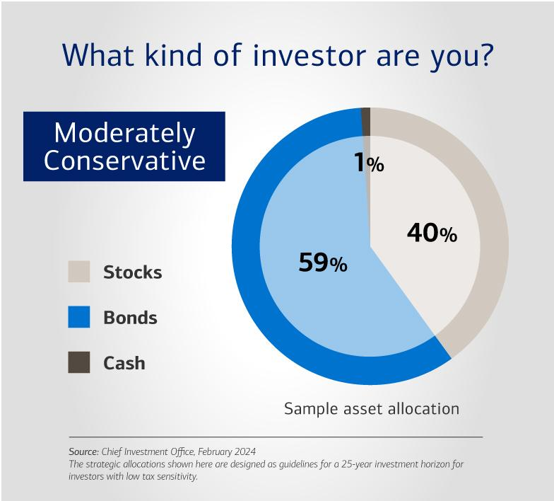

Investing has undergone considerable transformation with technological advancements and the development of innovative trading strategies. At the forefront of this transformation is algorithmic trading, commonly referred to as algo-trading, which integrates computer algorithms with financial trading to achieve enhanced accuracy and speed. Algo-trading utilizes complex computations and live data analysis to systematically execute trades, minimizing human error and emotion-driven decision-making [1]. This evolution allows traders to handle vast amounts of market data efficiently, executing transactions in milliseconds [2].

This article seeks to illuminate the point where investment strategy quizzes, strategic investing, and algorithmic trading converge. Investment strategy quizzes are tools that help individuals discern their risk profiles and investment preferences, laying a foundational understanding of one's investment strategy. These quizzes often assess factors such as risk tolerance, investment goals, and personal financial situations, providing an initial blueprint for strategic decision-making.



Strategic investing complements these quizzes by offering a framework tailored to an individual's specific financial goals, whether they are wealth preservation, income generation, or capital appreciation. In a rapidly changing financial landscape, aligning strategy with both personal insights from quizzes and the precision of algorithmic models can yield significant advantages.

By examining various investment strategies, incorporating quizzes, and leveraging the computational strength of algorithms, we seek to offer a comprehensive perspective. The aim is to demonstrate how these elements, when combined, can lead to informed and effective investment outcomes. As investors adapt to advancements in technology and data analysis, understanding the synergy between traditional strategies and algorithmic trading becomes indispensable.

References:

[1] Hasbrouck, J., & Saar, G. (2013). "Low-latency trading," Journal of Financial Markets, 16(4), 646-679.

[2] Aldridge, I. (2013). "High-frequency trading: A practical guide to algorithmic strategies and trading systems," John Wiley & Sons.

## Table of Contents

## Understanding Investing Strategies

Investing strategies are crucial for determining how investors can effectively reach their financial objectives. These strategies define the approach and actions an investor takes in managing their assets, critically influencing outcomes in their investment journey. The selection of an appropriate strategy often depends on an investor's risk tolerance, financial goals, and investment timeline. For example, strategies may vary significantly depending on whether an investor aims for capital preservation, moderate returns with some level of risk, or aggressive growth.

The spectrum of investment strategies ranges from conservative to aggressive. Conservative strategies, such as fixed-income investments or bonds, prioritize capital preservation and steady returns over higher, riskier profits. In contrast, aggressive strategies aim for significant growth, often through investing in high-[volatility](/wiki/volatility-trading-strategies) equities or emerging markets, accepting increased risk. A well-known balance is the moderate strategy, which might involve a mix of bonds (for stability) and stocks (for growth potential). 

One of the oldest and most common strategies is the buy-and-hold approach, which involves purchasing stocks or other securities and retaining them for an extended duration. This strategy relies on the notion that, despite market volatility, the securities' value will increase over time. Growth investing is another strategy focusing on securities expected to grow at an above-average rate compared to their industry or market sector. These could include investments in technology companies or innovative start-ups. Conversely, value investing involves selecting stocks undervalued by the market, purchasing them at lower prices in anticipation of their eventual price appreciation aligning with their intrinsic value.

Investors need to frequently evaluate their strategies to ensure alignment with personal and external financial conditions. Tools such as risk tolerance quizzes and financial planning sessions facilitate this process, allowing individuals to assess and realign their strategies according to their current circumstances and market variables. Risk tolerance quizzes help determine an investor's comfort level with potential losses in their investment portfolios. By objectively measuring an individual's risk tolerance through factors like age, income stability, and investment objectives, these quizzes enable investors to choose suitable strategies that respect their risk capacity.

Moreover, regular financial planning sessions guide investors by helping them to set realistic goals, evaluate market conditions, and adjust their strategies proactively. Such sessions often incorporate simulations or scenario analyses to visualize potential outcomes under various market conditions, providing insights into expected performance and risks.

In conclusion, understanding and wisely choosing investing strategies suited to one's financial goals and risk tolerance is vital for investment success. Leveraging tools such as quizzes and structured planning sessions helps refine these strategies over time, ensuring they remain aligned with personal and market dynamics.

## The Role of Quizzes in Determining Your Investing Strategy

Financial literacy and self-assessment quizzes provide significant insights into an individual's investing preferences, enabling investors to understand and refine their strategies efficiently. These online quizzes are increasingly popular due to their convenience and ability to personalize investment advice without requiring expert consultation.

Primarily, these quizzes help investors identify their risk tolerance—a critical [factor](/wiki/factor-investing) in determining suitable investment vehicles. By evaluating aspects such as age, income, financial objectives, and market knowledge, quizzes craft a profile that suggests appropriate investment strategies. For beginners, this can be an invaluable start to navigating the myriad of available investment opportunities. As they receive suggestions tailored to their unique profiles, novices gain confidence and clarity in establishing or modifying their investment approaches.

The typical structure of an investment quiz involves questions that gauge an individual's willingness to accept risk, the timeline for achieving financial goals, and current financial circumstances. For example, questions may inquire about the investor's response to potential market downturns or preference for stable versus high-growth investments. By presenting scenarios requiring introspection on hypothetical financial situations, these quizzes prompt individuals to critically analyze their comfort levels concerning potential gains and losses.

Moreover, quizzes serve as dynamic instruments that evolve alongside personal or market changes. Regularly updating quiz inputs ensures that the investment strategy adapts to life changes such as a salary increase, new liabilities, or shifting economic conditions. As markets and economic landscapes are in constant flux, periodic reassessment through updated quiz responses can significantly enhance the relevance and efficacy of an investment strategy.

Integrating such quizzes into the investment process provides an analytical approach to strategic planning. For instance, an individual’s risk tolerance might be quantified numerically and incorporated into an algorithmic model for precise strategy alignment. Using Python, one could model the output of such quizzes to map risk tolerance to portfolio allocation, ensuring adherence to a predefined risk profile.

```python
# Sample Python code to adjust portfolio allocation based on risk tolerance score from a quiz
def adjust_portfolio(risk_tolerance_score):
    # Scale risk tolerance score to determine percentage of assets allocated to stocks
    # Assumption: risk_tolerance_score is between 0 (risk-averse) and 100 (risk-seeking)
    stock_percentage = min(max(risk_tolerance_score, 0), 100)
    bond_percentage = 100 - stock_percentage

    return {"stocks": stock_percentage, "bonds": bond_percentage}

# Example usage
current_risk_score = 70  # Assume the result from the quiz
portfolio_allocation = adjust_portfolio(current_risk_score)
print("Portfolio allocation based on current risk tolerance:", portfolio_allocation)
```

This illustrative code snippet demonstrates how self-assessment quizzes can be quantitatively integrated into determining an investment strategy's tactical elements.

In conclusion, investment quizzes are a vital tool in enhancing investors' self-awareness and decision-making capabilities. They bridge the gap between academic investment principles and personal financial behavior, allowing individuals to construct investment strategies that are both responsive and aligned with their long-term objectives.

## Getting to Know Algorithmic Trading

Algorithmic trading refers to the use of computer algorithms to execute trading decisions automatically. The core of [algorithmic trading](/wiki/algorithmic-trading) lies in constructing precise mathematical models and instructions that allow traders to execute orders systematically. The algorithms used in this type of trading are typically pre-defined and are based on a variety of trading strategies.

Some common trading strategies include:

1. **Trend-Following Strategies**: These strategies are based on the assumption that securities that have been rising will continue to rise and those that have been falling will continue to fall. It involves using technical indicators such as moving averages to determine the direction of the market and make trading decisions without predictive algorithms.

2. **Arbitrage Strategies**: Arbitrage involves simultaneously buying and selling an asset in different markets to capitalize on the price difference. This strategy uses algorithms to identify and exploit slight pricing discrepancies that exist across markets.

Algorithmic trading seeks to reduce human error and emotional interference, contributing to more consistent trading outcomes. The emotionally charged nature of trading often leads to suboptimal decisions. By automating decision-making, algorithmic trading systems aim to mitigate these inefficiencies.

Understanding the benefits and risks associated with algorithmic trading is essential for effectively utilizing this technology. On the positive side, algorithmic trading can increase speed, allowing for rapid executions that align with favorable market prices. The reduction in transaction costs is another notable advantage as automated systems can continuously monitor and analyze market trends more efficiently than humans.

However, algorithmic trading is not without drawbacks. Technical glitches, such as system failures, can lead to significant errors or unintended trading activities. Moreover, the very reliance on algorithms can sometimes result in increased market volatility, as pre-programmed actions may exacerbate rapid market movements, as seen in several 'flash crash' events.

Prospective algo-traders must be cognizant of the technical demands inherent to this style of trading. Programming skills are critical, as understanding and developing trading algorithms often require proficiency in languages such as Python or C++. Furthermore, access to comprehensive market data is vital to design effective trading strategies and algorithms that can operate efficiently under diverse market conditions.

To demonstrate the basic logic of algorithmic trading, consider this simple Python example that uses a moving average crossover strategy—one of the trend-following methods:

```python
import pandas as pd

# Load historical price data
data = pd.read_csv('historical_prices.csv')

# Calculate moving averages
data['SMA_50'] = data['Close'].rolling(window=50).mean()
data['SMA_200'] = data['Close'].rolling(window=200).mean()

# Define trading signals
data['Signal'] = 0
data.loc[data['SMA_50'] > data['SMA_200'], 'Signal'] = 1  # Buy signal
data.loc[data['SMA_50'] < data['SMA_200'], 'Signal'] = -1 # Sell signal

# Simulate trading actions based on signal
data['Position'] = data['Signal'].diff()

# Display the trading signals
print(data[['Close', 'SMA_50', 'SMA_200', 'Signal', 'Position']])
```

This simple script calculates moving averages and generates buy or sell signals based on their crossover. Although rudimentary, this example illustrates the fundamental process of how algorithmic strategies can be encoded and executed in real-time trading.

## Combining Strategy, Quizzes, and Algorithms

Integrating human-led investment strategy assessments with algorithmic trading can optimize trading performance. The process begins with taking an investment strategy quiz, which offers valuable insights into personal risk tolerance, financial goals, and preferred asset classes. These quizzes are designed to evaluate an individual's financial profile and provide a clearer understanding of suitable investment paths.

By utilizing the results of these quizzes, investors can either develop new algorithmic trading strategies or refine existing ones. The insights derived from quizzes help in aligning algorithmic strategies closer to the investor's personal objectives and risk appetite. For instance, if a quiz indicates a preference for conservative investments, the algorithm could be adjusted to prioritize low-risk assets, such as government bonds or index funds.

Algorithmic trading implements quiz insights automatically, maintaining a consistent alignment between personal preferences and trading actions. This automation ensures that the human biases inherent in manual trading are reduced, leading to potentially more consistent and objective investment outcomes. For example, an algorithm could be programmed to execute trades only within the defined risk parameters, ensuring adherence to the investor's risk tolerance at all times.

A constant reevaluation of both quiz results and algorithm performance is vital to adapt to market dynamics. Financial markets are inherently volatile, and personal circumstances can change over time. Regular updates to quiz inputs ensure that the strategy remains relevant, while monitoring algorithm performance helps in identifying any deviations from expected outcomes. This feedback loop allows investors to make informed adjustments, optimizing both strategy alignment and trading efficiency.

The integration of quizzes and algorithmic trading represents a fusion of human insight with technological precision, offering a powerful approach to modern investing. This combination empowers investors to navigate the complexities of financial markets while maintaining a personalized investment strategy.

## Advantages and Disadvantages of Algorithmic Trading

Algorithmic trading, or algo-trading, presents several advantages that have revolutionized the financial markets. One of the primary benefits is its ability to significantly reduce transaction costs. By automating the trading process, algo-trading can execute trades at optimal prices with minimal delay. This efficiency is largely attributed to the algorithms' capacity to process market data and execute trades far quicker than any human trader. The constant scanning of markets allows algorithms to exploit short-lived opportunities that are often overlooked by manual trading approaches.

Moreover, algo-trading systematically evaluates vast amounts of data to identify patterns indicative of trading opportunities. This ability to integrate complex data analysis into trading strategies enables traders to capitalize on market inefficiencies quickly. For instance, algorithms might identify [arbitrage](/wiki/arbitrage) opportunities that exist between different markets or exchanges and execute trades to profit from these imbalances.

Despite these advantages, algo-trading is not without its drawbacks. The reliance on technology introduces a significant dependency that can lead to vulnerabilities, such as system outages or 'flash crashes.' Flash crashes occur when rapid automated selling leads to drastic drops in security prices, which can ripple through the market causing widespread panic. These events highlight the risk of over-reliance on algorithms that may lack the contextual understanding that human traders possess.

Additionally, algo-trading requires a comprehensive understanding of black swan events—rare and unpredictable occurrences that have severe consequences. Risk management becomes a critical component in the deployment of algorithmic trading systems to mitigate the impact of such events. Robust risk management frameworks should be in place to monitor algorithm performance, particularly during periods of market turbulence.

Integrating human judgment with algorithmic precision can provide a balanced approach that leverages the strengths of both. Humans can provide strategic oversight and intervene when extraordinary market conditions arise, while algorithms efficiently manage the execution of trades under normal circumstances. This hybrid approach can help in achieving optimal performance, ensuring that the benefits of algorithmic trading are maximized while mitigating its inherent risks.

In conclusion, while algo-trading offers significant advantages in terms of efficiency and cost-effectiveness, understanding and managing its inherent risks is crucial for sustained success in the financial markets.

## Conclusion

Investors today have the unique opportunity to combine traditional strategy selection with cutting-edge technology, enhancing their ability to navigate the financial markets effectively. Strategic quizzes and algorithmic trading offer avenues to refine decision-making processes, reducing inherent biases often encountered in human judgment, and streamlining trading efficiency. These tools enable investors to tailor investment strategies suited to their individual profiles, while also leveraging the computational power and speed of automated trading systems.

Continuous learning, adaptation, and strategy revaluation are essential components of any successful investment approach. Markets are dynamic, influenced by a multitude of factors that necessitate regular reassessment of strategies to ensure alignment with current conditions. By incorporating personal insights derived from investor quizzes into algorithmic models, investors can create a synergistic approach that balances intuition and data-driven precision, thus optimizing investment outcomes.

Embracing advancements in investment tools is crucial for staying ahead in today’s rapidly evolving market environment. The integration of personal strategic insights with algorithmic capabilities provides a robust platform for investors to enhance their asset management practices, capitalize on market opportunities, and ultimately achieve their financial objectives with greater efficacy.

## References & Further Reading

[1]: Hasbrouck, J., & Saar, G. (2013). ["Low-latency trading,"](https://www.sciencedirect.com/science/article/abs/pii/S1386418113000165) Journal of Financial Markets, 16(4), 646-679.

[2]: Aldridge, I. (2013). ["High-frequency trading: A practical guide to algorithmic strategies and trading systems,"](https://www.wiley.com/en-us/High+Frequency+Trading%3A+A+Practical+Guide+to+Algorithmic+Strategies+and+Trading+Systems%2C+2nd+Edition-p-9781118343500) John Wiley & Sons.

[3]: Bergstra, J., Bardenet, R., Bengio, Y., & Kégl, B. (2011). ["Algorithms for Hyper-Parameter Optimization."](https://proceedings.neurips.cc/paper/2011/file/86e8f7ab32cfd12577bc2619bc635690-Paper.pdf) Advances in Neural Information Processing Systems 24.

[4]: Lopez de Prado, M. (2018). ["Advances in Financial Machine Learning,"](https://www.amazon.com/Advances-Financial-Machine-Learning-Marcos/dp/1119482089) Wiley.

[5]: Aronson, D. (2006). ["Evidence-Based Technical Analysis: Applying the Scientific Method and Statistical Inference to Trading Signals,"](https://www.wiley.com/en-us/Evidence+Based+Technical+Analysis%3A+Applying+the+Scientific+Method+and+Statistical+Inference+to+Trading+Signals-p-9780470008744) Wiley.

[6]: Jansen, S. (2020). ["Machine Learning for Algorithmic Trading,"](https://github.com/stefan-jansen/machine-learning-for-trading) Packt Publishing.

[7]: Chan, E. P. (2009). ["Quantitative Trading: How to Build Your Own Algorithmic Trading Business,"](https://github.com/ftvision/quant_trading_echan_book) Wiley.