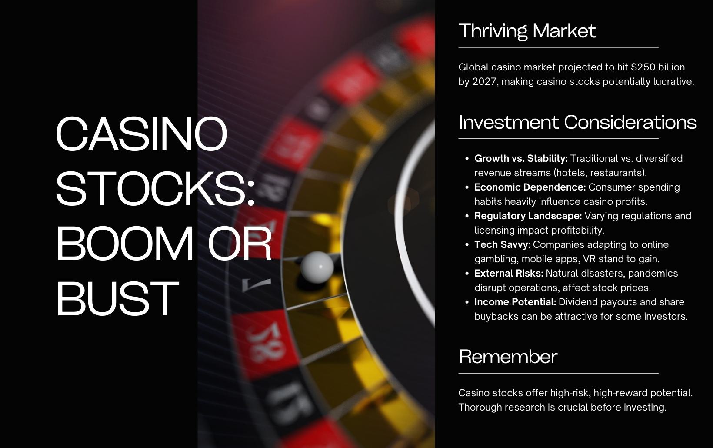

In the ever-evolving financial landscape, distinguishing between investing, gambling, financial strategy, and algorithmic trading can be complex. Each discipline has unique characteristics, yet their boundaries often overlap, leading to misconceptions and debates about their nature and interplay. This article aims to clarify these concepts by examining both their distinct features and shared aspects.

Investing typically involves committing capital to an asset with the expectation of generating future income or profit. It necessitates an understanding of market dynamics, economic indicators, and risk management strategies. Unlike gambling, where outcomes are predominantly based on chance, investing is guided by informed decisions and historical data analysis. However, the psychological element influencing investors can sometimes blur this line, as emotions and biases may lead to speculative behavior akin to gambling.



Algorithmic trading plays a transformative role in contemporary investing practices by leveraging technology to execute trades at speeds and frequencies beyond human capability. These computer-driven strategies, which include trend-following, arbitrage, and high-frequency trading, offer benefits of efficiency and precision. Yet, they also introduce challenges such as increased market volatility and the potential for systemic risks.

Beyond the technical execution, psychological and technical factors critically shape investment outcomes. Cognitive biases, such as overconfidence or loss aversion, can significantly impact decision-making processes, while technical elements like portfolio diversification and risk assessment tools are crucial in formulating robust financial strategies.

This article provides a thorough examination of these financial themes and their implications. By exploring the intersections and boundaries of investing, gambling, and algorithmic trading, readers will gain insights into the dynamics that define modern financial markets and the continuous learning curve required for effective participation.

## Table of Contents

## Investing vs. Gambling: Understanding the Difference

Investing and gambling are two concepts often conflated due to their inherent involvement with risk and potential reward. However, the fundamental distinction lies in the approach and objectives associated with each activity.

**Investing Defined**: Investing entails the allocation of capital to assets, such as stocks, bonds, or real estate, with the expectation of generating income or profit over time. This process involves informed decision-making, risk assessment, and strategic planning to achieve specific financial goals. The expectation of returns in investing is based on thorough analysis and an understanding of market dynamics. Investors typically rely on data analysis, historical performance, and economic indicators to make decisions. For instance, a diversified investment portfolio might include a mix of asset classes tailored to balance risk and growth potential.

**Gambling Defined**: In contrast, gambling involves placing a bet on an uncertain outcome with the primary aim of immediate gain, often without regard for the underlying probabilities. It is characterized by risk-taking based on chance, where the outcome is largely unpredictable and can result in significant losses. Games of chance like lotteries, casino games, and sports betting exemplify gambling activities, where skill and strategy play a minimal role compared to luck.

**Psychological Drivers**: Psychological tendencies, such as overconfidence, herd behavior, and the illusion of control, can blur the line between investing and gambling. Some individuals might engage in speculative investing, treating it as a form of gambling, hoping for quick gains without substantial analysis. Cognitive biases, such as the recency bias, where people give undue weight to recent events, can further distort their perception of investment decisions.

**Key Principles and Strategies**: Disciplined investing is distinguished from gambling through the application of several key principles:

1. **Research and Analysis**: Investment decisions are grounded in comprehensive research. Fundamental and technical analysis provides insights into asset valuation and market conditions, thereby reducing uncertainty.

2. **Risk Management**: Effective risk management strategies, such as stop-loss orders and asset allocation, help investors mitigate potential losses. Diversification across various asset classes and geographic regions can also spread risk.

3. **Long-term Perspective**: Investors typically adopt a long-term perspective, allowing for potential short-term volatility without derailing financial objectives. This approach contrasts with gambling’s focus on short-term wins.

4. **Strategic Planning**: Crafting a robust strategic plan with defined goals, risk tolerance, and time horizon is essential to investing. This structured approach facilitates disciplined execution and continuous assessment of performance.

Through these strategies, investing aims to align with financial objectives while managing risks, unlike gambling, which involves high stakes based on chance without strategic foresight.

## Financial Strategies: Balancing Risk and Reward

In effective investing, financial strategies play a crucial role in balancing risk and reward. These strategies involve the application of various financial tools and techniques aimed at mitigating risk while optimizing potential returns. A fundamental component of risk management is portfolio diversification. By allocating investments across different asset classes—such as stocks, bonds, and real estate—investors can reduce the impact of a poor performance of any single asset on their overall portfolio. The correlation between assets is a key consideration; ideally, investors should choose assets that have low or negative correlations to maximize diversification benefits.

Risk assessment tools are essential in financial strategy development. These tools include statistical measures such as standard deviation, Value at Risk (VaR), and beta, which help quantify and evaluate the risk associated with different investment options. VaR, for instance, estimates the potential loss in value of an asset or portfolio over a defined period for a given confidence interval, allowing investors to understand potential exposure to market [volatility](/wiki/volatility-trading-strategies).

Strategic financial planning goes beyond basic risk assessment and diversification. It involves aligning investment choices with long-term financial goals, considering factors such as time horizon, [liquidity](/wiki/liquidity-risk-premium) needs, and risk tolerance. Strategies such as dollar-cost averaging—regularly investing a fixed amount over time—can mitigate the impact of market volatility by spreading out the purchase price of investments.

Investor decision-making can often be influenced by emotions and cognitive biases, which can lead to irrational choices. Common biases include overconfidence, loss aversion, and herd behavior. To counteract these influences, investors are encouraged to adopt a disciplined approach, adhering strictly to predetermined investment criteria and strategies rather than reacting impulsively to market movements.

Behavioral finance suggests techniques to manage such biases, such as setting specific investment goals and rules in advance, maintaining a long-term focus, and regularly reviewing portfolio performance against the investment plan. Utilizing technology like [algorithmic trading](/wiki/algorithmic-trading) systems, which execute trades based on predefined criteria, can also help eliminate emotional biases.

In conclusion, understanding and implementing effective financial strategies is essential for balancing risk and reward in investing. By leveraging diversification, utilizing risk assessment tools, engaging in strategic financial planning, and mitigating emotional biases, investors can enhance their decision-making processes and improve the prospects of achieving their financial goals.

## Algorithmic Trading: The Intersection of Tech and Finance

Algorithmic trading refers to the use of computer algorithms to automate trading strategies, aiming to execute trades at speeds and frequencies that exceed human capabilities. It has become a cornerstone in modern finance by leveraging advanced mathematical models and high-speed data analytics to make trading decisions, minimizing human intervention. Algorithms operate by following pre-defined rules, allowing them to process a vast array of market variables and execute trades within milliseconds.

The primary advantage of algorithmic trading is its efficiency in executing large volumes of trades quickly and cost-effectively. Since algorithms can process and react to market information in real-time, they offer a significant edge over traditional manual trading, where delays can result in substantial cost differences. Additionally, algorithmic trading can reduce the likelihood of human errors and emotional biases that often accompany manual decision-making.

However, the automation of trading also introduces several challenges. Market volatility can be exacerbated by algorithmic trading, especially in cases where high-frequency trading ([HFT](/wiki/high-frequency-trading-strategies)) firms simultaneously execute numerous trades, potentially leading to rapid price swings and flash crashes. Another disadvantage lies in the potential for technical failures, which can result in substantial financial losses if not promptly addressed.

Common algorithmic trading strategies include:

1. **Trend-Following**: This strategy seeks to capture gains by analyzing momentum indicators such as moving averages. Algorithms generate buy or sell signals based on the crossing of short-term versus long-term averages, enabling traders to capitalize on established market trends.

2. **Arbitrage**: Algorithms exploit price discrepancies of the same asset across different markets. By executing simultaneous buy and sell orders, algorithms can lock in risk-free profits, contributing to market efficiency through price adjustment.

3. **High-Frequency Trading (HFT)**: This involves the rapid execution of a large number of orders within fractions of a second, enabling traders to profit from small price changes. HFT relies heavily on high-speed data feeds and low-latency execution systems.

In implementing these strategies, the role of data analysis and [backtesting](/wiki/backtesting) is crucial. Backtesting involves applying strategies to historical data to evaluate their potential performance in real-market conditions, which is essential for minimizing risks associated with algorithmic trading.

Overall, algorithmic trading represents a sophisticated integration of technology and finance, transforming the landscape of market operations while presenting unique advantages and challenges that traders and financial institutions must navigate.

## Is Algorithmic Trading a Gamble?

Algorithmic trading, often characterized by its reliance on mathematical models and sophisticated software, executes trades at speeds and volumes that are impossible for human traders. This functionality raises the question: can algorithmic trading be equated with gambling? 

At its core, gambling involves placing bets on outcomes that are fundamentally uncertain and often not influenced by systematic analysis. It typically relies on chance, where the odds are usually against the player, like in games of roulette or slot machines. Conversely, algorithmic trading is built on the foundation of calculated, rule-based decision-making. Algorithms are designed using a set of predefined rules derived from extensive data analysis and statistical models. 

The role of data analysis in algorithmic trading is pivotal. Traders use historical market data to identify patterns and trends, which inform the development of algorithms. This data-driven approach contrasts sharply with gambling, where decisions are rarely grounded on granular analysis. In algorithmic trading, backtesting is an essential process where strategies are tested against historical data to evaluate their effectiveness. A well-backtested strategy provides a statistical edge, aiming to minimize risk and enhance the chances of profitable outcomes, countering the randomness characteristic of gambling.

Strategy development in algorithmic trading is also a rigorous process. Traders and developers focus on crafting strategies that capitalize on market inefficiencies. For example, a simple moving average crossover strategy might involve buying a security when its short-term average price exceeds the long-term average, and selling when the reverse occurs. This contrasts with gambling, which does not typically involve such systematic approaches based on past performance data.

Common myths and misconceptions about algorithmic trading often exacerbate the confusion between it and gambling. One frequent misconception is that algorithmic trading guarantees profits with minimal effort, akin to a winning streak in gambling. In reality, while algorithms can process information at lightning speed and execute trades with precision, they require constant monitoring, updating, and validation to ensure their models remain relevant in changing market conditions.

Moreover, the presence of risk in both activities is not sufficient to categorize them as the same. While both gambling and algorithmic trading involve risk, the nature and management of that risk are fundamentally different. Algorithmic trading entails a calculated risk, where every trade is evaluated on its potential return and probability of success, using tools like the Sharpe ratio to quantify risk-adjusted returns. 

In summary, while both algorithmic trading and gambling involve uncertainty and risk, the former stands apart due to its reliance on systematic, data-driven strategies designed to manage and mitigate that risk. Hence, algorithmic trading should not be simply equated with gambling. Its success hinges on effective strategy development, continuous data analysis, and adaptation to evolving market conditions.

## Implementing Effective Trading Strategies with Algorithms

Implementing effective trading strategies with algorithms involves a comprehensive understanding of market conditions, technical requirements, and the integration of robust coding and infrastructure practices. Market conditions significantly impact the performance of algorithmic trading strategies. Traders need to account for market volatility, liquidity, and trends, as these factors can dramatically affect the execution and profitability of trades. Algorithms should be designed to adapt to varying conditions, employing strategies such as trend-following during stable periods or mean-reversion when markets are erratic.

Technical requirements form another crucial component. This includes a deep understanding of the trading platform, data feeds, and execution systems. Reliable data is the backbone of any algorithmic strategy; hence, accessing high-quality, real-time market data is essential. Furthermore, algorithm speed is paramount, especially in high-frequency trading. A delay of even milliseconds can impact the success of a trade, necessitating fast computational capabilities and efficient algorithms.

Coding is fundamental in creating these algorithms. Python is widely recommended due to its simplicity and robust libraries like NumPy, pandas, and scikit-learn, which facilitate data analysis, [machine learning](/wiki/machine-learning), and mathematical computation. Below is a simple example of how one can begin with coding a basic mean-reversion strategy using Python:

```python
import pandas as pd
import numpy as np

# Load historical price data
data = pd.read_csv('price_data.csv')
data['Returns'] = data['Close'].pct_change()

# Calculate moving average and standard deviation
data['Mean'] = data['Close'].rolling(window=20).mean()
data['Std'] = data['Close'].rolling(window=20).std()

# Identify buy/sell signals
data['Buy_Signal'] = np.where(data['Close'] < (data['Mean'] - data['Std']), 1, 0)
data['Sell_Signal'] = np.where(data['Close'] > (data['Mean'] + data['Std']), -1, 0)

```

Backtesting is imperative for validating these strategies. The process involves applying an algorithm to historical data to evaluate its viability and profitability before deploying it in the live market. Proper backtesting can identify potential pitfalls and optimize algorithm design. Additionally, walk-forward analysis can further enhance robustness by testing the strategy in unseen future datasets.

Infrastructure supports the deployment and maintenance of these algorithms. A stable internet connection, powerful servers, and robust databases ensure that strategies execute seamlessly and adapt to real-time market changes. A cloud-based infrastructure can also offer scalable solutions for data storage and computational needs.

Practical tips for both novices and seasoned traders include continual learning and adapting. Keeping abreast of market news, advances in technology, and financial regulations is critical. Practicing with paper trading accounts can provide hands-on experience without financial risk. Finally, network with other algorithmic traders to exchange insights and strategies, fostering an environment of mutual learning and improvement.

In conclusion, achieving success in algorithmic trading demands a blend of meticulous strategy formulation, technical acumen, continuous monitoring, and adaptation in response to evolving market landscapes.

## Conclusion

Understanding the distinctions and connections between investing, gambling, and algorithmic trading is crucial for anyone involved in financial markets. Investing is generally characterized by a calculated approach aimed at generating income or profit over time, guided by principles such as diversification and strategic planning. In contrast, gambling is often driven by chance with a focus on immediate gains, lacking the structured strategies that define disciplined investing. Algorithmic trading adds a technological layer to these financial activities, employing complex algorithms to execute trades rapidly and systematically.

The key distinction lies in the nature of risk assessment and decision-making. While both investing and gambling involve risk, the former is grounded in data analysis, forecasting, and strategic asset allocation. Algorithmic trading blends these traditional investing elements with technical advancements, offering both opportunities and challenges. It requires meticulous strategy development, coding proficiency, and robust backtesting to minimize risks, distinguishing it from the speculative nature associated with gambling.

For both novice and seasoned investors, applying disciplined strategies and informed decision-making remains imperative. This involves not only understanding various financial instruments and their risk-reward profiles but also mitigating emotional biases that can lead to suboptimal decisions. Algorithmic trading further emphasizes the importance of a methodical and data-driven approach, requiring continual adaptation to evolving market conditions.

The dynamic nature of financial markets demands a commitment to learning and adaptation. As technologies advance and market trends shift, traders and investors must stay informed about new developments and continuously refine their strategies. This ongoing learning curve ensures resilience and success in navigating the complexities of modern financial landscapes.

## References & Further Reading

[1]: Bergstra, J., Bardenet, R., Bengio, Y., & Kégl, B. (2011). ["Algorithms for Hyper-Parameter Optimization."](https://papers.nips.cc/paper/4443-algorithms-for-hyper-parameter-optimization) Advances in Neural Information Processing Systems 24.

[2]: ["Advances in Financial Machine Learning"](https://www.amazon.com/Advances-Financial-Machine-Learning-Marcos/dp/1119482089) by Marcos Lopez de Prado.

[3]: ["Evidence-Based Technical Analysis: Applying the Scientific Method and Statistical Inference to Trading Signals"](https://www.amazon.com/Evidence-Based-Technical-Analysis-Scientific-Statistical/dp/0470008741) by David Aronson.

[4]: ["Machine Learning for Algorithmic Trading"](https://github.com/stefan-jansen/machine-learning-for-trading) by Stefan Jansen.

[5]: ["Quantitative Trading: How to Build Your Own Algorithmic Trading Business"](https://www.amazon.com/Quantitative-Trading-Build-Algorithmic-Business/dp/1119800064) by Ernest P. Chan.

[6]: Thaler, R. H., & Shefrin, H. M. (1981). ["An Economic Theory of Self-Control."](https://www.jstor.org/stable/1833317) Journal of Political Economy, 89(2), 392-406.

[7]: Kahneman, D., & Tversky, A. (1979). ["Prospect Theory: An Analysis of Decision under Risk."](http://web.mit.edu/curhan/www/docs/Articles/15341_Readings/Behavioral_Decision_Theory/Kahneman_Tversky_1979_Prospect_theory.pdf) Econometrica, 47(2), 263-291.

[8]: Fama, E. F. (1991). ["Efficient Capital Markets: II."](https://onlinelibrary.wiley.com/doi/full/10.1111/j.1540-6261.1991.tb04636.x) The Journal of Finance, 46(5), 1575-1617.