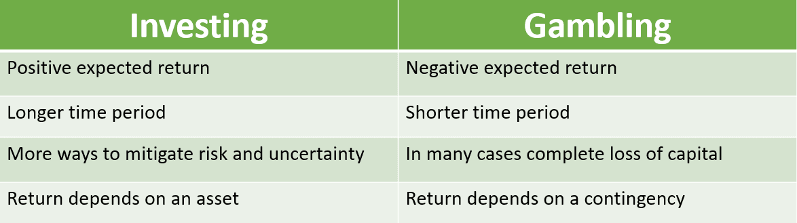

## Table of Contents

## What is the difference between investing and gambling?

Investing and gambling are two different ways to use money to try to make more money, but they work in different ways. Investing means putting money into things like stocks, bonds, or real estate, with the hope that these things will grow in value over time. When you invest, you usually do a lot of research and think about the long term. The goal is to make money slowly and steadily, and it's based on the idea that the economy and businesses will grow over time.

Gambling, on the other hand, is more like playing a game where you bet money on something that is mostly based on chance. This could be betting on sports, playing the lottery, or going to a casino. With gambling, you can win a lot of money quickly, but you can also lose it just as fast. It's more about luck than anything else, and it's not usually seen as a good way to build wealth over time.

The main difference between the two is the level of risk and the time frame. Investing is generally seen as a safer, more predictable way to grow your money over the long term, while gambling is riskier and more about short-term wins or losses. Both can make you money, but they are very different in how they work and the results they usually bring.

## What are the main goals of investing compared to gambling?

The main goal of investing is to grow your money over time. When you invest, you put your money into things like stocks, bonds, or real estate. You do this hoping that these things will become more valuable in the future. Investing is about being patient and thinking long-term. You want your money to grow slowly but steadily, so you can have more money later on. It's like planting a seed and waiting for it to grow into a big tree.

On the other hand, the main goal of gambling is to win money quickly. When you gamble, you bet money on games or events that are mostly based on luck. You might go to a casino, play the lottery, or bet on sports. The idea is to get a big win right away, but it's very risky. You could lose all your money just as fast as you could win it. Gambling is more about the thrill of the moment and the chance of a quick payoff, not about building wealth over time.

## How does risk management differ between investing and gambling?

Risk management in investing is all about trying to keep your money safe while still making it grow. When you invest, you look at a lot of information to decide where to put your money. You might spread your money out over different types of investments, like stocks, bonds, and real estate, so if one goes down, the others might still go up. This is called diversification. You also think about how long you want to keep your money invested, because over time, the ups and downs of the market can even out. The goal is to make smart choices that lower the chance of losing a lot of money all at once.

In gambling, risk management is very different because it's mostly about luck. When you gamble, you can't really control what happens, so you can't do much to lower the risk. Some people might set a limit on how much money they're willing to lose, but that's about it. You might win big, but you could also lose everything in a short time. Gambling is more about taking a chance and hoping for the best, not about making careful plans to protect your money.

## What are some common examples of investments versus gambling activities?

Common examples of investments include buying stocks, which means you own a small part of a company and hope its value goes up over time. Another example is buying bonds, where you lend money to a company or government and they pay you back with interest. Real estate is also a popular investment; you buy a house or property hoping it will be worth more money later. These are all ways to put your money into something that you think will grow in value over time.

On the other hand, common examples of gambling activities include playing slot machines at a casino, where you put in money and hope to win more based on luck. Betting on sports is another example; you guess which team will win and if you're right, you get money, but if you're wrong, you lose your bet. Playing the lottery is also gambling; you buy a ticket and hope to win a big prize, but the chances of winning are very small. These activities are all about taking a chance and hoping for a quick win, but they come with a high risk of losing money.

## How do time horizons affect the outcomes of investing versus gambling?

Time horizons have a big impact on the outcomes of investing. When you invest, you usually think about the long term. You might keep your money in stocks, bonds, or real estate for many years. Over a long time, the value of these investments can go up and down, but they often grow overall. This means that if you are patient and wait, you can make more money. The longer you keep your money invested, the more time it has to grow, and the less you have to worry about short-term ups and downs.

In gambling, the time horizon is usually very short. When you gamble, you want to win money right away. You might go to a casino and play a game, or bet on a sports event that happens that day. The outcome is quick, and you either win or lose in a short time. Because gambling is based on luck, the short time horizon means you can lose all your money fast, or you might get lucky and win big. But over time, gambling usually doesn't help you build wealth like investing does.

## What role does research and analysis play in investing compared to gambling?

Research and analysis are very important in investing. When you invest, you need to learn a lot about where you are putting your money. You look at things like how a company is doing, what the economy is like, and what might happen in the future. This helps you make smart choices about which stocks, bonds, or real estate to buy. By doing a lot of research, you can pick investments that are more likely to grow over time. This careful planning can help you avoid big losses and make your money grow.

In gambling, research and analysis don't help much. When you gamble, you are mostly relying on luck. You might look at things like a sports team's past games or try to guess which numbers might come up in the lottery, but these things don't really change your chances of winning. Gambling is more about taking a chance and hoping for the best. No matter how much you study or analyze, the outcome is still mostly up to luck.

## How does the concept of expected return vary between investing and gambling?

In investing, the expected return is what you think you will earn from your investment over time. You look at things like how much a company might grow, what the economy might do, and how much money you could make from interest or dividends. Because you do a lot of research, you can make a good guess about what your return might be. It's not a sure thing, but over the long term, investing usually gives you a steady return. For example, if you buy a stock, you hope its price will go up and you can sell it for more money later.

In gambling, the expected return is very different. It's all about luck, so it's hard to guess what you might win or lose. When you gamble, like playing a slot machine or betting on a sports game, the house usually has an edge. This means that over time, the casino or the betting company makes more money than the people who gamble. So, the expected return in gambling is often negative, meaning you are likely to lose money in the long run. Even if you win sometimes, the chances are against you, and you can't really predict what will happen.

## What psychological factors influence people to choose investing over gambling, or vice versa?

People choose investing over gambling because it feels safer and more in control. When you invest, you do a lot of research and make plans based on what you learn. This makes people feel like they can predict what might happen and that their money will grow over time. Investing also matches with the idea of working hard and being patient to build wealth slowly. People who like to plan for the future and want to feel secure about their money often choose investing. It's about being smart and steady, not taking big risks.

On the other hand, people might choose gambling because it's exciting and gives a quick thrill. Gambling is all about the chance to win big money right away, which can be very tempting. Some people enjoy the rush of not knowing what will happen and the possibility of a big win. It's more about the fun and the moment than about building wealth over time. People who like to take risks and enjoy the excitement of not knowing the outcome might be drawn to gambling. It's about the thrill and the hope of a quick payoff, even if it's risky.

## How do regulatory environments impact investing and gambling differently?

Regulatory environments have a big impact on investing. Governments make rules to keep the stock market and other investments safe and fair. These rules say things like how companies have to tell the truth about their money and what they are doing. This helps people trust that their investments are safe. There are also rules about how much risk banks and other big investors can take. All these rules make investing more stable and help people feel more sure about where they put their money.

Gambling is also affected by rules, but in a different way. Governments make laws to control where and how people can gamble. They might say that only certain places, like casinos or online sites, can offer gambling. There are also rules to stop people from gambling too much and to make sure games are fair. But gambling is still seen as risky, and the rules are more about keeping it under control than making it safe like with investing. So, while both investing and gambling have rules, the rules for investing are more about safety and trust, and the rules for gambling are more about control and fairness.

## What are the tax implications of earnings from investing versus gambling?

When you make money from investing, like selling stocks or getting dividends, you usually have to pay taxes on it. The tax you pay depends on how long you held the investment. If you held it for more than a year, it's called a long-term capital gain, and the tax rate is usually lower. If you held it for less than a year, it's a short-term capital gain, and you pay your regular income tax rate on it. Some investments, like certain bonds, might have different tax rules, but in general, the government wants to tax the money you make from investing.

When you win money from gambling, you also have to pay taxes on it. The casino or betting company will usually take out some money for taxes right away if you win a big amount. You report your gambling winnings on your tax return, and you pay your regular income tax rate on it. But, you can also take away some of your gambling losses from your winnings when you do your taxes, which can lower how much tax you owe. So, while both investing and gambling earnings are taxed, the way you report and pay taxes on them can be different.

## How can one transition from a gambling mindset to an investing mindset?

Moving from a gambling mindset to an investing mindset means changing how you think about money and risk. When you gamble, you're looking for a quick win and you're okay with taking big risks. But when you invest, you need to be patient and think about the long term. You have to learn to do research and make plans based on what you find out. Instead of hoping for a big win right away, you focus on growing your money slowly over time. This change can be hard because it means you have to be okay with not seeing big results right away and being more careful with your money.

To make this transition, start by learning about different types of investments like stocks, bonds, and real estate. Read [books](/wiki/algo-trading-books), take classes, or talk to people who know about investing. This will help you understand how to pick good investments and how to spread your money out to lower your risk. Also, set clear goals for what you want to achieve with your money and make a plan to reach those goals. Over time, as you see your investments grow, you'll start to feel more comfortable with the idea of building wealth slowly and steadily, rather than trying to win big quickly.

## What advanced strategies can be used to optimize returns in investing that are not applicable to gambling?

One advanced strategy for optimizing returns in investing is called dollar-cost averaging. This means you put a fixed amount of money into an investment at regular times, like every month. By doing this, you buy more shares when the price is low and fewer shares when the price is high. Over time, this can help you pay less on average for your investments and make more money. This strategy works well because it takes away some of the risk of trying to guess when the market will go up or down. You can't use this in gambling because gambling is all about luck and quick wins, not about slowly building up over time.

Another strategy is called asset allocation, which means you spread your money across different types of investments, like stocks, bonds, and real estate. This helps lower your risk because if one type of investment goes down, the others might still go up. You can also change how much money you put into each type of investment based on how old you are or how much risk you want to take. This strategy needs a lot of planning and thinking about the future, which you can't do in gambling. In gambling, you can't control what happens, so you can't use strategies like asset allocation to make your money safer and grow it over time.

## References & Further Reading

[1]: Bergstra, J., Bardenet, R., Bengio, Y., & Kégl, B. (2011). ["Algorithms for Hyper-Parameter Optimization."](https://papers.nips.cc/paper/4443-algorithms-for-hyper-parameter-optimization) Advances in Neural Information Processing Systems 24.

[2]: ["Advances in Financial Machine Learning"](https://www.amazon.com/Advances-Financial-Machine-Learning-Marcos/dp/1119482089) by Marcos Lopez de Prado.

[3]: ["Evidence-Based Technical Analysis: Applying the Scientific Method and Statistical Inference to Trading Signals"](https://www.amazon.com/Evidence-Based-Technical-Analysis-Scientific-Statistical/dp/0470008741) by David Aronson.

[4]: ["Machine Learning for Algorithmic Trading"](https://github.com/stefan-jansen/machine-learning-for-trading) by Stefan Jansen.

[5]: ["Quantitative Trading: How to Build Your Own Algorithmic Trading Business"](https://www.amazon.com/Quantitative-Trading-Build-Algorithmic-Business/dp/1119800064) by Ernest P. Chan.

[6]: Thaler, R. H., & Shefrin, H. M. (1981). ["An Economic Theory of Self-Control."](https://www.jstor.org/stable/1833317) Journal of Political Economy, 89(2), 392-406.

[7]: Kahneman, D., & Tversky, A. (1979). ["Prospect Theory: An Analysis of Decision under Risk."](http://web.mit.edu/curhan/www/docs/Articles/15341_Readings/Behavioral_Decision_Theory/Kahneman_Tversky_1979_Prospect_theory.pdf) Econometrica, 47(2), 263-291.

[8]: Fama, E. F. (1991). ["Efficient Capital Markets: II."](https://onlinelibrary.wiley.com/doi/full/10.1111/j.1540-6261.1991.tb04636.x) The Journal of Finance, 46(5), 1575-1617.