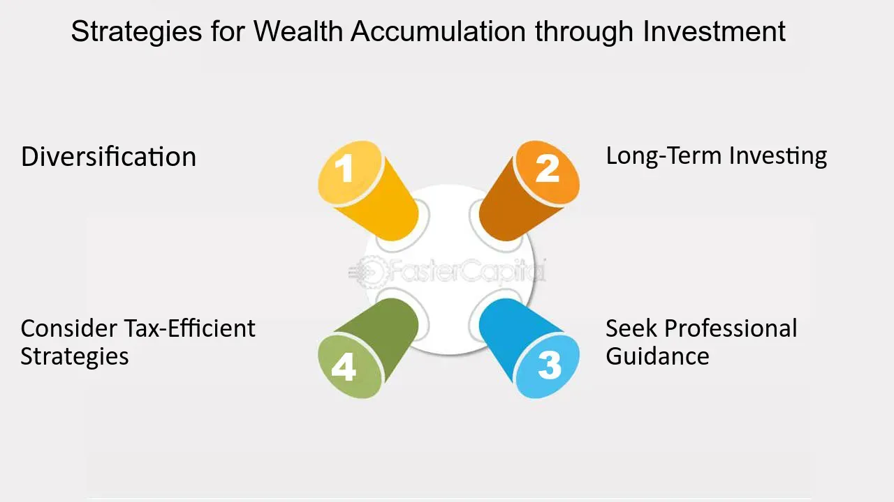

## Table of Contents

## What is investment accumulation and why is it important?

Investment accumulation is the process of growing your money over time by investing it in different places like stocks, bonds, or real estate. When you invest, your money can earn more money through interest, dividends, or increases in value. This is different from just saving money in a bank account, where the growth is usually slower. By investing, you're letting your money work for you, and over time, the amount you have can grow much larger.

This process is important because it helps you reach your financial goals, like buying a house, paying for education, or retiring comfortably. The earlier you start investing, the more time your money has to grow. This is because of something called compound interest, where you earn interest on both your original money and the interest it earns. Over many years, this can turn small, regular investments into a big sum. So, understanding and using investment accumulation can really help you build wealth and secure your financial future.

## What are the basic types of investment vehicles suitable for beginners?

For beginners, some of the best types of investment vehicles are savings accounts, mutual funds, and exchange-traded funds (ETFs). A savings account is a safe place to start because it's easy to open and your money grows slowly with interest. Mutual funds are another good choice because they let you invest in a bunch of different things at once, like stocks or bonds, without needing to pick them yourself. Someone else manages the fund, which makes it simpler for beginners. ETFs are similar to mutual funds but you can buy and sell them like stocks during the day.

Another option for beginners is to invest in individual stocks. This means you buy a small piece of a company. It can be riskier because the value of the stock can go up and down a lot, but it can also be exciting to pick companies you believe in. Lastly, bonds are a safer choice. When you buy a bond, you're lending money to a company or the government, and they pay you back with interest over time. Bonds are less risky than stocks, but they usually grow more slowly. Each of these options has its own level of risk and reward, so it's good to learn about them and maybe start with the ones that feel safest to you.

## How does compound interest work in investment accumulation?

Compound interest is like a snowball rolling down a hill, getting bigger as it goes. When you invest money, you earn interest on it. With compound interest, you don't just earn interest on the money you put in, but also on the interest that money has already earned. So, if you start with $100 and it earns 5% interest each year, after the first year, you'll have $105. In the second year, you'll earn 5% on $105, not just the original $100, so you'll have $110.25. This keeps happening, making your money grow faster and faster over time.

This is why starting to invest early is so important. The longer your money is invested, the more time it has to grow through compound interest. If you invest $1,000 at age 25 and it grows at 5% a year, by the time you're 65, you'll have over $7,000, even if you never add more money. But if you wait until you're 35 to start, you'll only have about $4,300 by age 65. That's a big difference! Compound interest can turn small, regular investments into a lot of money over many years, helping you reach your financial goals.

## What are the differences between saving and investing for accumulation?

Saving and investing are both ways to grow your money, but they work differently. Saving usually means putting your money in a bank account, like a savings account. The money in a savings account grows slowly because it earns a small amount of interest over time. Saving is safe and easy, and it's good for money you might need soon, like for an emergency or a short-term goal. But the growth is slow, so it's not the best way to build a lot of wealth over many years.

Investing, on the other hand, means putting your money into things like stocks, bonds, or real estate. When you invest, your money can grow much faster because you can earn more through things like interest, dividends, or the value of your investments going up. But investing can also be riskier because the value of your investments can go down as well as up. That's why investing is better for long-term goals, like saving for retirement or buying a house in the future. Over many years, the growth from investing can be much bigger than from saving, thanks to something called compound interest.

## How can diversification help in managing investment risks?

Diversification is like not putting all your eggs in one basket. When you invest, you can spread your money across different types of investments, like stocks, bonds, and real estate. This way, if one of your investments doesn't do well, the others might still be okay. It's like having a safety net. If one part of your investments goes down, the other parts can help balance it out, so you don't lose as much money.

This strategy helps manage risk because it reduces the chance that all your money will be affected by one bad event. For example, if you only invest in one company's stock and that company does poorly, you could lose a lot. But if you have money in many different companies, and even different types of investments, a problem with one won't hurt as much. Over time, diversification can help your investments grow more steadily and safely, making it easier to reach your financial goals.

## What role do time horizon and risk tolerance play in choosing accumulation strategies?

Time horizon is how long you plan to keep your money invested before you need it. If you're saving for something you'll need soon, like a car in a year, you'll want a safer place to put your money, like a savings account. But if you're saving for something far away, like retirement in 30 years, you can take more risks because you have time to recover if your investments go down. So, a longer time horizon means you can choose investments that might grow more but are also riskier, like stocks.

Risk tolerance is how much risk you're okay with taking. Some people don't mind if their money goes up and down a lot because they hope it will grow more in the end. These people have a high risk tolerance and might choose to invest in stocks or other risky things. But if the thought of losing money makes you nervous, you have a low risk tolerance. You might choose safer investments like bonds or a savings account. Knowing your risk tolerance helps you pick investments that you'll feel good about, even when the market changes.

## What are some common mistakes to avoid in investment accumulation?

One common mistake people make in investment accumulation is not starting early enough. The earlier you start, the more time your money has to grow through compound interest. If you wait too long, you miss out on years of growth. Another mistake is putting all your money in one place. This is risky because if that one investment does badly, you could lose a lot. It's better to spread your money around in different types of investments, which is called diversification. This can help protect your money and make it grow more steadily.

Another mistake is trying to time the market, which means trying to guess when to buy and sell investments to make the most money. This is really hard to do and can lead to big losses. It's usually better to invest for the long term and not worry too much about short-term changes. Also, some people chase after investments that have done well recently, hoping to get the same big returns. But past performance doesn't guarantee future results, and this can lead to buying high and selling low. It's important to do your research and pick investments that fit your goals and how much risk you're okay with.

## How can one use tax-advantaged accounts to enhance investment accumulation?

Tax-advantaged accounts are special types of accounts that can help your investments grow faster because they offer tax benefits. There are different kinds, like 401(k)s and IRAs. With these accounts, you might not have to pay taxes on the money you put in right away, or you might not have to pay taxes on the money your investments earn until you take it out. This can make a big difference because the money that would have gone to taxes can stay in your account and keep growing.

Using these accounts can really help you save more for the future. For example, if you put money into a 401(k), you can lower your taxes now and let your money grow without being taxed until you retire. This means more of your money can be invested and earn compound interest over time. It's a good idea to learn about the different tax-advantaged accounts and see which ones fit your goals and situation, so you can make the most of your investments.

## What advanced strategies can be used to optimize investment returns?

One advanced strategy to optimize investment returns is called dollar-cost averaging. This means you invest a fixed amount of money at regular times, like every month, instead of trying to time the market. By doing this, you buy more shares when prices are low and fewer when prices are high, which can lead to a lower average cost per share over time. This strategy helps reduce the risk of investing a large amount at the wrong time and can lead to better long-term results.

Another strategy is rebalancing your portfolio. This means you check your investments every so often and adjust them to keep the mix of investments you want. For example, if stocks have done well and now make up a bigger part of your portfolio than you planned, you might sell some stocks and buy more bonds to get back to your original mix. Rebalancing helps you stay on track with your risk level and can actually boost your returns over time by selling high and buying low.

A third strategy is to use tax-loss harvesting. This means you sell investments that have lost value to offset the taxes you owe on your gains. If you have some investments that are down, you can sell them and use those losses to reduce your taxable income. Then, you can buy similar investments to keep your portfolio the same. This can help you keep more of your money and let it grow without being eaten up by taxes.

## How do economic cycles affect investment accumulation strategies?

Economic cycles are like the ups and downs of the economy. They can change how well your investments do. When the economy is growing, it's called an expansion. During this time, businesses do well, and the stock market usually goes up. This can be a good time to invest in stocks because they might grow a lot. But when the economy slows down, it's called a recession. During a recession, businesses might struggle, and the stock market can go down. This can be a risky time for stocks, but it might be a good time to buy them at a lower price if you believe the economy will get better.

Understanding where we are in the economic cycle can help you decide what to do with your investments. If you think a recession is coming, you might want to move some of your money into safer investments like bonds or cash. These don't grow as fast, but they are less likely to lose value during tough times. On the other hand, if you think the economy is about to start growing again, you might want to put more money into stocks to take advantage of the growth. By paying attention to economic cycles, you can adjust your investment strategy to try and get the best returns while managing risk.

## What are the benefits and risks of using leverage in investment accumulation?

Using leverage in investment accumulation means borrowing money to invest. The main benefit of this is that it can help your investments grow faster. If you invest $1,000 of your own money and it grows by 10%, you'll have $1,100. But if you borrow another $1,000 and invest $2,000 total, that same 10% growth will give you $2,200. After paying back the loan, you'll still have more money than if you had just used your own money. This can be a powerful way to increase your returns, especially if you're confident in your investments.

However, using leverage also comes with big risks. If your investments go down instead of up, you could lose more than just your own money. For example, if you borrow $1,000 and invest $2,000 total, and your investments drop by 10%, you'll be left with $1,800. After paying back the loan, you'll have less money than you started with. This can put you in a tough spot financially. Leverage can make gains bigger, but it can also make losses bigger, so it's important to understand these risks and use leverage carefully.

## How can one evaluate and adjust their investment accumulation strategy over time?

To evaluate and adjust your investment accumulation strategy over time, you need to keep an eye on how your investments are doing. This means checking your portfolio regularly to see if it's growing the way you want it to. You can compare your returns to things like the stock market's overall performance or a specific benchmark to see if you're doing well. If your investments are not doing as well as you hoped, or if your goals have changed, it might be time to make some adjustments. This could mean selling some investments that aren't working out and buying others that you think will do better.

Adjusting your strategy also means thinking about your risk tolerance and time horizon. As you get closer to your goal, like retirement, you might want to move some of your money into safer investments to protect what you've built. On the other hand, if you have a long time before you need the money, you might be able to take more risks to try and grow your investments faster. It's also important to stay informed about the economy and how it might affect your investments. By keeping an eye on these things and making changes when needed, you can keep your investment strategy on track and help your money grow over time.

## What is Understanding Investment Accumulation?

Investment accumulation is a fundamental strategy for individuals seeking to build wealth systematically over time. It involves making consistent, regular contributions to an investment portfolio, with the aim of benefiting from the power of compounding. This process can significantly enhance the value of the portfolio, as the earnings on investments are reinvested to generate their own returns.

### Reinvesting Dividends and Capital Gains

A critical component of investment accumulation is the reinvestment of dividends and capital gains. When dividends, the distribution of a company's earnings to its shareholders, are reinvested, they purchase additional shares of the stock or fund, thereby increasing the investor's holdings without the need for additional capital. Similarly, capital gains, which are profits from the sale of an asset, can be reinvested to acquire more units of the investment. Over time, this reinvestment of earnings facilitates a compounding effect, where returns are generated on both the original investment and on accumulated returns from prior periods. The formula for compound interest, which illustrates this concept, is given by:

$$
A = P \left(1 + \frac{r}{n}\right)^{nt}
$$

where:
- $A$ is the future value of the investment,
- $P$ is the principal investment amount,
- $r$ is the annual interest rate (decimal),
- $n$ is the number of times that interest is compounded per year,
- $t$ is the number of years the money is invested for.

### Investment Vehicles

Investors have a choice of several investment vehicles for accumulation, each with its own characteristics and risks. Mutual funds, exchange-traded funds (ETFs), and individual stocks are popular options. 

- **Mutual Funds**: These are investment programs funded by shareholders that trade in diversified holdings and are professionally managed. They offer convenience and diversification, making them a favored choice for accumulation strategies.

- **ETFs**: Like mutual funds, ETFs hold a collection of assets but trade on exchanges like stocks. They provide the benefits of diversification with the flexibility of trading in real time.

- **Stocks**: Individual stocks offer potentially higher returns, albeit with higher risks, and can be suitable for investors with a higher risk tolerance looking to focus on specific companies.

### Accumulation Plans and Their Long-Term Impact

Various accumulation plans allow investors to tailor their strategies to their personal financial situations and goals. One such plan is the Dollar-Cost Averaging (DCA), where an investor contributes a fixed amount of money to investments at regular intervals, regardless of market conditions. This strategy reduces the impact of market [volatility](/wiki/volatility-trading-strategies) and lowers the average cost per share over time, as more shares are purchased when prices are low and fewer when higher.

Another option is using retirement accounts such as 401(k)s or IRAs, which provide tax advantages that can significantly impact long-term wealth accumulation. These accounts offer compound growth and deferred taxes on earnings until withdrawals, which can greatly enhance the growth potential of an individual's savings.

The ultimate objective of investment accumulation is to grow the portfolio sufficiently to meet future financial needs, such as retirement, education, or major purchases. By consistently contributing and reinvesting, investors harness the power of market growth and compounding returns, potentially achieving substantial financial success over the long term. 

Overall, understanding and implementing an effective investment accumulation strategy is essential for anyone looking to build wealth systematically and efficiently over time.

## References & Further Reading

[1]: ["Advances in Financial Machine Learning"](https://www.amazon.com/Advances-Financial-Machine-Learning-Marcos/dp/1119482089) by Marcos Lopez de Prado

[2]: ["Evidence-Based Technical Analysis: Applying the Scientific Method and Statistical Inference to Trading Signals"](https://www.amazon.com/Evidence-Based-Technical-Analysis-Scientific-Statistical/dp/0470008741) by David Aronson

[3]: ["Machine Learning for Algorithmic Trading"](https://www.amazon.com/Machine-Learning-Algorithmic-Trading-alternative/dp/1839217715) by Stefan Jansen

[4]: ["Quantitative Trading: How to Build Your Own Algorithmic Trading Business"](https://www.amazon.com/Quantitative-Trading-Build-Algorithmic-Business/dp/1119800064) by Ernest P. Chan

[5]: Bergstra, J., Bardenet, R., Bengio, Y., & Kégl, B. (2011). ["Algorithms for Hyper-Parameter Optimization."](https://dl.acm.org/doi/10.5555/2986459.2986743) Advances in Neural Information Processing Systems 24.