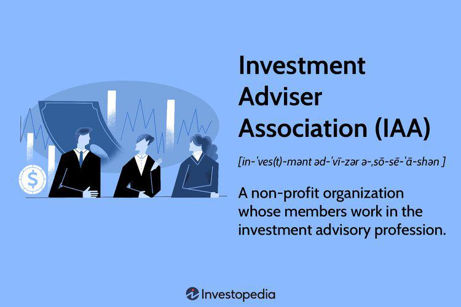

The world of finance is experiencing a fundamental transformation, driven by cutting-edge technological advancements. Central to this transformation is automated trading, often referred to as algorithmic trading, a practice that utilizes sophisticated algorithms and data analytics to execute trades with speed and precision. This method is revolutionizing the manner in which investment strategies are developed and implemented.

Amidst this backdrop of rapid change, the Investment Adviser Association (IAA) holds a significant position. Established in 1937, the IAA is a prominent organization representing SEC-registered investment advisers. As the investment landscape evolves, understanding the role and influence of the IAA is crucial, especially as it intersects with the growing field of automated trading.



The IAA's impact is multifaceted; it not only advocates for maintaining fiduciary duties and best practices within the investment advisory profession but also provides essential educational and regulatory resources. This comprehensive support aims to equip its members with the tools needed to navigate the complexities of modern financial markets.

As automated trading continues to gain momentum, it is crucial to explore how entities like the IAA contribute to shaping the future of investment advice. By examining this intersection, we gain valuable insights into contemporary investment strategies, helping advisers leverage technology while adhering to their regulatory and ethical obligations.

## Table of Contents

## Understanding the Investment Adviser Association (IAA)

The Investment Adviser Association (IAA) serves as a pivotal organization representing SEC-registered investment advisers across the United States. Founded in 1937, the IAA has played a crucial role in the development and adoption of significant regulatory frameworks, most notably the Investment Advisers Act of 1940. This Act established the fiduciary duty owed by advisers to their clients, underscoring the importance of maintaining high standards in investment advice and financial management.

The IAA's advocacy for the investment advisory profession ensures that fiduciary standards are not only maintained but also adapted to meet evolving industry dynamics. By promoting best practices, the IAA helps safeguard the interests of investors and enhances the credibility of the advisory sector. The association's membership is extensive, comprising over 650 firms managing an estimated $25 trillion in client assets. This significant representation empowers the IAA to influence public policy and regulatory decisions that impact the financial advisory landscape.

Beyond advocacy, the IAA provides a wealth of educational resources and regulatory guidance for its members. These resources are designed to help advisers navigate the complexities of financial regulation, ensure compliance, and continuously improve their service offerings. By offering continuous professional development opportunities, the IAA helps its members stay informed about industry trends and regulatory changes, thereby supporting the overall integrity and professionalism of the advisory profession.

## The Role of the IAA in Financial Regulation

The Investment Adviser Association (IAA) is a significant influencer in shaping the regulatory environment for investment advisers. By actively engaging with the U.S. Securities and Exchange Commission (SEC) and other regulatory bodies, the IAA works to implement changes that enhance the profession's efficiency and integrity. Its advocacy efforts underscore the importance of transparency, investor protection, and the upholding of ethical standards within investment management.

One of the primary functions of the IAA is to provide a strong advocacy platform that addresses the concerns and needs of investment advisers at both federal and state levels. This platform is essential for ensuring that the voices of over 650 member firms, which collectively manage approximately $25 trillion in client assets, are heard and considered in policy-making processes. These firms rely on the IAA to represent their interests effectively, facilitating the development of regulations that are conducive to robust and ethical investment practices.

Moreover, the IAA offers a wealth of compliance resources designed to assist investment advisers in navigating the often complex regulatory landscapes they face. These resources are tailored to help firms remain compliant with evolving regulations and to promote best practices in fiduciary conduct. By providing detailed guidance and support, the IAA enables its members to stay informed and adapt to changes in the regulatory environment efficiently.

Through its active involvement in financial regulation, the IAA ensures that the investment advisory profession operates within a framework that promotes fairness and accountability. This commitment not only benefits its members but also contributes to the overall health and stability of the financial markets. By fostering an environment of ethical investment practices, the IAA plays a crucial role in safeguarding the interests of investors and maintaining trust in the financial system.

## Algorithmic Trading and Its Impact on Investment Advice

Algorithmic trading is fundamentally transforming investment strategies and their execution by utilizing sophisticated algorithms and data analytics. This specialized form of trading allows for high-speed, accurate market transactions that traditional trading methods cannot match. Algorithms are designed to follow a set of rules and parameters to decide on trades, which might include timing, price, or quantity.

The integration of complex algorithms enables investment advisers to offer more refined strategies and improved risk management to their clients. By leveraging patterns in historical data, algorithms can test strategies across various market conditions, optimizing decision-making processes. For example, a simple moving average crossover strategy might be implemented using the Python code snippet below:

```python
def moving_average_strategy(prices, short_window=40, long_window=100):
    signals = pd.DataFrame(index=prices.index)
    signals['signal'] = 0.0

    # Create short simple moving average
    signals['short_mavg'] = prices.rolling(window=short_window, min_periods=1, center=False).mean()

    # Create long simple moving average
    signals['long_mavg'] = prices.rolling(window=long_window, min_periods=1, center=False).mean()

    # Create signals
    signals['signal'][short_window:] = np.where(signals['short_mavg'][short_window:] > signals['long_mavg'][short_window:], 1.0, 0.0)   

    # Generate trading orders
    signals['positions'] = signals['signal'].diff()

    return signals
```

This sample code provides a framework for creating a buy signal when the short moving average crosses above the long moving average, encapsulating a basic [algorithmic trading](/wiki/algorithmic-trading) strategy.

However, algorithmic trading is not without its challenges, particularly on the regulatory front. The rapid evolution of technology introduces new risks, such as market manipulation and errant trades, which can create systemic issues. Regulatory bodies, including those associated with the Investment Adviser Association (IAA), are tasked with developing guidelines to ensure that technology is used ethically and responsibly. This requires a delicate balance between fostering innovation and ensuring regulatory compliance to protect investors.

As algorithmic trading continues to evolve, investment advisers enrolled with organizations like the IAA must remain vigilant in understanding the legal and ethical implications of these technologies. Effective balancing between technological advancements and adherence to compliance is central to the sustainable growth of financial advisory services in this era of technological disruption.

## IAA's Contribution to Automated Trading Education

The Investment Adviser Association (IAA) significantly enhances knowledge and understanding in the field of automated trading through various educational programs. Providing resources on the implications and best practices of automated trading systems is a core aspect of its mission. 

Educational workshops and seminars organized by the IAA are critical components in disseminating information about emerging technologies and their corresponding legal frameworks. These events are tailored to equip investment advisers with the necessary knowledge to navigate the complexities associated with automated and algorithmic trading. By focusing on the latest advancements, the IAA ensures that its members remain proficient in the rapidly changing technological landscape.

Members of the IAA benefit from exclusive access to a network of experts and thought leaders specializing in automated and algorithmic trading. This connection fosters an environment of collaboration and innovation, encouraging the exchange of ideas and experiences among professionals in the field. Through these interactions, investment advisers can gain valuable insights into best practices and emerging trends.

The IAA's continuous learning initiatives underscore its commitment to supporting advisers in mastering advanced trading techniques. These initiatives encompass a wide range of educational opportunities that keep advisers informed of the latest developments in technology and trading strategies. Such ongoing education is crucial for maintaining a competitive edge in the industry and ensuring the ability to provide clients with optimal investment advice.

Furthermore, the resources provided by the IAA are designed to help investment advisers balance the use of technology with their fiduciary responsibilities. As technology advances, maintaining ethical standards and adhering to regulatory requirements become increasingly important. The IAA's educational programs emphasize this balance, offering guidance on how to integrate technological innovations into investment strategies while upholding the highest professional standards. 

In summary, the IAA plays an essential role in educating investment advisers on the complexities of automated trading. Its workshops, access to expert networks, and focus on continuous learning empower advisers to implement cutting-edge technological solutions responsibly and effectively, thereby enhancing their overall capability to serve clients.

## The Future of the IAA and Algorithmic Trading

As technology continues to evolve, the Investment Adviser Association (IAA) is poised to play an increasingly vital role in steering investment advisers through emerging challenges. The symbiotic relationship between the IAA and technological advancements, particularly in algorithmic trading, is pivotal in shaping the future of investment management.

One significant development is potential collaborations between the IAA and technology firms, which could drive innovative solutions for investment management. These partnerships might focus on developing sophisticated algorithms that enhance portfolio management, optimize trading strategies, and improve risk assessment. By fostering ties with tech companies, the IAA can help its members adopt cutting-edge technologies that offer a competitive edge in the rapidly evolving financial landscape.

Moreover, as technology burgeons at an unprecedented pace, the IAA is committed to refining its advocacy and educational efforts. This involves integrating technological advancements into its programs to ensure investment advisers are equipped with the latest knowledge and skills. Educational initiatives may cover topics such as the ethical use of [artificial intelligence](/wiki/ai-artificial-intelligence) in trading and navigating the regulatory implications of employing automated systems. By doing so, the IAA ensures that its members are conversant with new tools and strategies while adhering to regulatory standards.

The future landscape of financial advising will be heavily shaped by regulatory developments alongside technological advancements. The dynamic interplay between these elements necessitates a forward-thinking approach from the IAA, which remains a cornerstone for investment advisers. Deploying technologies responsibly while complying with evolving regulations is essential to maintaining investor trust and market integrity.

In conclusion, the IAA's ongoing efforts and strategic initiatives aim to prepare investment advisers for future demands. By facilitating technological adoption and providing robust educational resources, the IAA underscores its commitment to supporting its members in a changing financial ecosystem. Its role is not just reactive but also proactive in foreseeing and paving the way for the challenges and opportunities that lie ahead in the domain of algorithmic trading and beyond.

## Conclusion

The Investment Adviser Association (IAA) holds a central position in the financial advisory industry, underscoring its importance through regulation, education, and advocacy which are invaluable to its members and the broader investment advisory community. The continued evolution of algorithmic trading presents both opportunities and challenges for financial advisers. This method of trading allows for the development of advanced investment strategies and enhanced risk management, yet it necessitates navigating a complex regulatory landscape.

The IAA's enduring support is instrumental for advisers, enabling them to surmount these challenges while fully exploiting the benefits of automated trading. By providing resources, fostering educational opportunities, and advocating for advisory firms, the association ensures that its members are equipped to leverage technological advancements while maintaining their fiduciary responsibilities.

Looking to the future, the collaboration between the IAA and emerging technologies suggests a promising outlook for investment advisories. This synergy is poised to refine investment strategies, promote ethical standards, and foster innovative solutions that comply with regulatory requirements. The IAA's ongoing efforts will remain critical, ensuring that investment advisers can address forthcoming demands with confidence and competence. As technology and regulations continue to evolve, this foundational support will shape the future dynamics of the financial advisory landscape, benefiting both advisers and their clients.

## References & Further Reading

[1]: Bergstra, J., Bardenet, R., Bengio, Y., & Kégl, B. (2011). ["Algorithms for Hyper-Parameter Optimization."](https://dl.acm.org/doi/10.5555/2986459.2986743) Advances in Neural Information Processing Systems 24.

[2]: ["Advances in Financial Machine Learning"](https://www.amazon.com/Advances-Financial-Machine-Learning-Marcos/dp/1119482089) by Marcos Lopez de Prado

[3]: ["Evidence-Based Technical Analysis: Applying the Scientific Method and Statistical Inference to Trading Signals"](https://www.amazon.com/Evidence-Based-Technical-Analysis-Scientific-Statistical/dp/0470008741) by David Aronson

[4]: ["Machine Learning for Algorithmic Trading"](https://github.com/stefan-jansen/machine-learning-for-trading) by Stefan Jansen

[5]: ["Quantitative Trading: How to Build Your Own Algorithmic Trading Business"](https://www.amazon.com/Quantitative-Trading-Build-Algorithmic-Business/dp/1119800064) by Ernest P. Chan