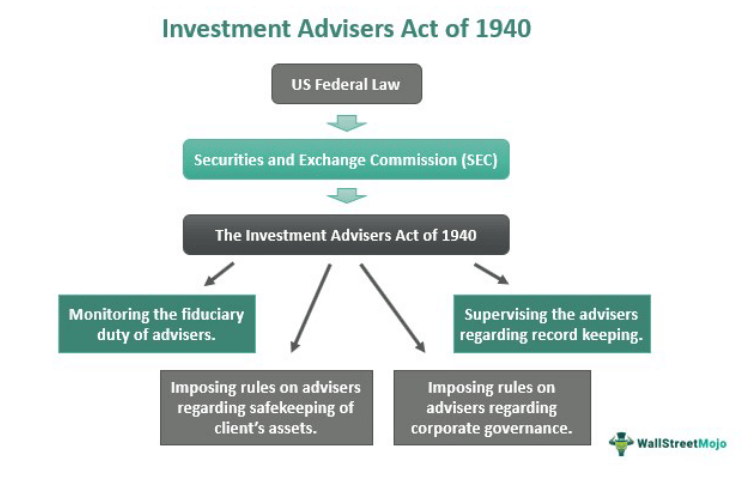

The Investment Advisers Act of 1940 is a cornerstone of financial regulation in the United States, fundamentally shaping the landscape of investment advice and protection. Originating as part of a broader legislative response to the market failures observed during the late 1920s and 1930s, the Act was developed to establish a standardized regulatory framework. Its primary objective was to protect investors and maintain fair and transparent markets.

In modern financial markets, characterized by rapid technological advancements, the significance of the Investment Advisers Act has only grown. Its guidelines influence how financial advisors operate, particularly as contemporary investment strategies, such as algorithmic trading, emerge. Algorithmic trading involves the use of computational systems to execute trades at speeds and volumes that are infeasible for human traders. While this innovation offers efficiency and liquidity benefits, it also imposes new challenges for ensuring compliance with the Act's core principles.



Key among these principles is the fiduciary duty, which mandates that advisors act in their clients' best interests, prioritizing client outcomes above their own gains. This duty translates into regulations concerning disclosure obligations, conflict of interest mitigation, and ethical conduct standards. For financial advisors and firms, understanding the nuances of registration is essential, with criteria determined by assets under management and the nature of advisory services provided.

Navigating this regulatory environment is crucial for both investors and advisors. Investors need assurance that their advisors are adhering to high ethical standards and regulatory requirements. Meanwhile, advisors must remain vigilant to evolving regulations to maintain compliance and uphold their duties effectively. Understanding the historical context and regulatory framework offered by the Investment Advisers Act of 1940 is thus vital for stakeholders in today's fast-paced financial markets, characterized by complex and dynamic investment strategies.

## Table of Contents

## Historical Background

The Investment Advisers Act of 1940 emerged from a turbulent economic period marked by the 1929 stock market crash and the Great Depression. These events catalyzed a wave of financial reform in the United States, as they exposed numerous vulnerabilities in the financial system, including unethical practices by financial advisors. The crash created a demand for increased oversight and accountability within the financial sector, leading to the establishment of foundational regulations.

In response to these financial turbulences, the U.S. government sought to restore confidence among investors and the public. The Securities and Exchange Commission (SEC) played a pivotal role in this regulatory evolution. Following a comprehensive report to Congress by the SEC, it became clear that the realm of investment advice required specific regulatory oversight, which led to the introduction of the Investment Advisers Act of 1940. The Act was designed to protect investors by mandating that investment advisors register with the SEC and adhere to defined fiduciary duties.

This period was marked by other significant legislative actions aimed at fostering transparency and stability in financial markets. The Securities Act of 1933 was one of the first federal legislations targeting securities regulation, providing clear regulations for the issuance and registration of securities to combat fraud and dishonest practices. Shortly thereafter, the Investment Company Act of 1940 was enacted to regulate investment companies, set standards for mutual funds, and establish guidelines to protect investors from potential abuses.

Together, these legislative actions laid the groundwork for a more transparent financial environment, fundamentally transforming the landscape of investment advisory practices and ensuring greater protection for individual investors. The regulatory framework established during this era continues to influence modern financial regulation and serves as a reference point when addressing contemporary challenges in the financial industry.

## Key Provisions of the Investment Advisers Act

The Investment Advisers Act of 1940 establishes the framework for defining investment advice and determining who must register as an investment advisor in the United States. This legislation plays a pivotal role in ensuring that the provision of investment advice is conducted with transparency and integrity.

Under the Act, an "investment advisor" is any person or entity that provides advice or analysis regarding securities for compensation. This definition necessitates registration for those who are in the business of advising others about investing in securities. Registration requirements depend on factors such as the nature of the advice given and the type of compensation received.

Central to the Act is the requirement for fiduciary duty, which obliges advisors to act in the best interests of their clients. The fiduciary duty imposes rigorous standards of loyalty and care, necessitating that advisors place client interests above their own. This obligation serves to protect client assets and decisions from being influenced by conflicting interests that may benefit the advisor over the client.

To ensure high professional standards, the Act requires that advisors demonstrate their competence through qualifying examinations. These exams assess the advisor's understanding of financial regulations, securities laws, and ethical responsibilities. Additionally, advisors must provide clients with full disclosure of all material facts, such as conflicts of interest and compensation arrangements. This transparency fosters trust between the advisor and client, facilitating informed decision-making.

By mandating these provisions, the Investment Advisers Act of 1940 seeks to uphold the integrity of financial advising practices, thereby safeguarding investors and fostering confidence in the advisory process.

## Impact on Financial Advisors

The Investment Advisers Act of 1940 imposes fiduciary duties on financial advisors, necessitating that they demonstrate loyalty and care in their client interactions. This fiduciary duty is fundamental, requiring advisors to act in the best interests of their clients and prioritize client needs over personal gain.

A key aspect of this fiduciary obligation is the prohibition against two unethical practices: front-running and churning. Front-running occurs when an advisor executes orders on a security for their account before executing orders for a client's account, based on knowledge of the client's impending order. Churning, on the other hand, refers to excessive trading by an advisor in a client's account primarily to generate commissions without regard to the client's investment objectives. Both practices clearly violate the fiduciary duty by putting the advisor’s interests ahead of the client's, thus directly contravening the principles set forth by the Act.

Registration and compliance are integral components for investment advisors under the Act. Advisors are required to register with the Securities and Exchange Commission (SEC) if they manage assets exceeding a specified threshold, which as of the most recent amendments in the Dodd-Frank Act of 2010, is $100 million for SEC registration. Those managing less than $100 million must typically register with state regulators. The registration process is designed to enhance transparency and facilitate oversight, ensuring that advisors adhere to the fiduciary standards and other regulatory requirements.

Compliance extends beyond registration to include ongoing obligations, such as maintaining records, filing annual updates, and ensuring that all advice rendered meet the fiduciary duty. Advisors must also implement robust internal controls to prevent conflicts of interest and ensure that their recommendations remain aligned with their clients' financial goals.

In sum, the Investment Advisers Act of 1940, through its fiduciary and regulatory mandates, plays a crucial role in shaping the ethical landscape in which financial advisors operate. By upholding these standards, advisors are better positioned to maintain trust and integrity in their client relationships.

## Algorithmic Trading and Regulatory Challenges

Algorithmic trading has revolutionized financial markets by introducing high-speed, automated systems capable of executing complex trading strategies. These systems, often driven by sophisticated algorithms, analyze vast amounts of market data to make real-time trading decisions. However, the emergence of [algorithmic trading](/wiki/algorithmic-trading) has presented regulatory challenges that the original Investment Advisers Act of 1940 was not designed to address.

The foundation of algorithmic trading lies in its speed and complexity. These automated systems can execute transactions within fractions of a second, a capability that traditional financial advisors manually assessing and executing trades simply cannot match. Consequently, the [high frequency](/wiki/high-frequency-trading) and velocity of trades necessitate specific oversight mechanisms to ensure that these systems adhere to the fiduciary and ethical standards mandated by the Act.

Financial advisors engaged in algorithmic trading must ensure that their algorithms operate within the regulatory framework. This involves ensuring that the trading strategies devised by these algorithms remain transparent and do not exploit market inefficiencies in ways that could harm client interests. For example, advisors must avoid practices such as "quote stuffing," where algorithms rapidly place and cancel orders to create a misleading appearance of market demand or supply.

Additionally, ensuring compliance with fiduciary duties means that algorithms must be designed to prioritize client interests consistently. This includes strategies for mitigating risks associated with rapid trading, such as avoiding excessive leverage or highly speculative trades that do not align with the client's risk profile.

A practical approach to achieving these ends can involve regular auditing and [backtesting](/wiki/backtesting) of algorithms to assess and address potential failures or biases in decision-making processes. Advisors must also implement robust monitoring protocols that can detect unethical trading behaviors or system anomalies in real-time.

Python, a popular language in the financial industry, can be utilized to assess an algorithmic strategy's compliance with fiduciary obligations. For example, backtesting a trading strategy using Python libraries like `pandas` for data manipulation and `numpy` for numerical calculations can help in evaluating the strategy's performance against historical data. Below is a simple Python snippet for backtesting a moving average crossover strategy:

```python
import pandas as pd
import numpy as np

def backtest_moving_average(data, short_window, long_window):
    signals = pd.DataFrame(index=data.index)
    signals['price'] = data['close']
    signals['short_mavg'] = data['close'].rolling(window=short_window, min_periods=1, center=False).mean()
    signals['long_mavg'] = data['close'].rolling(window=long_window, min_periods=1, center=False).mean()
    signals['signal'] = 0.0
    signals['signal'][short_window:] = np.where(signals['short_mavg'][short_window:] > 
                                                signals['long_mavg'][short_window:], 1.0, 0.0)   
    signals['positions'] = signals['signal'].diff()
    return signals

# Usage example
historical_data = pd.read_csv('historical_stock_data.csv', index_col='date', parse_dates=True)
backtest_results = backtest_moving_average(historical_data, short_window=40, long_window=100)
```

In conclusion, while algorithmic trading offers prospects for enhanced efficiency and market insights, it also requires careful regulatory oversight to ensure adherence to ethical and fiduciary standards. This involves not only adhering to existing regulations but also developing comprehensive strategies to adapt to new challenges posed by algorithmic systems.

## Registration and Compliance

The Investment Advisers Act of 1940 established the necessity for those engaged in providing investment advice to register as investment advisors. The primary considerations for registration hinge on the nature of advice offered and the method of compensation. Individuals or entities that provide recommendations or analyses concerning securities and receive compensation must register under the Act. This requirement underscores the aim to ensure transparency and accountability within financial advisory services.

The Dodd-Frank Wall Street Reform and Consumer Protection Act of 2010 brought significant amendments to these requirements, particularly affecting advisors to private funds. This legislative change imposed registration obligations on many previously exempt advisors, essentially expanding the scope of who must comply with the Act. Private fund advisors, including those managing hedge funds and private equity funds, are now often required to register with the Securities and Exchange Commission (SEC) if they meet certain asset thresholds.

Advisors must remain vigilant in tracking changes in regulatory frameworks to maintain compliance. Regulatory amendments are dynamic, responding to evolving market practices and financial innovations. This necessitates continuous education and adaptation by advisors to align with current compliance mandates. Failure to adhere to updated regulations can result in penalties and undermine the integrity of advisory services.

Hence, financial advisors are encouraged to employ various strategies for staying informed. This can include subscribing to regulatory updates, participating in industry webinars, and seeking guidance from compliance professionals. Proactive engagement with regulatory developments ensures advisors fulfill their legal obligations and uphold high standards of professional conduct.

## The Future of Financial Regulation

The financial landscape is undergoing rapid transformation, driven by technological advancements and innovative investment strategies. Consequently, regulations such as the Investment Advisers Act of 1940 must evolve to address these changes effectively.

The surge in fintech and algorithmic trading presents unique challenges to the existing regulatory framework. These technologies introduce new complexities in portfolio management and advisory roles, requiring regulators to continuously update compliance guidelines to ensure they remain relevant in this dynamic environment. For instance, algorithmic trading operates at speeds and volumes that traditional regulations might not adequately cover. This necessitates enhanced oversight mechanisms, including rigorous testing of algorithms for ethical standards and adherence to fiduciary obligations.

Moreover, the global nature of modern financial markets complicates regulatory efforts. Cross-border transactions facilitated by digital platforms introduce jurisdictional challenges, requiring a more coordinated approach among international regulatory bodies. This coordination is crucial to prevent regulatory [arbitrage](/wiki/arbitrage), where firms exploit differences between national regulations to gain competitive advantages without adhering to the spirit of regulatory laws.

Investors and advisors should remain vigilant about regulatory developments to effectively navigate the complexities of the financial market. This includes understanding the implications of new regulations and how they affect investment strategies and advisory practices. Advisors, in particular, must ensure that their technological integration and investment approach aligns with evolving legal standards to maintain compliance and safeguard client interests.

The future of financial regulation will likely involve increased collaboration between policymakers and industry stakeholders to develop frameworks that balance innovation with investor protection. Regulators may employ advanced data analytics and [machine learning](/wiki/machine-learning) tools to monitor market activities more efficiently, identifying potential risks and compliance breaches in real time. These tools could also assist in drafting more informed and flexible regulatory policies to adapt swiftly to technological advancements and emerging market trends.

In summary, as financial markets and technologies evolve, regulations like the Investment Advisers Act of 1940 must be continually reassessed and updated. This proactive approach will help ensure that financial advisors meet their fiduciary obligations while fostering innovation and protecting investors in an increasingly complex market.

## Conclusion

The Investment Advisers Act of 1940 remains a vital framework for regulating advisory activities in the United States. As the financial landscape continues to evolve, particularly with the emergence of algorithmic trading, understanding and complying with the Act is essential for all financial advisors. The Act's foundational provisions requiring transparency, loyalty, and adherence to fiduciary duties are crucial in maintaining the integrity of client-advisor relationships. By strictly adhering to these principles, advisors can ensure that they meet their fiduciary obligations, ultimately safeguarding client interests in an environment characterized by rapid technological advancements and increasingly complex investment strategies.

## References & Further Reading

[1]: ["Investment Advisers Act of 1940"](https://en.wikipedia.org/wiki/Investment_Advisers_Act_of_1940) Overview by the U.S. Securities and Exchange Commission (SEC).

[2]: ["The Law of Financial Advice: A Study of Investor Protection"](https://www.elgaronline.com/abstract/edcoll/9781800884618/9781800884618.xml) by Tamar Frankel, Journal of Legislation and Public Policy.

[3]: ["Algorithmic Trading and the Role of Regulation"](https://blog.counselstack.com/algorithmic-trading-regulations-compliance-risk-controls/) by John A. E. Pottow & Eric J. Pan, published in the Journal of Corporation Law.

[4]: ["The Investment Company Act of 1940 and Other Recent Developments"](https://en.wikipedia.org/wiki/Investment_Company_Act_of_1940) by Charles J. Casassa, Loyola of Los Angeles Law Review.

[5]: ["Advances in Financial Machine Learning"](https://www.amazon.com/Advances-Financial-Machine-Learning-Marcos/dp/1119482089) by Marcos Lopez de Prado.