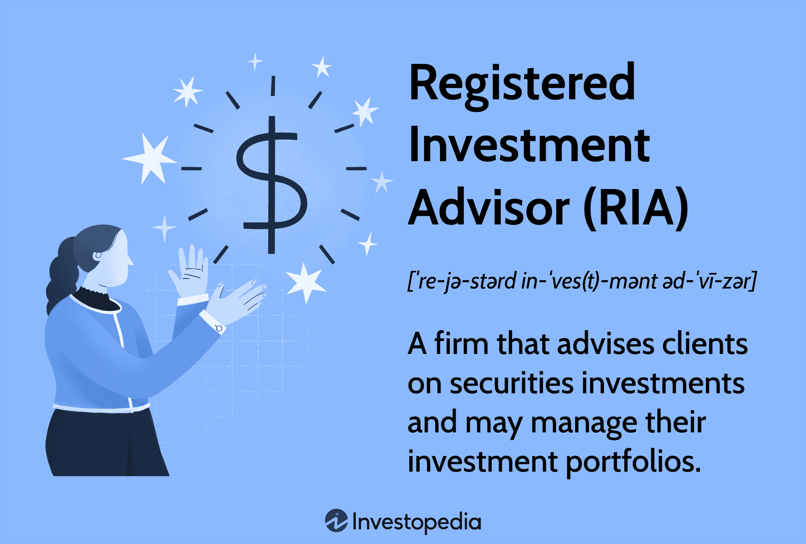

## Table of Contents

## What is an Investment Advisory Representative (IAR)?

An Investment Advisory Representative (IAR) is a person who works for an investment advisory firm and helps clients make smart choices about their money. They give advice on things like stocks, bonds, and other investments. To become an IAR, a person needs to pass certain exams and follow rules set by the government to make sure they are doing a good job and keeping clients' money safe.

IARs work closely with their clients to understand their financial goals and create plans to reach those goals. They might help someone save for retirement, plan for their kids' education, or just grow their wealth. It's important for IARs to keep learning about the market and new investment options so they can give the best advice possible.

## What are the basic responsibilities of an IAR?

An Investment Advisory Representative (IAR) has the main job of helping people with their money. They talk to clients to find out what they want to achieve with their money, like saving for a house or planning for retirement. Then, they suggest different ways to invest, like in stocks or bonds, that can help reach those goals. IARs also keep an eye on how these investments are doing and make changes if needed to keep the client's money growing in the right direction.

Another big part of an IAR's job is to follow the rules. They need to make sure they are always doing what's best for their clients and not just trying to make money for themselves. This means being honest and clear about any fees or risks involved with the investments they suggest. IARs also have to keep learning about new laws and investment options so they can give the best advice possible.

## How does an IAR help clients with their investment portfolios?

An IAR helps clients with their investment portfolios by first understanding what the client wants to achieve with their money. They talk to the client to learn about their goals, like saving for a new home, paying for college, or planning for retirement. Once they know what the client wants, the IAR suggests different investments, like stocks, bonds, or mutual funds, that can help reach those goals. They explain how each investment works and what risks are involved, so the client can make informed choices.

After setting up the portfolio, the IAR keeps a close watch on how the investments are doing. They check regularly to see if the investments are growing as expected or if any changes are needed. If the market changes or the client's goals shift, the IAR will adjust the portfolio to keep it on track. This might mean selling some investments and buying others, or just making small tweaks to keep everything balanced. The IAR's job is to make sure the client's money is working hard to meet their financial goals.

## What qualifications are required to become an IAR?

To become an Investment Advisory Representative (IAR), you need to meet certain qualifications set by the government. First, you have to pass the Series 65 or Series 66 exam. These exams test your knowledge about investments, how to advise clients, and the rules you need to follow. You also need to have a clean background, which means no big legal problems or money troubles that could make people doubt your honesty.

Once you pass the exam and have a clean background, you need to work for a registered investment advisory firm. This firm will help you get registered with the right government agencies, like the Securities and Exchange Commission (SEC) or your state's securities regulator. After you're registered, you have to keep learning about new laws and investment options to give the best advice to your clients. This means taking classes and staying up-to-date with changes in the financial world.

## What is the role of an IAR in financial planning?

An IAR plays a big role in helping people plan their money. They start by talking to their clients to find out what they want to do with their money, like saving for a house or getting ready for retirement. Once they know the client's goals, the IAR suggests different ways to invest, like in stocks or bonds, that can help reach those goals. They explain how each investment works and what risks are involved, so the client can make good choices.

After setting up the investment plan, the IAR keeps watching how the investments are doing. They check regularly to see if the investments are growing as expected or if any changes are needed. If the market changes or the client's goals shift, the IAR will adjust the plan to keep it on track. This might mean selling some investments and buying others, or just making small tweaks to keep everything balanced. The IAR's job is to make sure the client's money is working hard to meet their financial goals.

## How does an IAR ensure compliance with financial regulations?

An IAR makes sure they follow the rules by always learning about new laws and rules that affect how they give advice to clients. They have to pass exams like the Series 65 or Series 66 to show they know these rules. They also have to keep their knowledge up to date by taking classes and staying informed about changes in the financial world. This helps them avoid doing anything that might break the law and keeps them honest with their clients.

Another way an IAR ensures compliance is by being clear and honest with clients about any fees or risks involved with investments. They have to tell clients everything they need to know so the clients can make good choices. IARs also have to keep good records of all their advice and transactions, so if anyone from the government checks, they can show they did everything right. By following these steps, IARs can make sure they are doing their job the right way and keeping their clients' money safe.

## What are the ethical responsibilities of an IAR?

An IAR has to always put their clients first. This means they need to give advice that is best for the client, not just what makes them more money. They have to be honest and clear about any fees or risks with investments. If they know something that could affect the client's money, they have to tell the client right away. This helps build trust and makes sure the client can make good choices about their money.

Another big part of an IAR's ethical duties is to follow all the rules and laws. They need to keep learning about new laws and rules so they don't do anything wrong. They also have to keep good records of everything they do, so if someone checks, they can show they did things the right way. By doing this, IARs make sure they are doing their job honestly and keeping their clients' money safe.

## How do IARs manage risk for their clients?

IARs help their clients manage risk by first understanding what the client wants and how much risk they are okay with. They talk to the client to find out if they want to be safe with their money or if they are okay with taking bigger risks for possibly bigger rewards. Once they know this, the IAR picks investments that match the client's comfort level. For example, if a client wants to be very safe, the IAR might suggest putting more money into bonds or savings accounts instead of stocks.

After setting up the investments, the IAR keeps watching them to make sure they are doing what they should. If the market changes or something unexpected happens, the IAR will change the investments to keep the risk at a level the client is okay with. This might mean selling some risky investments and buying safer ones, or just making small changes to keep everything balanced. By doing this, the IAR helps protect the client's money and keeps it working towards their goals.

## What advanced strategies do expert IARs use to optimize client investments?

Expert IARs use advanced strategies like asset allocation and diversification to help their clients' money grow while keeping it safe. Asset allocation means spreading the client's money across different types of investments, like stocks, bonds, and real estate. This helps balance the risk and reward. Diversification is a part of this, where the IAR picks different investments within each type to avoid having all the money in one place. If one investment does badly, others might do well, which can help protect the client's money.

Another strategy expert IARs use is tax-efficient investing. This means [picking](/wiki/asset-class-picking) investments that will help the client pay less in taxes. For example, they might suggest putting money into tax-free accounts or choosing investments that grow without being taxed until they are sold. They also look at the timing of when to buy or sell investments to keep taxes low. By doing this, the IAR helps the client keep more of their money and grow it faster.

Lastly, expert IARs use rebalancing to keep the client's investment plan on track. Over time, some investments might grow faster than others, which can change the balance of the portfolio. Rebalancing means selling some of the investments that have grown a lot and buying more of the ones that haven't, to get back to the original plan. This helps keep the risk at the right level and makes sure the client's money is still working towards their goals.

## How do IARs tailor investment advice to different client profiles?

IARs tailor investment advice to different client profiles by first understanding each client's unique financial situation, goals, and how much risk they are willing to take. They talk to the client to learn about their age, job, family, and what they want to do with their money. For example, a young person saving for a first home might be okay with taking more risks than someone close to retirement who wants to keep their money safe. The IAR uses this information to pick investments that fit the client's needs and comfort level with risk.

Once they know the client's profile, IARs create a personalized investment plan. This plan might include a mix of stocks, bonds, and other investments that match the client's goals. For someone who wants to grow their money quickly, the IAR might suggest more stocks. For someone who wants to be safe, they might suggest more bonds or savings accounts. The IAR keeps checking the plan and makes changes if the client's situation or goals change, to make sure the investments are always working towards what the client wants.

## What continuing education requirements do IARs need to meet?

IARs need to keep learning to stay good at their job and follow the rules. They have to take classes and get more education every year. This helps them know about new laws and rules, and also about new ways to invest money. By doing this, they can give the best advice to their clients and make sure they are doing everything the right way.

The exact amount of continuing education IARs need can be different depending on where they work and what rules they have to follow. But usually, they need to finish a certain number of hours of classes each year. These classes can be about things like how to give good advice, how to follow the law, or how to pick the best investments. Keeping up with this education helps IARs stay smart and honest, so they can help their clients reach their money goals.

## How do IARs adapt to changes in the financial markets and regulatory environments?

IARs have to keep learning to stay good at their job when the financial markets and rules change. They take classes every year to learn about new laws and new ways to invest money. This helps them know what's going on in the market and how to follow the new rules. By doing this, they can give the best advice to their clients and make sure they are doing everything the right way.

When the market changes, IARs watch their clients' investments closely. If something big happens, like a stock market drop or a new law, they might need to change the investments to keep their clients' money safe and growing. They talk to their clients about these changes and explain what they need to do. This way, they can keep the client's money working towards their goals, even when things change.

## References & Further Reading

[1]: ["Advances in Financial Machine Learning"](https://books.google.com/books/about/Advances_in_Financial_Machine_Learning.html?id=oU9KDwAAQBAJ) by Marcos Lopez de Prado.

[2]: ["Machine Learning for Algorithmic Trading: Predictive models to extract signals from market and alternative data for systematic trading strategies using Python, 2nd Edition"](https://www.amazon.com/Machine-Learning-Algorithmic-Trading-alternative/dp/1839217715) by Stefan Jansen.

[3]: Aronson, David R. ["Evidence-Based Technical Analysis: Applying the Scientific Method and Statistical Inference to Trading Signals"](https://www.amazon.com/Evidence-Based-Technical-Analysis-Scientific-Statistical/dp/0470008741).

[4]: Chan, Ernest P. ["Quantitative Trading: How to Build Your Own Algorithmic Trading Business"](https://github.com/ftvision/quant_trading_echan_book).

[5]: Securities and Exchange Commission (SEC). ["Investment Advisers"](https://www.sec.gov/about/offices/oia/oia_investman/rplaze-042012.pdf).

[6]: Financial Industry Regulatory Authority (FINRA). ["Series 65 - Uniform Investment Adviser Law Exam"](https://www.finra.org/registration-exams-ce/qualification-exams/series65).

[7]: Financial Industry Regulatory Authority (FINRA). ["FINRA Series 66 Exam"](https://www.finra.org/registration-exams-ce/qualification-exams/series66).