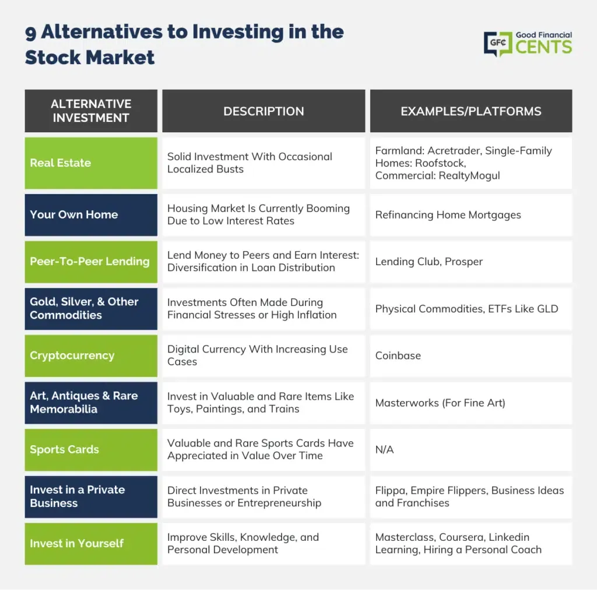

## Table of Contents

## What are the reasons someone might look for alternatives to Google stocks?

People might look for alternatives to Google stocks because they want to spread their money around. When you put all your money into one company, like Google, it can be risky. If Google has a bad year, your money could lose value. By choosing other stocks, people can lower this risk. They can invest in different industries, like healthcare or energy, which might do well even if tech stocks, like Google, go down.

Another reason is that some people might think Google's stock is too expensive. Google is a big and successful company, so its stock price can be high. Some investors might believe that other stocks offer better value for the money. They might find smaller companies or companies in different sectors that they think will grow faster or give them more return on their investment.

Lastly, some people might not agree with Google's business practices or want to invest in companies that focus on different things. For example, they might prefer to invest in green energy or social impact companies. By choosing alternatives to Google, they can put their money into businesses that match their values or interests more closely.

## What are some basic investment options for beginners that are less expensive than Google stocks?

For beginners looking for less expensive investment options than Google stocks, one good choice is to invest in index funds. Index funds are a type of mutual fund or exchange-traded fund ([ETF](/wiki/etf-trading-strategies)) that aims to match the performance of a specific market index, like the S&P 500. This means you're investing in a broad range of companies all at once, which can be less risky than [picking](/wiki/asset-class-picking) individual stocks like Google. Plus, index funds often have low fees, making them a cost-effective way to start investing.

Another option is to look into ETFs that focus on specific sectors or themes but are still more affordable than buying individual stocks like Google. For example, you might find ETFs that invest in technology, but they spread the investment across many tech companies, not just one. This can give you exposure to the tech industry without the high cost of buying Google stock directly. ETFs are generally cheaper to buy and sell than individual stocks, which makes them a good choice for beginners.

Lastly, consider dividend stocks from stable companies. These are stocks that pay out part of the company's earnings to shareholders regularly. While these might not be as flashy as tech giants like Google, they can provide a steady income stream and often come at a lower price per share. Companies in sectors like utilities or consumer goods might offer these dividends, making them a more affordable entry point for new investors.

## How do index funds compare to investing in individual stocks like Google?

Index funds and individual stocks like Google are different ways to invest your money. Index funds are like a big basket that holds many different stocks all at once. When you buy an index fund, you're buying a tiny piece of all the companies in that fund. This can be safer because if one company does badly, it won't hurt your whole investment as much. Plus, index funds usually cost less to own because they don't need a lot of people to manage them. They just follow the market, so you don't have to pick which stocks to buy.

On the other hand, buying individual stocks like Google means you're betting on just one company. If Google does well, your investment can grow a lot. But if Google has a bad year, your money could lose value quickly. It's riskier because all your money is tied to one company. Also, individual stocks like Google can be more expensive to buy and might need more research to understand if they're a good investment. So, index funds can be a simpler and safer way to start investing, while individual stocks can offer bigger rewards but come with more risk.

## What are ETFs, and how can they serve as a cost-effective alternative to Google stocks?

ETFs, or Exchange-Traded Funds, are like baskets of different investments that you can buy and sell on the stock market, just like you would with a single stock. They can hold a mix of stocks, bonds, or other assets. When you buy an ETF, you're getting a piece of all the things inside it, which can be a lot safer than putting all your money into one company like Google. ETFs are often cheaper to own because they don't need a lot of people to manage them. They just follow a set of rules, like trying to match the performance of a certain part of the market.

ETFs can be a good choice if you want to invest in tech but don't want to spend a lot of money on Google stock. Instead of buying Google, you could buy a tech ETF that includes Google along with other tech companies. This way, you're spreading your money around, which can be less risky. Plus, ETFs usually have lower fees than buying and selling individual stocks, so you keep more of your money. This makes ETFs a cost-effective way to get into the market without the high price tag of a single stock like Google.

## Can you explain the concept of dividend stocks and how they might be a better fit for some investors?

Dividend stocks are shares in companies that give some of their profits back to the people who own the stocks. These payments, called dividends, are usually paid out every few months. When you own dividend stocks, you get a little bit of money regularly, which can be nice if you want to earn some income from your investments. Companies that pay dividends are often big and stable, like those in utilities or consumer goods. They might not grow as fast as tech companies like Google, but they can be a safer bet because they're more predictable.

For some investors, dividend stocks might be a better fit than stocks like Google because they offer a steady income. If you're looking for money to live on or to reinvest, dividends can help. Also, dividend stocks can be less risky because the companies paying them are usually well-established and less likely to have big ups and downs in their stock price. While Google might offer the chance for big growth, dividend stocks give you a more reliable return, which can be more important for people who want to keep their money safe and growing slowly over time.

## What role can real estate investment trusts (REITs) play in diversifying a portfolio away from tech stocks?

Real estate investment trusts, or REITs, are companies that own and often operate income-generating real estate. They can be a good way to diversify your investment portfolio away from tech stocks like Google. When you invest in a REIT, you're putting your money into properties like apartments, malls, or office buildings. This means your money is spread across a different kind of asset, which can help balance out the risk if the tech industry goes through a rough patch.

REITs are also attractive because they have to pay out at least 90% of their taxable income as dividends to shareholders. This can provide a steady stream of income, which is different from the potential for big growth you might get from tech stocks. By adding REITs to your portfolio, you're not only diversifying away from tech but also adding an investment that can give you regular income. This mix of different types of investments can make your overall portfolio safer and more balanced.

## How do bonds offer a different risk and return profile compared to Google stocks?

Bonds are like loans you give to a company or the government. They promise to pay you back the money you lent them, plus a little extra, over time. This makes bonds safer than stocks like Google because you know you'll get your money back as long as the company or government doesn't go broke. The extra money you get, called interest, is usually less than what you might make from Google stocks if they go up a lot. But it's more predictable, so you don't have to worry as much about losing your money.

Google stocks, on the other hand, are riskier but can offer bigger rewards. If Google does well, the price of its stock can go up a lot, and you can make more money. But if Google has a bad year, the stock price can drop, and you could lose money. This is different from bonds, where you're more likely to get your money back but won't see the same big gains. So, bonds can be a good choice if you want safety and steady income, while Google stocks might be better if you're okay with more risk for the chance of bigger returns.

## What are mutual funds, and how can they be used to achieve diversification without the high cost of Google stocks?

Mutual funds are like big baskets where lots of people put their money together to buy a mix of different investments, like stocks, bonds, or other things. When you buy into a mutual fund, you're getting a piece of all the stuff inside it. This can be a good way to spread your money around without having to pick each investment yourself. Instead of buying expensive stocks like Google, you can buy a mutual fund that includes Google along with many other companies. This way, you're not putting all your eggs in one basket, which can be safer.

Mutual funds can be a smart choice if you want to keep costs down. They often have lower fees than buying and selling individual stocks, especially pricey ones like Google. By choosing a mutual fund, you're paying less to get into the market and still getting a chance to grow your money. Plus, because mutual funds are managed by professionals, you don't need to spend a lot of time figuring out which stocks to buy. This makes them a simple and cost-effective way to invest and diversify your portfolio.

## Can you discuss the potential of peer-to-peer lending as an alternative investment?

Peer-to-peer lending is a way for people to lend money to others without using a bank. Instead of putting your money in Google stocks, you can lend it to someone who needs it, and they pay you back with interest. This can be a good way to make money because the interest rates can be higher than what you get from a savings account or some bonds. But it's also riskier because if the person you lend to can't pay you back, you might lose your money. So, it's a bit like a gamble, but with the chance for bigger rewards.

This type of investment can be a nice way to mix things up in your portfolio. Instead of just having stocks like Google, you can spread your money around by doing some peer-to-peer lending. This can make your investments safer because if the stock market goes down, you still have money coming in from your loans. But you have to be careful and do your homework because not all loans are safe. It's important to look at the person's credit history and how likely they are to pay you back before you lend them your money.

## How might investing in emerging markets provide a different growth opportunity compared to investing in Google?

Investing in emerging markets can offer different growth opportunities compared to investing in Google because these markets are often in countries that are growing fast. Countries like India, Brazil, and China are examples of emerging markets. When you invest in these places, you're betting on their whole economy to grow, not just one company like Google. This can be exciting because if these countries do well, your investment can grow a lot. But it's also riskier because these markets can be up and down more than the U.S. market where Google is.

Emerging markets can also give you a chance to invest in new industries that might not be as big in the U.S. yet. For example, you might find companies in these markets that are doing cool things with technology, healthcare, or green energy. These companies might be smaller and cheaper than Google, so you can buy more of them with less money. This means you could see big growth if these companies take off. But remember, it's important to do your homework because investing in emerging markets can be tricky and there's more risk involved.

## What are the tax implications of investing in alternatives to Google stocks?

When you invest in things other than Google stocks, like index funds, ETFs, or bonds, the way you pay taxes can be different. If you buy and sell stocks a lot, you might have to pay capital gains tax. This tax depends on how long you hold the investment. If you keep it for less than a year, you pay a higher rate. But if you hold it for more than a year, the rate is usually lower. With index funds and ETFs, you might have to pay taxes on any dividends you get, but these can be less than what you'd pay on quick stock trades.

Some investments, like bonds or REITs, can also affect your taxes. Bonds usually give you interest, which you have to pay taxes on every year. REITs are special because they have to pay out most of their income as dividends, and these dividends are often taxed at a higher rate than regular stock dividends. But, if you invest in things like peer-to-peer lending, the interest you earn is taxed as regular income, which could be higher than the tax on stock gains. So, when you're looking at alternatives to Google stocks, think about how taxes might change what you earn.

## For an expert investor, how can options trading be used to hedge against positions in tech stocks like Google?

Options trading can be a smart way for expert investors to protect their money in tech stocks like Google. When you buy options, you're getting the right to buy or sell a stock at a certain price before a certain time. If you own Google stock and you're worried it might go down, you can buy a "put" option. This gives you the right to sell your Google stock at a set price, even if the market price drops lower. This way, you can limit how much money you might lose if Google's stock price falls.

On the other hand, if you think Google's stock might go up but you don't want to buy more stock, you can buy a "call" option. This lets you buy Google stock at a set price later, even if the market price goes higher. This can be a cheaper way to bet on Google going up without spending a lot of money upfront. Options can be tricky and need a lot of know-how, but for expert investors, they're a powerful tool to manage risk and maybe make more money.

## References & Further Reading

[1]: Bergstra, J., Bardenet, R., Bengio, Y., & Kégl, B. (2011). ["Algorithms for Hyper-Parameter Optimization."](https://dl.acm.org/doi/10.5555/2986459.2986743) Advances in Neural Information Processing Systems 24.

[2]: ["Advances in Financial Machine Learning"](https://www.amazon.com/Advances-Financial-Machine-Learning-Marcos/dp/1119482089) by Marcos Lopez de Prado

[3]: ["Evidence-Based Technical Analysis: Applying the Scientific Method and Statistical Inference to Trading Signals"](https://www.amazon.com/Evidence-Based-Technical-Analysis-Scientific-Statistical/dp/0470008741) by David Aronson

[4]: ["Machine Learning for Algorithmic Trading"](https://github.com/stefan-jansen/machine-learning-for-trading) by Stefan Jansen

[5]: ["Quantitative Trading: How to Build Your Own Algorithmic Trading Business"](https://www.amazon.com/Quantitative-Trading-Build-Algorithmic-Business/dp/1119800064) by Ernest P. Chan