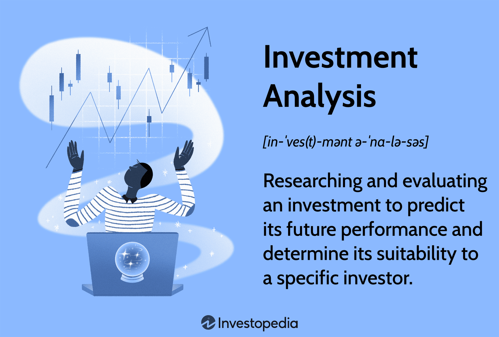

## Table of Contents

## What is investment analysis?

Investment analysis is the process of looking at different investments to decide which ones are good to put money into. It involves studying things like stocks, bonds, and real estate to see if they will make money over time. People do this to try to pick investments that will grow and help them reach their financial goals.

When doing investment analysis, people look at many things. They check the past performance of an investment to see how it has done before. They also look at the current market conditions and future predictions to guess how the investment might do in the future. By doing all this, they can make smarter choices about where to put their money.

## Why is investment analysis important for investors?

Investment analysis is important for investors because it helps them make smart choices about where to put their money. When investors take the time to study different investments, they can find out which ones are likely to grow and make them more money. This is important because it helps them avoid risky investments that might lose money. By doing investment analysis, investors can feel more confident that they are making good decisions and working towards their financial goals.

Another reason investment analysis is important is that it helps investors understand the risks involved with different investments. Every investment has some level of risk, and knowing what those risks are can help investors decide if they are comfortable with them. For example, some investments might offer the chance for big gains but also come with a higher chance of losing money. By understanding these risks, investors can choose investments that match their comfort level and financial plans. This way, they can build a portfolio that balances potential rewards with acceptable risks.

## What are the different types of investment analysis?

There are several types of investment analysis that investors use to make decisions. One common type is [fundamental analysis](/wiki/fundamental-analysis), where investors look at the financial health and performance of a company. They study things like earnings, profits, and growth to see if a company is a good investment. Another type is technical analysis, which focuses on looking at charts and patterns of an investment's price over time. Investors using technical analysis believe that past price movements can help predict future trends.

Another type of investment analysis is quantitative analysis, which uses math and numbers to make investment decisions. This can involve using complex formulas and models to predict how an investment will perform. On the other hand, qualitative analysis looks at non-numerical factors like the quality of a company's management, its brand reputation, and other things that are harder to measure but still important. Each type of analysis helps investors see different aspects of an investment and make more informed choices.

Lastly, there's also comparative analysis, where investors compare different investments to see which one is the best fit for their goals. This can involve looking at similar companies in the same industry or comparing different types of investments like stocks, bonds, and real estate. By using a mix of these analysis types, investors can get a fuller picture of their investment options and choose the ones that will help them reach their financial goals.

## How does fundamental analysis work?

Fundamental analysis is a way to study a company to see if it's a good investment. It looks at the company's financial health by checking things like how much money it makes, its profits, and how fast it's growing. Investors use this information to guess if the company will do well in the future. They look at numbers like earnings per share, which shows how much money the company makes for each share of stock, and the price-to-earnings ratio, which helps see if the stock is a good deal. By understanding these numbers, investors can decide if the company's stock is worth buying.

Besides looking at numbers, fundamental analysis also considers the bigger picture. This includes things like the overall economy, how the company's industry is doing, and any news or events that might affect the company. For example, if a new law might help or hurt the company, that's important to know. Investors also look at the company's management team to see if they are good at running the business. By putting all this information together, investors can get a good idea of whether the company is a smart investment and likely to grow over time.

## What is technical analysis and how is it used?

Technical analysis is a way to study investments by looking at charts and patterns of their prices over time. People who use technical analysis believe that past price movements can help predict what will happen in the future. They look at things like trends, which show if the price is going up or down, and patterns, which are shapes on the chart that might mean the price will change soon. By studying these charts, investors try to find the best times to buy or sell an investment.

Technical analysis uses tools like moving averages, which smooth out price data to show the overall direction, and indicators like the Relative Strength Index (RSI), which can show if an investment is overbought or oversold. These tools help investors see if the price might go up or down soon. While technical analysis doesn't look at a company's financial health or news, it focuses on the price itself. This makes it different from fundamental analysis, but many investors use both to make better decisions about their investments.

## Can you explain quantitative analysis in investment?

Quantitative analysis in investment is all about using math and numbers to make decisions. Investors who use this method look at a lot of data and use formulas and models to predict how an investment will do. They might use things like historical price data, financial ratios, and other numbers to see patterns and make guesses about the future. This can help them find investments that are likely to grow and make money.

This type of analysis can be very detailed and often uses computers to handle all the numbers. For example, investors might use a model to see how different economic conditions could affect an investment. By running these numbers, they can see what might happen in different situations and make smarter choices. While quantitative analysis can be complex, it helps investors make decisions based on hard data rather than just feelings or guesses.

## What role does qualitative analysis play in investment decisions?

Qualitative analysis looks at things about a company that you can't measure with numbers. It's about understanding the company's story, like how good its leaders are, what people think about its brand, and how it treats its workers. Investors use this kind of analysis to see if a company has a strong future, even if its numbers don't look great right now. For example, a company might have a new CEO who is really good at turning businesses around. That could make the company a good investment, even if its profits are low at the moment.

This type of analysis is important because it helps investors see the bigger picture. Numbers can tell you a lot, but they don't show everything. A company might be doing well financially, but if it's in an industry that's shrinking or if it's not keeping up with new technology, it might not be a good long-term investment. By looking at qualitative factors, investors can make better decisions and find companies that are likely to do well in the future, even if they don't look great on paper right now.

## How do beginners start with investment analysis?

Beginners can start with investment analysis by first learning the basics. They should understand what different types of investments are, like stocks, bonds, and real estate. It's good to read [books](/wiki/algo-trading-books), watch videos, or take online courses to get a feel for how investing works. Starting with simple investments like index funds or ETFs can help because they are easier to understand and often less risky. It's also important for beginners to practice with small amounts of money before jumping into big investments. This way, they can learn from their mistakes without losing a lot of money.

Once they have a basic understanding, beginners should start doing their own analysis. They can begin with fundamental analysis by looking at a company's financial reports to see if it's making money and growing. Websites like Yahoo Finance or Morningstar offer free tools and data to help with this. For technical analysis, beginners can use charting tools on these websites to see price trends and patterns. It's also a good idea to read news and articles about the companies they're interested in to get a feel for qualitative factors. By combining these methods and starting small, beginners can slowly build their skills and confidence in investment analysis.

## What are some common tools and software used for investment analysis?

There are many tools and software that people use to help with investment analysis. Some popular ones include Microsoft Excel, which is great for doing math and making charts. It's easy to use and can handle a lot of data. Another tool is Bloomberg Terminal, which gives you real-time news, data, and tools to analyze investments. It's used by a lot of professionals but can be expensive. For those who want something simpler, Yahoo Finance and Google Finance offer free tools and data that can help you look at stocks and other investments.

Other useful software includes Morningstar, which has a lot of information about stocks, funds, and other investments. It also has tools to help you analyze them. For people who like technical analysis, TradingView is a good choice. It has charts and indicators that help you see price trends and patterns. Finally, there are apps like Robinhood and E*TRADE that let you buy and sell investments and also give you tools to analyze them. These tools can help beginners and experts make better investment decisions.

## How can advanced investors use portfolio analysis to optimize their investments?

Advanced investors can use portfolio analysis to make their investments better by looking at how all their investments work together. They check things like how much risk they are taking and how much their investments might grow. By using portfolio analysis, they can see if their investments are spread out well. If they have too much money in one type of investment, like tech stocks, they might want to put some money into other areas, like real estate or bonds, to lower their risk. This way, they can balance their portfolio to match their goals and how much risk they want to take.

Another way advanced investors use portfolio analysis is by looking at how their investments have done in the past and guessing how they might do in the future. They use tools and software to help them see patterns and make predictions. This can help them decide if they should buy more of a certain investment or sell some to buy something else. By doing this, they can keep their portfolio strong and working towards their financial goals. Portfolio analysis helps them make smart choices and keep their investments growing over time.

## What are the latest trends in investment analysis techniques?

One of the latest trends in investment analysis is the use of [artificial intelligence](/wiki/ai-artificial-intelligence) (AI) and [machine learning](/wiki/machine-learning). These technologies help investors look at huge amounts of data quickly and find patterns that might be hard to see otherwise. For example, AI can look at news articles, social media posts, and financial reports to guess how a company might do in the future. This can help investors make better decisions and find new opportunities. Many big investment companies are starting to use AI tools to help them analyze investments and manage their portfolios.

Another trend is the focus on environmental, social, and governance ([ESG](/wiki/esg-investing)) factors. More and more investors are looking at how a company treats the environment, its workers, and its leaders when deciding if it's a good investment. This is called ESG investing. People believe that companies that do well in these areas are likely to do well in the future too. So, they use ESG data to help them pick investments that match their values and might grow over time. This trend is becoming more popular as people want to invest in a way that helps the world.

## How do expert investors integrate different types of analysis for better decision-making?

Expert investors use different types of analysis together to make better decisions about where to put their money. They start with fundamental analysis to look at a company's financial health, like how much money it makes and how fast it's growing. This helps them see if the company is strong and likely to do well in the future. At the same time, they use technical analysis to study the price patterns of the company's stock. This can show them the best times to buy or sell. By combining these two methods, they get a full picture of the investment and can make smarter choices.

In addition to fundamental and technical analysis, expert investors also use qualitative and quantitative analysis. Qualitative analysis helps them understand things about a company that numbers can't show, like how good its leaders are or what people think about its brand. This can give them a sense of the company's future potential. On the other hand, quantitative analysis uses math and models to predict how an investment might perform based on lots of data. By looking at both the numbers and the story behind a company, expert investors can make well-rounded decisions. This mix of different analysis types helps them find the best investments and manage their money wisely.

## References & Further Reading

[1]: ["The Intelligent Investor"](https://en.wikipedia.org/wiki/The_Intelligent_Investor) by Benjamin Graham

[2]: ["Security Analysis"](https://www.amazon.com/Security-Analysis-Foreword-Buffett-Editions/dp/0071592539) by Benjamin Graham and David Dodd

[3]: Damodaran, A. ["Damodaran on Valuation: Security Analysis for Investment and Corporate Finance"](https://onlinelibrary.wiley.com/doi/book/10.1002/9781119201786)

[4]: ["Algorithmic Trading: Winning Strategies and Their Rationale"](https://www.wiley.com/en-us/Algorithmic+Trading%3A+Winning+Strategies+and+Their+Rationale-p-9781118460146) by Ernie Chan

[5]: Jagannathan, R., McGrattan, E. R., & Scherbina, A. (2000). ["The Declining U.S. Equity Premium."](https://www.nber.org/papers/w8172) National Bureau of Economic Research. 

[6]: Lo, A. W. & MacKinlay, A. C. ["A Non-Random Walk Down Wall Street"](https://www.amazon.com/Non-Random-Walk-Down-Wall-Street/dp/0691092567)

[7]: Hull, J. C. ["Options, Futures, and Other Derivatives"](https://www.pearson.com/en-us/subject-catalog/p/options-futures-and-other-derivatives/P200000005938/9780136939917)

[8]: ["Modern Portfolio Theory and Investment Analysis"](https://books.google.com/books/about/Modern_Portfolio_Theory_and_Investment_A.html?id=181CEAAAQBAJ) by Edwin J. Elton, Martin J. Gruber, Stephen J. Brown, and William N. Goetzmann

[9]: Sharpe, W. F. (1964). ["Capital Asset Prices: A Theory of Market Equilibrium Under Conditions of Risk."](https://onlinelibrary.wiley.com/doi/full/10.1111/j.1540-6261.1964.tb02865.x) The Journal of Finance, 19(3), 425-442.