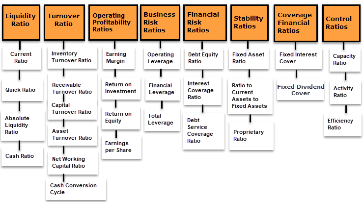

In finance, understanding financial health and evaluating investment opportunities is crucial for both individual and institutional investors. This process heavily relies on the analysis of financial ratios, which offer quantitative insights into a company's performance and stability. By dissecting financial statements, these ratios highlight areas of strength and potential risks, aiding investors in making informed decisions.

The advent of algorithmic trading has significantly impacted the evaluation of financial ratios. This technology enables quick and precise analysis of vast amounts of financial data, revolutionizing traditional investment strategies. Algorithmic trading ensures timely execution and enhances precision, which is essential in today’s fast-paced market environment where milliseconds can affect profitability.



Financial ratios are pivotal in providing a systematic approach to investment analysis. Four essential categories include profitability ratios, which measure a company's ability to generate earnings relative to its resources; liquidity ratios, assessing a company's capability to cover short-term obligations; solvency ratios, evaluating long-term financial stability; and valuation ratios, determining the market value of a company against its financial metrics. Each category offers unique insights that inform investors about a company’s overall financial health.

This article explores the intersection of financial ratios and algorithmic trading, offering a comprehensive guide on how these tools can be effectively utilized in investment analysis. By integrating these ratios with algorithmic systems, investors can automate decision-making processes, mitigate human bias, and enhance the speed and accuracy of executing investment strategies. The focus will be on understanding these essential ratio categories and evaluating the key metrics used to assess trading algorithms, aiming to optimize investment strategies and capitalize on market opportunities efficiently.

## Table of Contents

## Understanding Financial Ratios

Financial ratios are critical tools derived from a company's financial statements, designed to provide quantitative insights into its financial health. By offering a structured analysis, these ratios help in evaluating a firm's performance, stability, and overall attractiveness as an investment. They are broadly classified into four categories: profitability, liquidity, solvency, and valuation ratios, each serving different analytical purposes.

### Profitability Ratios

Profitability ratios measure a company's ability to generate income relative to its revenue, assets, or equity. Key ratios in this category include:

1. **Return on Assets (ROA)**: This ratio indicates how efficiently a company uses its assets to generate profit. It is calculated as:
$$
   \text{ROA} = \frac{\text{Net Income}}{\text{Total Assets}}

$$

2. **Return on Equity (ROE)**: ROE measures the return generated on shareholders' equity, showcasing the firm's effectiveness in converting equity investments into profits. It is calculated as:
$$
   \text{ROE} = \frac{\text{Net Income}}{\text{Shareholder's Equity}}

$$

3. **Net Profit Margin**: This ratio highlights the percentage of revenue that remains as profit after all expenses. It is calculated as:
$$
   \text{Net Profit Margin} = \frac{\text{Net Income}}{\text{Revenue}} \times 100

$$

### Liquidity Ratios

Liquidity ratios evaluate a company's capacity to meet its short-term obligations using its current assets. The key ratios include:

1. **Current Ratio**: This ratio assesses whether a firm can cover its short-term liabilities with its short-term assets. It is calculated as:
$$
   \text{Current Ratio} = \frac{\text{Current Assets}}{\text{Current Liabilities}}

$$

2. **Quick Ratio**: Often referred to as the acid-test ratio, it gauges the ability to meet short-term liabilities with assets that can quickly be converted to cash, excluding inventory. It is calculated as:
$$
   \text{Quick Ratio} = \frac{\text{Current Assets} - \text{Inventory}}{\text{Current Liabilities}}

$$

### Solvency Ratios

Solvency ratios assess a company's long-term financial stability by examining its debt compared to assets and equity. Important solvency ratios include:

1. **Debt-to-Equity Ratio**: This ratio indicates the relative proportion of equity and debt used to finance a company's assets. It is calculated as:
$$
   \text{Debt-to-Equity Ratio} = \frac{\text{Total Debt}}{\text{Shareholder's Equity}}

$$

2. **Interest Coverage Ratio**: This measures a company's ability to pay interest on its outstanding debt. It is calculated as:
$$
   \text{Interest Coverage Ratio} = \frac{\text{Earnings Before Interest and Taxes (EBIT)}}{\text{Interest Expense}}

$$

### Valuation Ratios

Valuation ratios help investors evaluate the market value of a company relative to its financial performance, assisting in making informed investment decisions:

1. **Price-to-Earnings (P/E) Ratio**: This reflects investors' expectations of future earnings, comparing the company's current share price to its per-share earnings. It is calculated as:
$$
   \text{P/E Ratio} = \frac{\text{Market Price per Share}}{\text{Earnings per Share (EPS)}}

$$

2. **Price-to-Book (P/B) Ratio**: This ratio compares a company's market value to its book value, indicating investor sentiment towards the firm's assets. It is calculated as:
$$
   \text{P/B Ratio} = \frac{\text{Market Price per Share}}{\text{Book Value per Share}}

$$

In conclusion, financial ratios offer a systematic method of evaluating a company's financial condition and performance. Each category serves specific purposes and, when applied collectively, provides a comprehensive overview, crucial for effective investment analysis and decision-making.

## Algorithmic Trading and Financial Ratios

Algorithmic trading leverages sophisticated computer algorithms to execute trades based on pre-defined criteria, including financial ratios derived from a company's financial statements. This method capitalizes on advances in technology to process substantial volumes of data swiftly, facilitating both faster and more precise financial analysis. The automation of trading through algorithms eliminates much of the delay associated with manual decision-making, thereby enhancing the efficiency and accuracy of investment strategies.

Incorporating financial ratio analysis into [algorithmic trading](/wiki/algorithmic-trading) provides a structured framework for evaluating a company’s financial health systematically. Financial ratios can be segment-specific, encompassing areas such as profitability, [liquidity](/wiki/liquidity-risk-premium), solvency, and valuation. Tailoring algorithms to integrate these financial ratios enables investors to focus on specific metrics pertinent to their investment objectives. For instance, an algorithm could prioritize companies with a high return on equity (ROE) or a low price-to-earnings (P/E) ratio, systematically analyzing and ranking potential investments based on these criteria.

The core advantage of using algorithms in financial analysis is the ability to conduct real-time assessments, which is crucial for capitalizing on fleeting market opportunities. Algorithms can continuously monitor market conditions and financial ratios, dynamically adjusting trading strategies in response to new data. This real-time analysis can be illustrated by a Python implementation that monitors a basket of stocks and executes trades if the stocks meet certain financial criteria:

```python
import pandas as pd
from datetime import datetime
import yfinance as yf  # For more datasets, visit: https://paperswithbacktest.com/datasets

# Criteria: ROE > 15%, P/E < 20
def fetch_financial_data(ticker):
    stock = yf.Ticker(ticker)
    financials = stock.financials
    roe = financials.loc['Net Income', :] / financials.loc['Shareholders' Equity', :]
    pe_ratio = stock.info['trailingPE']
    return roe[-1], pe_ratio

def execute_trade(ticker, criteria):
    roe, pe_ratio = fetch_financial_data(ticker)
    if roe > criteria['roe'] and pe_ratio < criteria['pe']:
        print(f"Trade executed for {ticker}: ROE = {roe}, P/E = {pe_ratio}")
    else:
        print(f"No trade for {ticker}: ROE = {roe}, P/E = {pe_ratio}")

criteria = {'roe': 0.15, 'pe': 20}
tickers = ['AAPL', 'GOOGL', 'MSFT']

for ticker in tickers:
    execute_trade(ticker, criteria)
```

In this script, the financial health of companies is assessed based on a return on equity (ROE) threshold of 15% and a price-to-earnings (P/E) ratio of less than 20. Such automation facilitates more informed decision-making processes and optimizes trade execution timing.

The integration of algorithmic trading with financial ratio analysis not only increases the objectivity of investment decisions by mitigating human bias but also enables rapid adaptation to changes in the market landscape. By leveraging these technological advancements, investors are better positioned to exploit efficiencies, potentially enhancing portfolio returns while minimizing risks associated with human errors and delayed responses.

## Key Financial Ratios for Investment Analysis

In evaluating a company's investment potential, financial ratios play a crucial role by offering quantitative measures of a firm's financial health. These ratios present a structured way to assess various aspects of a company's performance, helping investors make informed decisions.

**Profitability Ratios:** Profitability ratios provide insights into a company’s ability to generate earnings relative to its resources. Three key metrics are:

1. **Return on Assets (ROA):** This ratio measures how efficiently a company uses its assets to generate profit and is calculated as:
$$
   \text{ROA} = \frac{\text{Net Income}}{\text{Total Assets}}

$$

2. **Return on Equity (ROE):** ROE assesses a company’s profitability by revealing how much profit is generated with the money shareholders have invested:
$$
   \text{ROE} = \frac{\text{Net Income}}{\text{Shareholder's Equity}}

$$

3. **Net Profit Margin:** This ratio indicates how much profit a company retains from its total revenue, calculated as:
$$
   \text{Net Profit Margin} = \frac{\text{Net Income}}{\text{Revenue}}

$$

**Liquidity Ratios:** These ratios evaluate a company’s capacity to meet its short-term obligations. The most commonly used liquidity ratios include:

1. **Current Ratio:** It measures the ability to pay short-term liabilities with short-term assets:
$$
   \text{Current Ratio} = \frac{\text{Current Assets}}{\text{Current Liabilities}}

$$

2. **Quick Ratio:** Also known as the acid-test ratio, it provides a more stringent assessment by excluding inventory from current assets:
$$
   \text{Quick Ratio} = \frac{\text{Current Assets} - \text{Inventory}}{\text{Current Liabilities}}

$$

**Solvency Ratios:** Solvency ratios focus on a company's long-term financial sustainability by examining its use of debt:

1. **Debt-to-Equity Ratio:** This ratio compares a company's total liabilities to its shareholder equity, indicating how much debt is used to finance assets:
$$
   \text{Debt-to-Equity Ratio} = \frac{\text{Total Liabilities}}{\text{Shareholder's Equity}}

$$

2. **Interest Coverage Ratio:** It assesses the ability to pay interest on outstanding debt, calculated as:
$$
   \text{Interest Coverage Ratio} = \frac{\text{EBIT}}{\text{Interest Expenses}}

$$

**Valuation Ratios:** Valuation ratios help investors determine the market value of a company relative to its financial metrics:

1. **Price-to-Earnings (P/E) Ratio:** The P/E ratio evaluates the monetary value that investors are willing to pay for each dollar of earnings:
$$
   \text{P/E Ratio} = \frac{\text{Market Price per Share}}{\text{Earnings per Share}}

$$

2. **Price-to-Book (P/B) Ratio:** This ratio compares a company’s market value to its book value, aiding in assessing whether a stock is undervalued or overvalued:
$$
   \text{P/B Ratio} = \frac{\text{Market Price per Share}}{\text{Book Value per Share}}

$$

In summary, these financial ratios offer crucial insights into a company's financial status, providing a comprehensive view necessary for optimal investment decision-making.

## Evaluating Trading Algorithms

Evaluating the performance of trading algorithms is crucial to ensure that they align with investment objectives and deliver optimum results. Key metrics provide both quantitative and qualitative insights into an algorithm's effectiveness. The Sharpe Ratio is one significant metric, calculated as follows:

$$
\text{Sharpe Ratio} = \frac{E[R_a - R_f]}{\sigma_a}
$$

where $E[R_a - R_f]$ is the expected return of the algorithm minus the risk-free rate, and $\sigma_a$ is the standard deviation of the excess return. This ratio measures risk-adjusted returns, allowing investors to understand the reward they receive for each unit of risk undertaken.

Maximum drawdown, another vital metric, represents the maximum observed loss from a peak to a trough before a new peak is attained. It reflects the downside risk of an algorithm and can be crucial for risk management, as significant drawdowns could imply substantial losses and potential strategy inefficacies.

The winning percentage metric calculates the success rate of executed trades and is defined as:

$$
\text{Winning Percentage} = \left(\frac{\text{Number of Winning Trades}}{\text{Total Number of Trades}}\right) \times 100
$$

A higher winning percentage indicates a higher number of successful trades, directly contributing to the profitability of the trading strategy.

The profit [factor](/wiki/factor-investing) further analyzes profitability by comparing gross profits to gross losses:

$$
\text{Profit Factor} = \frac{\text{Gross Profits}}{\text{Gross Losses}}
$$

A profit factor greater than one suggests a profitable trading strategy, whereas a value below one indicates potential losses.

Volatility metrics are essential in assessing an algorithm's sensitivity to market fluctuations. High [volatility](/wiki/volatility-trading-strategies) might suggest larger swings in trade outcomes, impacting profitability and risk exposure. These indicators help investors adjust strategies to enhance performance and maintain stability across varying market conditions.

Regular evaluation and adjustment of algorithms are imperative to conform to the ever-changing market dynamics. As markets evolve, algorithmic trading strategies must be recalibrated to maintain their relevance and effectiveness, thereby optimizing investment outcomes. Advanced [machine learning](/wiki/machine-learning) techniques could also be employed to predict and adapt to market changes, further optimizing algorithmic strategies. For example:

```python
from sklearn.linear_model import LinearRegression

def optimize_strategy(historical_data, current_market_conditions):
    model = LinearRegression()
    X = historical_data[['feature_1', 'feature_2', 'feature_n']]
    y = historical_data['target']
    model.fit(X, y)
    predictions = model.predict(current_market_conditions)
    return predictions
```

In summary, diligent evaluation and continuous refinement of trading algorithms enable robust performance and alignment with investment goals, ensuring competitiveness in a rapidly evolving financial landscape.

## Integrating Financial Ratios with Algorithmic Trading

Integrating financial ratios into algorithmic trading strategies provides a systematic and automated method for enhancing investment analysis. This integration facilitates continuous monitoring of a company’s financial metrics, allowing real-time adjustments to be made in trading strategies. By leveraging financial ratios as indicators of a company’s health, algorithms can dynamically adjust to market conditions, making informed and timely trade decisions.

Financial ratios such as the return on equity (ROE), debt-to-equity ratio, and price-to-earnings ratio (P/E) can be encoded into trading algorithms. These ratios serve as triggers that initiate specific trade actions when the underlying conditions are met. For instance, a trading algorithm may be designed to purchase stocks of companies with a P/E ratio below a certain threshold, indicating potential undervaluation.

Automating the analysis of financial ratios through algorithmic trading aids in identifying opportunities that match predefined risk-return profiles. This is achieved by programming the trading system to execute only those trades that adhere to selected financial criteria, optimizing the asset allocation process. Algorithms can thus efficiently sift through vast volumes of data to find investments that align with investors' risk tolerance and return expectations.

Python, owing to its extensive libraries and ease of use, remains a preferred choice for developing such algorithms. For example, using libraries like pandas for data manipulation and NumPy for numerical computations, one can construct an algorithm that analyzes financial ratios and executes trades accordingly. Here is a basic structure in Python:

```python
import pandas as pd
import numpy as np

# Example stock data
data = {
    'P/E Ratio': [15, 8, 20, 12],
    'ROE': [0.15, 0.20, 0.10, 0.18]
}
df = pd.DataFrame(data)

# Define trading strategy
def trade_signal(df):
    # Buy signal: P/E < 10 and ROE > 0.15
    buy_signal = (df['P/E Ratio'] < 10) & (df['ROE'] > 0.15)
    return buy_signal

# Assess the buy signals
df['Buy'] = trade_signal(df)
print(df)
```

This kind of automation not only improves the efficiency of portfolio management but also helps in minimizing risks by ensuring that investments are made based on robust financial criteria rather than speculative or emotional impulses.

Incorporating financial ratios into algorithmic trading strategies invigorates decision-making processes by providing a structured approach to evaluating market opportunities. This synergy between financial analysis and technology empowers investors to enhance their portfolio management capabilities, potentially increasing returns while reducing exposure to risk. By capitalizing on real-time data and insights, investors can maintain a competitive advantage in rapidly changing financial markets.

## Conclusion

Financial ratios continue to be indispensable tools for investors assessing the viability and attractiveness of investment opportunities. They provide crucial insights that help in understanding a company's financial health and potential for growth. The integration of financial ratios with algorithmic trading amplifies these benefits, allowing investors to leverage both speed and precision in their decision-making processes. Algorithmic trading systems are specifically designed to analyze data and execute trades based on real-time financial insights. This capacity for rapid analysis and execution can significantly enhance an investor's ability to make timely and informed decisions in a landscape where market conditions can shift swiftly.

The synergy between financial ratios and algorithmic trading positions investors well to navigate the complexities of the financial landscape. Sophisticated algorithms can continuously monitor market conditions and adapt strategies based on updated financial data, ensuring that investors can optimize their investment strategies effectively. This integration helps in identifying opportunities that align with predefined risk-return profiles, minimizing human biases and errors in the process. By utilizing technology and automation, investors can manage portfolios with greater efficiency, potentially improving returns and reducing risks.

In today's fast-paced markets, mastering the use of financial ratios in conjunction with algorithmic trading can offer a substantial competitive edge. This dual approach enables investors to stay ahead of the curve, making strategic decisions grounded in a thorough analysis of financial metrics. As markets continue to evolve, the ability to quickly adapt and respond using these integrated systems will be crucial for maintaining and enhancing investment performance.

## References & Further Reading

[1]: Damodaran, A. (2012). ["Investment Valuation: Tools and Techniques for Determining the Value of Any Asset"](https://books.google.com/books/about/Investment_Valuation.html?id=5SRHAAAAQBAJ). John Wiley & Sons.

[2]: Fabozzi, F. J., & Peterson Drake, P. (2009). ["Financial Ratio Analysis: A Guide to Useful Ratios for Understanding Investors and Investors' Understanding." In Finance: Capital Markets, Financial Management, and Investment Management."](https://legals.clevelandbanner.com/data/uploaded-files/index.jsp/fabozzi_foundations_of_financial_markets_and_institutions.pdf) CFA Institute.

[3]: Chan, E. P. (2009). ["Quantitative Trading: How to Build Your Own Algorithmic Trading Business"](https://github.com/ftvision/quant_trading_echan_book). John Wiley & Sons.

[4]: Chincarini, L., & Kim, D. (2006). ["Quantitative Equity Portfolio Management: An Active Approach to Portfolio Construction and Management"](https://archive.org/details/quantitativeequi0000chin_c9d6). McGraw-Hill.

[5]: Kissell, R. (2013). ["The Science of Algorithmic Trading and Portfolio Management"](https://www.sciencedirect.com/book/9780124016897/the-science-of-algorithmic-trading-and-portfolio-management). Academic Press.

[6]: Lopez de Prado, M. (2018). ["Advances in Financial Machine Learning"](https://www.amazon.com/Advances-Financial-Machine-Learning-Marcos/dp/1119482089). Wiley.

[7]: Jansen, S. (2020). ["Machine Learning for Algorithmic Trading, 2nd Edition"](https://github.com/stefan-jansen/machine-learning-for-trading). Packt Publishing.