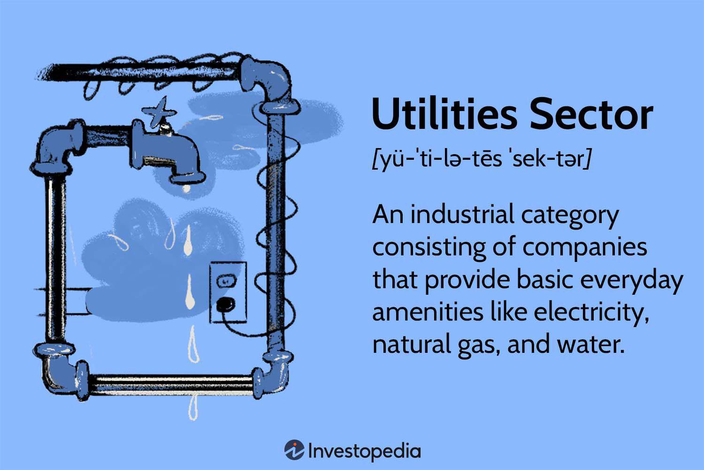

## Table of Contents

## What is the utilities sector and why is it important for investment?

The utilities sector includes companies that provide essential services like electricity, gas, water, and sometimes even waste management. These services are crucial for everyday life, so people and businesses always need them. This makes the utilities sector very stable because the demand for these services doesn't change much, even during tough economic times.

Investing in the utilities sector can be a good choice for many reasons. First, because these companies are stable, they often pay regular dividends to their investors. This means you can get a steady income from your investment. Second, utilities are often regulated by the government, which can help protect investors from big losses. Overall, the utilities sector can be a safe and reliable part of an investment portfolio.

## What are the main types of utilities companies (e.g., electric, gas, water)?

Utilities companies can be divided into different types based on the services they provide. The main types are electric, gas, and water companies. Electric companies generate and distribute electricity to homes and businesses. They might use different sources like coal, natural gas, nuclear power, or renewable energy like wind and solar. Gas companies deliver natural gas, which people use for heating, cooking, and sometimes to generate electricity. Water companies treat and supply clean water for drinking, cooking, and other uses, and they also manage wastewater.

Each type of utility company plays a crucial role in our daily lives. Electric companies are essential because almost everything we use, from lights to computers, needs electricity. Gas companies provide a convenient and often cheaper way to heat homes and cook food. Water companies are vital for our health and hygiene, making sure we have safe water to drink and use. Together, these companies make up the backbone of our modern society, ensuring that we have the basic services we need every day.

## How do regulatory environments affect utilities companies and their investment potential?

Regulatory environments have a big impact on utilities companies because the government often sets rules about how much they can charge for their services. These rules are meant to make sure that people can afford essential services like electricity, gas, and water. But they also mean that utilities companies can't just raise their prices whenever they want. This can limit how much profit they make, which is important for investors to think about.

Even though regulation can limit profits, it also makes utilities companies a safer investment. Because the government watches over them, there's less chance of big surprises or big losses. This can make utilities a good choice for investors who want a steady and reliable return on their money. So, while the rules might keep profits from growing too fast, they also help make utilities a more stable part of an investment portfolio.

## What are the key financial metrics to consider when analyzing utilities stocks?

When looking at utilities stocks, one of the most important things to check is the dividend yield. This tells you how much money the company pays out to its shareholders each year as a percentage of the stock's price. Utilities companies often have high dividend yields because they are stable and can afford to pay out regular dividends. Another key metric is the payout ratio, which shows how much of the company's earnings are being paid out as dividends. A payout ratio that is too high might mean the company is not keeping enough money to grow or handle tough times.

Another important thing to look at is the company's debt-to-equity ratio. This tells you how much the company is borrowing compared to what it owns. Utilities often need to borrow money to build big projects like power plants, so a higher debt-to-equity ratio is common. But if it's too high, it could be risky. You should also check the company's earnings growth. Even though utilities are stable, it's good to see if their earnings are growing over time. This can show that the company is doing well and might be able to keep paying good dividends in the future.

## How do interest rates impact the utilities sector and its investment attractiveness?

Interest rates can have a big impact on the utilities sector. When interest rates go up, it becomes more expensive for utilities companies to borrow money. These companies often need to borrow to build things like power plants or water treatment facilities, so higher interest rates can make these projects more costly. This can slow down their growth and make it harder for them to keep paying high dividends. On the other hand, when interest rates are low, borrowing is cheaper, which can help utilities companies grow and keep their dividends steady.

Interest rates also affect how attractive utilities stocks are to investors. When interest rates rise, other investments like bonds start to offer higher returns. This can make utilities stocks less appealing because investors might be able to get a similar or better return from bonds without the risk. But when interest rates are low, utilities stocks can look more attractive. Their steady dividends might seem better than the lower returns from bonds, making utilities a good choice for investors looking for income. So, keeping an eye on interest rates can help you decide if it's a good time to invest in utilities.

## What role does technological advancement play in the future of the utilities sector?

Technological advancement is changing the utilities sector in big ways. One of the main changes is the use of renewable energy like solar and wind power. These technologies are getting better and cheaper, so more utilities companies are using them to make electricity. This helps the environment because it cuts down on pollution. Also, new technology like smart meters is helping utilities companies work better. Smart meters let people see how much energy they are using and help the companies manage the power grid more efficiently.

Another important change is the use of digital technology to make the whole system smarter. For example, [artificial intelligence](/wiki/ai-artificial-intelligence) can help predict when machines might break down, so they can be fixed before they cause problems. This can save money and keep the power on for everyone. Also, new ways of storing energy, like batteries, are becoming more common. This means that utilities companies can save extra energy and use it when they need it, which makes the whole system more reliable. Overall, technology is making the utilities sector more efficient, greener, and better at serving people's needs.

## How can investors assess the environmental impact and sustainability efforts of utilities companies?

Investors can assess the environmental impact and sustainability efforts of utilities companies by looking at their use of renewable energy. Companies that are moving towards using more solar, wind, or hydro power are often more sustainable. They might share this information in their annual reports or on their websites. Investors can also check if the company has set goals to reduce their carbon emissions and if they are making progress towards those goals. This shows that the company is serious about being environmentally friendly.

Another way to assess a utilities company's sustainability is to see if they are involved in any green projects or if they have certifications like being part of a green energy program. For example, some companies might be working on energy storage solutions or smart grid technology that helps use energy more efficiently. Investors can also look at ratings from environmental organizations that track how well companies are doing in terms of sustainability. These ratings can give a good idea of how committed the company is to being environmentally responsible.

## What are the common risks associated with investing in the utilities sector?

Investing in the utilities sector can be safe because people always need services like electricity, gas, and water. But there are still some risks to think about. One big risk is that the government sets rules on how much utilities companies can charge. If the government doesn't let them raise prices enough, the companies might not make as much money as they need. This can hurt their profits and the dividends they pay to investors.

Another risk comes from interest rates. When interest rates go up, it costs more for utilities companies to borrow money for big projects like building power plants. This can slow down their growth and make it harder to keep paying good dividends. Also, when interest rates are high, other investments like bonds might offer better returns, so people might not want to buy utilities stocks as much.

Technology can also be a risk. As new technologies like renewable energy and smart grids become more common, utilities companies need to keep up. If they don't, they might lose customers to other companies that are using the latest technology. But if they do invest in new technology, it can be expensive and there's no guarantee it will pay off right away. So, while the utilities sector is stable, these risks are important for investors to keep in mind.

## How do utilities companies typically perform during different economic cycles?

Utilities companies usually do well even when the economy is not doing great. This is because people and businesses always need electricity, gas, and water, no matter what's happening with the economy. When times are tough, people might cut back on other things, but they can't stop using utilities. This makes the utilities sector more stable than other parts of the economy. Because of this stability, utilities companies can keep paying steady dividends to their investors, even during a recession.

During good economic times, utilities companies might not grow as fast as other sectors like technology or consumer goods. But they still do okay. People and businesses use more electricity and other utilities when the economy is strong, which can help the companies make more money. However, the government rules on how much they can charge can limit how much they can grow. So, while utilities might not see big jumps in their stock prices during economic booms, they provide a reliable and steady investment that can help balance out a portfolio.

## What are some advanced valuation techniques specific to the utilities sector?

One advanced way to value utilities companies is by using the Discounted Cash Flow (DCF) method. This method looks at how much money the company will make in the future and then figures out what that money is worth today. Because utilities companies are stable and often pay regular dividends, the DCF method can help investors see if the stock is a good deal. It's important to think about things like how much the company will grow, how much it will cost to keep the business running, and what the interest rates will be. All these things can change how much the future cash flows are worth today.

Another way to value utilities companies is by using the Dividend Discount Model (DDM). This method focuses on the dividends the company pays out to its shareholders. Because utilities companies often have high and steady dividends, the DDM can be a good way to see if the stock is worth buying. The DDM looks at how much the dividends will grow in the future and then figures out what those future dividends are worth today. This can help investors decide if the stock price is fair based on the income they will get from the dividends.

## How does the integration of renewable energy sources influence investment strategies in utilities?

The integration of renewable energy sources like solar and wind power is changing how investors think about the utilities sector. More and more utilities companies are using renewable energy because it's good for the environment and can save money in the long run. Investors are paying attention to this because companies that use renewable energy might be more sustainable and could attract more customers. This can make these companies a good choice for investors who care about the environment and want to support companies that are trying to be greener.

However, investing in renewable energy can also be risky. It costs a lot of money to build solar farms or wind turbines, and it might take a while for the company to make that money back. Also, the technology is always changing, so companies need to keep up with the latest advancements. If they don't, they might lose out to other companies that are using better technology. So, while renewable energy can be a good thing for utilities companies, investors need to think carefully about these risks and how they might affect the company's future profits and growth.

## What are the global trends and geopolitical factors affecting the utilities sector investments?

Global trends like the push for renewable energy are changing the utilities sector. More countries are trying to use less fossil fuels and more clean energy like solar and wind. This is because people want to fight climate change and governments are making rules to help. This trend is good for utilities companies that are moving towards renewable energy because they might get more customers and support from the government. But it can also be tough because building renewable energy projects can be expensive and take a long time to start making money.

Geopolitical factors also play a big role in the utilities sector. For example, if there's a conflict in a country that has a lot of oil or gas, it can make it harder for utilities companies to get the energy they need. This can make energy prices go up and affect how much money utilities companies can make. Also, different countries have different rules about energy, so utilities companies that work in many countries need to understand these rules and how they might change. This can make investing in utilities more complicated because investors need to think about what's happening around the world and how it might affect the companies they're investing in.

## References & Further Reading

[1]: Bergstra, J., Bardenet, R., Bengio, Y., & Kégl, B. (2011). ["Algorithms for Hyper-Parameter Optimization."](https://papers.nips.cc/paper/4443-algorithms-for-hyper-parameter-optimization) Advances in Neural Information Processing Systems 24.

[2]: ["Advances in Financial Machine Learning"](https://www.amazon.com/Advances-Financial-Machine-Learning-Marcos/dp/1119482089) by Marcos Lopez de Prado

[3]: ["Evidence-Based Technical Analysis: Applying the Scientific Method and Statistical Inference to Trading Signals"](https://www.amazon.com/Evidence-Based-Technical-Analysis-Scientific-Statistical/dp/0470008741) by David Aronson

[4]: ["Machine Learning for Algorithmic Trading"](https://github.com/stefan-jansen/machine-learning-for-trading) by Stefan Jansen

[5]: ["Quantitative Trading: How to Build Your Own Algorithmic Trading Business"](https://www.amazon.com/Quantitative-Trading-Build-Algorithmic-Business/dp/1119800064) by Ernest P. Chan