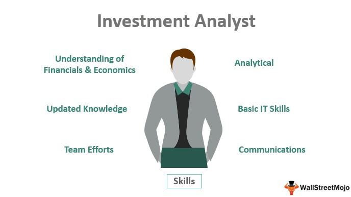

The finance sector plays a pivotal role in the modern economy by serving as the backbone for economic growth and development. It encompasses a broad range of activities, including banking, investing, insurance, and trading, which collectively facilitate the efficient allocation of resources, manage risk, and promote stability. Financial markets enable individuals, businesses, and governments to raise capital, invest savings, and hedge against uncertainties. This dynamic sector influences global economic trends and impacts the daily lives of millions.

Financial analysis is integral to the finance sector, providing the framework for evaluating economic performance and making informed investment decisions. It involves assessing historical data, analyzing financial statements, and forecasting future performance. By identifying trends, evaluating business viability, and pricing financial instruments, financial analysis guides investment strategies, corporate strategies, and risk management practices. It is essential for ensuring that capital is allocated efficiently and that stakeholders achieve the best possible return on investment.

Within the finance sector, various career paths offer unique opportunities for professionals. Financial analysis is one of the primary paths, focusing on examining financial data to guide investment decisions and business strategies. Investment analysis, a closely related field, involves evaluating securities and advising on portfolio compositions to generate returns for clients or organizations. Algorithmic trading represents another advancing area, where technology and finance intersect to automate and optimize trading processes through complex algorithms. These career paths reflect the sector's diversity and cater to a wide range of skills and interests.

Algorithmic trading has gained prominence in recent years due to the increasing reliance on technology within financial markets. It employs mathematical models and computational techniques to execute trades at speeds and frequencies that are impossible for human traders. Algorithms can analyze vast amounts of data to detect arbitrage opportunities and predict market trends, thereby enhancing market efficiency and liquidity. The growth of algorithmic trading underscores the continuing evolution of the finance industry, where innovation and technology are at the forefront.

The objective of this article is to provide a comprehensive examination of three major finance career paths: financial analysis, investment analysis, and algorithmic trading. It aims to explore the significance of these roles, outline educational requirements and skillsets, and compare career prospects. By highlighting the evolving landscape of finance careers, this article will inform aspiring finance professionals about the opportunities and challenges in this dynamic field.

## Table of Contents

## Career in Financial Analysis

Financial analysis is a systematic approach to evaluating the financial health and performance of businesses, projects, budgets, and financial transactions. It aims to provide insights that aid decision-makers in planning, forecasting, budgeting, and controlling business activities. By analyzing financial statements such as balance sheets, income statements, and cash flow statements, financial analysts can assess stability, profitability, liquidity, and solvency. This analysis is crucial as it informs strategic decisions, helping businesses optimize operations, minimize risks, and pursue growth opportunities.

### Education Requirements and Certifications

A strong educational foundation is essential for aspiring financial analysts. Typically, a bachelor's degree in finance, economics, accounting, or a related field is required. For those seeking to advance further or to specialize, a master's degree, such as a Master's in Business Administration (MBA) or a Master's in Finance, can provide additional advantages.

Certifications play a significant role in enhancing a financial analyst's credentials and career prospects. The Chartered Financial Analyst (CFA) designation is widely recognized and respected in the industry. Administered by the CFA Institute, this program requires a combination of educational prerequisites, professional experience, and passing three rigorous exams that cover areas such as ethical and professional standards, investment tools, asset valuation, and portfolio management.

### Skills Required to Excel in Financial Analysis

Financial analysts must possess a blend of hard and soft skills to excel in their roles. Key skills include:

- **Analytical Skills**: Ability to interpret financial data, identify trends, and make recommendations.
- **Technical Proficiency**: Mastery of financial modeling tools, Excel spreadsheets, and analytical software such as Bloomberg or Tableau.
- **Attention to Detail**: Vigilance in identifying discrepancies in data and ensuring accuracy.
- **Communication Skills**: Capability to clearly explain complex financial concepts and reports to stakeholders.
- **Problem-Solving Skills**: Aptitude for developing strategies to address business financial challenges.

### Typical Roles and Responsibilities of a Financial Analyst

The responsibilities of a financial analyst can vary depending on the specific role and industry. However, general duties often include:

- Evaluating financial data to forecast business, industry, or economic conditions.
- Conducting cost analyses, budgeting, and variance analysis to improve financial performance.
- Preparing detailed reports on financial patterns using charts, graphs, and summaries.
- Assisting in the preparation of financial plans and risk assessment reports.
- Recommending investment portfolios and financial management strategies.

### Career Prospects and Potential Salary in Financial Analysis

The demand for financial analysts is expected to grow, driven by the need for meticulous financial planning and risk management in organizations. According to the U.S. Bureau of Labor Statistics, employment in this field is projected to see consistent growth over the coming years.

Salaries for financial analysts can vary significantly based on factors such as location, experience, and industry. In the United States, the median annual salary for financial analysts was $83,660 as of 2020. Experience and professional certification, such as the CFA, can significantly enhance [earning](/wiki/earning-announcement) potential, with senior analysts and managers earning substantially higher salaries.

Overall, a career in financial analysis offers diverse opportunities and can serve as a stepping stone to advanced roles in finance and executive management.

## Investment Analysis as a Career

Investment analysis is a critical component of the finance industry, serving as a tool for evaluating securities, financial assets, and strategies to make informed investment decisions. The roles and objectives of investment analysis revolve around evaluating potential investments by assessing their risks and expected returns. This involves analyzing various factors such as financial statements, market trends, economic data, and political events to forecast future performance and guide investment choices.

### Differences Between Buy-Side and Sell-Side Analysts

Investment analysts typically operate within two distinct environments: buy-side and sell-side. Buy-side analysts work with investment firms, pension funds, hedge funds, and mutual funds, focusing on maximizing returns for their clients by making strategic investment decisions. Their primary role is to provide research and insights to portfolio managers who execute investment decisions. On the other hand, sell-side analysts are employed by investment banks, brokerage firms, and other financial services companies. Their main function is to offer investment recommendations and research reports to clients, such as institutional investors and traders, to facilitate transactions and generate brokerage fees.

### Key Qualifications and Certifications for Investment Analysts

Pursuing a career in investment analysis requires a solid educational foundation, typically a bachelor's degree in finance, economics, or a related field. Advanced degrees such as a Master's in Business Administration (MBA) or Master's in Finance can provide a competitive advantage. Additionally, certifications are significant in distinguishing oneself in the field. The Chartered Financial Analyst (CFA) designation is highly regarded globally, requiring a rigorous examination process covering topics like ethics, equity analysis, and portfolio management. Other certifications, such as Certified Investment Management Analyst (CIMA) and Financial Risk Manager (FRM), are also valuable depending on one’s career focus.

### The Impact of Market Trends and Economic Conditions

Market trends and economic conditions can profoundly impact investment analysis, as they directly affect asset prices and investment returns. Analysts must stay abreast of current and anticipated market developments, including changes in interest rates, inflation, GDP growth, and geopolitical events. For example, during a period of economic growth, equity investments might become more attractive due to expected corporate earnings growth. Conversely, in a downturn, analysts may favor bonds or other risk-averse investments. Understanding these dynamics is essential for analysts to provide timely and accurate investment guidance.

### Career Paths, Positions, and Expected Salary Ranges

Investment analysis offers a variety of career paths and positions. Entry-level roles generally start with titles such as Junior Analyst or Research Analyst, where responsibilities include data collection and initial report preparation. Progression often leads to Senior Analyst positions, focusing on more complex analysis and strategy formulation. With experience, individuals may move into roles like Portfolio Manager, where they manage investment portfolios and make high-level decisions.

Salaries in investment analysis can vary based on factors such as location, experience, and the specific financial sector. As of recent data, entry-level analysts can expect salaries ranging from $60,000 to $80,000 annually, while experienced analysts, especially those with a CFA designation, might earn between $100,000 and $150,000. Senior roles like Portfolio Managers can see compensation well into the six figures, often supplemented by performance bonuses and profit-sharing opportunities.

In summary, investment analysis is a field that offers dynamic career opportunities for those interested in finance. It requires a blend of technical expertise, analytical skills, and market awareness to excel and advance in this rewarding domain.

## Algorithmic Trading: An Emerging Career

Algorithmic trading, often referred to as algo trading, is a method of executing trades using automated and pre-programmed trading instructions. The parameters such as timing, price, or [volume](/wiki/volume-trading-strategy) are determined by sophisticated algorithms. In modern finance, [algorithmic trading](/wiki/algorithmic-trading) holds significant importance due to its ability to swiftly analyze vast datasets beyond the human capability, making trading more efficient and less susceptible to human emotions and errors.

### Required Academic Background and Skills

A career in algorithmic trading typically demands a solid educational foundation in fields such as finance, economics, computer science, mathematics, or engineering. A deep understanding of quantitative models and financial markets is crucial. Proficiency in programming languages such as Python, C++, or MATLAB is essential, given their extensive use in developing trading algorithms. Additionally, skills in statistical analysis, [machine learning](/wiki/machine-learning), and data analysis are highly valued.

### Common Algo Trading Strategies and Technologies

Several strategies exist within algorithmic trading, including:

1. **Trend Following Strategies:** These are based on moving averages and channel breakouts.
2. **Arbitrage Opportunities:** Utilizing price discrepancies in different markets or instruments.
3. **Market Making:** Providing liquidity by offering bid and ask prices to earn a spread.
4. **Pair Trading:** Exploiting the correlation between two stocks.

Technologies such as high-frequency trading platforms, execution management systems, and sophisticated data feeds are integral components of an algo trading setup, ensuring precision and speed in executing trades.

### Job Roles in Algorithmic Trading

Within algorithmic trading, several specialized roles exist:

- **Quantitative Analyst (Quant):** Responsible for developing mathematical models to identify trading opportunities. They require strong skills in mathematics and computer programming.

- **Algo Developer:** Focused on writing and implementing code that automates trading strategies. This role requires expertise in programming and software development.

- **Algorithmic Trader:** In charge of executing and managing trading strategies, often requiring a combination of market acumen and technical skills to adapt and optimize algorithms based on market conditions.

### The Potential Impact of AI and Machine Learning

Artificial Intelligence (AI) and Machine Learning (ML) are increasingly transforming algorithmic trading. These technologies enable systems to learn from historical data and improve trading algorithms over time, enhancing prediction accuracy and adaptability. AI can process and analyze real-time data to generate more sophisticated trading signals, offering a competitive edge in markets.

The integration of AI and ML is likely to redefine the landscape of algorithmic trading careers by emphasizing the need for professionals who can bridge finance and data science, designing systems that can autonomously evolve. This evolution points toward a future where algorithmic trading becomes more efficient, precise, and profitable, further cementing its role in modern finance.

## Comparing Careers: Financial Analysis vs. Investment Analysis vs. Algo Trading

Financial analysis, investment analysis, and algorithmic trading represent distinct yet interlinked career paths within the finance sector, each offering unique opportunities and challenges. Understanding these professions' nuances, skill requirements, work environments, and potential rewards is crucial for aspiring finance professionals to make informed career decisions.

Financial analysts assess the viability, stability, and profitability of businesses, sectors, or projects. They utilize financial data and models to provide insights that aid in decision-making. Key skills include expertise in financial reporting, proficiency with analytical tools like Excel and databases, and a strong understanding of economic trends. Financial analysts typically work in corporate finance departments, banks, or investment firms, where their responsibilities include financial forecasting, risk assessment, and budget analysis. Career progression can lead to roles such as senior financial analyst, finance manager, or chief financial officer (CFO), with compensation reflecting experience and responsibility, often ranging from $60,000 to over $150,000 annually.

Investment analysis focuses on evaluating investment opportunities to maximize returns for clients or institutions. This role requires strong analytical skills, an understanding of market dynamics, and the ability to interpret complex data sets. Investment analysts can work as buy-side analysts, who manage portfolios for institutional investors, or sell-side analysts, who provide research and recommendations for clients. Certifications such as the Chartered Financial Analyst (CFA) can significantly enhance career prospects. Salaries vary widely, from around $50,000 for entry-level roles to over $200,000 for experienced analysts in leading financial centers.

Algorithmic trading involves using computer programs to execute trades at speeds and frequencies beyond human capability. Careers in algo trading demand a strong background in mathematics, [statistics](/wiki/bayesian-statistics), and programming skills, particularly in languages like Python and C++. Common strategies include [arbitrage](/wiki/arbitrage), [market making](/wiki/market-making), and [trend following](/wiki/trend-following). Professionals may assume roles such as quantitative analysts (quants), developers, or traders. The work environment is often high-pressure and dynamic, focused on innovation and rapid decision-making. Salary potential is significant, with quants and algo traders in prestigious firms earning six-figure salaries and substantial bonuses.

Comparing these careers, financial analysis demands strong foundational skills in finance and reporting, suitable for those interested in corporate finance management. Investment analysis offers opportunities for individuals inclined towards market research and client advisory roles, often requiring more direct interaction with market trends and investment portfolios. Meanwhile, algorithmic trading suits those with a technical edge and a penchant for software development and quantitative analysis, thriving in technology-driven environments.

Deciding on the appropriate career path aligns closely with personal interests and market demand. Candidates with a keen interest in corporate structures and financial health might gravitate towards financial analysis. Meanwhile, those excited by market dynamics and client interactions could find investment analysis more rewarding. Individuals with strong analytical and programming skills may favor algorithmic trading, especially given the sector's rapid growth powered by AI and machine learning advancements. As the finance sector continues to evolve, adaptability and a commitment to continuous learning remain critical across all these career paths.

## Preparing for a Career in Finance

Preparing for a successful career in finance involves a combination of formal education, practical experience, networking, and continuous learning. Below is an exploration of the educational requirements, internships, networking strategies, resources, and interview tips essential for entering and thriving in the finance sector.

### Educational Pathways and Relevant Degrees

A robust educational foundation is critical for a career in finance. Typically, aspiring finance professionals pursue degrees in finance, economics, business administration, or accounting. Advanced roles and specializations may require further education, such as a master's degree in finance (MFin), a Master of Business Administration (MBA) with a concentration in finance, or a master's in financial engineering.

**Key courses** that are particularly beneficial include:
- **Financial Accounting and Reporting:** Understanding financial statements and their analysis.
- **Corporate Finance:** Focusing on financial management and capital structuring.
- **Investment Analysis:** Learning about securities, portfolio management, and market functioning.
- **Econometrics and Statistics:** Essential for quantitative finance roles, involving data analysis and financial modeling.

### The Role of Internships and Work Experience

Gaining practical experience through internships is invaluable. Internships offer a real-world grasp of financial operations, market analysis, and client interaction, providing a competitive edge in the job market. Many financial institutions offer summer internship programs that can lead to full-time employment. Entry-level positions, such as financial analyst roles, often transition from internship programs, making it crucial to seek internship opportunities early in one's academic career.

### Importance of Networking and Professional Organizations

Networking is a pivotal aspect of career advancement in finance. Building connections with professionals can provide insights into industry trends and potential job openings. Joining professional organizations such as the CFA Institute, Financial Planning Association (FPA), or local finance clubs can foster networking opportunities and career growth. These organizations often host workshops, seminars, and conferences that serve as platforms for building professional relationships and staying informed about industry developments.

### Key Resources and Courses for Aspiring Finance Professionals

Online platforms and resources can significantly enhance one’s knowledge and skills in finance. Several online courses and certifications complement traditional education:
- **Coursera and edX:** Offer finance-related courses from leading universities, covering various finance topics.
- **Financial Modeling & Valuation Analyst (FMVA) Certification:** Provides expertise in financial modeling and analysis.
- **Chartered Financial Analyst (CFA) Program:** A prestigious certification that provides comprehensive knowledge on investment management.

These resources, combined with traditional education, prepare candidates for various challenges in the financial field.

### Tips for Successful Job Interviews in Finance

Approaching job interviews with preparation and confidence is critical. Below are strategies for excelling in finance interviews:
- **Understand the Industry:** Be well-informed about current financial markets, trends, and the specific company you are interviewing with.
- **Technical Skills:** Be prepared to demonstrate financial modeling, analysis skills, or specific software competencies, such as Excel or Python coding for finance-related tasks.
- **Behavioral Questions:** Be ready to discuss past experiences, teamwork, problem-solving skills, and how you have tackled challenges.
- **Mock Interviews:** Practice with peers or mentors to refine your responses and get feedback on your delivery.

In summary, a career in finance demands a comprehensive educational background, practical experience through internships, robust networking strategies, utilization of learning resources, and meticulous interview preparation. These components collectively lay the foundation for a successful and rewarding career in finance.

## Conclusion

Financial analysis, investment analysis, and algorithmic trading represent critical roles in the finance industry, each contributing distinctly to the functioning and growth of financial markets. Financial analysis involves scrutinizing financial data and business metrics to support business decisions, while investment analysis focuses on assessing investment opportunities to maximize returns. Algorithmic trading, with its reliance on sophisticated algorithms and data analysis, revolutionizes the execution of trades with speed and precision. Together, these careers not only facilitate informed decision-making but also enhance market efficiency and [liquidity](/wiki/liquidity-risk-premium).

The finance sector is undergoing a significant transformation due to technological advancements and the digitization of financial services. This evolution is creating new opportunities and challenges for professionals. In particular, algorithmic trading is gaining prominence as Artificial Intelligence (AI) and Machine Learning (ML) technologies become more sophisticated, enabling more complex trading strategies and greater predictive accuracy. Financial analysts are also increasingly leveraging advanced analytics and big data to derive insights, while investment analysts are focusing on integrating Environmental, Social, and Governance ([ESG](/wiki/esg-investing)) criteria into their assessments to meet changing investor demands.

For individuals considering a career in finance, it is essential to align their career path with personal skills and interests. Whether one is drawn to the analytical rigor of financial analysis, the strategic insight required in investment analysis, or the tech-driven environment of algorithmic trading, there are compelling opportunities in each domain. Acquiring the right educational background, certifications, and practical experience is crucial, as is staying abreast of industry trends and networking with professionals.

Looking ahead, the finance industry is poised to continue its evolution, driven by technological innovation, regulatory changes, and shifting economic conditions. Future trends such as greater automation, the rise of fintech, and increased focus on sustainable investing will likely shape the roles within financial analysis, investment analysis, and algorithmic trading. Aspiring finance professionals should seek to embrace these changes, continuously upgrade their skills, and remain adaptable to succeed in this dynamic landscape.

## References & Further Reading

[1]: CFA Institute. ("CFA Program"). https://www.cfainstitute.org/programs/cfa

[2]: Bodie, Z., Kane, A., & Marcus, A. J. ("Investments"). McGraw-Hill Education.

[3]: Murphy, J. J. ("Technical Analysis of the Financial Markets: A Comprehensive Guide to Trading Methods and Applications"). New York Institute of Finance.

[4]: Chincarini, L. & Kim, D. ("Quantitative Equity Portfolio Management: An Active Approach to Portfolio Construction and Management"). McGraw-Hill Education.

[5]: Tse, Y. K. ("Financial Econometrics: Empirical Market Microstructure"). Princeton University Press.