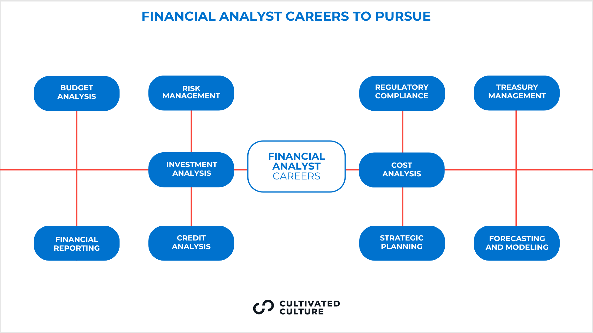

## Table of Contents

## What is an investment analyst?

An investment analyst is a person who helps people and companies make smart choices about where to put their money. They look at different investments like stocks, bonds, and real estate to see which ones might make the most money. They use numbers and data to figure out if an investment is a good idea or not. They also keep up with news and trends that might affect the value of investments.

Investment analysts often work for big companies, banks, or investment firms. They write reports and give advice to their clients or bosses about what to invest in. Sometimes, they meet with company leaders to learn more about the businesses they are thinking about investing in. Their job is important because they help people grow their money and make good financial decisions.

## What are the primary responsibilities of an investment analyst?

An investment analyst's main job is to look at different investments and figure out which ones are good choices. They study things like stocks, bonds, and real estate to see how much money they might make. They use numbers and data to make these decisions. They also keep an eye on the economy and news that could change how well an investment does. Their goal is to find investments that will grow and make money for their clients or the company they work for.

Another big part of their job is to write reports and give advice. They put all their research into easy-to-understand reports that explain why an investment is a good or bad idea. They share these reports with their clients or bosses. Sometimes, they meet with company leaders to learn more about the businesses they are thinking about investing in. This helps them make better decisions. Their advice helps people and companies make smart choices about where to put their money.

## What skills are essential for an investment analyst?

An investment analyst needs to be good with numbers and data. They use math and special computer programs to look at investments and see how they might do in the future. They also need to know a lot about the economy and how it can affect different investments. Being able to read and understand financial reports is important too. This helps them make smart choices about where to put money.

Good communication skills are also key for an investment analyst. They need to write clear reports and explain their ideas to others. Sometimes they have to talk to company leaders to learn more about a business. Being able to listen and ask good questions is part of this. They also need to be good at working with others because they often work in teams.

Lastly, an investment analyst should be curious and always want to learn more. The world of investing changes a lot, so they need to keep up with new trends and news. Being able to think critically and solve problems is also important. This helps them find the best investments and avoid bad ones.

## What educational background is required to become an investment analyst?

To become an investment analyst, you usually need a good education. Most people in this job have at least a bachelor's degree. They often study things like finance, economics, business, or accounting. These subjects help them learn about money and how to make smart investment choices. Sometimes, people even go to school for a master's degree, like an MBA or a Master's in Finance. This can help them get better jobs and learn even more about investing.

Besides school, many investment analysts also get special certificates. One popular one is the Chartered Financial Analyst (CFA) certification. To get this, you have to pass some hard tests and have some work experience. It shows that you know a lot about investing and are good at it. Some people also get other certificates like the Certified Financial Planner (CFP) or the Financial Risk Manager (FRM). These can help them stand out and get good jobs in the investment world.

## What certifications can enhance an investment analyst's career?

Certifications can really help an investment analyst's career. One of the most important ones is the Chartered Financial Analyst (CFA) certification. To get this, you need to pass three tough exams and have some work experience. The CFA certification shows that you know a lot about investing and are good at it. It can help you get better jobs and make more money. Many employers look for people with this certification because it means you are serious about your career.

Another useful certification is the Certified Financial Planner (CFP). This one is good if you want to help people plan their whole financial life, not just their investments. To get a CFP, you need to pass an exam, have some work experience, and follow certain rules about how you work with clients. It can open up more job opportunities and help you stand out. Some investment analysts also get the Financial Risk Manager (FRM) certification. This one is all about understanding and managing risks in investments. It can be very helpful if you want to work in a job where you need to keep investments safe.

## How does one start a career as an investment analyst?

To start a career as an investment analyst, you usually need to go to college and get a bachelor's degree. Many people study finance, economics, business, or accounting because these subjects help you learn about money and investments. After college, some people decide to get more education, like a master's degree in business administration (MBA) or finance. This can help you get better jobs and learn more about investing. While in school, it's a good idea to get internships at banks or investment firms. Internships give you real experience and help you meet people who can help you get a job later.

Once you have your education, you can start looking for jobs as an investment analyst. Many people start in entry-level jobs at big companies, banks, or investment firms. These jobs might not be exactly what you want at first, but they help you learn and gain experience. To stand out, you can also get certifications like the Chartered Financial Analyst (CFA) certification. This shows employers that you know a lot about investing and are serious about your career. As you work and learn more, you can move up to better jobs and make more money.

## What is the typical career progression for an investment analyst?

Starting as an investment analyst usually means beginning in an entry-level job at a bank, investment firm, or big company. These jobs help you learn the basics of investing and give you real experience. You might start as a junior analyst, where you help more experienced analysts with research and reports. As you learn and get better at your job, you can move up to being a full analyst. This means you get to do more of the important work, like making investment decisions and writing your own reports.

After a few years of working as an analyst, you can move up to more senior roles. You might become a senior analyst, where you lead a team of other analysts and make big decisions about investments. Some people also move into management roles, like becoming a portfolio manager. This means you are in charge of a big group of investments and make sure they are doing well. To keep moving up, it's important to keep learning and maybe get certifications like the CFA. With hard work and experience, you can have a successful career as an investment analyst.

## What industries do investment analysts typically work in?

Investment analysts usually work in the finance industry. This includes big banks, investment firms, and asset management companies. They help these companies decide where to put their money to make the most profit. Sometimes, they work for insurance companies or pension funds, where they help manage the money that people have saved for the future. These jobs are important because they help the companies grow their money and make good financial decisions.

Investment analysts can also work in other industries, like real estate or energy. In real estate, they look at properties and figure out if they are good investments. In the energy industry, they might study oil, gas, or renewable energy projects to see if they will make money. No matter where they work, their job is to use numbers and data to find the best places to invest money. This helps their companies or clients make smart choices about where to put their money.

## How do investment analysts use financial models and data analysis?

Investment analysts use financial models to predict how well an investment might do in the future. They put numbers into these models, like how much a company makes and how much it spends. The models help them see if the company will grow and make more money. They also look at things like interest rates and the economy to see how these might change the value of the investment. By using these models, investment analysts can figure out if an investment is a good idea or not.

Data analysis is also very important for investment analysts. They look at a lot of numbers and information about companies and the economy. They use special computer programs to find patterns and trends in the data. This helps them understand what is happening now and what might happen next. By analyzing data, they can make smart guesses about which investments will do well. This helps them give good advice to their clients or bosses about where to put their money.

## What are the key differences between a junior and a senior investment analyst?

A junior investment analyst is someone who is just starting out in the job. They usually help more experienced analysts by doing research and gathering data. They might write parts of reports, but they don't make the big decisions about investments. Junior analysts learn a lot on the job and get to know how things work in the company. They might also go to meetings and learn from senior analysts, but they don't lead these meetings themselves.

A senior investment analyst has a lot more experience and does more important work. They lead teams of analysts and make big decisions about where to invest money. They write their own reports and give advice to clients or bosses. Senior analysts often meet with company leaders to learn more about businesses they might invest in. They use their experience and knowledge to find the best investments and help their company or clients make more money.

## How do investment analysts stay updated with market trends and economic changes?

Investment analysts stay updated with market trends and economic changes by reading a lot. They look at financial news websites, newspapers, and special reports every day. They also use tools like Bloomberg Terminal and Reuters to get the latest information. These tools give them numbers and data about the stock market, economy, and different investments. By reading and using these tools, they can see what is happening in the world of money and make smart decisions.

Another way investment analysts stay updated is by going to meetings and conferences. They meet other people who work in finance and learn from them. They also listen to experts talk about what they think will happen in the future. Sometimes, they join groups or clubs where people share ideas and news about the market. This helps them understand new trends and changes in the economy. By doing all these things, investment analysts can keep their knowledge fresh and give good advice to their clients or bosses.

## What advanced strategies do expert investment analysts employ to maximize returns?

Expert investment analysts use advanced strategies to find the best investments and make more money. One strategy they use is called "quantitative analysis." This means they use math and computer programs to look at a lot of data and find patterns. They can see which investments have done well in the past and might do well in the future. They also use something called "[algorithmic trading](/wiki/algorithmic-trading)," where computers make quick decisions about buying and selling investments based on the data they see. This can help them make money faster than if they did it by hand.

Another strategy is called "diversification." This means they don't put all their money in one place. Instead, they spread it out over different types of investments, like stocks, bonds, and real estate. This helps them lower the risk of losing money if one investment does badly. Expert analysts also use "hedging" to protect their investments. Hedging means they buy other investments that will go up in value if their main investments go down. This way, they can still make money even if the market changes in a bad way. By using these smart strategies, expert investment analysts can maximize their returns and help their clients or companies make more money.

## References & Further Reading

[1]: CFA Institute. ("CFA Program"). https://www.cfainstitute.org/programs/cfa

[2]: Bodie, Z., Kane, A., & Marcus, A. J. ("Investments"). McGraw-Hill Education.

[3]: Murphy, J. J. ("Technical Analysis of the Financial Markets: A Comprehensive Guide to Trading Methods and Applications"). New York Institute of Finance.

[4]: Chincarini, L. & Kim, D. ("Quantitative Equity Portfolio Management: An Active Approach to Portfolio Construction and Management"). McGraw-Hill Education.

[5]: Tse, Y. K. ("Financial Econometrics: Empirical Market Microstructure"). Princeton University Press.