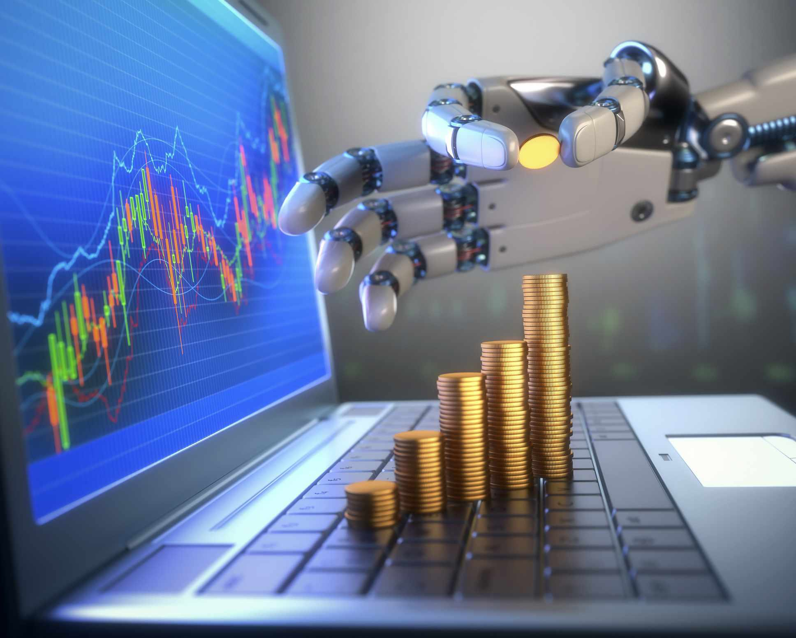

The evolution of financial technology has significantly transformed the way we invest, trade, and manage assets. Central to these advancements is automation, particularly through algorithmic trading, which has reshaped the financial sector by enhancing precision, speed, and operational efficiency. This article aims to explore the implications, benefits, and challenges associated with financial technology, focusing on investment automation and algorithmic trading.

Investors today must navigate a rapidly shifting landscape where traditional investment strategies are increasingly supplemented or replaced by technology-driven solutions. Automation in investment not only streamlines processes but also broadens access to sophisticated trading strategies that were once the domain of institutional investors. Algorithmic trading, which employs computer programs to execute trades based on predefined criteria, exemplifies this transformation, offering improved trading accuracy and eliminating the emotional biases inherent in human decision-making.

Understanding these innovations is crucial for investors and traders aiming to harness technology for optimized financial outcomes. By leveraging financial technology, stakeholders can achieve enhanced portfolio management, reduced transaction costs, and greater market participation. However, along with its benefits, this evolution also presents challenges such as technology risks, regulatory changes, and the need for continuous adaptation to new tools and strategies.

In examining how these technologies are shaping market dynamics, investors and traders can gain insights into their potential for unlocking new opportunities and achieving competitive advantages. As financial technology continues to advance, staying informed and adaptable will be key to capitalizing on its potential and navigating the challenges it presents.

## Table of Contents

## The Rise of Financial Technology in Investing

Financial technology, commonly known as fintech, represents a significant transformation in the financial services industry through the integration of advanced technology to deliver services more efficiently and effectively. Automation stands out as a pivotal advancement within this sector, fundamentally altering how financial transactions are conducted.

The primary influence of automation in fintech is the ability to streamline operations and execute decisions at a much faster pace. This enhancement in efficiency is crucial as it allows financial service providers to offer more responsive services. Additionally, automation minimizes human error, leading to more reliable outcomes.

Fintech innovations are continuously evolving, closely aligning with the contemporary investor’s demand for greater control, speed, and reliability. Investors increasingly seek platforms that not only facilitate swift decision-making but also grant them the autonomy to tailor investment strategies to their individual preferences. The deployment of user-friendly interfaces and real-time data analytics tools empowers investors to make informed decisions promptly.

Significantly, the rise of fintech has led to the development of new platforms and applications that open up novel opportunities for both individual and institutional investors. These platforms leverage big data and complex algorithms to analyze market trends and predict financial outcomes, enabling investors to optimize their portfolios more effectively. This has lowered the barriers to entry for individual investors, as they can now access sophisticated investment strategies that were once the domain of large financial institutions.

Moreover, fintech is broadening the scope of investment opportunities by integrating global financial markets. Investors now have access to a wider array of financial products and markets, allowing for improved portfolio diversification. This global connectivity not only enhances potential returns but also allows investors to manage risk more effectively through a diversified investment approach.

In conclusion, the rise of financial technology in investing is a transformative force, ushering in an era characterized by enhanced efficiency, greater investment control, and unprecedented access to financial markets. This evolution is not only democratizing investment opportunities but also reshaping the financial landscape at large.

## Investment Automation: A New Era of Investing

Investment automation marks a significant turning point in the financial landscape, as it leverages technology to manage investments with minimal human intervention. This innovation has reshaped the traditional approach to investing by introducing automated investing platforms, such as robo-advisors, which provide cost-effective portfolio management solutions. These platforms utilize sophisticated algorithms to allocate assets and adjust portfolios, aiming to optimize returns in accordance with individual risk tolerance and financial goals.

The use of algorithm-driven decisions helps investors by streamlining processes that traditionally required manual oversight. Robo-advisors typically rely on Modern Portfolio Theory (MPT) and other advanced quantitative models to make decisions regarding asset allocation. MPT, developed by Harry Markowitz, suggests that an optimal portfolio can be constructed to maximize returns for a given level of risk through diversification. Using mathematical equations, such as:

$$
E(R_p) = \sum_{i=1}^{n} w_i E(R_i)
$$

and

$$
\sigma_p^2 = \sum_{i=1}^{n} \sum_{j=1}^{n} w_i w_j \sigma_{ij}
$$

where $E(R_p)$ is the expected return of the portfolio, $w_i$ is the weight of asset $i$ in the portfolio, $E(R_i)$ is the expected return of asset $i$, and $\sigma_{ij}$ is the covariance between assets $i$ and $j$, portfolios can be optimized to achieve the desired balance between risk and return.

Automated platforms not only perform complex calculations but also offer other functions such as rebalancing portfolios when market conditions change. This adaptability ensures that investments align with the evolving market dynamics and the investor's strategy over time.

Moreover, the accessibility of automated investing platforms has democratized investment opportunities. They remove traditional barriers, such as high fees and large minimum investments, making financial markets more accessible to a broader audience. Investors with varying levels of capital and expertise can now partake in sophisticated investment strategies previously reserved for those with significant resources or dedicated financial advisors.

Additionally, these platforms enhance transparency and engagement by providing users with clear insights into their portfolio performance and risk exposure. As the demand for user-friendly, technology-enhanced financial solutions grows, investment automation continues to attract investors seeking efficient and effective ways to manage their assets.

In summary, investment automation represents a transformative advancement in the way investments are managed, providing both newcomers and seasoned investors with tools to better navigate financial markets. By blending technology with investment strategy, these automation tools stand at the forefront of a new era in investing, making it more inclusive and cost-efficient.

## Understanding Algorithmic Trading

Algorithmic trading, commonly referred to as algo-trading, is a pivotal facet of modern financial markets. It utilizes advanced computer programs and algorithms to execute trades efficiently based on pre-established criteria. This automated approach significantly enhances the speed and precision of trade executions, largely by removing human bias and minimizing the scope for errors due to emotional decision-making.

One of the key strengths of [algorithmic trading](/wiki/algorithmic-trading) lies in its ability to process and analyze immense datasets at high speeds. This capability allows for the identification of complex trading opportunities across an array of markets and asset classes. Algorithms are designed to detect patterns, price discrepancies, and other market inefficiencies that might be unobservable to human traders. For instance, in the foreign exchange market, algorithms can assess real-time currency price fluctuations and execute trades within milliseconds to capitalize on favorable shifts [1].

A few common strategies employed in algorithmic trading include trend-following, [arbitrage](/wiki/arbitrage) opportunities, and implementing complex strategies based on quantitative financial models. Trend-following strategies involve algorithms that identify price movements and trends in the market, executing trades that align with these patterns. The simplicity of these strategies, such as moving averages or [momentum](/wiki/momentum) indicators, makes them ideal candidates for algorithmic execution.

Arbitrage opportunities are particularly suited to algorithmic trading due to their dependence on time-sensitive price differences in different markets or instruments. Algorithms can quickly exploit mismatches in prices between, for example, commodities traded on different exchanges or related financial instruments, thereby profiting from these temporary discrepancies.

Quantitative model-based strategies use mathematical models to predict future price movements. These strategies often incorporate statistical and econometric techniques to formulate predictions based on historical data. An example of a quantitative model might be:

$$
\text{Expected Return} = \alpha + \beta_1 \times (\text{Market Return}) + \beta_2 \times (\text{Interest Rate}) + \epsilon
$$

where $\alpha$ represents the model's constant term, $\beta_1$ and $\beta_2$ are coefficients that measure sensitivity to the market returns and interest rates, and $\epsilon$ is the error term.

Overall, algorithmic trading continues to transform financial markets, offering strategies with improved speed and accuracy over traditional methods. However, the sophistication of these algorithms requires comprehensive understanding and rigorous testing to manage risks effectively.

[1] Hasbrouck, J. (2003). Trading Venue Competition. Oxford Review of Economic Policy.

## Benefits and Challenges of Algorithmic Trading

Algorithmic trading, commonly known as algo-trading, offers a multitude of benefits that can significantly enhance trading efficiency. One of the primary benefits is its ability to execute trades at optimal prices with minimal human intervention. This is achieved through precise algorithms that can analyze market data, predict price movements, and execute trades much faster than a human trader could. The automation reduces the vulnerability to human errors and emotions, such as fear and greed, leading to more disciplined trading decisions.

Algo-trading also reduces transaction costs. By employing sophisticated algorithms, traders can achieve better market timing and reduced bid-ask spreads, leading to cost savings. This efficiency allows both institutional and individual traders to manage multiple portfolios simultaneously, optimizing resource allocation and maximizing potential returns.

However, algorithmic trading is not without its challenges. One significant challenge is the technological risk associated with the reliance on software and hardware systems. Malfunctions, bugs, or cyber-attacks can lead to erroneous trades or system failures. Therefore, robust risk management and system checks are crucial to mitigate these risks.

Another challenge is the reliance on historical data. Algorithms developed on past data may not always predict future outcomes accurately, especially during unprecedented market conditions. This dependency can limit the effectiveness of the strategies used by the algorithms.

Market [volatility](/wiki/volatility-trading-strategies) also presents a challenge for algorithmic trading. Sudden and large market movements can lead to unexpected results, potentially amplifying losses. Algorithms may be designed to minimize risk, but extreme market conditions can test even the most sophisticated algorithms.

Regulations and ethical considerations play a pivotal role in maintaining market integrity and transparency. The increasing prevalence of algorithmic trading has prompted regulatory bodies to introduce measures ensuring fair trading practices and preventing market manipulation. Traders and institutions must comply with such regulations to avoid potential legal and ethical breaches.

In conclusion, while algorithmic trading offers substantial benefits in terms of efficiency, cost reduction, and scalability, it also presents challenges that require careful management. Understanding the potential risks and adhering to regulatory requirements are essential for leveraging the full potential of algorithmic trading strategies.

## Key Considerations in Implementing FinTech Investment Strategies

When adopting automated trading and investing strategies, several critical factors need to be considered to ensure that these fintech solutions align with individual financial goals and risk profiles. One of the primary considerations is the platform fees associated with automated investing services. These fees can include management fees, trading commissions, and other hidden costs that might erode investment returns over time. Platforms with transparent and competitive fee structures are preferable.

Account minimums also play a vital role. Some platforms require a significant initial deposit, which might be a barrier for smaller investors. Therefore, it's crucial to choose a platform whose account minimums are in line with the investor's financial situation and investment strategy.

Customer service is another [factor](/wiki/factor-investing) that cannot be overlooked. Investors should evaluate the quality of support provided, including the availability of live assistance and the responsiveness of the support team. Efficient customer service is essential for navigating any potential technical issues or investment queries that may arise.

Additionally, investors should assess the technological capabilities of the fintech solutions. This includes evaluating the algorithms used in portfolio management, the platform's ease of use, and its ability to integrate with other financial tools and services. The technology must be robust enough to meet the investor's specific financial objectives and risk tolerance.

Understanding the regulatory environment and associated compliance requirements is also crucial. Different jurisdictions have varying regulations that govern automated trading and investment platforms. Investors should ensure that their chosen platform complies with local regulations to mitigate legal risks and ensure the safety of their investments.

Lastly, continuous education and staying informed about market trends and technological advancements are essential for leveraging fintech innovations effectively. The financial technology landscape is dynamic, with new developments emerging regularly. Investors who engage in ongoing education and market analysis will be better equipped to adapt to changes and make informed investment decisions that align with their goals.

## The Future of Financial Technology Investing

The future of financial technology (fintech) in investment and trading is poised to witness transformative advancements that promise to reshape the financial landscape. As technological innovations accelerate, they bring opportunities and challenges that investors and traders must navigate to stay competitive. 

One of the most significant advancements is the integration of [artificial intelligence](/wiki/ai-artificial-intelligence) (AI) and [machine learning](/wiki/machine-learning) in trading systems. These technologies have the potential to revolutionize predictive analytics and decision-making processes. AI, with its capacity to learn from vast and complex datasets, can identify patterns and trends that are not immediately apparent to human analysts. This capability allows for the development of more sophisticated trading strategies and enhances the accuracy of predictions regarding market movements. Machine learning algorithms, in particular, can refine their models over time, adapting to new data, which aids in optimizing trading outcomes.

As technology-driven investment solutions become more mainstream, fintech's influence on financial markets will expand further. The adoption of digital platforms is already democratizing access to financial services, providing individual investors with tools that were once exclusive to large institutions. These platforms offer features such as automated trading, real-time data analysis, and personalized financial advice. As a result, fintech is enabling a more inclusive investment environment where a broader range of participants can engage effectively in the market.

However, to leverage the advantages of fintech innovations, investors will need to adapt to the rapidly evolving technological landscape. This adaptation involves not only acquiring new skills and knowledge but also embracing a mindset that is open to continuous learning and flexibility. Staying informed about the latest technological developments, regulatory changes, and market trends is crucial for investors aiming to optimize their portfolios and achieve their financial objectives.

Moreover, as fintech evolves, considerations regarding data security and privacy become paramount. Financial institutions and technology providers must prioritize the protection of sensitive investor information to maintain trust and regulatory compliance. Implementing robust cybersecurity measures and transparent data practices will be essential in fostering a secure investment environment.

In summary, while the future of financial technology in investing is promising, it necessitates strategic adaptation by market participants. AI and machine learning will continue to drive innovation in trading, enhancing analytical capabilities and decision-making precision. As fintech solutions become more ubiquitous, investors who remain agile and informed will be best positioned to capitalize on the opportunities presented by this dynamic sector.

## Conclusion

Financial technology and investment automation are continuously transforming how investments are approached, offering a myriad of tools and strategies that streamline trading processes. Algorithmic trading, a significant facet of this technological evolution, stands out by providing substantial benefits like enhanced speed, increased efficiency, and reduced costs. These advantages enable traders to execute multiple transactions swiftly and with precision, which is critical in today’s fast-paced financial markets.

However, the integration of such automation into trading also presents certain risks. Dependence on technology can lead to vulnerabilities including software failures and cybersecurity threats. Moreover, algorithmic trading can contribute to market volatility and requires substantial oversight to ensure ethical practices and compliance with regulations.

Understanding the complexities and developments in financial technology is essential for navigating its opportunities and challenges effectively. An informed investor can better utilize these technologies for portfolio enhancement while managing the risks associated with rapid technological advancements. The ability to adapt is central as fintech continues to evolve, bringing changes that redefine traditional concepts of trading and investment.

Going forward, staying informed about the latest in financial technology and maintaining adaptability will be crucial for investors. As new tools and advancements emerge, investors must be prepared to integrate these innovations into their strategies to maintain competitiveness and achieve financial objectives in an ever-evolving landscape.

## References & Further Reading

[1]: De Prado, M. L. (2018). ["Advances in Financial Machine Learning."](https://www.amazon.com/Advances-Financial-Machine-Learning-Marcos/dp/1119482089) Wiley.

[2]: Aronson, D. R. (2007). ["Evidence-Based Technical Analysis: Applying the Scientific Method and Statistical Inference to Trading Signals."](https://onlinelibrary.wiley.com/doi/book/10.1002/9781118268315) Wiley.

[3]: Jansen, S. (2020). ["Machine Learning for Algorithmic Trading: Predictive Models to Extract Signals from Market and Alternative Data for Systematic Trading Strategies with Python."](https://github.com/stefan-jansen/machine-learning-for-trading) Packt Publishing.

[4]: Chan, E. (2009). ["Quantitative Trading: How to Build Your Own Algorithmic Trading Business."](https://github.com/ftvision/quant_trading_echan_book) Wiley. 

[5]: Hasbrouck, J. (2003). ["Trading Venue Competition."](https://onlinelibrary.wiley.com/doi/10.1046/j.1540-6261.2003.00618.x) Oxford Review of Economic Policy, 19(4), 65-86.