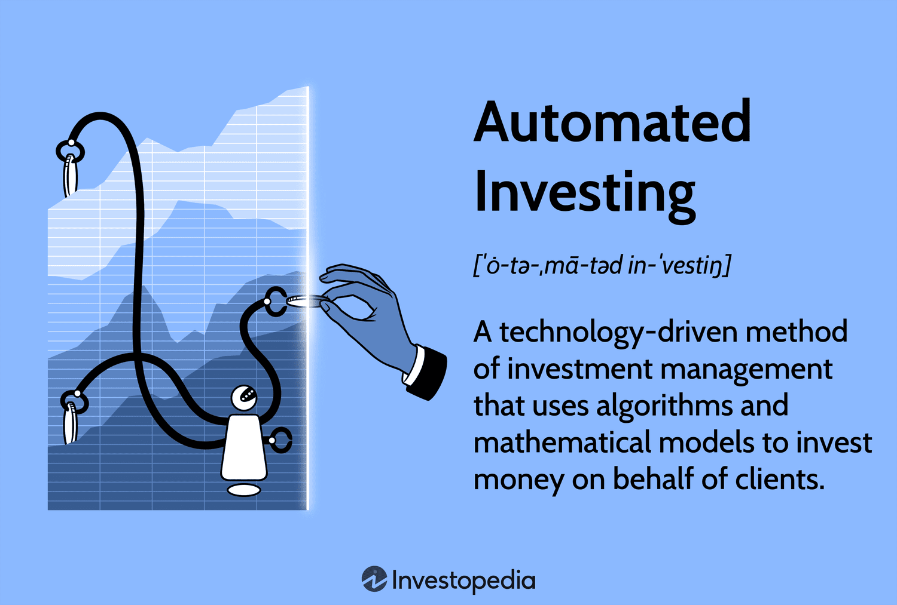

## Table of Contents

## What is investment automation and why is it important?

Investment automation is when computers and software help people manage their money and investments without them having to do everything by hand. This means that instead of you picking stocks or funds yourself, an automated system can do it for you based on rules and data. It's like having a robot that helps you decide where to put your money to grow it over time.

It's important because it makes investing easier and less time-consuming. Many people don't have the time or knowledge to manage their investments well. With automation, even if you're busy or new to investing, you can still make smart choices about your money. Plus, automated systems can often make decisions faster and without the emotions that might make people buy or sell at the wrong times. This can lead to better results and help you reach your financial goals more easily.

## What are the basic tools needed to start automating investments?

To start automating your investments, you'll need a few basic tools. First, you'll need a brokerage account where you can buy and sell investments like stocks, bonds, or funds. Many online brokerages offer automated investment services, sometimes called robo-advisors, which can help you set up and manage your investments without much work from you. These services often use algorithms to pick investments that match your goals and how much risk you're okay with taking.

Next, you'll need a way to move money into your investment account automatically. This can be done through setting up regular transfers from your bank account to your brokerage account. This ensures that you're consistently investing without having to remember to do it each time. Some platforms also let you set up automatic rebalancing, which means they'll adjust your investments to keep them in line with your goals as the market changes.

Lastly, having access to educational resources can be really helpful. Many robo-advisors and brokerages provide guides, videos, and tools that can teach you more about investing and help you make better decisions. This knowledge can boost your confidence in letting the automation do its job, knowing you have a good understanding of what's happening with your money.

## How can beginners set up their first automated investment plan?

To set up your first automated investment plan, start by choosing a robo-advisor or an online brokerage that offers automated investing services. These platforms are user-friendly and designed to help beginners. Once you've picked a service, open an account by providing your personal information and linking your bank account. Next, you'll need to answer some questions about your financial goals, how long you plan to invest, and how much risk you're comfortable with. Based on your answers, the robo-advisor will create a customized investment portfolio for you, usually made up of a mix of stocks and bonds.

After setting up your account and portfolio, the next step is to automate your investments. Decide on an amount you want to invest regularly, like every month or every paycheck, and set up automatic transfers from your bank account to your investment account. This way, you'll invest without having to remember to do it each time. The robo-advisor will then use the money to buy investments according to your plan. Over time, the platform will also automatically rebalance your portfolio to keep it aligned with your goals, making sure your investments stay on track without you having to do anything extra.

## What are the different types of investment automation strategies?

There are different types of investment automation strategies that can help you grow your money without much work. One common strategy is dollar-cost averaging, where you invest a fixed amount of money at regular intervals, like every month. This means you buy more shares when prices are low and fewer when prices are high, which can help smooth out the ups and downs of the market over time. Another strategy is target-date funds, which automatically adjust the mix of investments as you get closer to a certain date, like when you plan to retire. These funds start with more risky investments when you're young and switch to safer ones as you get older.

Another type of automation strategy is using robo-advisors. These are online services that use computer algorithms to pick and manage your investments based on your goals and how much risk you're willing to take. They do all the work for you, from choosing the right mix of stocks and bonds to rebalancing your portfolio to keep it in line with your goals. Lastly, there's the strategy of using ETFs or index funds, which are baskets of investments that track a part of the market. Automating investments into these funds means you're spreading your money across many different investments, which can lower your risk and help you grow your money over time.

## How does robo-advising work and is it suitable for beginners?

Robo-advising is a way to manage your investments using a computer program instead of a human. You tell the robo-advisor what you want to achieve with your money, like saving for retirement or buying a house, and how much risk you're okay with. The robo-advisor then picks a mix of investments, like stocks and bonds, that fit your goals. It keeps an eye on your investments and makes changes when needed, like selling some stocks and buying more bonds, to keep your plan on track. This all happens automatically, so you don't have to do much work after setting it up.

Robo-advising is really good for beginners because it's easy to use and doesn't need a lot of money to start. You just answer some questions about your goals and risk level, and the robo-advisor does the rest. This means you don't need to know a lot about investing to get started. It's also cheaper than working with a human financial advisor, which can save you money. Plus, because it's all done by a computer, there's no emotion involved, which can help you make better investment choices over time.

## What are the risks associated with automated investing?

Automated investing has some risks that you should know about. One big risk is that the computer program might not always make the best choices for your money. The program uses math and rules to pick your investments, but it can't predict everything that happens in the market. If the market goes down a lot, your investments might lose value, and the program might not be able to stop that from happening. Also, if you don't check your investments often, you might not notice if something goes wrong or if the program isn't working the way you want it to.

Another risk is that automated investing might not fit everyone's needs. Some people have special goals or need to invest in certain ways that a computer program might not be able to handle. If your situation changes, like if you need money sooner than you thought, the program might not adjust fast enough. Plus, while robo-advisors are usually cheaper than human advisors, they still charge fees. These fees can add up over time and eat into your returns, so it's important to understand what you're paying for.

## How can one optimize their automated investment portfolio?

To optimize your automated investment portfolio, start by regularly checking your investment goals and risk tolerance. Life changes, like getting a new job or planning to buy a house, can change what you want from your investments. Make sure your robo-advisor knows about these changes so it can adjust your portfolio to match your new goals. Also, keep an eye on the fees you're paying. Some robo-advisors charge more than others, and high fees can eat into your returns over time. If you find a cheaper option that still meets your needs, it might be worth switching.

Another way to optimize your portfolio is to understand and use tax-smart strategies. Some robo-advisors offer features like tax-loss harvesting, which can help you save money on taxes. This means selling investments that have gone down in value to offset the taxes you owe on the investments that have gone up. Also, make sure your portfolio is well-diversified. This means spreading your money across different types of investments, like stocks, bonds, and maybe even real estate. A well-diversified portfolio can help lower your risk and improve your chances of growing your money over time.

## What advanced techniques can be used to enhance investment automation?

To enhance investment automation, you can use a technique called algorithmic trading. This means using computer programs to buy and sell investments based on specific rules and patterns in the market. These programs can look at a lot of data really fast and make decisions without letting emotions get in the way. This can be good because it can help you take advantage of small changes in the market that you might miss if you were doing it by hand. But it can also be risky because the market can be unpredictable, and the computer might make choices that don't always work out.

Another advanced technique is using [machine learning](/wiki/machine-learning) to improve your investment strategy. Machine learning is when computers learn from data to make better decisions over time. You can use it to find patterns in the market that are hard for humans to see. This can help your automated investments make smarter choices about what to buy and sell. But machine learning needs a lot of data and can be complicated to set up, so it's more for people who really know about investing and technology.

## How do algorithmic trading and investment automation intersect?

Algorithmic trading and investment automation both use computers to help with investing, but they work in different ways. Investment automation usually means using a robo-advisor to manage your money based on your goals and how much risk you want to take. The robo-advisor picks a mix of investments like stocks and bonds and keeps them balanced over time without you having to do anything. It's like setting your investments on autopilot so you can focus on other things.

Algorithmic trading, on the other hand, is more about using computer programs to buy and sell investments quickly based on specific rules. These rules can be about things like price changes or patterns in the market. When algorithmic trading is used with investment automation, it can make the process even smarter. The computer can look at a lot of data really fast and make decisions without getting emotional. This can help your automated investments take advantage of small changes in the market that you might miss if you were doing it all by yourself. But it can also be riskier because the market can be unpredictable, and the computer might make choices that don't always work out.

## What role does artificial intelligence play in modern investment automation?

Artificial intelligence, or AI, is a big help in making investment automation better. It can look at a lot of information really quickly and find patterns that people might not see. This means AI can help pick the best investments for you based on what's happening in the market right now. It can also learn from past choices to make better ones in the future. This makes your automated investment plan smarter over time, so it can keep up with changes in the market and your goals.

AI also makes it easier to manage your money without having to do a lot of work. For example, AI can do things like tax-loss harvesting, which helps you save money on taxes. It can also keep your investments balanced, so they always match your goals and how much risk you want to take. This means you can let AI do the hard work while you focus on other things, knowing that your money is being taken care of in a smart way.

## How can experts use machine learning to predict market trends for automated investments?

Experts can use machine learning to predict market trends by feeding it lots of data about the market, like stock prices, news, and economic reports. The machine learning program looks for patterns in this data to guess what might happen next. For example, it might see that when certain news comes out, the market usually goes up or down. By using this information, the program can make better choices about when to buy or sell investments. This can help make automated investments more successful because the computer can react to changes in the market faster than a person could.

But using machine learning to predict market trends isn't perfect. The market can be unpredictable, and sometimes the patterns the program finds don't always work out. That's why experts need to keep an eye on what the machine learning program is doing and make sure it's making good choices. They might also use other tools and their own knowledge to help the program make better predictions. This way, they can use machine learning to improve their automated investments while still being careful about the risks.

## What are the future trends in investment automation and how can one prepare for them?

In the future, investment automation will likely become even smarter and easier to use. More and more, [artificial intelligence](/wiki/ai-artificial-intelligence) and machine learning will be used to make better choices about where to put your money. These technologies can look at a lot of information really fast and find patterns that people might miss. This means they can predict what might happen in the market and adjust your investments to take advantage of these predictions. Also, we might see more personalized investment plans, where the computer can understand your unique needs and goals better than ever before. This could make investing feel more like it's made just for you.

To get ready for these future trends, it's a good idea to start learning about how AI and machine learning work. You don't need to become an expert, but understanding the basics can help you make better choices about your investments. Also, keep an eye on new tools and services that come out. As technology changes, new platforms might offer better ways to automate your investments. Staying open to trying these new things can help you take advantage of the latest improvements. Lastly, always remember to check on your investments and make sure they're still meeting your goals, even if they're being managed by a computer.

## Is Investment Automation the Start of a New Era in Investing?

Investment automation marks a significant turning point in the financial landscape, as it leverages technology to manage investments with minimal human intervention. This innovation has reshaped the traditional approach to investing by introducing automated investing platforms, such as robo-advisors, which provide cost-effective portfolio management solutions. These platforms utilize sophisticated algorithms to allocate assets and adjust portfolios, aiming to optimize returns in accordance with individual risk tolerance and financial goals.

The use of algorithm-driven decisions helps investors by streamlining processes that traditionally required manual oversight. Robo-advisors typically rely on Modern Portfolio Theory (MPT) and other advanced quantitative models to make decisions regarding asset allocation. MPT, developed by Harry Markowitz, suggests that an optimal portfolio can be constructed to maximize returns for a given level of risk through diversification. Using mathematical equations, such as:

$$
E(R_p) = \sum_{i=1}^{n} w_i E(R_i)
$$

and

$$
\sigma_p^2 = \sum_{i=1}^{n} \sum_{j=1}^{n} w_i w_j \sigma_{ij}
$$

where $E(R_p)$ is the expected return of the portfolio, $w_i$ is the weight of asset $i$ in the portfolio, $E(R_i)$ is the expected return of asset $i$, and $\sigma_{ij}$ is the covariance between assets $i$ and $j$, portfolios can be optimized to achieve the desired balance between risk and return.

Automated platforms not only perform complex calculations but also offer other functions such as rebalancing portfolios when market conditions change. This adaptability ensures that investments align with the evolving market dynamics and the investor's strategy over time.

Moreover, the accessibility of automated investing platforms has democratized investment opportunities. They remove traditional barriers, such as high fees and large minimum investments, making financial markets more accessible to a broader audience. Investors with varying levels of capital and expertise can now partake in sophisticated investment strategies previously reserved for those with significant resources or dedicated financial advisors.

Additionally, these platforms enhance transparency and engagement by providing users with clear insights into their portfolio performance and risk exposure. As the demand for user-friendly, technology-enhanced financial solutions grows, investment automation continues to attract investors seeking efficient and effective ways to manage their assets.

In summary, investment automation represents a transformative advancement in the way investments are managed, providing both newcomers and seasoned investors with tools to better navigate financial markets. By blending technology with investment strategy, these automation tools stand at the forefront of a new era in investing, making it more inclusive and cost-efficient.

## What is Understanding Algorithmic Trading?

Algorithmic trading, commonly referred to as algo-trading, is a pivotal facet of modern financial markets. It utilizes advanced computer programs and algorithms to execute trades efficiently based on pre-established criteria. This automated approach significantly enhances the speed and precision of trade executions, largely by removing human bias and minimizing the scope for errors due to emotional decision-making.

One of the key strengths of [algorithmic trading](/wiki/algorithmic-trading) lies in its ability to process and analyze immense datasets at high speeds. This capability allows for the identification of complex trading opportunities across an array of markets and asset classes. Algorithms are designed to detect patterns, price discrepancies, and other market inefficiencies that might be unobservable to human traders. For instance, in the foreign exchange market, algorithms can assess real-time currency price fluctuations and execute trades within milliseconds to capitalize on favorable shifts [1].

A few common strategies employed in algorithmic trading include trend-following, [arbitrage](/wiki/arbitrage) opportunities, and implementing complex strategies based on quantitative financial models. Trend-following strategies involve algorithms that identify price movements and trends in the market, executing trades that align with these patterns. The simplicity of these strategies, such as moving averages or [momentum](/wiki/momentum) indicators, makes them ideal candidates for algorithmic execution.

Arbitrage opportunities are particularly suited to algorithmic trading due to their dependence on time-sensitive price differences in different markets or instruments. Algorithms can quickly exploit mismatches in prices between, for example, commodities traded on different exchanges or related financial instruments, thereby profiting from these temporary discrepancies.

Quantitative model-based strategies use mathematical models to predict future price movements. These strategies often incorporate statistical and econometric techniques to formulate predictions based on historical data. An example of a quantitative model might be:

$$
\text{Expected Return} = \alpha + \beta_1 \times (\text{Market Return}) + \beta_2 \times (\text{Interest Rate}) + \epsilon
$$

where $\alpha$ represents the model's constant term, $\beta_1$ and $\beta_2$ are coefficients that measure sensitivity to the market returns and interest rates, and $\epsilon$ is the error term.

Overall, algorithmic trading continues to transform financial markets, offering strategies with improved speed and accuracy over traditional methods. However, the sophistication of these algorithms requires comprehensive understanding and rigorous testing to manage risks effectively.

[1] Hasbrouck, J. (2003). Trading Venue Competition. Oxford Review of Economic Policy.

## References & Further Reading

[1]: De Prado, M. L. (2018). ["Advances in Financial Machine Learning."](https://www.amazon.com/Advances-Financial-Machine-Learning-Marcos/dp/1119482089) Wiley.

[2]: Aronson, D. R. (2007). ["Evidence-Based Technical Analysis: Applying the Scientific Method and Statistical Inference to Trading Signals."](https://onlinelibrary.wiley.com/doi/book/10.1002/9781118268315) Wiley.

[3]: Jansen, S. (2020). ["Machine Learning for Algorithmic Trading: Predictive Models to Extract Signals from Market and Alternative Data for Systematic Trading Strategies with Python."](https://github.com/stefan-jansen/machine-learning-for-trading) Packt Publishing.

[4]: Chan, E. (2009). ["Quantitative Trading: How to Build Your Own Algorithmic Trading Business."](https://github.com/ftvision/quant_trading_echan_book) Wiley. 

[5]: Hasbrouck, J. (2003). ["Trading Venue Competition."](https://onlinelibrary.wiley.com/doi/10.1046/j.1540-6261.2003.00618.x) Oxford Review of Economic Policy, 19(4), 65-86.