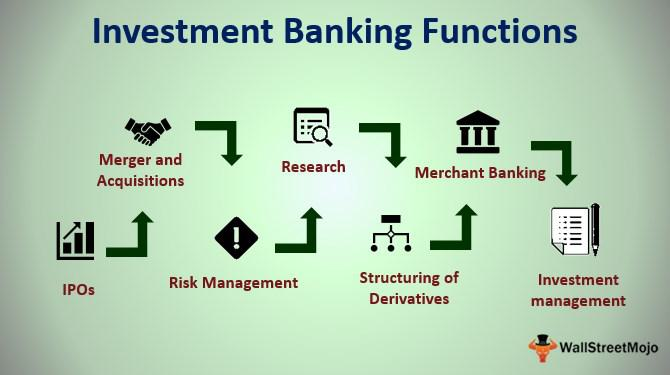

In today's dynamic financial landscape, banking services, financial institutions, and investment banking play a pivotal role in the global economy. These entities not only facilitate the flow of capital but also serve as catalysts for economic development, influencing both individual wealth creation and systemic financial stability. Their importance is universally acknowledged, as they underpin the economies of nations by ensuring efficient capital allocation and risk management.

Investment banking serves as a specialized division within the broader banking sector, focusing on complex financial transactions such as initial public offerings (IPOs) and mergers and acquisitions. This branch of banking is instrumental in providing strategic advice and financial expertise to corporations, governments, and other institutions looking to navigate significant financial events. By underwriting and distributing securities, investment banks play a critical role in capital markets, enhancing investor confidence and corporate growth opportunities.



Simultaneously, advancements in technology have led to the emergence of algorithmic trading, which is revolutionizing financial markets. This method of trading employs complex mathematical algorithms to execute trades at unprecedented speeds and volumes, significantly enhancing market efficiency. Algorithmic trading reduces transaction costs, improves market liquidity, and increases the accuracy of price discovery, reshaping how financial securities are bought and sold globally.

The intertwined roles of investment banking and algorithmic trading underscore their contributions to wealth creation and economic stability. Their impact extends beyond financial markets, influencing global economic trends and fostering an environment conducive to innovation and growth. Understanding these dynamics is crucial for stakeholders looking to navigate the complexities of the modern financial ecosystem.

## Table of Contents

## Understanding Banking Services and Financial Institutions

Banking services are fundamental to personal and corporate finance, encompassing a multitude of products designed for saving, investing, and managing monetary resources. These services are primarily provided by financial institutions, including banks and credit unions, which cater to both individual and corporate clients. At their core, these institutions are integral to the facilitation of financial transactions, offering vital services such as loans, credit facilities, and the safeguarding of financial assets.

One of the primary functions of financial institutions is to facilitate transactions, enabling the efficient transfer of funds between entities. This is achieved through various means, including electronic funds transfers, checks, and credit and debit card transactions. The seamless execution of these transactions is essential for maintaining liquidity and ensuring the smooth operation of the financial system.

In addition to facilitating transactions, financial institutions play a pivotal role in the provision of loans and credit. By evaluating the creditworthiness of potential borrowers, these institutions allocate capital to where it is most productive, supporting both personal financial goals and business expansion. The interest income generated from these loans forms a significant portion of a bank’s revenue, allowing for further investment and financial stability.

Safeguarding financial assets is another critical service provided by banks and credit unions. Institutions offer various accounts to secure funds, ranging from basic savings accounts to more complex investment vehicles. These accounts not only protect the depositor's funds but also often accrue interest, contributing to wealth generation over time.

The range of banking services available in today's market is vast, including but not limited to savings and checking accounts, mortgages, lines of credit, and wealth management services. Each product is designed to meet specific financial needs, ensuring that clients can effectively manage their financial health across different stages of life.

Overall, financial institutions are foundational pillars of economic activity and growth. They provide the necessary infrastructure and products that support the comprehensive financial needs of the economy, contributing to stability and prosperity. Their role is indispensable in promoting economic development, facilitating trade, and enhancing the overall quality of life by providing accessible financial services.

## Investment Banking: An Engine of Economic Growth

Investment banks play a critical role in facilitating capital formation by acting as intermediaries in large-scale financial transactions, including initial public offerings (IPOs), mergers, and acquisitions. These institutions, like Goldman Sachs and JPMorgan Chase, offer strategic advisory services to corporate clients, assisting them in structuring transactions to maximize value. Their expertise is vital in navigating complex regulatory environments and market conditions.

Investment banks generate revenue through various streams, primarily advisory fees and trading commissions. Advisory fees are earned by providing expert guidance and executing corporate restructuring, [capital raising](/wiki/hedge-fund-capital-raising), and financial planning. These fees are a percentage of the transaction value and are negotiated based on the complexity and scale of the transaction.

Trading commissions are another significant source of income for investment banks. They facilitate the buying and selling of securities for both institutional and individual clients, [earning](/wiki/earning-announcement) a commission on each trade. This trading activity enhances market [liquidity](/wiki/liquidity-risk-premium), allowing for efficient price discovery and risk distribution.

Underwriting is a core function of investment banks, where they assume the risk of distributing new securities to the public or institutional investors. This process starts with due diligence, followed by pricing, structuring, and marketing the securities. Investment banks either commit to purchasing the entire issue (firm commitment underwriting) or decide to underwrite on a best-efforts basis, where they sell as much of the issue as possible.

The contribution of investment banks to economic growth is underscored by their ability to channel capital from savers to borrowers, thus enabling businesses to expand and innovate. They support the capital markets by maintaining a delicate balance between supply and demand for capital, directly impacting economic dynamism and stability.

In conclusion, investment banks are indispensable to the financial ecosystem. Their sophisticated transaction-handling capabilities foster economic growth and facilitate the efficient allocation of financial resources in global markets.

## The Rise of Algorithmic Trading

Algorithmic trading has transformed the trading landscape, enabling the execution of financial securities transactions with unprecedented speed and precision. Leveraging intricate mathematical models and state-of-the-art technology, [algorithmic trading](/wiki/algorithmic-trading) systems can analyze vast datasets and perform trades in milliseconds. This efficiency is largely due to technological advancements in computing power, data processing, and network infrastructure, which have collectively lowered transaction costs and increased market liquidity.

One of the core elements of algorithmic trading is the use of sophisticated algorithms that determine trading strategies. These algorithms can identify patterns and trends in market data, employing statistical methods such as linear regression and time-series analysis. A simple example of a Python code snippet to execute a basic moving average crossover strategy might look like this:

```python
import pandas as pd

# Assume data is a pandas DataFrame with a 'Close' column for closing prices.
def moving_average_crossover(data, short_window=40, long_window=100):
    data['ShortMA'] = data['Close'].rolling(window=short_window, min_periods=1).mean()
    data['LongMA'] = data['Close'].rolling(window=long_window, min_periods=1).mean()

    # Generate signals
    data['Signal'] = 0
    data['Signal'][short_window:] = np.where(data['ShortMA'][short_window:] > data['LongMA'][short_window:], 1, 0)  

    # Calculate trading positions based on signals
    data['Position'] = data['Signal'].diff()

    return data

# Example usage
# data = pd.DataFrame(...) # Load your data here
# result = moving_average_crossover(data)
```

The benefits of algorithmic trading are significant. By automating trade execution, traders can reduce human error and implement strategies that respond to market changes in real-time. This automation contributes to improved market liquidity, ensuring that the buying and selling of securities continue smoothly, even during periods of high market activity. Additionally, algorithmic trading can minimize transaction costs since trades are executed quickly and efficiently, often capitalizing on small price fluctuations that can build to substantial gains over time.

However, the rapid pace and [volume](/wiki/volume-trading-strategy) of trading associated with algorithmic systems also introduce risks. Market [volatility](/wiki/volatility-trading-strategies) can be exacerbated by algorithms that react instantaneously to news events or fluctuations, potentially triggering a cascade of trades that intensify market swings. Moreover, the potential for market manipulation through algorithms is a concern, as sophisticated strategies could be employed to deceive other market participants.

To mitigate these risks, regulatory frameworks like the European Union's Markets in Financial Instruments Directive II (MiFID II) have been established. MiFID II requires firms to test algorithms thoroughly and maintain systems that can suspend or block trading in times of unusual activity. It also mandates greater transparency and oversight in algorithmic trading activities, aiming to reduce the likelihood of market abuse and ensure fair and orderly trading.

As algorithmic trading continues to evolve, balancing innovation with sound regulation remains crucial to harnessing its full potential while safeguarding market stability.

## Challenges and Opportunities in Modern Financial Systems

Advancements in technology have provided financial institutions with significant opportunities to innovate and enhance the efficiency of their operations. Nevertheless, these advancements also introduce intricate challenges, particularly concerning regulatory compliance and risk management associated with algorithmic trading. Financial institutions must navigate increasingly complex regulatory environments to ensure compliance and mitigate potential risks inherent in algorithmic trading strategies. This necessitates a robust understanding of evolving legal frameworks such as the European Union's Markets in Financial Instruments Directive II (MiFID II), which establishes guidelines to curb market manipulation and ensure transparency.

Blockchain technology and [artificial intelligence](/wiki/ai-artificial-intelligence) (AI) represent transformative tools that financial institutions can leverage to maintain a competitive edge. Blockchain offers a decentralized and secure method for recording transactions, which can significantly enhance the traceability and security of financial operations. By using smart contracts, institutions can automate processes, reducing administrative costs and increasing transaction speed. AI, on the other hand, facilitates superior data analytics capabilities, enabling predictive analytics and personalized financial services. Machine learning algorithms allow for the automation of trading strategies and portfolio management, optimizing performance and minimizing human error.

To harness these technologies effectively, financial institutions must adopt best practices that address the inherent complexities of financial markets. This includes implementing comprehensive risk management frameworks that encompass scenario analysis, stress testing, and real-time monitoring of trading activities. Institutions must invest in cybersecurity measures to protect sensitive data against potential breaches, ensuring the privacy and security of financial information.

Moreover, there is an increasing need for financial institutions to stay agile to adapt to rapid technological changes. Incorporating continuous learning and development programs for staff can equip them with the necessary skills to operate advanced technologies efficiently. Institutions should also foster innovation by collaborating with technology companies and startups, facilitating the integration of cutting-edge solutions.

In summary, while technology provides financial institutions with immense growth potential and competitive advantages, it requires them to strategically manage associated risks and regulatory complexities. By adopting advanced technologies such as blockchain and AI and adhering to best practices in risk management, financial institutions can enhance operational efficiency and sustainability in the dynamic financial landscape.

## Conclusion

Understanding the roles of banking services, financial institutions, and investment banking is essential for effectively navigating the modern financial ecosystem. These entities not only facilitate the smooth operation of financial markets but also support economic growth and stability. As we look at the impact of algorithmic trading, it remains a transformative force that brings both significant opportunities and regulatory challenges. Algorithmic trading enhances market efficiency, improves liquidity, and reduces transaction costs. However, it also introduces risks such as increased market volatility and potential manipulation, necessitating robust regulatory frameworks to manage these challenges responsibly.

The future of the financial sector lies in balancing innovation with prudent risk management strategies. Financial technology continues to evolve, promising further revolutions, such as blockchain for secure and transparent transactions, and artificial intelligence for advanced data analysis and automated decision-making. These advancements will likely redefine the way financial institutions operate, creating new opportunities for efficiency, but also requiring careful oversight to ensure stability and security within financial markets.

Staying informed about these trends is imperative for making sound investment decisions. As technology transforms the dynamics of trading and investment, individuals and institutions must be proactive in understanding the implications of these changes. Embracing innovation while maintaining a focus on risk management will be key to capitalizing on the potential these developments offer, ensuring sustainable growth and success in the rapidly advancing financial landscape.

## References & Further Reading

[1]: Bergstra, J., Bardenet, R., Bengio, Y., & Kégl, B. (2011). ["Algorithms for Hyper-Parameter Optimization."](https://dl.acm.org/doi/10.5555/2986459.2986743) Advances in Neural Information Processing Systems 24.

[2]: ["Advances in Financial Machine Learning"](https://www.amazon.com/Advances-Financial-Machine-Learning-Marcos/dp/1119482089) by Marcos Lopez de Prado

[3]: ["Evidence-Based Technical Analysis: Applying the Scientific Method and Statistical Inference to Trading Signals"](https://www.amazon.com/Evidence-Based-Technical-Analysis-Scientific-Statistical/dp/0470008741) by David Aronson

[4]: ["Machine Learning for Algorithmic Trading"](https://github.com/PacktPublishing/Machine-Learning-for-Algorithmic-Trading-Second-Edition) by Stefan Jansen

[5]: ["Quantitative Trading: How to Build Your Own Algorithmic Trading Business"](https://www.amazon.com/Quantitative-Trading-Build-Algorithmic-Business/dp/1119800064) by Ernest P. Chan

[6]: Harris, L. (2003). ["Trading and Exchanges: Market Microstructure for Practitioners."](https://academic.oup.com/book/52292) Oxford University Press.

[7]: Hull, J. (2018). ["Options, Futures, and Other Derivatives."](https://books.google.com/books/about/Options_Futures_and_Other_Derivatives_eB.html?id=2iopDwAAQBAJ) Pearson.

[8]: Fabozzi, F. J., Focardi, S. M., & Rachev, S. T. (2007). ["The Handbook of Commodity Investing."](https://onlinelibrary.wiley.com/doi/book/10.1002/9781118856406) Wiley.