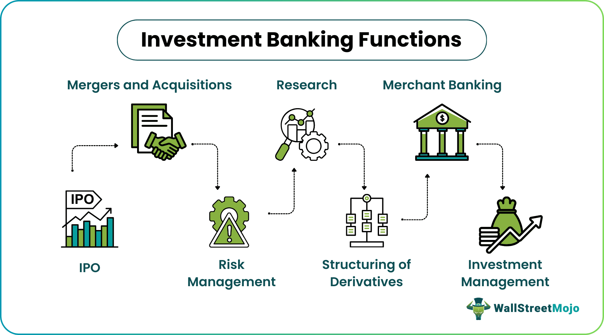

## Table of Contents

## What is investment banking?

Investment banking is a type of banking that helps companies and governments raise money. They do this by helping these clients sell stocks and bonds to investors. Investment banks also give advice on big financial decisions, like whether a company should buy another company or merge with one.

Another thing investment banks do is help with big projects. For example, if a city wants to build a new bridge, an investment bank can help figure out how to pay for it. They might suggest selling bonds to the public. Investment banks also help companies go public, which means selling shares of the company to the public for the first time. This is called an initial public offering, or IPO.

## What are the primary functions of investment banks?

Investment banks help companies and governments raise money. They do this by helping these clients sell stocks and bonds to investors. When a company wants to grow or a government needs money for a project, they can go to an investment bank. The bank will help them figure out the best way to get the money they need. This could mean selling shares of the company to the public or issuing bonds that people can buy.

Investment banks also give advice on big financial decisions. For example, if a company is thinking about buying another company or merging with one, they can ask an investment bank for help. The bank will look at the numbers and tell them if it's a good idea. They also help with things like figuring out how much a company is worth, which is important for these big decisions.

Another important thing investment banks do is help companies go public. This means selling shares of the company to the public for the first time, which is called an initial public offering, or IPO. The investment bank helps the company get ready for this big step and makes sure everything goes smoothly. They also help with other big projects, like if a city wants to build a new bridge, by figuring out how to pay for it, often through selling bonds.

## How do investment banks assist with mergers and acquisitions?

Investment banks play a big role when companies want to merge or buy other companies. They help by giving advice on whether it's a good idea to do the merger or acquisition. They look at the numbers and tell the company if the deal makes sense. They also help figure out how much the company they want to buy is worth. This is important because the company needs to know if they can afford it and if it's a good price.

Once the company decides to go ahead with the deal, the investment bank helps with the details. They help negotiate the price and the terms of the deal. They also help with all the paperwork and make sure everything is done correctly. This can be a lot of work, but the investment bank makes it easier for the company. They also help find other companies that might be good to buy or merge with, which can be really helpful for growing the business.

## What role do investment banks play in underwriting securities?

Investment banks help companies and governments sell stocks and bonds to the public. This process is called underwriting. When a company wants to raise money by selling stocks or bonds, they go to an investment bank. The bank agrees to buy all the stocks or bonds from the company at a set price. Then, the investment bank sells these securities to investors. This way, the company gets the money it needs right away, and the investment bank takes the risk of selling the securities to the public.

The investment bank also helps decide the best price for the securities. They do a lot of research to figure out how much people might be willing to pay. They look at the company's financial health and what's happening in the market. If they set the price too high, the securities might not sell. If it's too low, the company might not raise as much money as it could. The investment bank's job is to find the right balance so everyone is happy.

## How do investment banks help companies raise capital?

Investment banks help companies raise capital by helping them sell stocks and bonds. When a company needs money to grow or start a new project, they can go to an investment bank. The bank will help them figure out if they should sell stocks or bonds. If they choose stocks, the company sells pieces of itself to investors. If they choose bonds, the company borrows money from investors and promises to pay it back with interest. The investment bank makes sure everything goes smoothly and helps find buyers for these securities.

The investment bank also decides how much the stocks or bonds should cost. They do a lot of research to make sure the price is right. If the price is too high, no one might want to buy them. If it's too low, the company might not raise enough money. The bank takes on the risk of buying all the stocks or bonds from the company first and then selling them to the public. This way, the company gets the money it needs right away, and the bank works to sell the securities to investors.

## What is the difference between investment banking and commercial banking?

Investment banking and commercial banking are two different types of banking that serve different purposes. Investment banking helps companies and governments raise money by selling stocks and bonds. They also give advice on big financial decisions like mergers and acquisitions. Investment banks work with companies to help them grow, go public, or finance big projects. They take on more risk because they buy securities from companies before selling them to the public.

Commercial banking, on the other hand, is what most people think of when they think of a bank. Commercial banks take deposits from people and businesses and use that money to give out loans. They offer services like checking and savings accounts, credit cards, and mortgages. Commercial banks focus on helping people manage their day-to-day finances and businesses run smoothly. They are more focused on everyday banking needs and are less risky because they don't usually deal with the stock market or big financial deals.

In summary, investment banking is about helping companies and governments with big financial moves and raising money, while commercial banking is about everyday banking services for individuals and businesses. Both types of banking are important, but they serve different purposes and have different levels of risk involved.

## Can you explain the process of an initial public offering (IPO) and the role of investment banks?

An initial public offering, or IPO, is when a company sells its shares to the public for the first time. It's like the company is inviting people to own a piece of it. The company works with an investment bank to make this happen. The investment bank helps the company figure out how many shares to sell and at what price. They do a lot of research to make sure the price is right so that people will want to buy the shares. The investment bank also helps the company prepare all the paperwork and makes sure everything follows the rules.

Once everything is ready, the investment bank buys all the shares from the company at the agreed price. This is called underwriting. Then, the investment bank sells these shares to investors, like people and big funds. The money from selling the shares goes to the company, which can use it to grow or start new projects. The investment bank makes money by selling the shares at a slightly higher price than they bought them for. They also help the company after the IPO by giving advice and making sure the shares keep trading well on the stock market.

## What are some key financial instruments used by investment banks?

Investment banks use different financial instruments to help companies and governments raise money. One common instrument is stocks. When a company sells stocks, it's selling pieces of itself to investors. This is how companies can get money to grow or start new projects. Another instrument is bonds. When a company or government sells bonds, they are borrowing money from investors and promising to pay it back with interest. Investment banks help figure out how much to sell these stocks and bonds for and find people to buy them.

Another important instrument is derivatives. These are more complex and can be things like options and futures. They are used to manage risk or bet on future price changes. Investment banks use derivatives to help their clients protect themselves from big changes in the market. For example, if a company is worried about the price of oil going up, they can use a derivative to lock in a price now. Investment banks also use these instruments to make money for themselves by trading them.

Lastly, investment banks use instruments like loans and lines of credit. These are ways for companies to borrow money directly from the bank. The bank might give a company a loan to buy another company or a line of credit to help with day-to-day expenses. These instruments help companies manage their money and grow. Investment banks make money from the interest on these loans and by charging fees for setting them up.

## How do investment banks manage risk?

Investment banks manage risk by using different tools and strategies. One way they do this is by spreading out their investments. Instead of putting all their money into one thing, they invest in many different things. This way, if one investment does badly, it won't hurt them too much because they have other investments that might do well. They also use something called hedging. This is like buying insurance for their investments. If they think the price of something might go down, they can use a hedge to protect themselves from losing too much money.

Another way investment banks manage risk is by doing a lot of research. They look at all the numbers and try to predict what might happen in the future. This helps them make smarter decisions about where to invest their money. They also have rules and limits on how much risk they can take. For example, they might decide not to invest more than a certain amount in one company or industry. This helps them keep their risk under control and avoid big losses.

## What are some notable investment banks and their significant deals?

Goldman Sachs is a big name in investment banking. They helped with the IPO of Alibaba, which is a huge company in China. This IPO raised a lot of money, over $25 billion. Goldman Sachs also helped with the merger between Dow Chemical and DuPont. This was a big deal because it made a new company worth over $130 billion. They also worked on the IPO of Facebook, which was a big deal because it made a lot of people pay attention to the stock market.

JPMorgan Chase is another important investment bank. They helped with the IPO of Uber, which was one of the biggest IPOs ever. Uber raised about $8 billion from this. JPMorgan also helped with the acquisition of Whole Foods by Amazon. This deal was big because it changed how people thought about grocery shopping. They also worked on the IPO of Airbnb, which was important because it showed how the travel industry was changing.

Morgan Stanley is known for big deals too. They helped with the IPO of General Motors, which was a big deal because it showed that the car company was coming back strong after some tough times. They also worked on the merger between AT&T and Time Warner, which made a huge media company. Morgan Stanley also helped with the IPO of Snowflake, a tech company that raised a lot of money quickly.

## How has technology impacted the operations of investment banks?

Technology has changed a lot of things for investment banks. One big change is how they use computers to do their work faster and better. They use special software to look at numbers and make decisions. This helps them figure out the best prices for stocks and bonds and find good deals for their clients. They also use technology to talk to people all over the world quickly. This means they can do business with anyone, anywhere, without having to travel. It saves time and money.

Another way technology has helped is by making things safer and more secure. Investment banks use technology to protect their information and keep their clients' money safe. They use things like encryption to make sure no one can steal their data. They also use technology to watch for anything strange happening with their money. This helps them stop problems before they get too big. Technology has made investment banks more efficient and able to do more things than ever before.

## What are the current trends and future outlook for investment banking?

Investment banking is changing a lot these days because of new technology and what's happening in the world. One big trend is using more computers and software to do the work. This is called automation. It helps banks do things faster and cheaper. Another trend is that more people are using their phones and the internet to do banking. This means investment banks need to make sure they can work well online. Also, there's more focus on things like green energy and helping companies that are good for the environment. This is called [ESG](/wiki/esg-investing), which stands for Environmental, Social, and Governance.

The future of investment banking looks like it will keep changing with technology. More banks will use [artificial intelligence](/wiki/ai-artificial-intelligence) and big data to make better decisions and find new ways to help their clients. There will also be more rules and laws about how banks can work, especially with things like cryptocurrencies and new kinds of money. Investment banks will need to be ready for these changes and find ways to keep growing. Overall, the future looks exciting, but banks will need to keep up with all the new things happening around them.

## References & Further Reading

[1]: Bergstra, J., Bardenet, R., Bengio, Y., & Kégl, B. (2011). ["Algorithms for Hyper-Parameter Optimization."](https://dl.acm.org/doi/10.5555/2986459.2986743) Advances in Neural Information Processing Systems 24.

[2]: ["Advances in Financial Machine Learning"](https://www.amazon.com/Advances-Financial-Machine-Learning-Marcos/dp/1119482089) by Marcos Lopez de Prado

[3]: ["Evidence-Based Technical Analysis: Applying the Scientific Method and Statistical Inference to Trading Signals"](https://www.amazon.com/Evidence-Based-Technical-Analysis-Scientific-Statistical/dp/0470008741) by David Aronson

[4]: ["Machine Learning for Algorithmic Trading"](https://github.com/PacktPublishing/Machine-Learning-for-Algorithmic-Trading-Second-Edition) by Stefan Jansen

[5]: ["Quantitative Trading: How to Build Your Own Algorithmic Trading Business"](https://www.amazon.com/Quantitative-Trading-Build-Algorithmic-Business/dp/1119800064) by Ernest P. Chan

[6]: Harris, L. (2003). ["Trading and Exchanges: Market Microstructure for Practitioners."](https://academic.oup.com/book/52292) Oxford University Press.

[7]: Hull, J. (2018). ["Options, Futures, and Other Derivatives."](https://books.google.com/books/about/Options_Futures_and_Other_Derivatives_eB.html?id=2iopDwAAQBAJ) Pearson.

[8]: Fabozzi, F. J., Focardi, S. M., & Rachev, S. T. (2007). ["The Handbook of Commodity Investing."](https://onlinelibrary.wiley.com/doi/book/10.1002/9781118856406) Wiley.