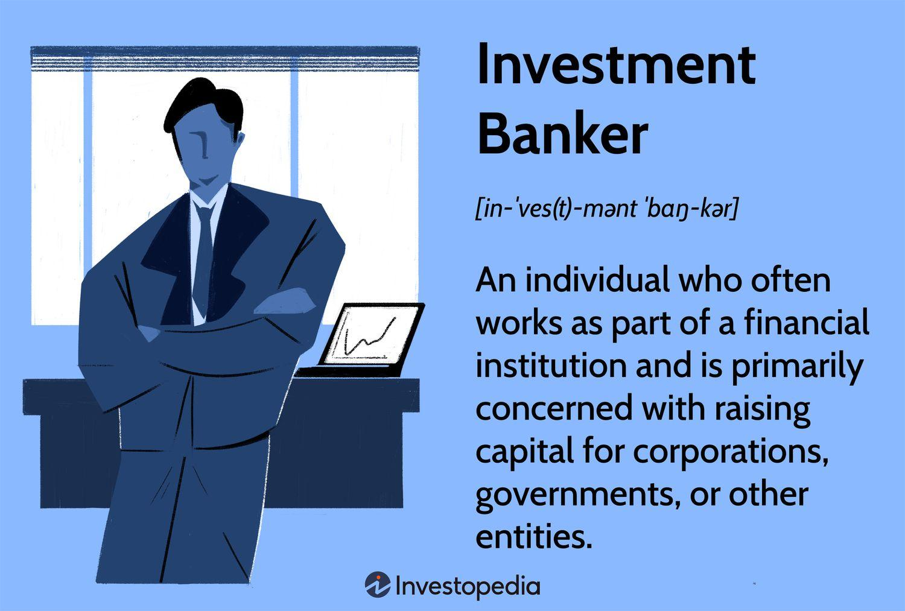

In the rapidly evolving world of finance, investment banking stands out as a pivotal component due to its significant impact on facilitating complex financial transactions. Investment bankers are instrumental in navigating the financial landscapes for corporations and governments, ensuring that large-scale projects, mergers, acquisitions, initial public offerings (IPOs), and other financial activities are executed smoothly and efficiently. As the financial industry becomes increasingly sophisticated, algorithmic trading has gained prominence as a revolutionary tool transforming investment banking.

Algorithmic trading, which relies on advanced mathematical models and high-speed computations, automates trading decisions and execution, leading to enhanced efficiency and precision. This form of trading enables investment banks to manage trades at scales and speeds unattainable through manual processes. By harnessing data and analytics, algorithmic trading systems can identify market trends and execute trades based on predefined criteria, making it a critical component in modern financial services.

This article explores the interplay between investment banking, financial services, and algorithmic trading, highlighting how these elements reshape modern financial markets. Through a meticulous examination of their interdependent roles, we aim to uncover the dynamics that drive today's financial ecosystem. Understanding these relationships is crucial for appreciating how technological advancements continue to influence investment strategies and market efficiencies, ultimately shaping the future of global finance.

## Table of Contents

## Understanding Investment Banking

Investment banking is a specialized branch of banking primarily concerned with facilitating large-scale financial transactions. Unlike commercial banking, which deals with consumer deposits and loans, investment banking focuses on services such as mergers and acquisitions (M&A), initial public offerings (IPOs), and underwriting new securities. 

Investment banks play a crucial role in mergers and acquisitions by acting as intermediaries. They provide valuation models to assess the financial worth of involved entities and offer strategic advice to negotiate deals effectively. During an IPO, investment banks underwrite new stocks, assuring the issuer that a certain amount of proceeds will be raised. This involves pricing the stock, marketing it, and sometimes purchasing residual shares to ensure successful issuance.

The role of investment bankers extends beyond transaction facilitation; they provide advisory services on complex financial structures and market strategies. This includes offering insights on capital raising strategies, investment climate analysis, and optimizing financial operations. The prowess of investment bankers in navigating these complex financial waters makes them invaluable to corporations and governments seeking to maximize the efficacy of their financialmaneuvers.

Some of the most influential players in the investment banking industry include globally recognized institutions such as Goldman Sachs, JPMorgan Chase, and Morgan Stanley. These firms are not only renowned for facilitating substantial financial transactions but are also pivotal in managing investment portfolios and rendering comprehensive financial advice. For instance, they help in asset restructuring, capital allocation strategies, and risk management, ensuring clients maintain a robust financial standing.

Through their extensive services, investment banks significantly contribute to the efficient functioning of financial markets. They aid in the optimal allocation of resources by directing capital to its best use and managing risks associated with large-scale investments. In doing so, investment banks are instrumental in fostering economic growth and innovation across industries.

## The Role of Financial Services in Investment Banking

Financial services in investment banking encompass a diverse range of activities that are pivotal in facilitating the financial well-being of corporations and other clients. These services include asset management, risk assessment, and strategic advisory services, among others. Investment banks act as intermediaries, connecting investors with institutions and enabling the smooth functioning of financial markets.

Asset management plays a crucial role in investment banking, where banks manage portfolios on behalf of their clients. This involves making informed investment decisions to maximize returns while minimizing risks. For example, investment banks may create diversified investment portfolios using equities, bonds, and alternative assets to optimize performance. Strategic asset allocation and tactical asset allocation are typically employed to adapt to the dynamic market environment.

Risk assessment is another integral component of financial services. Investment banks conduct thorough analyses to identify, evaluate, and manage risks associated with financial transactions. Tools such as Value at Risk (VaR) models and stress testing are frequently utilized to gauge the potential impact of market fluctuations. These risk minimization strategies ensure that financial institutions and their clients maintain stability and mitigate potential losses.

Strategic advisory services provided by investment banks encompass guidance on mergers and acquisitions (M&A), corporate restructuring, and [capital raising](/wiki/hedge-fund-capital-raising). Through these services, banks leverage their industry expertise and market insights to advise clients on optimal financial strategies. Whether it involves restructuring an organization's debt or evaluating the merits of a potential acquisition, these advisory services are essential in enhancing corporate value.

Investment banks employ a cadre of financial experts to offer tailored solutions to corporate clients. These experts draw upon extensive market knowledge and analytical skills to fulfill the unique needs of each client. The objective is to craft customized financial strategies that align with the client’s business goals while safeguarding their interests. By doing so, investment banks facilitate the efficient allocation of resources and help businesses to manage their investments effectively.

Financial services also play a vital role in helping businesses raise capital. Whether through equity financing, debt issuance, or syndicated loans, investment banks devise ways to channel funds to corporations, enabling them to expand and innovate. This capital-raising function is essential for supporting economic growth and fostering business development.

Overall, the broad scope of financial services offered by investment banks underpins their importance in the global financial ecosystem. These services are indispensable for ensuring efficiency in resource allocation, risk management, and strategic growth across diverse industries. By continuously adapting to market changes, investment banks remain integral to the economic infrastructure, driving forward financial innovation and stability.

## Algorithmic Trading: A New Frontier

Algorithmic trading, or algo trading, has fundamentally transformed trading activities within the financial markets by utilizing complex algorithms. These algorithms make it possible to execute trades at speeds far beyond human capability, optimizing transactions through sophisticated mathematical models and automated systems. In contrast to manual trading, [algorithmic trading](/wiki/algorithmic-trading) employs precise instructions, which can include timing, price, and quantity, to execute orders that minimize human intervention and errors.

A distinct feature of algo trading is its prevalence in stock markets, where it supports high-frequency and high-[volume](/wiki/volume-trading-strategy) trade capabilities. High-frequency trading ([HFT](/wiki/high-frequency-trading-strategies)) is a subset of algo trading characterized by the extremely rapid entry and [exit](/wiki/exit-strategy) of multiple positions over brief timeframes. HFT firms can execute millions of trades in fractions of a second, leveraging speed as a critical determinant of profitability.

The efficiency of trade execution is significantly enhanced by algorithmic trading. Through algorithms, investment banks can manage vast amounts of trade data in real-time, optimizing the execution process for better pricing and reduced market impact. Algo trading enables firms to capitalize on microsecond-level opportunities that are imperceptible to human traders, thereby potentially increasing profitability.

Major investment banks utilize algorithmic trading as part of their trading strategies, optimizing client services and internal trading operations. Algorithms play a pivotal role in managing large transactions efficiently, allowing for ample flexibility and precision. For example, a bank may use an algorithm designed to execute a large block trade by breaking it into smaller parts to mitigate the trade's impact on the market price.

Despite its advantages, algorithmic trading introduces certain challenges and risks. Market [volatility](/wiki/volatility-trading-strategies) can be exacerbated by the speed and volume of trade executions, potentially leading to sudden and significant market movements. Additionally, ethical concerns arise regarding the fairness and transparency of algo trading, as it can create an uneven playing field where only those with advanced technological resources benefit.

Regulatory bodies continuously scrutinize the implications of algo trading to curb potential market manipulation and ensure transparency. A well-known risk associated with algorithmic trading is the occurrence of "flash crashes," where rapid, automated trading activities can cause abrupt spikes or drops in market prices. Continuous advancements in technological monitoring and regulatory frameworks are imperative to mitigate these risks and harness the full potential of algo trading within financial ecosystems.

## The Synergy Between Investment Banking and Algo Trading

Investment banks have increasingly adopted algorithmic trading to enhance their trading strategies and improve client services. Algorithmic trading, which uses high-speed algorithms to execute trades, allows investment banks to handle large transactions with enhanced speed and precision. This integration optimizes trade execution, reducing the time and cost associated with manual trading methods.

Investment banks utilize algorithms not only for trade execution but also for risk management and portfolio diversification. Algorithms can analyze vast amounts of data rapidly, identifying potential risks and opportunities in the market. For example, predictive algorithms can assess market trends and make informed decisions about asset allocation, thus aiding in portfolio diversification. By leveraging these algorithms, banks can balance risk and return efficiently.

The synergy between investment banking and algorithmic trading provides more efficient and cost-effective solutions to clients. Cost reductions arise from minimized trading errors and increased operational efficiency, while improved speed and accuracy of trades enhance client satisfaction. This relationship allows investment banks to offer tailored financial solutions, adjusting to market demands swiftly and accurately.

By incorporating algorithmic trading, investment banks gain a competitive advantage in the financial markets. Algorithms can adapt to changing market conditions more quickly than human traders, allowing banks to capitalize on market opportunities. Furthermore, investment banks can manage complex financial transactions with precision, thus attracting more clients and increasing their market share.

The integration of algorithmic trading into investment banking practices illustrates a transformative approach in financial services, enhancing both the strategic capabilities and competitiveness of banks in the global market.

## Challenges and Risks in Algorithmic Trading

Algorithmic trading, while offering unprecedented speed and efficiency in executing trades, is accompanied by several inherent challenges and risks. One of the primary technical risks is the potential for system failures. These failures can result from hardware malfunctions, software glitches, or unforeseen anomalies in trading algorithms. When execution depends largely on automated systems, any disruption in these processes can lead to significant financial losses. For instance, a minor error in coding can exponentially magnify across numerous trades, resulting in unintended trades and financial repercussions.

Cybersecurity threats represent another critical concern in algorithmic trading. As trading systems become increasingly digital, they also become more susceptible to cyber attacks. Hackers may exploit vulnerabilities to manipulate trades or steal sensitive financial information, posing significant threats to financial institutions relying on these systems. Ensuring the integrity and security of trading platforms is paramount, requiring substantial investment in robust cybersecurity measures.

Regulatory challenges are equally substantial as authorities strive to monitor and control market manipulations. The complexity and speed associated with algorithmic trading make it difficult for regulators to detect manipulative practices immediately. Regulators are tasked with establishing frameworks that ensure transparency and accountability while fostering innovation. The introduction of policies such as the Markets in Financial Instruments Directive (MiFID II) in the European Union represents efforts to standardize and enhance the monitoring of algorithmic trading activities.

Flash crashes, characterized by rapid market plummets followed by swift recoveries, are often linked to algorithmic trading. These events underscore the need for stringent regulatory frameworks that can mitigate the risk of such occurrences. Flash crashes generally result from high-frequency trading algorithms operating on similar signals and triggering cascading effects, further highlighting the potential systemic risks these technologies can pose.

Navigating these challenges necessitates a proactive approach from investment banks. They must continually reassess and refine their algorithmic strategies to ensure they operate within the bounds of regulatory requirements while minimizing technical vulnerabilities. This ongoing effort demands substantial investment in advanced technology, including the development and implementation of fail-safes and system redundancies to safeguard against potential failures.

Moreover, compliance with evolving regulatory standards is crucial. Investment banks must stay abreast of regulatory changes and actively engage in shaping constructive norms that govern algorithmic trading. Collaborating with regulatory bodies can aid in establishing more effective monitoring systems that enhance market stability.

In conclusion, addressing the challenges and risks associated with algorithmic trading requires a multifaceted strategy. Continuous technological investment, vigilant cybersecurity measures, and closely adhering to regulatory standards are essential steps in harnessing the full potential of algorithmic trading while mitigating its drawbacks.

## Future Trends in Investment Banking and Algo Trading

Investment banking and algorithmic trading are on the brink of significant transformation, driven predominantly by technological advancements. Key among these advancements are [artificial intelligence](/wiki/ai-artificial-intelligence) (AI) and [machine learning](/wiki/machine-learning), which are anticipated to redefine algorithmic trading. These technologies enable the development of sophisticated algorithms that can analyze vast datasets, recognize patterns, and make trading decisions with unprecedented speed and accuracy. Machine learning models can improve over time by learning from previous market data, optimizing strategies to enhance returns while managing risks more effectively.

Sustainable investing and green finance are also emerging as critical trends in investment banking. As environmental, social, and governance ([ESG](/wiki/esg-investing)) criteria gain importance, investment banks are increasingly focusing on sustainable investment practices. This shift not only responds to regulatory pressures and societal expectations but also attracts investors interested in sustainable and ethical investment portfolios. Green finance initiatives, such as green bonds and sustainability-linked loans, are becoming integral to banks' offerings, encouraging investment in environmentally-friendly projects and technologies.

Furthermore, the expansion of digital services is a priority for investment banks aiming to cater to the needs of tech-savvy clients. Digital platforms offer clients enhanced accessibility and convenience, facilitating seamless transactions, real-time account monitoring, and instant customer support. Banks are leveraging blockchain technology to streamline processes, increase transparency, and ensure the security of transactions. This digital transformation helps banks remain competitive and relevant in a rapidly evolving marketplace.

The continuous integration of technology promises to revolutionize financial services and investment banking. Automated systems and AI-driven analytics are reducing operational costs and increasing efficiency. As these technological trends grow, investment banks are likely to shift focus to more personalized and data-driven client interactions, using big data to tailor services and financial products to individual needs. This digital evolution is expected to reshape the traditional paradigms of investment banking, fostering innovation and creating new opportunities for growth and development in the financial sector.

## Conclusion

Investment banking is an essential pillar of modern financial markets, supported by cutting-edge financial services. Algorithmic trading, in particular, has become integral to contemporary investment strategies, transforming the nature of trade execution with its speed and precision. This technological marvel enables investment banks to conduct large-scale transactions efficiently, providing a significant competitive edge. Despite the inherent challenges, such as technical risks and regulatory concerns, the synergy between algorithmic trading and investment banking is invaluable.

The financial sector must remain agile and continuously integrate new technologies to improve efficiency, transparency, and service delivery. As artificial intelligence and machine learning advance, they will further refine algorithmic trading systems, offering even more sophisticated tools for risk management and investment strategies. Consequently, the roles of investment bankers will evolve, requiring them to adapt to new technologies and harness these innovations to optimize financial services.

In summary, the ongoing integration of algorithmic trading and technological advancements will continue to redefine investment banking strategies, ensuring they remain at the forefront of the financial industry’s evolution. The challenge will be balancing innovative capabilities with regulatory compliance and ethical considerations, ensuring that financial markets remain robust and reliable.

## References & Further Reading

[1]: Bergstra, J., Bardenet, R., Bengio, Y., & Kégl, B. (2011). ["Algorithms for Hyper-Parameter Optimization."](https://dl.acm.org/doi/10.5555/2986459.2986743) Advances in Neural Information Processing Systems 24.

[2]: ["Advances in Financial Machine Learning"](https://www.amazon.com/Advances-Financial-Machine-Learning-Marcos/dp/1119482089) by Marcos Lopez de Prado

[3]: ["Evidence-Based Technical Analysis: Applying the Scientific Method and Statistical Inference to Trading Signals"](https://www.amazon.com/Evidence-Based-Technical-Analysis-Scientific-Statistical/dp/0470008741) by David Aronson

[4]: ["Machine Learning for Algorithmic Trading"](https://github.com/PacktPublishing/Machine-Learning-for-Algorithmic-Trading-Second-Edition) by Stefan Jansen

[5]: ["Quantitative Trading: How to Build Your Own Algorithmic Trading Business"](https://books.google.com/books/about/Quantitative_Trading.html?id=j70yEAAAQBAJ) by Ernest P. Chan