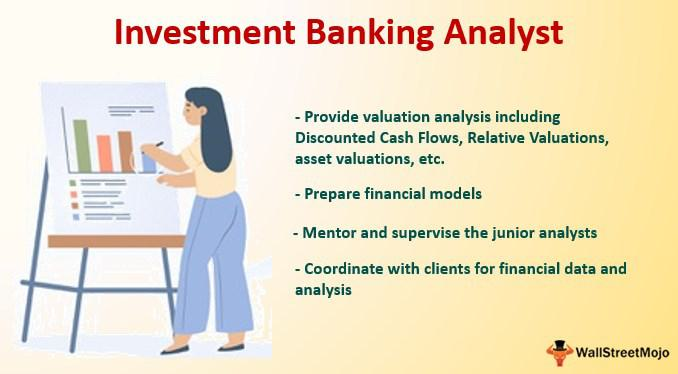

Investment banking stands as a cornerstone of the financial industry, where professionals orchestrate high-stakes financial transactions that fuel economic growth. These financial experts play a pivotal role in the expansion of businesses and the mobilization of capital, influencing the trajectory of the global economy. Investment bankers specialize in a myriad of functions, including raising capital through equity and debt markets, facilitating mergers and acquisitions (M&A), and advising corporations on strategic matters. This multifaceted role necessitates a diverse skill set, encompassing financial literacy, analytical acumen, negotiation prowess, and an acute awareness of regulatory frameworks.

The world of investment banking now increasingly intertwines with technological advancements, epitomized by the rise of algorithmic trading. This innovation represents a transformative shift, harnessing computational power to execute trades at speeds and efficiencies beyond human capacity. Algorithmic trading uses complex algorithms to make trading decisions, leveraging large datasets and real-time market analysis to optimize trading strategies. This intersection of finance and technology demands that investment bankers not only maintain traditional financial expertise but also adapt to technological changes and integrate these advancements into day-to-day operations.

In navigating the complexities of modern finance, the skills of investment bankers are paramount. Their ability to analyze market trends, evaluate risks, and develop strategic solutions is what enables them to guide companies through financial landscapes fraught with uncertainty. Moreover, strong communication and networking abilities facilitate the closing of pivotal deals, ensuring that investment bankers can effectively collaborate with a wide array of stakeholders.

As this article progresses, readers will gain insights into the distinct examples of high-profile financial transactions, the essential skills that distinguish successful bankers, and how technology, particularly algorithmic trading, reshapes the financial industry. This exploration aims to illuminate the intricate components that define investment banking, offering a comprehensive understanding of what drives success in this ever-evolving sector.

## Table of Contents

## The Role of Investment Bankers

Investment bankers play a central role in raising capital and managing large financial transactions, which are critical for driving economic growth and expanding business operations. Their responsibilities encompass a range of tasks, starting with advising corporations, governments, and other entities on issuing securities to raise funds. These securities can include stocks, bonds, and other financial instruments, which are tailored to meet the specific needs of clients. Investment bankers are instrumental in underwriting these securities, meaning they assume the risk of distributing them at an agreed price.

Mergers and acquisitions (M&A) represent a significant portion of investment banking activities. In these processes, investment bankers assess the value of firms, negotiate terms, and facilitate the transfer of ownership. They execute due diligence – a comprehensive appraisal of a business undertaken before signing a contract – to ensure clients make informed decisions. During Initial Public Offerings (IPOs), investment bankers guide privately-held firms in going public by listing their shares on a stock exchange. This involves determining the appropriate pricing of shares, regulatory compliance, and marketing the IPO to potential investors to secure the necessary capital.

Managing financial risks is another fundamental responsibility of investment bankers. They utilize financial models and market analysis to identify potential risks associated with investments and propose strategic solutions to mitigate those risks. Investment bankers provide financial advice tailored to each client, considering market conditions, economic forecasts, and the client's objectives. Their expertise ensures that clients can make sound decisions that align with their long-term goals.

Navigating the landscape of investment banking requires a solid understanding of regulatory compliance. Investment bankers must ensure that all transactions adhere to legal and industry regulations, which involves staying abreast of changes in legislation and policy shifts affecting the financial sector. This compliance not only protects clients but also maintains the integrity of the financial system.

Several prominent institutions exemplify the influence of investment banking on a global scale. Firms such as Goldman Sachs, JPMorgan Chase, and Morgan Stanley are renowned for their expertise in managing complex financial transactions and offering strategic advice worldwide. These institutions have built reputations based on their capacity to navigate diverse markets, uphold regulatory standards, and provide innovative financial solutions that facilitate corporate and economic development. Their global reach underscores the critical role of investment bankers in today's interconnected economy.

## Essential Banker Skills

Investment banking demands a diverse set of skills that are pivotal for success in the competitive and fast-paced financial sector. Among these, financial modeling expertise stands out. This involves constructing abstract representations of a financial decision-making situation. Investment bankers use financial modeling to forecast company performance, evaluate potential investment opportunities, and structure transactions. These models can range from basic spreadsheet analyses to complex simulations. The ability to create robust and precise financial models is essential for assessing corporate finance opportunities and valuing companies.

Analytical thinking and valuation techniques are also fundamental to the success of an investment banker. These skills enable professionals to interpret and analyze data effectively, drawing insights that inform strategic financial advice. Valuation techniques, such as Discounted Cash Flow (DCF) analysis, Comparable Company Analysis (CCA), and Precedent Transactions Analysis, are critical in determining the worth of a company or asset. For example, DCF involves estimating the present value of expected future cash flows, informing decisions on mergers, acquisitions, or IPOs.

Communication and networking abilities are equally significant for closing deals in investment banking. Effective communication ensures that complex financial concepts are conveyed clearly and persuasively to clients, stakeholders, and colleagues. Networking skills facilitate relationship-building with potential clients, industry veterans, and other bankers, which can lead to new business opportunities and partnerships. The ability to articulate and negotiate terms is vital for steering transactions towards successful completion.

Additionally, resilience and adaptability are vital attributes for navigating the ever-changing landscape of the financial industry. Investment bankers often face high-pressure situations and fluctuating market conditions. Resilience helps them manage stress and persist in the face of setbacks, while adaptability allows them to respond swiftly to changes in regulatory environments, economic trends, and technological advancements. To maintain relevance, bankers must also stay informed on industry trends, regulatory changes, and emerging financial technologies. This continuous learning ensures they remain competent advisors for their clients.

In summary, a blend of technical skills, such as financial modeling and analytical capabilities, alongside soft skills like communication and adaptability, are imperative for any aspiring professional aiming to succeed in investment banking.

## Investment Banking and Algorithmic Trading

Investment banking and [algorithmic trading](/wiki/algorithmic-trading) are increasingly intertwined due to advancements in technology. Algorithmic trading, which uses computer algorithms to execute trades at high speeds and [volume](/wiki/volume-trading-strategy), has significantly transformed the financial markets. This transformation is enabled by sophisticated technologies that enhance trading strategies and market analysis, leading to more efficient financial transactions.

Technology plays a crucial role in enhancing trading strategies by offering speed, accuracy, and the ability to process large datasets. Algorithms can evaluate numerous variables and execute trades within milliseconds, something that is beyond human capability. This capability facilitates the creation of complex trading strategies that can respond to market changes in real-time. High-frequency trading, a subset of algorithmic trading, uses algorithms to analyze multiple markets and execute large volumes of orders in fractions of a second. This not only improves market [liquidity](/wiki/liquidity-risk-premium) but also reduces the cost of trading.

Algorithmic trading is reshaping financial transactions by increasing market efficiency and transparency. Automated trading systems can eliminate human errors and emotional biases, leading to more consistent trading patterns. Moreover, algorithms can monitor markets continuously, allowing for constant price discovery and tighter bid-ask spreads. This efficiency is critical in maintaining the competitiveness of financial markets globally.

Integrating algorithmic trading within investment banking requires a unique skill set. Strong programming skills, particularly in languages like Python, are essential for developing and implementing trading algorithms. An understanding of quantitative methods is also crucial, as algorithms rely heavily on statistical models to predict price movements and manage risk. Risk management skills are critical, as algorithmic trading can lead to significant losses if not properly monitored.

Several financial institutions have successfully leveraged algorithmic trading to enhance their operations. For instance, Goldman Sachs utilizes algorithms to conduct large equity trades, significantly reducing market impact and transaction costs. Morgan Stanley has invested in algorithmic trading platforms that provide clients with advanced trading solutions tailored to their investment strategies. Such examples demonstrate the potential for algorithmic trading to enhance investment banking services by increasing trade efficiency and providing more sophisticated financial products.

In conclusion, the fusion of investment banking and algorithmic trading, driven by technological innovation, is redefining how financial transactions are executed. It demands a new set of skills from investment bankers, emphasizing programming and quantitative analysis, and presents opportunities for financial institutions to enhance their service offerings through advanced trading strategies.

## Examples and Case Studies

Investment banks play a pivotal role in facilitating Initial Public Offerings (IPOs), mergers, and acquisitions, thereby driving significant economic growth and corporate development. A notable example of a successful IPO facilitated by investment banks is that of Alibaba Group in 2014. Managed by underwriters including Credit Suisse and Goldman Sachs, Alibaba raised $25 billion, marking it as one of the largest IPOs in history. This monumental event highlights the investment banks’ capacity to gauge market conditions, structure offerings, and price stocks to maximize capital raised [1].

The merger and acquisition sector also holds numerous examples of investment banking expertise. The acquisition of Whole Foods by Amazon in 2017 serves as a prominent case. Investment banks played a crucial role in this $13.7 billion deal, providing strategic advice and assessing the financial implications. Their involvement underscores critical skills like due diligence, valuation, and negotiation required to execute such complex transactions smoothly.

Investment banks have historically been instrumental in navigating financial turmoil through strategic planning. During the 2008 financial crisis, Goldman Sachs and Morgan Stanley quickly adapted by reorganizing into bank holding companies, enabling them to access government bailouts and stabilize their operations. This strategic shift illustrates the importance of adaptability and risk management — key competencies for investment banks facing economic downturns [2].

Furthermore, investment banks contribute to economic development and corporate growth, as evidenced by their involvement in the revitalization of economies emerging from recession. For example, banks like J.P. Morgan have facilitated infrastructure projects and business expansions in developing regions, demonstrating their role in fostering economic stability and growth.

However, the history of investment banking is not devoid of challenges. The AOL and Time Warner merger in 2000 is often cited as one of the most unsuccessful mergers, resulting in substantial losses. This scenario highlights lessons in overvaluation and integration missteps — areas where investment banks must be meticulous to avoid financial pitfalls.

These examples illustrate the diverse skills and knowledge required in investment banking, including financial modeling, regulation compliance, strategic advisory, and problem-solving under pressure. By understanding successful and challenging scenarios, professionals in the field can better prepare for the dynamic nature of financial markets and enhance their strategic decision-making.

References:
1. "Alibaba IPO: Investment banks raise $25bn in US" - BBC News, https://www.bbc.com/news/business-29213030
2. "Strategies for Survival in Post Crisis Period - Goldman Sachs" - Harvard Business Review, https://hbr.org/2010/05/strategies-for-survival-in-a-post-crisis-world

## Conclusion

Investment banking remains a cornerstone of global financial systems, characterized by its pivotal role in [capital raising](/wiki/hedge-fund-capital-raising), extensive financial transactions, and strategic advisories. The industry demands a mastery of multi-faceted skills, including financial modeling, analytical acumen, and robust communication capabilities. Such skills are essential in navigating complex transactions like mergers, acquisitions, and initial public offerings (IPOs).

The acceleration of technological advancements, especially the incorporation of algorithmic trading, underscores the dynamic nature of investment banking. Algorithmic trading utilizes sophisticated mathematical models and algorithms to automate and enhance trading decisions, thereby improving efficiency and accuracy in financial transactions. This technological evolution requires investment bankers to continuously upgrade their expertise, integrating these advancements into their traditional skill sets to maintain competitiveness in a rapidly changing environment.

Continuous learning and adaptability are not merely advantageous but essential in the financial sector. As markets evolve and new technologies emerge, financial professionals who embrace ongoing education and skill enhancement will be better positioned to thrive. For aspiring bankers, cultivating a mindset geared towards embracing novel technologies and learning prospects is crucial.

The future of investment banking and algorithmic trading is replete with opportunities. With the rise in digital currencies, fintech innovations, and global economic shifts, the landscape presents numerous pathways for innovative financial strategizing. Aspiring professionals are encouraged to pursue careers in investment banking, leveraging the dual foundation of traditional financial expertise and technological adeptness. By doing so, they can contribute to and benefit from the dynamic and constantly evolving global financial system.

## References & Further Reading

[1]: Bergstra, J., Bardenet, R., Bengio, Y., & Kégl, B. (2011). ["Algorithms for Hyper-Parameter Optimization."](https://papers.nips.cc/paper/4443-algorithms-for-hyper-parameter-optimization) Advances in Neural Information Processing Systems 24.

[2]: ["Advances in Financial Machine Learning"](https://www.amazon.com/Advances-Financial-Machine-Learning-Marcos/dp/1119482089) by Marcos Lopez de Prado

[3]: ["Evidence-Based Technical Analysis: Applying the Scientific Method and Statistical Inference to Trading Signals"](https://www.amazon.com/Evidence-Based-Technical-Analysis-Scientific-Statistical/dp/0470008741) by David Aronson

[4]: ["Machine Learning for Algorithmic Trading"](https://github.com/stefan-jansen/machine-learning-for-trading) by Stefan Jansen

[5]: ["Quantitative Trading: How to Build Your Own Algorithmic Trading Business"](https://www.amazon.com/Quantitative-Trading-Build-Algorithmic-Business/dp/1119800064) by Ernest P. Chan

[6]: "Alibaba IPO: Investment banks raise $25bn in US." BBC News, [https://www.bbc.com/news/business-29213030](https://www.ft.com/content/0f97cc70-4208-11e4-a7b3-00144feabdc0)

[7]: "Strategies for Survival in Post Crisis Period - Goldman Sachs." Harvard Business Review, [https://hbr.org/2010/05/strategies-for-survival-in-a-post-crisis-world](https://pmc.ncbi.nlm.nih.gov/articles/PMC7241356/)