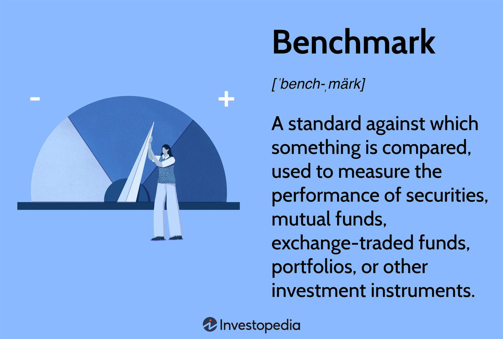

## Table of Contents

## What are investment benchmarks?

Investment benchmarks are standards used to measure the performance of investments. They help investors see if their investments are doing well or not by comparing them to something else. For example, if you invest in a stock, you might compare it to a stock market index like the S&P 500 to see if your stock is doing better or worse than the overall market.

There are many different types of benchmarks, and the right one depends on what you are investing in. For stocks, common benchmarks include the Dow Jones Industrial Average or the Nasdaq Composite. For bonds, you might use the Bloomberg Barclays US Aggregate Bond Index. By using these benchmarks, investors can make smarter decisions about where to put their money and understand how well their investments are performing compared to others.

## Why are benchmarks important in investing?

Benchmarks are important in investing because they give you a way to see if your investments are doing well. Imagine you're running a race. You need to know how fast other runners are going to see if you're doing a good job. In investing, benchmarks are like those other runners. They help you compare your investments to something else, like a stock market index, to see if you're ahead or behind.

Using benchmarks also helps you make better choices about your money. If your investments are not doing as well as the benchmark, you might decide to change what you're investing in. On the other hand, if your investments are beating the benchmark, you might feel good about your choices and keep going. Either way, benchmarks give you important information that can guide your investing decisions.

## What are some common types of investment benchmarks?

Investment benchmarks come in many forms, but some of the most common ones are stock market indexes. For example, the S&P 500 is a popular benchmark for U.S. stocks. It includes 500 of the biggest companies in the U.S., so it gives a good picture of how the overall stock market is doing. Another common benchmark is the Dow Jones Industrial Average, which tracks 30 large companies. If you're investing in tech stocks, you might use the Nasdaq Composite as your benchmark because it focuses on technology companies.

For people who invest in bonds, a common benchmark is the Bloomberg Barclays US Aggregate Bond Index. This index looks at a wide range of bonds, including government and corporate bonds, to give a sense of how the bond market is performing. If you're investing in international stocks, you might use the MSCI World Index, which tracks stocks from around the world. These benchmarks help investors see if their investments are doing better or worse than the market they're interested in.

## How do you choose the right benchmark for your investments?

Choosing the right benchmark for your investments depends on what you are investing in. If you are investing in U.S. stocks, a good benchmark might be the S&P 500 because it shows how the overall U.S. stock market is doing. If you are focusing on tech stocks, the Nasdaq Composite could be a better choice because it tracks technology companies. For bonds, the Bloomberg Barclays US Aggregate Bond Index is often used because it covers a wide range of bonds. The key is to pick a benchmark that matches the type of investment you are making.

It's also important to consider your investment goals. If you are investing for the long term, you might want a benchmark that reflects long-term market trends. If you are looking at international investments, the MSCI World Index could be useful because it tracks stocks from around the world. By choosing a benchmark that closely matches your investments and goals, you can get a clearer picture of how well your investments are doing compared to the market.

## What is the difference between a benchmark and an index?

A benchmark and an index are similar but not exactly the same. An index is a collection of stocks, bonds, or other investments that represent a specific part of the market. For example, the S&P 500 is an index that includes 500 large U.S. companies. People use indexes to see how a certain part of the market is doing.

A benchmark, on the other hand, is a standard that you use to measure the performance of your own investments. It's like a yardstick. You can use an index as a benchmark if it matches what you're investing in. For example, if you're investing in U.S. stocks, you might use the S&P 500 as your benchmark to see if your investments are doing better or worse than the overall market. So, while an index is a specific collection of investments, a benchmark is a tool you use to compare your investments to something else.

## How can benchmarks be used to evaluate investment performance?

Benchmarks help you see how well your investments are doing by comparing them to something else. Imagine you're playing a game and you want to know if you're doing well. You look at the scoreboard to see how everyone else is doing. In investing, a benchmark is like that scoreboard. If you're investing in U.S. stocks, you might use the S&P 500 as your benchmark. If your investments are doing better than the S&P 500, that's a good sign. If they're doing worse, you might need to think about changing your investments.

Using benchmarks also helps you make better decisions about your money. If your investments are not doing as well as the benchmark, you might decide to sell some of them and buy different ones. On the other hand, if your investments are beating the benchmark, you might feel good about your choices and keep going. Either way, benchmarks give you important information that can guide your investing decisions. By comparing your investments to a benchmark, you can see if you're on the right track or if you need to make some changes.

## What are the limitations of using benchmarks?

Using benchmarks to measure how well your investments are doing can be helpful, but it's not perfect. One problem is that benchmarks might not match your investments exactly. For example, if you're investing in small companies, using the S&P 500 as your benchmark might not be fair because the S&P 500 includes big companies. This can make it hard to know if your investments are really doing well or not.

Another issue is that benchmarks can make you focus too much on short-term results. If you're always comparing your investments to a benchmark, you might start making quick decisions based on how the market is doing right now, instead of thinking about your long-term goals. This can lead to buying and selling investments too often, which can be risky and might not help you reach your goals in the end.

## How do benchmarks influence investment strategies?

Benchmarks can really change how people decide to invest their money. When you use a benchmark, you're always comparing your investments to see if they're doing better or worse than the market. This can make you want to change your investments if they're not doing as well as the benchmark. For example, if your stocks are not keeping up with the S&P 500, you might decide to sell them and buy different stocks that you think will do better. This can lead to a strategy where you're always trying to beat the benchmark, which might mean buying and selling investments more often.

But benchmarks can also help you stick to a long-term plan. If you know your investments are doing well compared to the benchmark, you might feel more confident about keeping them for a long time. This can help you avoid making quick decisions based on short-term changes in the market. By using a benchmark, you can see if your strategy is working over time and make changes only when you really need to, not just because the market went up or down a little bit.

## Can you explain the concept of benchmark hugging?

Benchmark hugging is when a fund manager tries to make their investments look a lot like the benchmark they are using. They do this because they want to make sure their fund doesn't do much worse than the benchmark. If their fund is very similar to the benchmark, it's less likely to fall behind, but it also means the fund won't do much better than the benchmark either. It's like playing it safe by sticking close to the middle of the pack.

This strategy can be good for fund managers because it helps them avoid big losses. But for people who invest in these funds, it might not be so great. If you're looking for a fund that will beat the market and give you higher returns, a fund that's just hugging the benchmark might not be what you want. It's a way for fund managers to play it safe, but it might not help you reach your investment goals if you're looking for big gains.

## What role do benchmarks play in portfolio management?

Benchmarks are really important in managing a portfolio because they help you see if your investments are doing well. Imagine you're a coach of a sports team. You need to know how your team is doing compared to other teams. In investing, a benchmark is like the other teams. If you're investing in U.S. stocks, you might use the S&P 500 as your benchmark. By comparing your portfolio to the S&P 500, you can see if your investments are doing better or worse than the overall market. This helps you decide if you need to make changes to your investments.

Using benchmarks also helps you stick to your long-term plan. If your portfolio is doing well compared to the benchmark, you might feel more confident about keeping your investments for a long time. But if your portfolio is not doing as well, you might decide to sell some investments and buy different ones. Either way, benchmarks give you important information that can guide your decisions about managing your portfolio. They help you stay on track and make smart choices about your money.

## How do global benchmarks differ from local benchmarks?

Global benchmarks and local benchmarks are used to measure how well investments are doing, but they look at different parts of the world. A global benchmark, like the MSCI World Index, includes stocks from many different countries. This helps you see how your investments are doing compared to the whole world. If you're investing in companies from different countries, a global benchmark can give you a good idea of how well you're doing overall.

On the other hand, a local benchmark focuses on just one country or region. For example, the S&P 500 is a local benchmark for the U.S. because it only includes big U.S. companies. If you're investing in U.S. stocks, using the S&P 500 as your benchmark helps you see how your investments are doing compared to other U.S. stocks. So, the main difference is that global benchmarks give you a worldwide view, while local benchmarks give you a more specific view of one place.

## What advanced metrics can be used alongside benchmarks to assess investment performance?

Alongside benchmarks, you can use advanced metrics like the Sharpe Ratio to assess how well your investments are doing. The Sharpe Ratio looks at the return of your investment compared to the risk you're taking. A higher Sharpe Ratio means you're getting more return for the risk you're taking, which is good. This can help you see if your investments are worth the risk, even if they're not beating the benchmark.

Another useful metric is the Alpha, which shows how much better or worse your investments are doing compared to the benchmark, after adjusting for risk. If your Alpha is positive, it means your investments are doing better than the benchmark, considering the risk. If it's negative, they're doing worse. Using Alpha alongside benchmarks can give you a clearer picture of how well your investment strategy is working.

## References & Further Reading

[1]: ["The Intelligent Investor: The Definitive Book on Value Investing"](https://www.amazon.com/Intelligent-Investor-Definitive-Investing-Essentials/dp/0060555661) by Benjamin Graham

[2]: ["Common Stocks and Uncommon Profits and Other Writings"](https://www.amazon.com/Common-Stocks-Uncommon-Profits-Writings/dp/0471445509) by Philip A. Fisher

[3]: Fabozzi, F. J., & Markowitz, H. M. (2002). [The Theory and Practice of Investment Management](https://onlinelibrary.wiley.com/doi/book/10.1002/9781118267028). Wiley

[4]: ["A Random Walk Down Wall Street: The Time-Tested Strategy for Successful Investing"](https://www.amazon.com/Random-Walk-Down-Wall-Street/dp/0393358380) by Burton G. Malkiel

[5]: Chan, E. P. (2009). ["Quantitative Trading: How to Build Your Own Algorithmic Trading Business"](https://github.com/ftvision/quant_trading_echan_book). Wiley

[6]: ["Market Liquidity: Theory, Evidence, and Policy"](https://academic.oup.com/book/55158) by Thierry Foucault, Marco Pagano, and Ailsa Röell

[7]: ["Algorithmic Trading and DMA: An introduction to direct access trading strategies"](https://www.semanticscholar.org/paper/Algorithmic-trading-%26-DMA-%3A-an-introduction-to-Johnson/aa5de1ab883d5e23b6651faa7c1807586d688e4b) by Barry Johnson