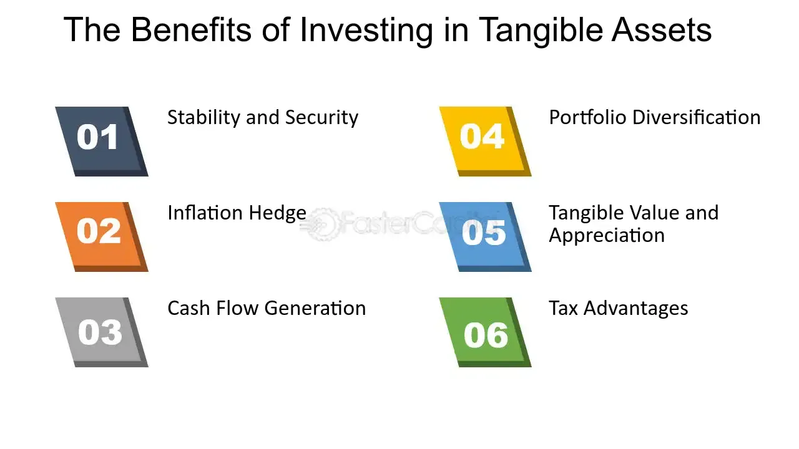

## Table of Contents

## What are tangible assets?

Tangible assets are physical items that have value and can be touched. These include things like buildings, vehicles, machinery, and inventory. They are important for businesses because they help in producing goods or providing services. For example, a bakery needs ovens and mixing machines to make bread and cakes. These assets can be bought, sold, or used as collateral for loans.

There are two main types of tangible assets: current and fixed. Current tangible assets are things that can be turned into cash within a year, like inventory or raw materials. Fixed tangible assets, on the other hand, are long-term items that a business uses over many years, such as land, buildings, and heavy equipment. These assets lose value over time due to wear and tear, a process known as depreciation. Keeping track of tangible assets is important for understanding a company's overall financial health.

## How do tangible assets differ from intangible assets?

Tangible assets are things you can touch and see, like a car or a computer. They are physical items that a business owns and uses to make money. For example, a restaurant needs tables and chairs for customers to sit and eat. These assets can be sold if the business needs money quickly. They are important because they help the business run and make products or provide services.

Intangible assets, on the other hand, are things you can't touch or see, like a brand name or a patent. They are valuable because they give the business special rights or advantages. For example, a company might have a famous logo that people recognize, which helps them sell more products. These assets are harder to value and sell than tangible assets, but they can be very important for a business's success.

The main difference between tangible and intangible assets is that tangible assets are physical and can be easily seen and touched, while intangible assets are non-physical and often related to legal rights or intellectual property. Both types of assets are important for a business, but they are managed and valued in different ways.

## What are some common examples of tangible assets for investment?

When people think about investing in tangible assets, they often consider real estate. This means buying houses, apartments, or land. Real estate can be a good investment because it can go up in value over time. People can also rent out their properties to make money every month. Another common tangible asset for investment is precious metals, like gold and silver. These metals are valuable because they are rare and people like to use them for jewelry or to keep as a safe investment.

Another popular tangible asset for investment is art. Some paintings or sculptures can become very valuable over time, especially if they are made by famous artists. People buy art not just because they like it, but also because they hope it will be worth more money in the future. Lastly, some investors choose to buy stocks in companies that own a lot of tangible assets, like factories or machinery. These companies can be a good investment because their physical assets help them make money and grow.

## Why might someone choose to invest in tangible assets?

People might choose to invest in tangible assets because they can see and touch them, which makes them feel more secure. For example, if you buy a house or a piece of land, you can visit it and know it's really yours. Tangible assets like real estate or gold can also go up in value over time, which means you could sell them later for more money than you paid. This is why many people think of these assets as a safe way to keep their money growing.

Another reason people invest in tangible assets is that they can provide regular income. For instance, if you own a rental property, you can earn money every month from tenants. This steady income can be very helpful, especially for people who want to have money coming in without working. Plus, tangible assets can be used as collateral for loans, which means you can borrow money against them if you need to. This makes tangible assets a flexible choice for people looking to build their wealth.

## How can tangible assets provide a hedge against inflation?

Tangible assets like real estate and gold can help protect your money from inflation. Inflation means the prices of things go up over time, so your money doesn't buy as much. When you invest in tangible assets, their value often goes up with inflation. For example, if you own a house, the price of the house might go up when inflation happens. This means your investment grows in value and keeps up with the rising prices of other things.

Another way tangible assets help with inflation is that they can give you income that grows with inflation. For instance, if you rent out your house, you can raise the rent when prices go up. This means the money you get from renting can keep up with inflation. So, tangible assets not only keep your money safe but can also help it grow when prices are rising.

## What are the potential risks associated with investing in tangible assets?

Investing in tangible assets can be risky because their value can go down. For example, if you buy a house, the price of houses in that area might drop if the economy is bad or if there are too many houses for sale. Also, tangible assets like buildings and machinery can wear out over time. This means you might have to spend money to fix them or they might not be worth as much when you want to sell them.

Another risk is that tangible assets are not as easy to sell quickly as stocks or bonds. If you need money fast, you might have to sell your house or gold at a lower price than you want. This is called [liquidity](/wiki/liquidity-risk-premium) risk. Plus, if you invest in things like art or collectibles, it can be hard to know what they are really worth. The price can change a lot depending on what people think is popular or valuable at the time.

## How does the liquidity of tangible assets compare to other types of investments?

Tangible assets like real estate, gold, and art are not as easy to turn into cash quickly as other types of investments like stocks or bonds. If you need money fast, you might have to sell your house or gold at a lower price than you want. This is called liquidity risk. For example, if you own a house, it can take months to find a buyer and complete the sale. On the other hand, you can sell stocks or bonds in just a few seconds through a computer or phone.

Stocks and bonds are more liquid because they can be bought and sold on big markets where lots of people are trading all the time. This means you can usually sell them quickly and get your money when you need it. Tangible assets, though, often need more time to find someone who wants to buy them, and the process can be more complicated. So, if you need to get your money back fast, tangible assets might not be the best choice compared to stocks or bonds.

## What are the tax implications of investing in tangible assets?

When you invest in tangible assets like real estate or gold, you need to think about taxes. If you make money by selling these assets for more than you paid, you might have to pay capital gains tax. The tax rate can be different depending on how long you owned the asset. If you owned it for less than a year, you might pay a higher rate than if you owned it for more than a year. Also, if you rent out a property, you have to pay taxes on the rent money you get. But you can also take away some costs, like repairs or interest on a loan, to lower your tax bill.

Another thing to think about is property taxes. If you own real estate, you have to pay taxes on it every year based on how much the property is worth. These taxes can go up if the value of your property goes up. For other tangible assets like art or collectibles, you might have to pay sales tax when you buy them, and you might have to pay taxes on any profit when you sell them. It's a good idea to talk to a tax expert to understand all the tax rules and how they can affect your investment in tangible assets.

## How can diversification with tangible assets benefit an investment portfolio?

Diversifying your investment portfolio by including tangible assets can help lower your risk. When you spread your money across different types of investments, like stocks, bonds, and tangible assets, you are less likely to lose a lot of money if one type of investment does poorly. Tangible assets like real estate or gold often don't go up and down in value at the same time as stocks or bonds. This means if the stock market goes down, your tangible assets might still be worth a lot, helping to balance out your losses.

Another benefit of including tangible assets in your portfolio is that they can provide different kinds of returns. For example, real estate can give you rental income, which is money you get every month. Gold or art might not give you regular income, but they can be good at keeping their value over time, especially during inflation. By having a mix of tangible and other types of investments, you can have a more stable and potentially more profitable portfolio.

## What strategies should be considered when investing in tangible assets like real estate or commodities?

When investing in tangible assets like real estate, it's important to do a lot of research first. Look at the area where the property is located to see if it's a good place to invest. Check if the neighborhood is growing and if there are good schools, jobs, and other things that make people want to live there. Also, think about how much money you can make from renting out the property. Make sure you can cover the costs like mortgage payments, taxes, and repairs with the rent money. It's also a good idea to have some extra money saved up for unexpected costs. Talking to a real estate expert can help you make better choices and avoid common mistakes.

For commodities like gold or silver, you need to understand the market and how prices can change. Commodities can be a good way to protect your money from inflation because their value often goes up when prices rise. You can buy physical gold or silver, or you can invest in commodity funds or ETFs that track the price of these metals. It's important to keep an eye on the market and know when to buy and sell. Don't put all your money into commodities because their prices can be very up and down. A good strategy is to have a small part of your investment in commodities to balance out other types of investments like stocks or bonds.

## How do global economic factors influence the value of tangible assets?

Global economic factors can have a big impact on the value of tangible assets like real estate and commodities. When the world economy is doing well, people have more money to spend, and this can drive up the prices of houses and land. For example, if a country's economy is growing fast, more people might want to buy homes there, which can make real estate prices go up. On the other hand, if the economy is not doing well, like during a recession, fewer people might be able to afford to buy homes, and real estate prices can go down. Commodities like gold and oil can also be affected by global economic conditions. If there is a lot of uncertainty in the world, people might buy more gold because it's seen as a safe investment, which can push its price up.

Another way global economic factors influence tangible assets is through interest rates and inflation. When interest rates are low, borrowing money is cheaper, so more people might take out loans to buy houses or invest in other tangible assets. This can increase demand and push up prices. But if interest rates go up, borrowing becomes more expensive, and this can slow down the real estate market. Inflation also plays a big role. When prices are rising, tangible assets like real estate and commodities often go up in value too, because they can help protect your money from losing value. So, keeping an eye on global economic trends can help you understand and predict changes in the value of your tangible assets.

## What advanced valuation techniques can be used to assess the worth of tangible assets?

When you want to figure out how much a tangible asset like a house or a piece of machinery is worth, you can use some advanced ways to do it. One way is called the Discounted Cash Flow (DCF) method. This means you look at how much money the asset will make in the future and then figure out what that money is worth today. For example, if you own a rental property, you can guess how much rent you will get over the next few years and then use a special math formula to see what that money is worth right now. This helps you understand if the price you are paying for the asset is a good deal or not.

Another advanced way to value tangible assets is the Comparable Sales method. This means you look at what similar assets have sold for recently. If you want to know how much your house is worth, you can check the prices of other houses in your neighborhood that are similar in size and condition. This gives you a good idea of what buyers are willing to pay for a house like yours. Sometimes, you might also use the Replacement Cost method, which means figuring out how much it would cost to buy a new asset just like the one you have. This can be useful for things like machinery or buildings, where you need to think about how much it would cost to replace them if they got damaged or worn out.

## How can one achieve diversification through tangible assets?

Tangible assets, often classified as "alternative investments," comprise categories like real estate, gold bullion, and collectibles. These physical assets play a critical role in diversifying investment portfolios due to their unique characteristics and their generally low correlation with traditional asset markets such as stocks and bonds.

Real estate, for instance, provides a tangible way for investors to diversify. The property market often moves independently of the equity markets, providing investors a cushion against stock market volatilities. Real estate investments generate steady cash flows through rental income and have the potential for long-term capital appreciation. Additionally, properties often appreciate in value independently of stock market fluctuations, offering investors the prospect of counterbalancing risks associated with equities.

Similarly, precious metals, gold bullion in particular, have long been regarded as a safe haven asset. Gold's value is generally observed to increase in unstable economic conditions and during inflationary periods, when traditional equity might suffer. This characteristic makes gold an excellent diversification tool for investors looking to shield their portfolios from systemic risks.

Collectibles, which could include items like fine art, rare coins, or antiques, also provide unique diversification benefits. While these items can be illiquid and their market dynamics complex, they are not directly tied to financial markets, allowing them to maintain or even increase in value when traditional assets fluctuate negatively. Notably, the markets for collectibles can sometimes align with cultural or economic trends, resulting in periods of rapid appreciation.

Incorporating tangible assets into a portfolio can be mathematically represented by examining the correlation coefficients between these assets and traditional securities. A lower correlation (closer to 0) suggests that the asset's return movements are less likely to coincide with the movements of other portfolio assets, thus contributing to risk reduction. By adding tangible assets to a portfolio, investors can mathematically decrease the overall variance of the portfolio's returns, as shown in the portfolio variance formula:

$$

\sigma_p^2 = \sum_{i=1}^{n} w_i^2 \sigma_i^2 + \sum_{i=1}^{n} \sum_{j \neq i} w_i w_j \sigma_i \sigma_j \rho_{ij}
$$

Where:
- $\sigma_p^2$ is the portfolio variance
- $w_i$ and $w_j$ are the weights of assets $i$ and $j$
- $\sigma_i$ and $\sigma_j$ are the standard deviations of assets $i$ and $j$
- $\rho_{ij}$ is the correlation coefficient between assets $i$ and $j$

Through strategic allocation to tangible assets, investors can enhance portfolio resilience, achieve strategic diversification, and reduce overall exposure to market [volatility](/wiki/volatility-trading-strategies).

## References & Further Reading

[1]: Bergstra, J., Bardenet, R., Bengio, Y., & Kégl, B. (2011). ["Algorithms for Hyper-Parameter Optimization."](https://dl.acm.org/doi/10.5555/2986459.2986743) Advances in Neural Information Processing Systems 24.

[2]: ["Advances in Financial Machine Learning"](https://www.amazon.com/Advances-Financial-Machine-Learning-Marcos/dp/1119482089) by Marcos Lopez de Prado

[3]: ["Evidence-Based Technical Analysis: Applying the Scientific Method and Statistical Inference to Trading Signals"](https://www.amazon.com/Evidence-Based-Technical-Analysis-Scientific-Statistical/dp/0470008741) by David Aronson

[4]: ["Machine Learning for Algorithmic Trading"](https://github.com/stefan-jansen/machine-learning-for-trading) by Stefan Jansen

[5]: ["Quantitative Trading: How to Build Your Own Algorithmic Trading Business"](https://www.amazon.com/Quantitative-Trading-Build-Algorithmic-Business/dp/1119800064) by Ernest P. Chan