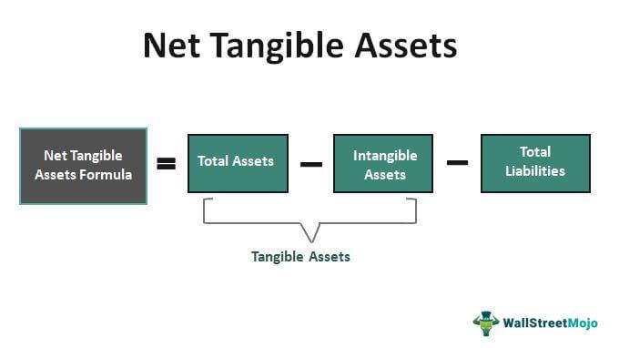

In the rapidly evolving world of finance, understanding different asset types and investment strategies is crucial for making informed decisions. Tangible assets, such as real estate, machinery, and inventory, play a significant role in an investment portfolio due to their physical presence and intrinsic value. These assets are particularly attractive to risk-averse investors because of their stability and income-generating capabilities. In contrast, intangible assets, including stocks, bonds, and intellectual property, derive their value from non-physical entities and are often subject to market volatility.

The article examines the benefits and challenges associated with managing tangible assets. Valuation of these physical assets depends on market-based metrics and appraisals, and they often serve as collateral in financial transactions. Although tangible assets are valued for their potential to provide steady returns and serve as inflation hedges, managing them can be complex due to factors like maintenance, liquidity, and market dynamics.



Advancements in technology have introduced algorithmic trading to the financial landscape, revolutionizing asset management. Algorithmic trading involves using computer algorithms to execute trades with precision and speed, thereby optimizing trading strategies. This transformative approach removes emotional biases, facilitates real-time data analysis, and enables swift reactions to market changes. Consequently, algorithmic trading can augment the management of both tangible and intangible assets by improving decision-making processes.

In this article, readers will gain insights into how tangible assets compare with intangible assets and how algorithmic trading can optimize asset management strategies. By strategically integrating both asset types with algorithmic trading, investors can enhance diversification, reduce risk, and potentially achieve optimized investment outcomes.

## Table of Contents

## Understanding Tangible Assets

Tangible assets are defined as physical items with intrinsic value, such as real estate, machinery, and inventory. These assets possess a physical form and are utilized in various industries for operational, investment, and collateral purposes. The intrinsic value of tangible assets lies in their material existence and capacity to generate income, appealing particularly to risk-averse investors seeking stability in their portfolios.

The stability of tangible assets, such as real estate, is highlighted by their ability to generate rental income and appreciate over time. Real estate, for example, can yield steady cash flow through rental agreements and has historically shown a tendency to increase in value, providing a reliable hedge against economic volatility. Machinery and equipment are pivotal in production processes, contributing to revenue generation through manufacturing and operational efficiency.

Valuation of tangible assets is determined using market-based metrics and appraisals. For real estate, comparative market analysis, income approach, and cost approach are commonly employed to ascertain value. Comparative market analysis involves comparing the asset with similar properties recently sold in the market, while the income approach estimates value based on projected income generation potential. The cost approach considers the replacement cost of the asset, subtracting depreciation.

In financial transactions, tangible assets serve as collateral, underscoring their significance in credit and lending agreements. The physical presence and appraised value of these assets provide lenders with assurance in case of borrower default. This collateral-backed security allows businesses and individuals to secure loans and credit lines essential for various financial activities.

Risk-averse investors are often attracted to tangible assets due to their ability to withstand economic downturns better than intangible assets. The tangible nature of these assets, along with their income-generating capability, provides a sense of security and predictability in investment returns. Consequently, incorporating tangible assets into investment portfolios is a strategic endeavor for balancing risk and achieving long-term financial stability.

In conclusion, tangible assets are integral components in asset management, recognized for their physical presence, intrinsic value, and income-generating potential. They offer stability and security, making them valuable for risk management in diversified investment portfolios.

## Diversification Through Tangible Assets

Tangible assets, often classified as "alternative investments," comprise categories like real estate, gold bullion, and collectibles. These physical assets play a critical role in diversifying investment portfolios due to their unique characteristics and their generally low correlation with traditional asset markets such as stocks and bonds.

Real estate, for instance, provides a tangible way for investors to diversify. The property market often moves independently of the equity markets, providing investors a cushion against stock market volatilities. Real estate investments generate steady cash flows through rental income and have the potential for long-term capital appreciation. Additionally, properties often appreciate in value independently of stock market fluctuations, offering investors the prospect of counterbalancing risks associated with equities.

Similarly, precious metals, gold bullion in particular, have long been regarded as a safe haven asset. Gold's value is generally observed to increase in unstable economic conditions and during inflationary periods, when traditional equity might suffer. This characteristic makes gold an excellent diversification tool for investors looking to shield their portfolios from systemic risks.

Collectibles, which could include items like fine art, rare coins, or antiques, also provide unique diversification benefits. While these items can be illiquid and their market dynamics complex, they are not directly tied to financial markets, allowing them to maintain or even increase in value when traditional assets fluctuate negatively. Notably, the markets for collectibles can sometimes align with cultural or economic trends, resulting in periods of rapid appreciation.

Incorporating tangible assets into a portfolio can be mathematically represented by examining the correlation coefficients between these assets and traditional securities. A lower correlation (closer to 0) suggests that the asset's return movements are less likely to coincide with the movements of other portfolio assets, thus contributing to risk reduction. By adding tangible assets to a portfolio, investors can mathematically decrease the overall variance of the portfolio's returns, as shown in the portfolio variance formula:

$$

\sigma_p^2 = \sum_{i=1}^{n} w_i^2 \sigma_i^2 + \sum_{i=1}^{n} \sum_{j \neq i} w_i w_j \sigma_i \sigma_j \rho_{ij}
$$

Where:
- $\sigma_p^2$ is the portfolio variance
- $w_i$ and $w_j$ are the weights of assets $i$ and $j$
- $\sigma_i$ and $\sigma_j$ are the standard deviations of assets $i$ and $j$
- $\rho_{ij}$ is the correlation coefficient between assets $i$ and $j$

Through strategic allocation to tangible assets, investors can enhance portfolio resilience, achieve strategic diversification, and reduce overall exposure to market [volatility](/wiki/volatility-trading-strategies).

## Protection from Inflation

Tangible assets, particularly precious metals like gold, are widely regarded as effective hedges against inflation. The intrinsic value of these assets provides a safeguard for investors looking to preserve their wealth in the face of rising prices. Historically, gold has demonstrated an impressive ability to maintain its purchasing power, often outpacing inflation rates.

For example, during periods of high inflation, gold prices tend to rise, as evidenced by historical data from the 1970s when inflation in the United States reached double digits. During this time, gold prices increased significantly, reinforcing its status as a reliable store of value. Moreover, as central banks increase money supply to tackle economic downturns, fiat currencies may depreciate, further enhancing the appeal of tangible assets that are less susceptible to such policies.

Investors often gravitate towards tangible assets like gold during economic uncertainty due to their inherent value. Gold's scarcity and finite nature make it a stable investment over the long term, unlike paper currency, which can be produced in unlimited quantities. Additionally, tangible assets like real estate and agriculture can generate income, offering extra layers of security against inflation.

Portfolio diversification with tangible assets can be an effective strategy for managing inflation risk. By allocating a portion of their portfolio to such assets, investors can achieve a balance that mitigates the potential erosion of value caused by inflation. While no asset is entirely immune to economic fluctuations, the historical performance and intrinsic characteristics of tangible assets make them a valuable component of an inflation-hedging strategy.

## Algorithmic Trading in Asset Management

Algorithmic trading, often referred to as algo trading, has become a pivotal element in modern asset management by utilizing computer algorithms to execute trades with precision and speed. This approach significantly enhances the efficiency of trading operations, allowing for the management of both tangible and intangible assets. By processing real-time data, these algorithms can analyze market trends, price movements, and other relevant factors, facilitating well-informed investment decisions.

One of the primary advantages of [algorithmic trading](/wiki/algorithmic-trading) is the elimination of emotional biases that often influence human traders. Emotions like fear and greed can lead to irrational decision-making, especially during volatile market conditions. By automating the trading process, algorithms ensure that trade executions are based solely on predefined criteria and statistical models. This objectivity is crucial in optimizing trading strategies, as it allows for consistent adherence to the investor's strategy, even during times of market turbulence.

Algorithmic trading's capability to react swiftly to market changes is another critical benefit. In financial markets, prices can fluctuate considerably in seconds, creating opportunities that require rapid response to exploit. Algorithms can perform complex computations in milliseconds and execute trades faster than any human, gaining an edge in high-frequency trading environments. This speed advantage is vital for capitalizing on short-lived opportunities and minimizing exposure to unfavorable price movements.

Furthermore, the integration of [machine learning](/wiki/machine-learning) and [artificial intelligence](/wiki/ai-artificial-intelligence) into algorithmic trading has enhanced its ability to manage assets. By learning from past data and identifying patterns, these intelligent systems can adapt and refine trading strategies over time. This adaptability ensures that trading algorithms remain effective in varying market conditions, thereby maximizing potential returns for investors.

Algorithmic trading not only supports the execution of trades but also plays a role in comprehensive portfolio management. It aids in portfolio rebalancing, risk management, and the allocation of assets, ensuring an optimal balance between risk and return. By continuously monitoring market dynamics, algorithms can adjust portfolios to align with investment objectives, thereby maintaining their desired risk profile.

In conclusion, algorithmic trading transforms asset management by offering precision, speed, and consistency in trading activities. By leveraging real-time data analysis and minimizing emotional bias, algo trading enhances the capability to manage complex investment portfolios effectively.

## Integration of Algo Trading with Tangible Assets

Algorithmic trading, often referred to as algo trading, has revolutionized the management of various asset classes, including tangible assets, by leveraging computational algorithms to execute trading decisions swiftly and accurately. When integrated with tangible assets like real estate, commodities, or precious metals, algo trading offers significant advantages in monitoring and rebalancing portfolios.

One of the primary benefits of using algorithms in the context of tangible assets is the ability to predict market movements more effectively. Algorithms can analyze vast amounts of data in real-time, encompassing historical price trends, macroeconomic indicators, and geopolitical events, to forecast potential shifts in asset values. This predictive capability allows for proactive management, enabling investors to adjust their portfolios in anticipation of market changes, thereby mitigating risks associated with unexpected asset price fluctuations.

In a Python-based implementation, trading algorithms might employ machine learning techniques such as regression analysis or neural networks to predict future asset prices. For example:

```python
from sklearn.linear_model import LinearRegression
import numpy as np

# Sample data for tangible asset prices
asset_prices = np.array([[1, 1500], [2, 1520], [3, 1545], [4, 1570]])
X = asset_prices[:, 0].reshape(-1, 1)  # Time periods
y = asset_prices[:, 1]  # Corresponding prices

# Linear regression model
model = LinearRegression()
model.fit(X, y)

# Predict future price
future_period = np.array([[5]])
predicted_price = model.predict(future_period)
print(f"Predicted asset price for future period is {predicted_price}")
```

Additionally, algo trading enables the strategic use of derivatives to hedge positions. By utilizing options or futures contracts, investors can protect their tangible asset holdings against adverse price movements. This is particularly useful in volatile markets where the intrinsic value of tangible assets like commodities could fluctuate due to sudden demand-supply imbalances.

Moreover, algorithms can be instrumental in identifying undervalued tangible asset opportunities. By systematically scanning the market for price discrepancies between the current market value and fundamental value indicators, algorithms can pinpoint potential investment opportunities that are undervalued based on intrinsic metrics. This systematic approach not only broadens the investment horizon but also enhances the potential for higher returns by capitalizing on market inefficiencies.

In summary, the integration of algo trading within the management of tangible assets offers numerous advantages, including enhanced risk mitigation through predictive analytics, the ability to hedge positions using derivatives, and the identification of undervalued investment opportunities. This innovative approach provides investors with a robust toolkit to navigate the complexities of asset markets, ensuring that decision-making is both timely and data-driven.

## Conclusion

Tangible and intangible assets are pivotal components of a well-rounded investment portfolio, each offering distinct advantages and challenges that can significantly impact an investor's success. Tangible assets, such as real estate and commodities, are valued for their physical presence and ability to generate stable income. They serve as a hedge against inflation and economic uncertainty by maintaining intrinsic value. Conversely, intangible assets, including stocks and intellectual property, offer potential for high returns driven by market dynamics and innovation.

Algorithmic trading plays a crucial role in optimizing asset management by leveraging computational power and real-time data analysis to enhance trading efficiency and decision-making. This advanced approach minimizes human biases, ensures rapid execution of trades, and enables investors to adapt swiftly to market changes. By integrating algorithmic trading into their strategies, investors can more effectively manage both tangible and intangible assets, optimizing portfolio performance and risk management.

Achieving an ideal balance and strategic integration of these asset types with algorithmic trading can lead to optimized investment outcomes. This dynamic combination not only allows investors to capitalize on the unique benefits of each asset class but also enhances the overall resilience and performance of the investment portfolio. Through careful analysis and informed decision-making, investors can achieve a diversified and robust portfolio that meets their financial goals amidst a constantly evolving market landscape.

## References & Further Reading

[1]: Bergstra, J., Bardenet, R., Bengio, Y., & Kégl, B. (2011). ["Algorithms for Hyper-Parameter Optimization."](https://dl.acm.org/doi/10.5555/2986459.2986743) Advances in Neural Information Processing Systems 24.

[2]: ["Advances in Financial Machine Learning"](https://www.amazon.com/Advances-Financial-Machine-Learning-Marcos/dp/1119482089) by Marcos Lopez de Prado

[3]: ["Evidence-Based Technical Analysis: Applying the Scientific Method and Statistical Inference to Trading Signals"](https://www.amazon.com/Evidence-Based-Technical-Analysis-Scientific-Statistical/dp/0470008741) by David Aronson

[4]: ["Machine Learning for Algorithmic Trading"](https://github.com/stefan-jansen/machine-learning-for-trading) by Stefan Jansen

[5]: ["Quantitative Trading: How to Build Your Own Algorithmic Trading Business"](https://www.amazon.com/Quantitative-Trading-Build-Algorithmic-Business/dp/1119800064) by Ernest P. Chan